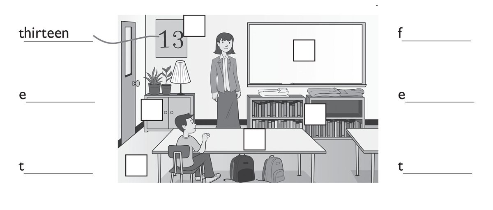
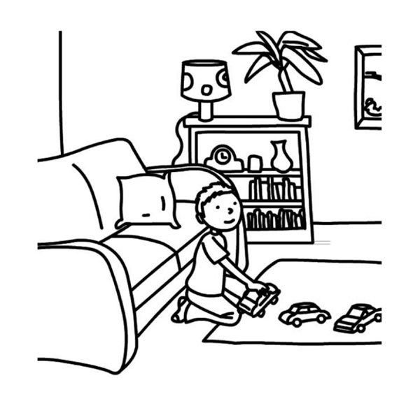
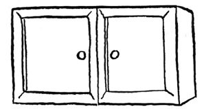
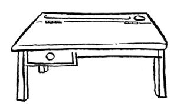
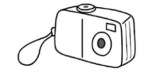
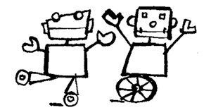
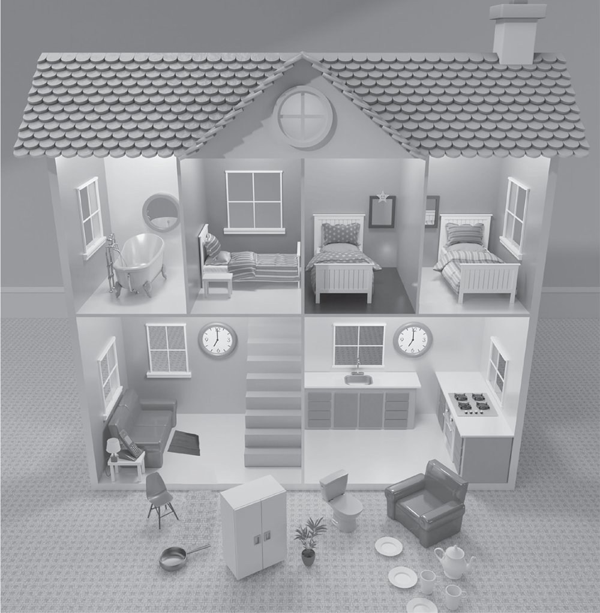

**[Vocabulary]{.underline}**

**1. Listen and write the number on the picture. Write and draw lines.
There is one example.   (one point each)**

**2. Read and write the correct word. There is one example   (one point
each)**

alien / aliens \| bath / baths \| camera / cameras

lorry / ~~lorries~~ \| sofa / sofas \| watch / watches

1\. These are *[lorries]{.underline}*.

2\. This is a \_\_\_\_\_\_\_\_\_\_\_\_\_\_.

3\. These are \_\_\_\_\_\_\_\_\_\_\_\_\_\_.

4\. These are \_\_\_\_\_\_\_\_\_\_\_\_\_\_.

5\. This is an \_\_\_\_\_\_\_\_\_\_\_\_\_\_.

6\. This is a \_\_\_\_\_\_\_\_\_\_\_\_\_\_.

**[Grammar]{.underline}**

**3. Look and write the words. There is one example.   (one point
each)**

~~next to~~ \| under \| on \| in \| on \| next to

1\. The boy is *[next to]{.underline}* the sofa.

2\. The cars are \_\_\_\_\_\_\_\_\_\_\_\_\_\_ the rug.

3\. The sofa is \_\_\_\_\_\_\_\_\_\_\_\_\_\_ the bookcase.

4\. The clock is \_\_\_\_\_\_\_\_\_\_\_\_\_\_ the lamp.

5\. The lamp is \_\_\_\_\_\_\_\_\_\_\_\_\_\_ the bookcase.

6\. The books are \_\_\_\_\_\_\_\_\_\_\_\_\_\_ the bookcase.

**4. Put the words in order and write. There is one example.   (one
point each)**

1\. cupboards / are / there? / How / many

*[How many cupboards are there?]{.underline}*

2\. Is / teacher? / there / a

\_\_\_\_\_\_\_\_\_\_\_\_\_\_\_\_\_\_\_\_\_\_\_\_\_

3\. whiteboard. / There / a / is

\_\_\_\_\_\_\_\_\_\_\_\_\_\_\_\_\_\_\_\_\_\_\_\_\_

4\. desks? / there / Are / eighteen

\_\_\_\_\_\_\_\_\_\_\_\_\_\_\_\_\_\_\_\_\_\_\_\_\_

5\. six / Are / there / rulers?

\_\_\_\_\_\_\_\_\_\_\_\_\_\_\_\_\_\_\_\_\_\_\_\_\_

6\. there / bookcase? / Is / a

\_\_\_\_\_\_\_\_\_\_\_\_\_\_\_\_\_\_\_\_\_\_\_\_\_

**5. Read and write the words. There is one example.   (one point
each)**

It's \| it isn't \| mine \| ones \| They're \| ~~they're~~

1\. Are these lorries mine? Yes, *[they're]{.underline}* yours.

2\. Is this watch yours? No, \_\_\_\_\_\_\_\_\_\_\_\_.

3\. Whose camera is this? \_\_\_\_\_\_\_\_\_\_\_\_ Mary's.

4\. Whose games are these? \_\_\_\_\_\_\_\_\_\_\_\_ Tom's

5\. Whose kites are those? They're \_\_\_\_\_\_\_\_\_\_\_\_.

6\. Which robots are Clare's? The two white \_\_\_\_\_\_\_\_\_\_\_\_.

**[Listening]{.underline}**

**6. Listen, look and write the number. There is one example.   (one
point each)**

**7. Listen and circle. There is one example.   (one point each)**

**[Reading]{.underline}**

**8. Look and read. Write the answer. There is one example.   (one point
each)**

bed \| kitchen \| mat \| sofa \| three \| ~~three~~

1\. How many beds are there?

*[three]{.underline}*

2\. Where is the phone?

Next to the \_\_\_\_\_\_\_\_\_\_\_\_\_\_

3\. How many mirrors are there?

\_\_\_\_\_\_\_\_\_\_\_\_\_\_

4\. Where is the lamp?

Next to the \_\_\_\_\_\_\_\_\_\_\_\_\_\_

5\. Where are the clocks?

In the living room and \_\_\_\_\_\_\_\_\_\_\_\_\_\_

6\. What's in front of the sofa?

A \_\_\_\_\_\_\_\_\_\_\_\_\_\_

