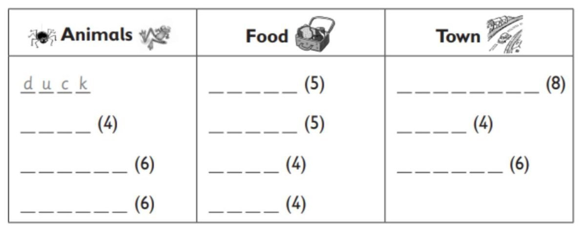
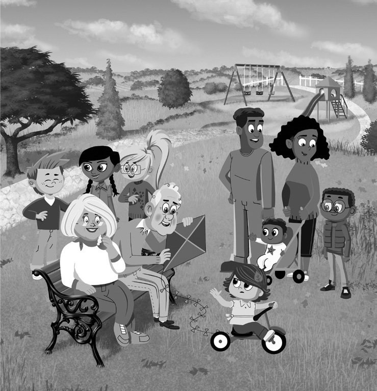
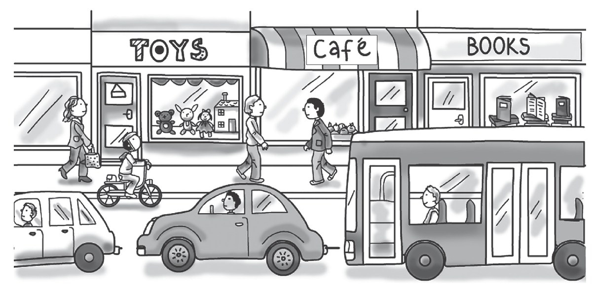
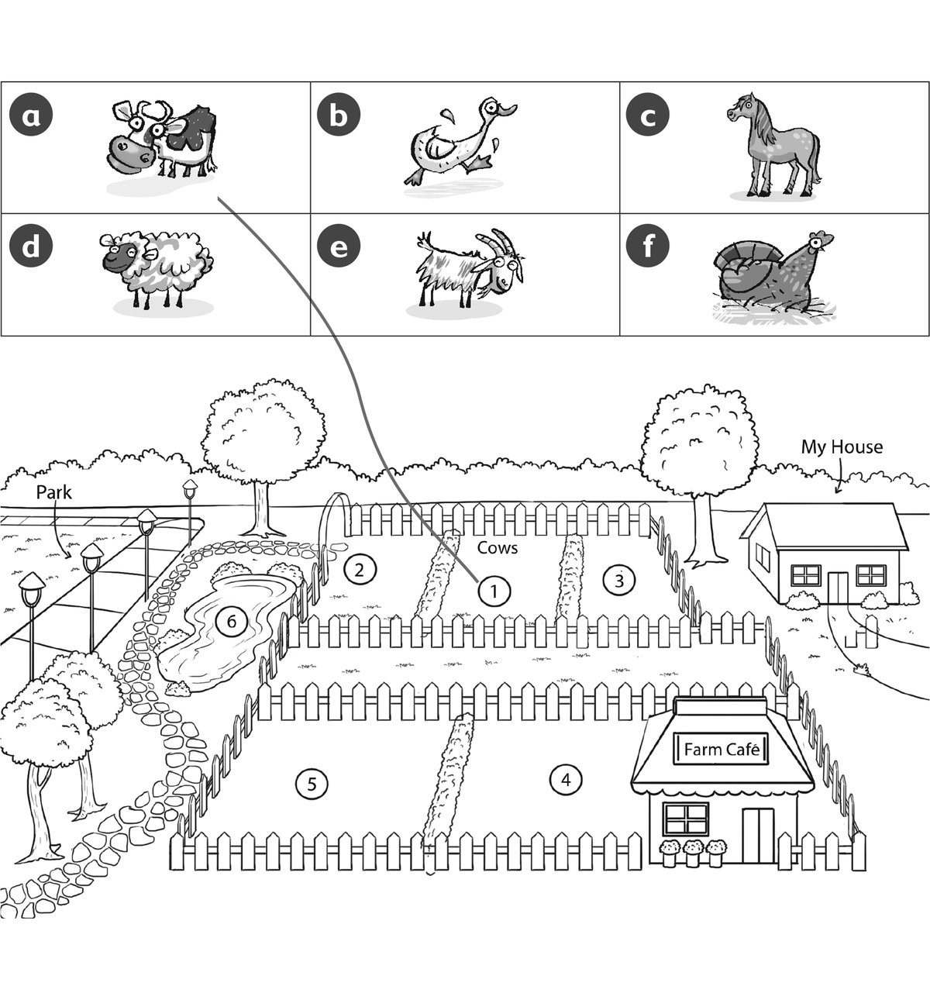

**[Vocabulary]{.underline}**

**1. Look and write the words. There is one example.   (one point
each)**

bread \| chips \| ~~duck~~ \| eggs \| hospital \| goat \| lizard \| rice
\| shop \| spider \| street

*Animals: goat*

*lizard*

*spider; Food: bread*

*chips*

*eggs*

*rice; Town: hospital*

*shop*

*street*

**2. Look and write one or two or five. There is one example.   (one
point each)**

  ------------------------------- --- -----------------------------------
  1\. How many children are           *[five]{.underline}*
  there?                              

  ------------------------------- --- -----------------------------------

  -------------------------------- --- -----------------------------------
  2\. How many babies are              *babies -- one*
  there?\_\_\_\_\_\_\_\_\_\_\_\_       

  -------------------------------- --- -----------------------------------

  -------------------------------- --- -----------------------------------
  3\. How many women are               *women -- two*
  there?\_\_\_\_\_\_\_\_\_\_\_\_       

  -------------------------------- --- -----------------------------------

  -------------------------------- --- -----------------------------------
  4\. How many men are                 *men -- two*
  there?\_\_\_\_\_\_\_\_\_\_\_\_       

  -------------------------------- --- -----------------------------------

  -------------------------------- --- -----------------------------------
  5\. How many kites are               *kites -- one*
  there?\_\_\_\_\_\_\_\_\_\_\_\_       

  -------------------------------- --- -----------------------------------

  -------------------------------- --- -----------------------------------
  6\. How many bikes are               *bikes -- one*
  there?\_\_\_\_\_\_\_\_\_\_\_\_       

  -------------------------------- --- -----------------------------------

**[Grammar]{.underline}**

**3. Look and write the number. There is one example.   **

1\. *[3]{.underline}* She's throwing the ball.

2\. \_\_\_\_\_\_\_\_\_\_\_\_He's sleeping.

*He's hitting the ball -- 2*

3\. \_\_\_\_\_\_\_\_\_\_\_He's hitting the ball.

*She's sitting - 1*

4\. \_\_\_\_\_\_\_\_\_\_\_\_He's flying a kite.

*He's sleeping - 5*

5\. \_\_\_\_\_\_\_\_\_\_\_She's sitting.

*He's flying a kite -- 6*

6\. \_\_\_\_\_\_\_\_\_\_\_\_She's kicking a ball.

*She's kicking a ball -- 4*

**4. Read and circle. There is one example.   (one point each)**

1\. The grey car is *between / next* to the white car and the bus.

2\. The book shop is *next to / behind* the bus.

*behind*

3\. The girl on the bike is *behind / in front* of the toy shop.

*in front of*

4\. The café is *between / under* the toy shop and the book shop.

*between*

5\. There is a doll *on / in* the toy shop.

*in*

6\. The book shop is *next to / between* the café.

*next to*

**5. Read and match. Write the number. There is one example.   (one
point each)**

  ------------------------------- --- -------------------------------
  1\. What are you doing?             Yes, here you are.

  ------------------------------- --- -------------------------------

*I'm cleaning my bedroom.*

  ------------------------------- --- -------------------------------
  2\. Who's that?                     That's my cousin.

  ------------------------------- --- -------------------------------

*That's my cousin.*

  ------------------------------- --- -------------------------------
  3\. What's your cousin doing?       It's next to the café.

  ------------------------------- --- -------------------------------

*She's catching a ball.*

  ------------------------------- --- -------------------------------
  4\. Can I have some rice?           I'm cleaning my bedroom.

  ------------------------------- --- -------------------------------

*Yes, here you are.*

  ------------------------------- --- -------------------------------
  5\. Where's the hospital?           She's catching a ball.

  ------------------------------- --- -------------------------------

*It's next to the café.*

  ------------------------------- --- -------------------------------
  6\. I love orange juice.            So do I!

  ------------------------------- --- -------------------------------

*So do I!*

**[Listening]{.underline}**

**6. Listen and write the number. There is one example.   (one point
each)**

*Picture 1: girl eating - 3*

*Picture 2: boy drinking - 4, girl eating - 5*

*Picture 3: girl eating - 2, boy playing - 6*

**Audio script**

She's eating a banana.

She's eating bread.

He's drinking juice.

She's eating cake.

He's playing.

**7. Look and listen. Draw lines. There is one example.   (one point
each)**

*d - sheep*

*f - chicken*

*e - goat*

*c - horse*

*b - duck*

**Audio script**

There's a farm between my house and the park.

The cows are between the sheep and the chickens.

The chickens are next to my house, under a tree.

The sheep are next to the park.

There is a café at the farm.

There are goats next to the café.

There are horses between the goats and the park.

The park is very big and there are lots of ducks.They love the water in
the park.

**[Reading]{.underline}**

**8. Read and circle. There is one example.   (one point each)**

1\. Mark lives in a small *[town / city]{.underline}*.

2\. He lives in a *house / flat*.

*flat*

3\. He lives next to the *park / school*.

*park*

4\. He *plays in the park / rides his bike*. in the morning

*rides his bike*

5\. Now his grandma is sitting *under a tree / in a café*.

*in a café*

6\. Mark is playing *football / baseball*.

*football*

