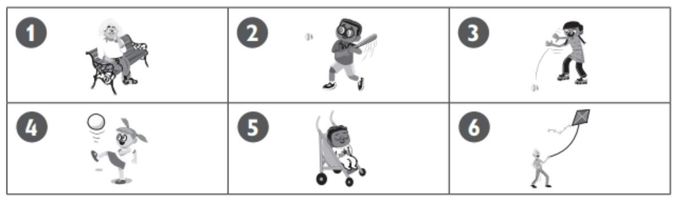
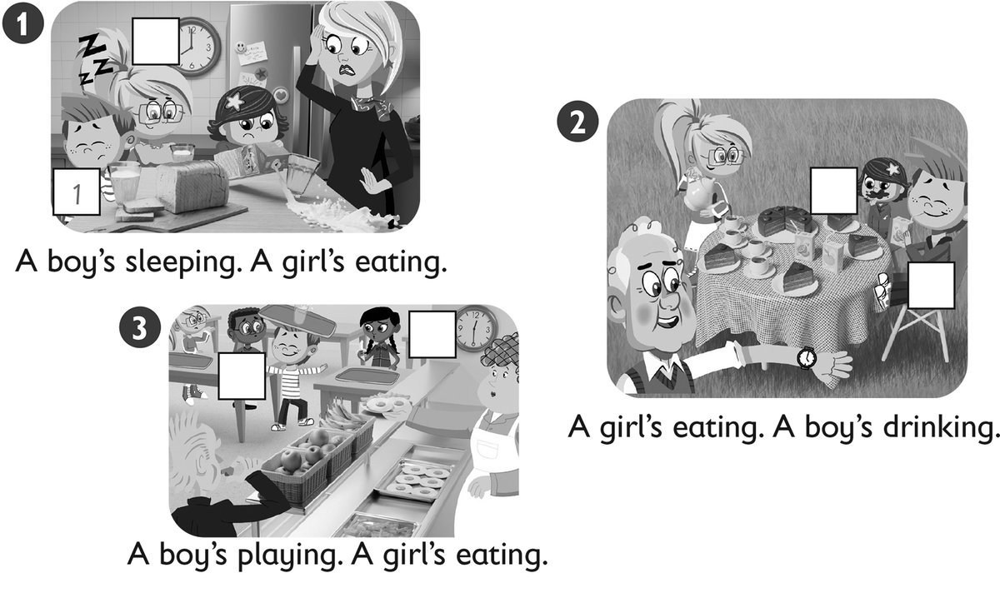
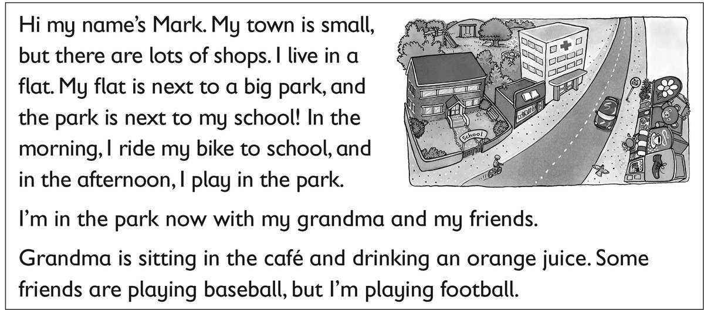

**[Vocabulary]{.underline}**

**1. Look and write the words. There is one example.   (one point
each)**

bread \| chips \| ~~duck~~ \| eggs \| hospital \| goat \| lizard \| rice
\| shop \| spider \| street

**2. Look and write one or two or five. There is one example.   (one
point each)**

  ------------------------------- --- -----------------------------------
  1\. How many children are           
  there?                              

  ------------------------------- --- -----------------------------------

  -------------------------------- --- -----------------------------------
  2\. How many babies are              
  there?\_\_\_\_\_\_\_\_\_\_\_\_       

  -------------------------------- --- -----------------------------------

  -------------------------------- --- -----------------------------------
  3\. How many women are               
  there?\_\_\_\_\_\_\_\_\_\_\_\_       

  -------------------------------- --- -----------------------------------

  -------------------------------- --- -----------------------------------
  4\. How many men are                 
  there?\_\_\_\_\_\_\_\_\_\_\_\_       

  -------------------------------- --- -----------------------------------

  -------------------------------- --- -----------------------------------
  5\. How many kites are               
  there?\_\_\_\_\_\_\_\_\_\_\_\_       

  -------------------------------- --- -----------------------------------

  -------------------------------- --- -----------------------------------
  6\. How many bikes are               
  there?\_\_\_\_\_\_\_\_\_\_\_\_       

  -------------------------------- --- -----------------------------------

**[Grammar]{.underline}**

**3. Look and write the number. There is one example.   **

1\. *[3]{.underline}* She's throwing the ball.

2\. \_\_\_\_\_\_\_\_\_\_\_\_He's sleeping.

3\. \_\_\_\_\_\_\_\_\_\_\_He's hitting the ball.

4\. \_\_\_\_\_\_\_\_\_\_\_\_He's flying a kite.

5\. \_\_\_\_\_\_\_\_\_\_\_She's sitting.

6\. \_\_\_\_\_\_\_\_\_\_\_\_She's kicking a ball.

**4. Read and circle. There is one example.   (one point each)**

1\. The grey car is *between / next* to the white car and the bus.

2\. The book shop is *next to / behind* the bus.

3\. The girl on the bike is *behind / in front* of the toy shop.

4\. The café is *between / under* the toy shop and the book shop.

5\. There is a doll *on / in* the toy shop.

6\. The book shop is *next to / between* the café.

**5. Read and match. Write the number. There is one example.   (one
point each)**

  ------------------------------- --- -------------------------------
  1\. What are you doing?             I'm cleaning my bedroom.

  ------------------------------- --- -------------------------------

  ------------------------------- --- -------------------------------
  2\. Who's that?                     So do I!

  ------------------------------- --- -------------------------------

  ------------------------------- --- -------------------------------
  3\. What's your cousin doing?       Yes, here you are.

  ------------------------------- --- -------------------------------

  ------------------------------- --- -------------------------------
  4\. Can I have some rice?           She's catching a ball.

  ------------------------------- --- -------------------------------

  ------------------------------- --- -------------------------------
  5\. Where's the hospital?           It's next to the café.

  ------------------------------- --- -------------------------------

  ------------------------------- --- -------------------------------
  6\. I love orange juice.            That's my cousin.

  ------------------------------- --- -------------------------------

**[Listening]{.underline}**

**6. Listen and write the number. There is one example.   (one point
each)**

**7. Look and listen. Draw lines. There is one example.   (one point
each)**

**[Reading]{.underline}**

**8. Read and circle. There is one example.   (one point each)**

1\. Mark lives in a small *[town / city]{.underline}*.

2\. He lives in a *house / flat*.

3\. He lives next to the *park / school*.

4\. He *plays in the park / rides his bike*. in the morning

5\. Now his grandma is sitting *under a tree / in a café*.

6\. Mark is playing *football / baseball*.

