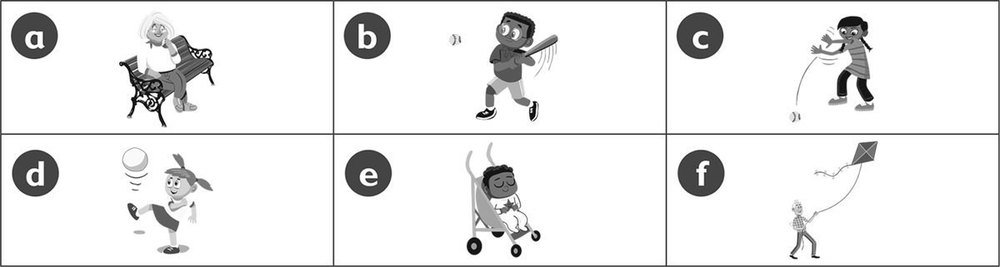
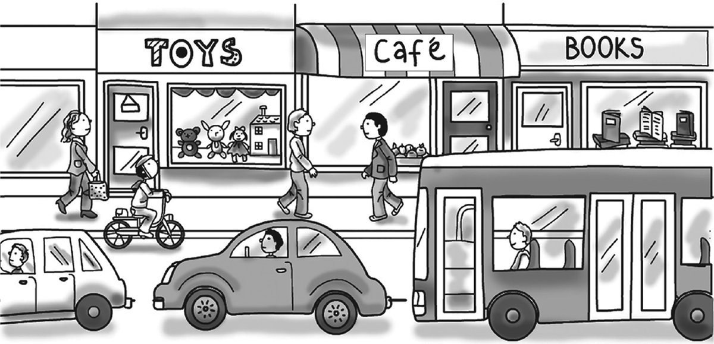
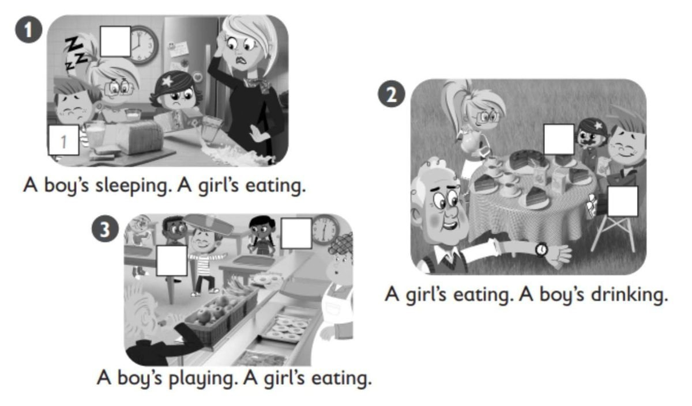
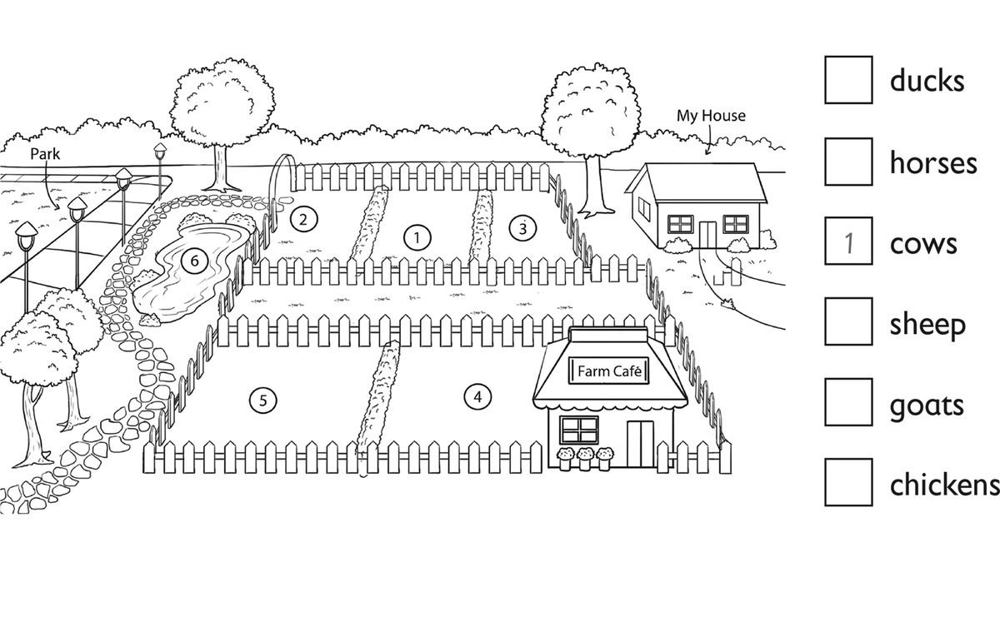

**[Vocabulary]{.underline}**

**1. Look and write the words. There is one example.   (one point
each)**

*Animals: goat*

*lizard*

*sheep; Food: bread*

*chicken eggs*

*rice; Town: hospital*

*shop*

*street*

**2. Write the words and answer the questions. There is one
example.   (one point each)**

1\. How many (child) *[children]{.underline}* are there?
*[five]{.underline}*

2\. How many (baby) *babies* are there? *one*

3\. How many (woman) *women* are there? *two*

4\. How many (man) *men* are there? *two*

5\. How many (kite) *kites* are there? *one*

6\. How many (bike) *bikes* are there? *one*

**[Grammar]{.underline}**

**3. Look and put the letters in order. Write the letter and the word.
There is one example.   (one point each)**

1\. *[    c    ]{.underline}* She's (inghtrow) *[throwing]{.underline}*
the ball.

2\. \_\_\_\_\_ She's (gstinti) \_\_\_\_\_\_\_\_\_\_\_\_.

*She's sitting -- a*

3\. \_\_\_\_\_ He's (ttihgni) \_\_\_\_\_\_\_\_\_\_\_\_ the ball.

*He's hitting the ball -- b*

4\. \_\_\_\_\_ He's (yigfln) \_\_\_\_\_\_\_\_\_\_\_\_ a kite.

*He's flying a kite -- f*

5\. \_\_\_\_\_ He's (gsleinep) \_\_\_\_\_\_\_\_\_\_\_\_.

*He's sleeping -- e*

6\. \_\_\_\_\_ She's (gnikcik) \_\_\_\_\_\_\_\_\_\_\_\_ a ball.

*She's kicking a ball -- d*

**4. Read and write the words. There is one example.    (one point
each)**

1\. The grey car is *[between]{.underline}* the white car and the bus.

2\. The bookshop is *behind* the bus.

3\. The girl on the bike is *in front of* the toy shop.

4\. The café is *between* the toy shop and the book shop.

5\. There is a doll's house *in* the toy shop.

6\. The book shop *next to* is the café.

**5. Put the words in order. Match. Write the number. There are two
extra answers. There is one example.**

1\. are What doing you

  ------------------------------- --- -------------------------------
  *[What are you                      He's ten.
  doing]{.underline}*?                

  ------------------------------- --- -------------------------------

*I'm cleaning my bedroom.*

2\. that Who's

  ------------------------------------------- --- -------------------------------
  \_\_\_\_\_\_\_\_\_\_\_\_\_\_\_\_\_\_\_\_?       She's catching a ball.

  ------------------------------------------- --- -------------------------------

*Who's that? --That's my cousin.*

3\. cousin your doing What's

  ----------------------------------------- --- -------------------------------
  \_\_\_\_\_\_\_\_\_\_\_\_\_\_\_\_\_\_\_?       They're in the park.

  ----------------------------------------- --- -------------------------------

*What's your cousin doing? -- She's catching a ball.*

4\. some Can rice I have

  ------------------------------------------- --- -------------------------------
  \_\_\_\_\_\_\_\_\_\_\_\_\_\_\_\_\_\_\_\_?       It's next to the café.

  ------------------------------------------- --- -------------------------------

*Can I have some rice? -- Yes, here you are.*

5\. hospital the Where's

  ------------------------------------------- --- -------------------------------
  \_\_\_\_\_\_\_\_\_\_\_\_\_\_\_\_\_\_\_\_?       Yes, here you are.

  ------------------------------------------- --- -------------------------------

*Where's the hospital? -- It's next to the café.*

6\. juice I orange love

  ------------------------------------------- --- -------------------------------
  \_\_\_\_\_\_\_\_\_\_\_\_\_\_\_\_\_\_\_\_.       So do I!

  ------------------------------------------- --- -------------------------------

*I love orange juice. --So do I!*

  ------------------------------- --- -------------------------------
                                      That's my cousin.

  ------------------------------- --- -------------------------------

  ------------------------------- --- -------------------------------
                                      I'm cleaning my bedroom.

  ------------------------------- --- -------------------------------

**[Listening]{.underline}**

**6. Listen and write the number. Then write. There is one
example.   (one point each)**

1\. He's sleeping.

2\. \_\_\_\_\_\_\_\_\_\_\_\_\_\_\_\_\_\_\_\_\_\_\_\_\_\_\_

3\. \_\_\_\_\_\_\_\_\_\_\_\_\_\_\_\_\_\_\_\_\_\_\_\_\_\_\_

4\. \_\_\_\_\_\_\_\_\_\_\_\_\_\_\_\_\_\_\_\_\_\_\_\_\_\_\_

5\. \_\_\_\_\_\_\_\_\_\_\_\_\_\_\_\_\_\_\_\_\_\_\_\_\_\_\_

6\. \_\_\_\_\_\_\_\_\_\_\_\_\_\_\_\_\_\_\_\_\_\_\_\_\_\_\_

*Left picture: girl eating - 3 Middle picture: boy drinking - 4, girl
eating - 5 Right picture: girl eating - 2, boy playing - 6*

*2. She's eating a banana*

*3. She's eating bread*

*4. He's drinking juice*

*5. She's eating cake*

*6. He's playing*

**Audio script**

He's sleeping.

She's eating a banana.

She's eating bread.

He's drinking juice.

She's eating cake.

He's playing.

**7. Look and listen. Write the number. There is one example.   (one
point each)**

*2. sheep*

*3. chickens*

*4. goats*

*5. horses*

*6. ducks*

**Audio script**

There's a farm between my house and the park.

The cows are between the sheep and the chickens. The chickens are next
to my house, under a tree. The sheep are next to the park.

There is a café at the farm. There are goats next to the café.

There are horses between the goats and the park.

The park is very big and there are lots of ducks. They love the water in
the park.

**[Reading]{.underline}**

**8. Read and write. There is one example.   (one point each)**

1\. There are lots of *[shops]{.underline}* in Mark's town.

2\. He plays in the park in the *afternoon*.

3\. He lives in a *flat* not a house.

4\. Now his grandma is sitting in the *café*.

5\. The park is between his house and his *school*.

6\. Mark isn't playing *baseball*, he's playing football.

