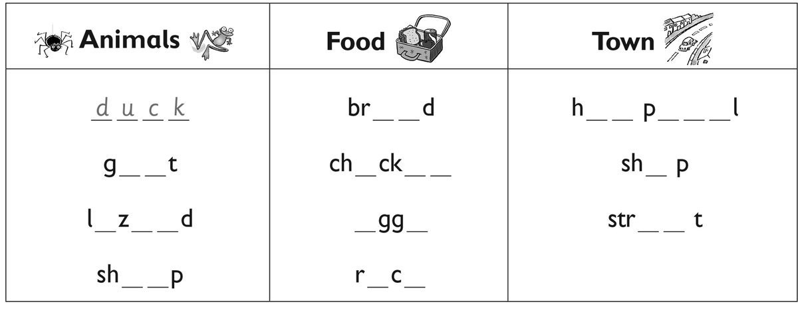
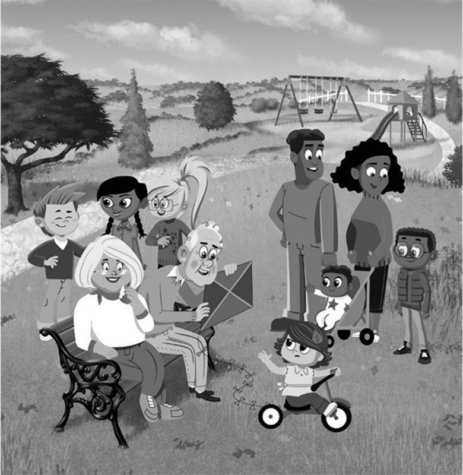
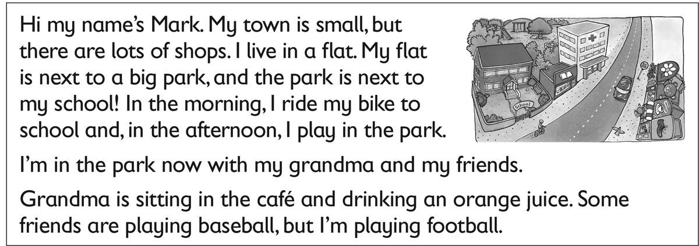

**[Vocabulary]{.underline}**

**1. Look and write the words. There is one example.   (one point
each)**

**2. Write the words and answer the questions. There is one
example.   (one point each)**

1\. How many (child) *[children]{.underline}* are there?
*[five]{.underline}*

2\. How many (baby) \_\_\_\_\_\_\_\_\_\_\_\_\_ are there?
\_\_\_\_\_\_\_\_\_\_\_\_\_

3\. How many (woman) \_\_\_\_\_\_\_\_\_\_\_\_\_ are there?
\_\_\_\_\_\_\_\_\_\_\_\_\_

4\. How many (man) \_\_\_\_\_\_\_\_\_\_\_\_\_ are there?
\_\_\_\_\_\_\_\_\_\_\_\_\_

5\. How many (kite) \_\_\_\_\_\_\_\_\_\_\_\_\_ are there?
\_\_\_\_\_\_\_\_\_\_\_\_\_

6\. How many (bike) \_\_\_\_\_\_\_\_\_\_\_\_\_ are there?
\_\_\_\_\_\_\_\_\_\_\_\_\_

**[Grammar]{.underline}**

**3. Look and put the letters in order. Write the letter and the word.
There is one example.   (one point each)**

1\. *[    c    ]{.underline}* She's (inghtrow) *[throwing]{.underline}*
the ball.

2\. \_\_\_\_\_ She's (gstinti) \_\_\_\_\_\_\_\_\_\_\_\_.

3\. \_\_\_\_\_ He's (ttihgni) \_\_\_\_\_\_\_\_\_\_\_\_ the ball.

4\. \_\_\_\_\_ He's (yigfln) \_\_\_\_\_\_\_\_\_\_\_\_ a kite.

5\. \_\_\_\_\_ He's (gsleinep) \_\_\_\_\_\_\_\_\_\_\_\_.

6\. \_\_\_\_\_ She's (gnikcik) \_\_\_\_\_\_\_\_\_\_\_\_ a ball.

**4. Read and write the words. There is one example.    (one point
each)**

1\. The grey car is *[between]{.underline}* the white car and the bus.

2\. The bookshop is \_\_\_\_\_\_\_\_\_\_\_\_\_\_\_\_\_\_\_ the bus.

3\. The girl on the bike is \_\_\_\_\_\_\_\_\_\_\_\_\_\_\_\_\_\_\_ the
toy shop.

4\. The café is \_\_\_\_\_\_\_\_\_\_\_\_\_\_\_\_\_\_\_ the toy shop and
the book shop.

5\. There is a doll's house \_\_\_\_\_\_\_\_\_\_\_\_\_\_\_\_\_\_\_ the
toy shop.

6\. The book shop \_\_\_\_\_\_\_\_\_\_\_\_\_\_\_\_\_\_\_ is the café.

**5. Put the words in order. Match. Write the number. There are two
extra answers. There is one example.**

1\. are What doing you

  ------------------------------- --- -------------------------------
  *[What are you                      So do I!
  doing]{.underline}*?                

  ------------------------------- --- -------------------------------

2\. that Who's

  ------------------------------------------- --- -------------------------------
  \_\_\_\_\_\_\_\_\_\_\_\_\_\_\_\_\_\_\_\_?       They're in the park.

  ------------------------------------------- --- -------------------------------

3\. cousin your doing What's

  ----------------------------------------- --- -------------------------------
  \_\_\_\_\_\_\_\_\_\_\_\_\_\_\_\_\_\_\_?       He's ten.

  ----------------------------------------- --- -------------------------------

4\. some Can rice I have

  ------------------------------------------- --- -------------------------------
  \_\_\_\_\_\_\_\_\_\_\_\_\_\_\_\_\_\_\_\_?       It's next to the café.

  ------------------------------------------- --- -------------------------------

5\. hospital the Where's

  ------------------------------------------- --- -------------------------------
  \_\_\_\_\_\_\_\_\_\_\_\_\_\_\_\_\_\_\_\_?       That's my cousin.

  ------------------------------------------- --- -------------------------------

6\. juice I orange love

  ------------------------------------------- --- -------------------------------
  \_\_\_\_\_\_\_\_\_\_\_\_\_\_\_\_\_\_\_\_.       Yes, here you are.

  ------------------------------------------- --- -------------------------------

  ------------------------------- --- -------------------------------
                                      I'm cleaning my bedroom.

  ------------------------------- --- -------------------------------

  ------------------------------- --- -------------------------------
                                      She's catching a ball.

  ------------------------------- --- -------------------------------

**[Listening]{.underline}**

**6. Listen and write the number. Then write. There is one
example.   (one point each)**

1\. He's sleeping.

2\. \_\_\_\_\_\_\_\_\_\_\_\_\_\_\_\_\_\_\_\_\_\_\_\_\_\_\_

3\. \_\_\_\_\_\_\_\_\_\_\_\_\_\_\_\_\_\_\_\_\_\_\_\_\_\_\_

4\. \_\_\_\_\_\_\_\_\_\_\_\_\_\_\_\_\_\_\_\_\_\_\_\_\_\_\_

5\. \_\_\_\_\_\_\_\_\_\_\_\_\_\_\_\_\_\_\_\_\_\_\_\_\_\_\_

6\. \_\_\_\_\_\_\_\_\_\_\_\_\_\_\_\_\_\_\_\_\_\_\_\_\_\_\_

**7. Look and listen. Write the number. There is one example.   (one
point each)**

**[Reading]{.underline}**

**8. Read and write. There is one example.   (one point each)**

1\. There are lots of *[shops]{.underline}* in Mark's town.

2\. He plays in the park in the \_\_\_\_\_\_\_\_\_\_\_\_\_\_\_\_.

3\. He lives in a \_\_\_\_\_\_\_\_\_\_\_\_\_\_\_\_ not a house.

4\. Now his grandma is sitting in the \_\_\_\_\_\_\_\_\_\_\_\_\_\_\_\_.

5\. The park is between his house and his
\_\_\_\_\_\_\_\_\_\_\_\_\_\_\_\_.

6\. Mark isn't playing \_\_\_\_\_\_\_\_\_\_\_\_\_\_\_\_, he's playing
football.

