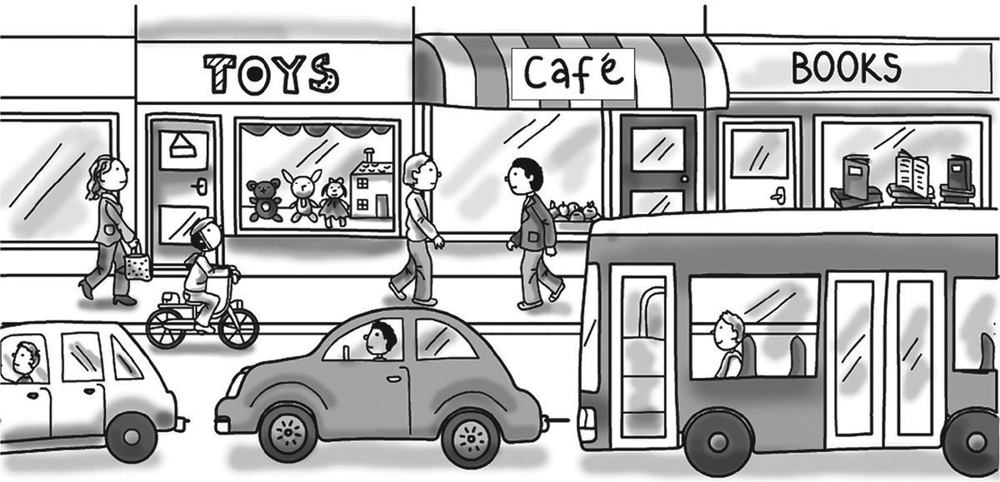
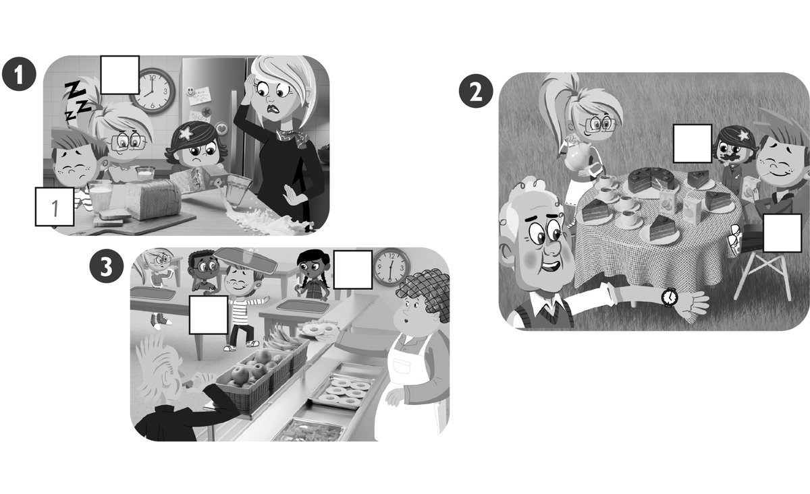
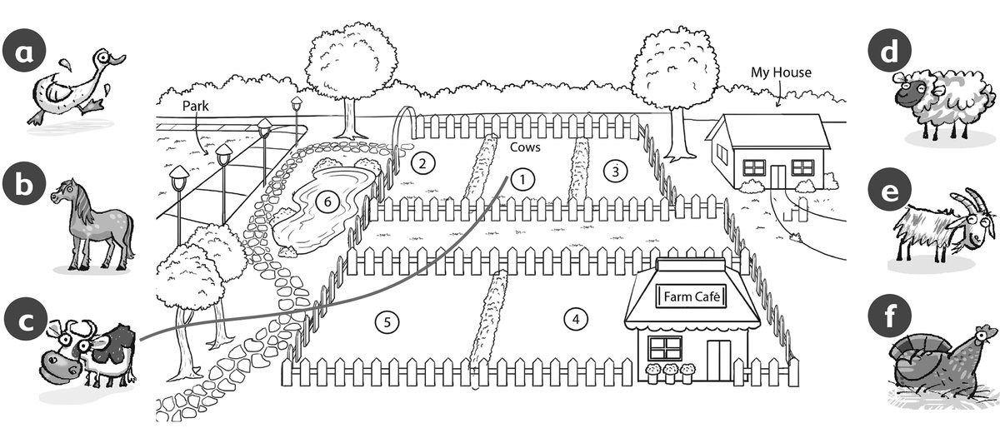

**[Vocabulary]{.underline}**

**1. Look and write the words. There is one example.   (one point
each)**

bread \| chicken \| ~~duck~~ \| eggs \| hospital \| goat \| lizard \|
rice \| shop \| spider \| street

*Animals: goat*

*lizard, spider; Food: bread*

*chicken*

*eggs*

*rice; Town: hospital*

*shop*

*street*

**2. Look and write. There is one example.   (one point each)**

  ------------------------------- --- -----------------------------------
  1\. How many children are           *[five]{.underline}*
  there?                              

  ------------------------------- --- -----------------------------------

  ------------------------------- --- -----------------------------------
  2\. How many babies are there?      *women -- two*

  ------------------------------- --- -----------------------------------

  ------------------------------- --- -----------------------------------
  3\. How many women are there?       *women -- two*

  ------------------------------- --- -----------------------------------

  ------------------------------- --- -----------------------------------
  4\. How many men are there?         *men -- two*

  ------------------------------- --- -----------------------------------

  ------------------------------- --- -----------------------------------
  5\. How many kites are there?       *kites -- one*

  ------------------------------- --- -----------------------------------

  ------------------------------- --- -----------------------------------
  6\. How many bikes are there?       *bikes -- one*

  ------------------------------- --- -----------------------------------

**[Grammar]{.underline}**

**3. Look and circle. There is one example.   (one point each)**

1\. She's *[sitting]{.underline}* / *swimming*.

2\. He's *catching* / *hitting* the ball.

*hitting*

3\. She's *throwing* / *kicking* the ball.

*throwing*

4\. She's *kicking* / *bouncing* the ball.

*kicking*

5\. He's *walking* / *sleeping*.

*sleeping*

6\. He's *flying* / *riding* a kite.

*flying*

**4. Read and draw lines. There is one example.   (one point each)**

*2.behind*

*3.in front of*

*4.between*

*5.in*

*6.next to*

**5. Read and match. Write the number. There are two extra answers.
There is one example.   (one point each)**

  ------------------------------- --- -------------------------------
  \_\_ What are you doing?            So do I!

  ------------------------------- --- -------------------------------

*I'm cleaning my bedroom.*

  ------------------------------- --- -------------------------------
  \_\_ Who's that?                    I'm cleaning my bedroom.

  ------------------------------- --- -------------------------------

*That's my cousin.*

  ------------------------------- --- -------------------------------
  \_\_ What's your cousin doing?      They're in the park. He's ten.

  ------------------------------- --- -------------------------------

*She's catching a ball.*

  ------------------------------- --- -------------------------------
  \_\_ Can I have some rice? v        She's catching a ball.

  ------------------------------- --- -------------------------------

*Yes, here you are.*

  ------------------------------- --- -------------------------------
  \_\_ Where's the hospital?          It's next to the café.

  ------------------------------- --- -------------------------------

*It's next to the café.*

  ------------------------------- --- -------------------------------
  \_\_ I love orange juice.           Yes, here you are.

  ------------------------------- --- -------------------------------

*So do I!*

  ------------------------------- --- -------------------------------
  \_\_                                That's my cousin.

  ------------------------------- --- -------------------------------

**[Listening]{.underline}**

**6. Listen and write the number. There is one example.   (one point
each)**

*Picture 1: girl eating - 3*

*Picture 2: boy drinking - 4, girl eating - 5*

*Picture 3: girl eating - 2, boy playing - 6*

**Audio script**

He's sleeping.

She's eating a banana.

She's eating bread.

He's drinking juice.

She's eating cake.

He's playing.

**7. Look and listen. Draw the line. There is one example.   (one point
each)**

*2. d - sheep*

*3. f - chicken*

*4. e - goat*

*5. b - horse*

*6. a - duck*

**Audio script**

There's a farm between my house and the park.

The cows are between the sheep and the chickens. The chickens are next
to my house, under a tree. The sheep are next to the park.

There is a café at the farm. There are goats next to the café.

There are horses between the goats and the park.

The park is very big and there are lots of ducks. They love the water in
the park.

**8. Read and write yes or no. There is one example.   (one point
each)**

  ------------------------------- --- -----------------------------------
  1\. Mark lives in a small town.     *[yes]{.underline}*

  ------------------------------- --- -----------------------------------

  ------------------------------- --- -----------------------------------
  2\. He lives in a house.            *no*

  ------------------------------- --- -----------------------------------

  ------------------------------- --- -----------------------------------
  3\. He lives next to the park.      *yes*

  ------------------------------- --- -----------------------------------

  ------------------------------- --- -----------------------------------
  4\. He plays in the park in the     *no*
  morning.                            

  ------------------------------- --- -----------------------------------

  ------------------------------- --- -----------------------------------
  5\. Now his grandma is sitting      *no*
  under a tree.                       

  ------------------------------- --- -----------------------------------

  ------------------------------- --- -----------------------------------
  6\. Mark is playing football.       *yes*

  ------------------------------- --- -----------------------------------

