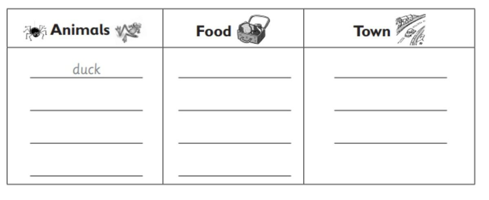
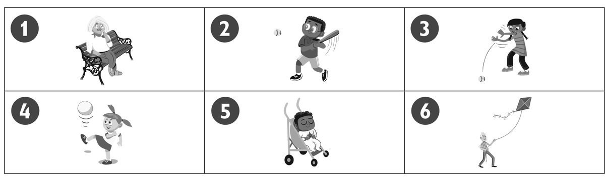
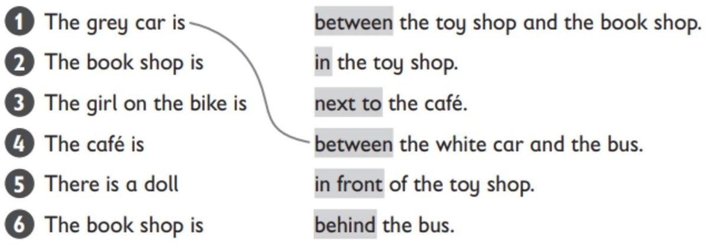
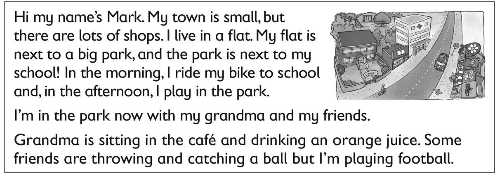

**[Vocabulary]{.underline}**

**1. Look and write the words. There is one example.   (one point
each)**

bread \| chicken \| ~~duck~~ \| eggs \| hospital \| goat \| lizard \|
rice \| shop \| spider \| street

**2. Look and write. There is one example.   (one point each)**

  ------------------------------- --- -----------------------------------
  1\. How many children are           *[five]{.underline}*
  there?                              

  ------------------------------- --- -----------------------------------

  ------------------------------- --- -----------------------------------
  2\. How many babies are there?      \_\_\_\_\_\_\_\_\_\_\_\_\_\_\_

  ------------------------------- --- -----------------------------------

  ------------------------------- --- -----------------------------------
  3\. How many women are there?       \_\_\_\_\_\_\_\_\_\_\_\_\_\_\_

  ------------------------------- --- -----------------------------------

  ------------------------------- --- -----------------------------------
  4\. How many men are there?         \_\_\_\_\_\_\_\_\_\_\_\_\_\_\_

  ------------------------------- --- -----------------------------------

  ------------------------------- --- -----------------------------------
  5\. How many kites are there?       \_\_\_\_\_\_\_\_\_\_\_\_\_\_\_

  ------------------------------- --- -----------------------------------

  ------------------------------- --- -----------------------------------
  6\. How many bikes are there?       \_\_\_\_\_\_\_\_\_\_\_\_\_\_\_

  ------------------------------- --- -----------------------------------

**[Grammar]{.underline}**

**3. Look and circle. There is one example.   (one point each)**

1\. She's *[sitting]{.underline}* / *swimming*.

2\. He's *catching* / *hitting* the ball.

3\. She's *throwing* / *kicking* the ball.

4\. She's *kicking* / *bouncing* the ball.

5\. He's *walking* / *sleeping*.

6\. He's *flying* / *riding* a kite.

**4. Read and draw lines. There is one example.   (one point each)**

**5. Read and match. Write the number. There are two extra answers.
There is one example.   (one point each)**

  ------------------------------- --- -------------------------------
  \_\_ What are you doing?            I'm cleaning my bedroom.

  ------------------------------- --- -------------------------------

  ------------------------------- --- -------------------------------
  \_\_ Who's that?                    She's catching a ball.

  ------------------------------- --- -------------------------------

  ------------------------------- --- -------------------------------
  \_\_ What's your cousin doing?      They're in the park. He's ten.

  ------------------------------- --- -------------------------------

  ------------------------------- --- -------------------------------
  \_\_ Can I have some rice? v        So do I!

  ------------------------------- --- -------------------------------

  ------------------------------- --- -------------------------------
  \_\_ Where's the hospital?          That's my cousin.

  ------------------------------- --- -------------------------------

  ------------------------------- --- -------------------------------
  \_\_ I love orange juice.           Yes, here you are.

  ------------------------------- --- -------------------------------

  ------------------------------- --- -------------------------------
  \_\_                                It's next to the café.

  ------------------------------- --- -------------------------------

**[Listening]{.underline}**

**6. Listen and write the number. There is one example.   (one point
each)**

**7. Look and listen. Draw the line. There is one example.   (one point
each)**

**8. Read and write yes or no. There is one example.   (one point
each)**

  ------------------------------- --- -----------------------------------
  1\. Mark lives in a small town.     *[yes]{.underline}*

  ------------------------------- --- -----------------------------------

  ------------------------------- --- -----------------------------------
  2\. He lives in a house.            \_\_\_\_\_\_\_

  ------------------------------- --- -----------------------------------

  ------------------------------- --- -----------------------------------
  3\. He lives next to the park.      \_\_\_\_\_\_\_

  ------------------------------- --- -----------------------------------

  ------------------------------- --- -----------------------------------
  4\. He plays in the park in the     \_\_\_\_\_\_\_
  morning.                            

  ------------------------------- --- -----------------------------------

  ------------------------------- --- -----------------------------------
  5\. Now his grandma is sitting      \_\_\_\_\_\_\_
  under a tree.                       

  ------------------------------- --- -----------------------------------

  ------------------------------- --- -----------------------------------
  6\. Mark is playing football.       \_\_\_\_\_\_\_

  ------------------------------- --- -----------------------------------

