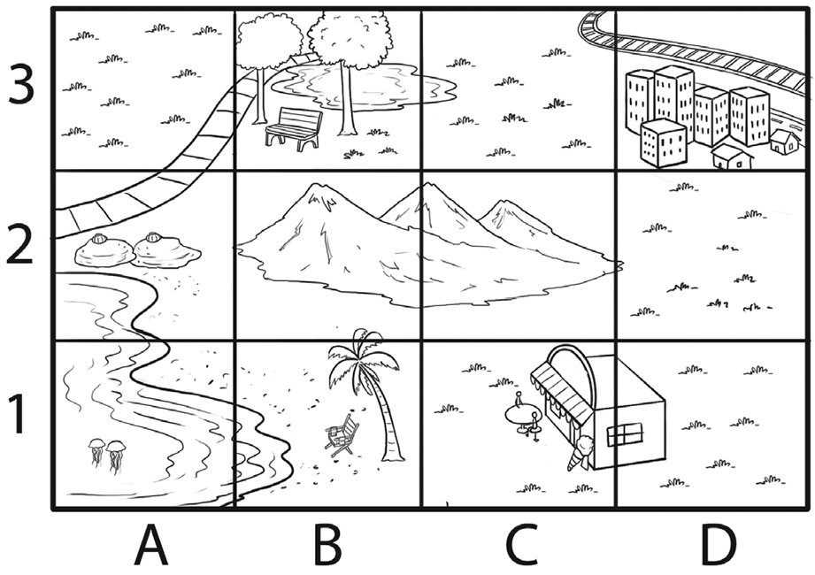
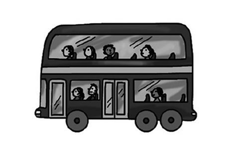
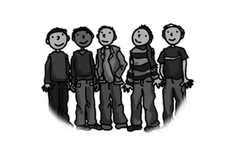
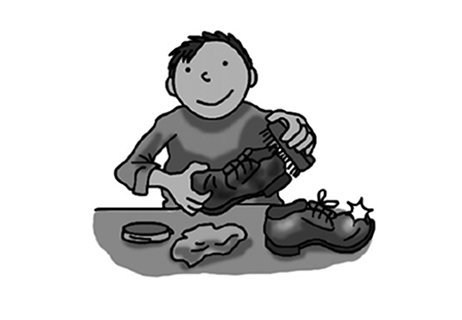
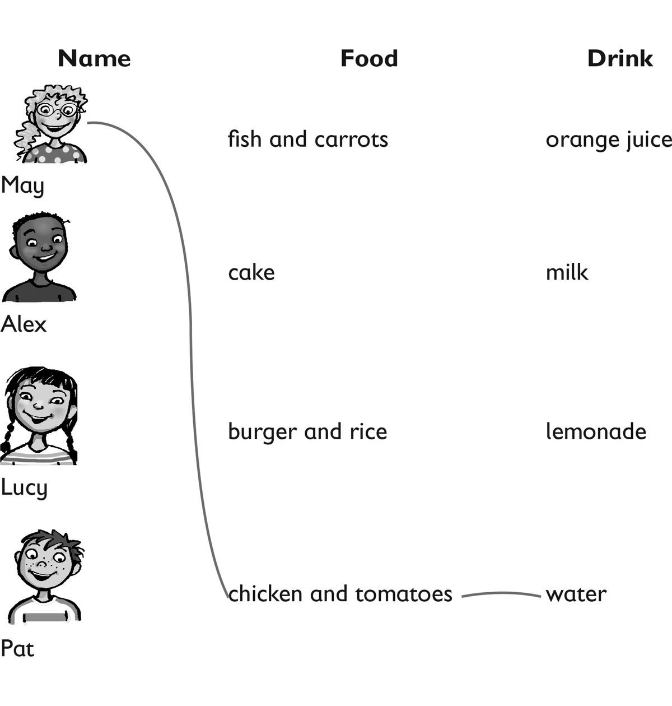
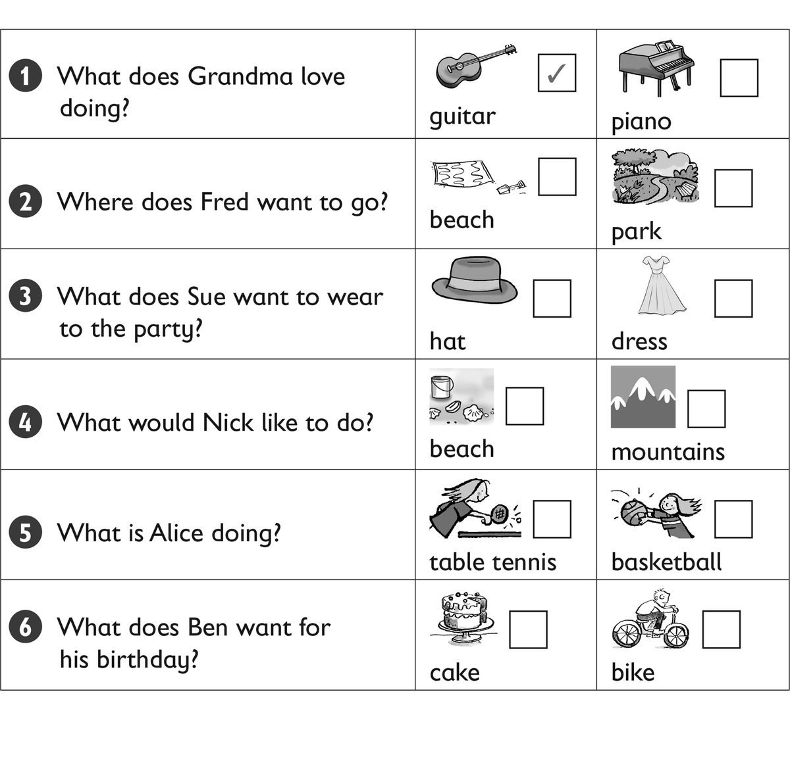

**[Vocabulary]{.underline}**

**1. Look and read. Write the name. Draw lines. There is one
example.   (one point each)**

1\. *[Bill]{.underline}*'s wearing a shirt, trousers and a hat. He's got
a ball.

2\. \_\_\_\_\_\_\_\_\_\_\_\_'s wearing a skirt, T-shirt and shoes. She's
got a phone.

*Anna (phone)*

3\. \_\_\_\_\_\_\_\_\_\_\_\_'s wearing a T-shirt, a hat and jeans. He's
got a watch.

*Matt (watch)*

4\. \_\_\_\_\_\_\_\_\_\_\_\_'s wearing a skirt and socks. She's got a
guitar.

*Grace (guitar)*

5\. \_\_\_\_\_\_\_\_\_\_\_\_'s wearing a shirt, black trousers and a
jacket. He's got a fish.

*Tom (fish)*

6\. \_\_\_\_\_\_\_\_\_\_\_\_'s wearing a long dress. She's got a camera.

*May (camera)*

**2. Look and draw lines. There is one example.   (one point each)**

*2. a photo*

*3. a bus*

*4. a picture*

*5. hockey*

*6. the guitar*

**3. Look and read. Write the number and letter. There are two
examples.   (one point each)**

*[   3D  ]{.underline}* There is a city.

\_\_\_\_\_ There are two shells.

\_\_\_\_\_ There are two jellyfish in the sea.

\_\_\_\_\_ There is a park.

\_\_\_\_\_ There is a beach with a tree.

\_\_\_\_\_ and *[   2C  ]{.underline}* There are three mountains.

*2A*

*1A*

*3B*

*1B*

*2B*

**[Grammar]{.underline}**

**4. Complete the questions and answers. There is one example.   (one
point each)**

like \| ~~Does~~ \| do \| doesn't \| Do \| does

1\. *[Does]{.underline}* Suzy like picking up shells?

2\. Yes, she *does*.

3\. *Do* you like going to the beach?

4\. Yes, I *do*.

5\. Does Rick *like* fishing?

6\. No, he *doesn't*.

**5. Read and circle. There is one example.   (one point each)**

1\. Look at *[her]{.underline}* / *him*.

    She's wearing a skirt.

2\. Look at *us* / *them*.

    We're on the bus.

*us*

3\. Look at *us* / *me*.

    I'm under a tree.

*me*

4\. Look at *them* / *him*.

    Look at those men.

*them*

5\. Look at *them* / *him*.

    He can swim.

*him*

6\. Look at *me* / *you*.

    You're cleaning a shoe.

*you*

**[Listening]{.underline}**

**6. Listen and draw lines. There is one example.   (one point each)**

*Alex -- burger and rice, orange juice*

*Lucy -- fish and carrots, milk*

*Pat -- cake, lemonade.*

**Audio script**

**1**

**Woman:** Hi May, what would you like to eat?

**May:** I'd like some chicken and, um, some tomatoes. Can I some water
too, please?

**Woman:** Yes, of course. Here you are.

**2**

**Woman:** Hi Alex, what would you like to eat?

**Alex:** I'd like a burger and some rice, please.

**Woman:** What about a drink?

**Alex:** Can I have an orange juice?

**Woman:** Here you are.

**3**

**Woman:** Good afternoon, Lucy, what would you like for lunch?

**Lucy:** I want some fish and carrots, please, and I'd like a glass of
milk.

**Woman:** Great. Here you are.

**Lucy:** Thank you.

**4**

**Woman:** Hello Pat. How are you?

**Pat:** Very well, thank you.

**Woman:** What would you like for lunch?

**Pat:** Can I have some cake and a lemonade.

**Woman:** Yes, here you are.

**Pat:** Thank you!

**7. Look and listen. Tick. There is one example.   (one point each)**

*2. park*

*3. hat*

*4. mountains*

*5. table tennis*

*6. bike*

**Audio script**

**1**

**Boy:** Can your grandma play the piano?

**Girl:** No, but she loves playing the guitar!

**2**

**Man:** Let's go to the beach today!

**Boy:** Oh, but I want to go to the park and play football.

**Man:** OK. Let's go to the park.

**3**

**Mum:** What do you want to wear to the school party, Sue?

**Sue:** Can I wear Dad's big hat?

**Mum:** Ha ha! OK.

**4**

**Woman:** Let's take the dog for a walk.

**Boy:** Can we walk in the mountains?

**Woman:** Oh yes, the dog loves the mountains!

**5**

**Woman:** Where's Alice? Is she playing basketball?

**Boy:** No, she's playing table tennis with a friend.

**Woman:** Oh yes ... that's right!

**6**

**Dad:** What do you want for your birthday, Ben?

**Ben:** Oooh! Can I have a new, bike, Dad?

**Dad:** That's a good idea.

**[Reading]{.underline}**

**8. Read and circle. There is one example.   (one point each)**

1\. What's Mum wearing?        a *book* / *[dress]{.underline}*

2\. How many children are playing badminton?        *four* / *five*

*four*

3\. How many shells are there?        *two* / *three*

*three*

4\. What's on the table?        a *tomato* / *watermelon*

*watermelon*

5\. Where's the young boy sitting?        *on the sand* / *in the sea*

*on the sand*

6\. What's Mum doing?        *reading* / *writing*

*reading*

