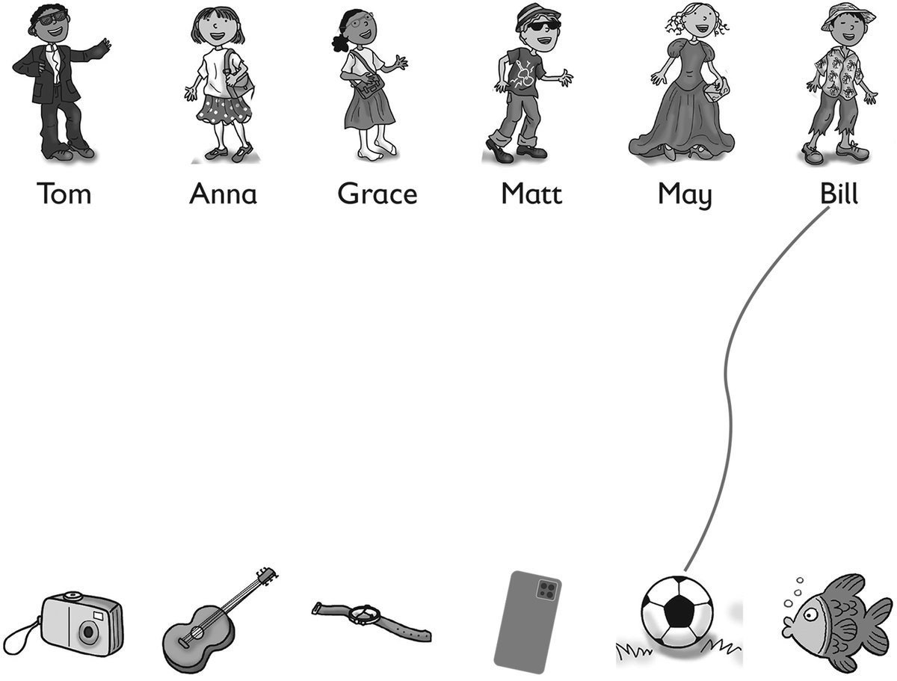
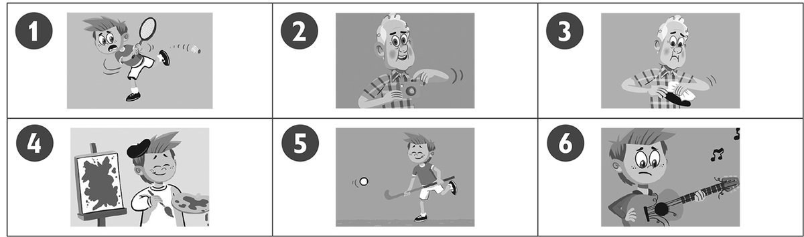
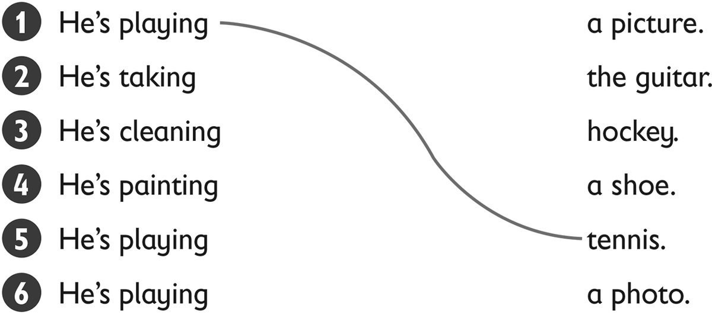
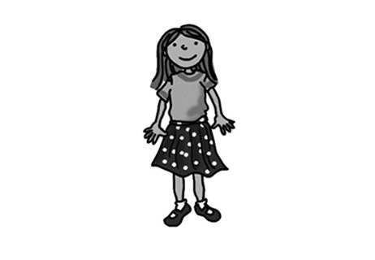
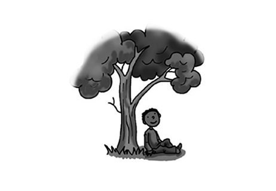
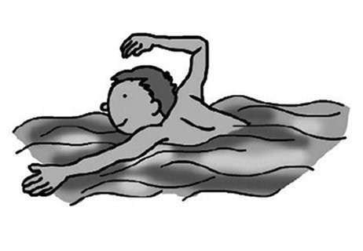
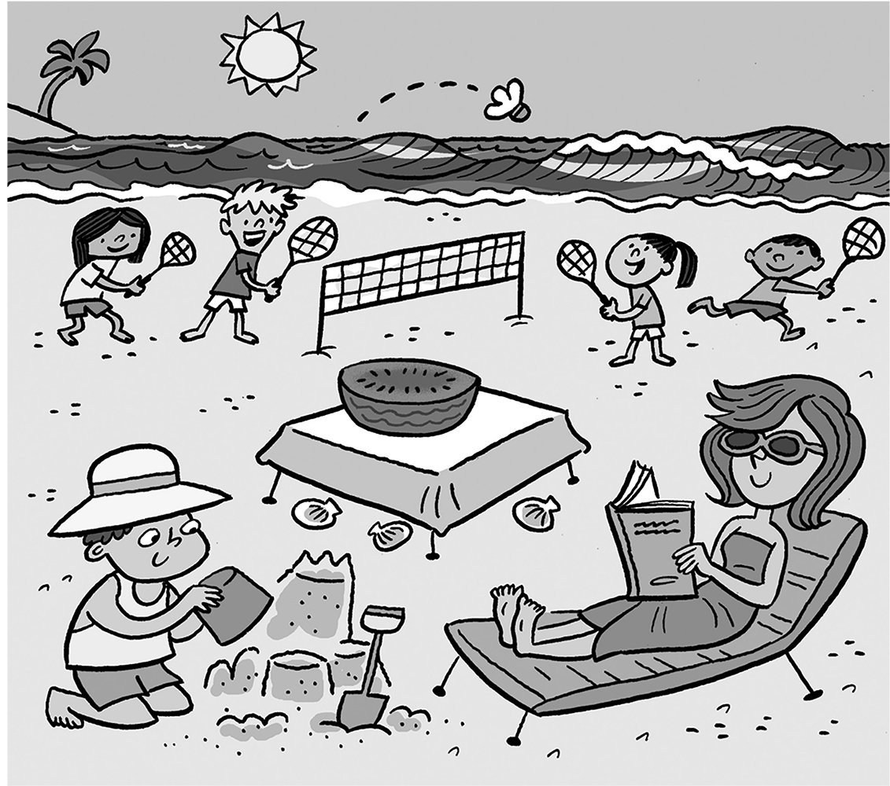

**[Vocabulary]{.underline}**

**1. Look and read. Write the name. Draw lines. There is one
example.   (one point each)**

1\. *[Bill]{.underline}*'s wearing a shirt, trousers and a hat. He's got
a ball.

2\. \_\_\_\_\_\_\_\_\_\_\_\_'s wearing a skirt, T-shirt and shoes. She's
got a phone.

3\. \_\_\_\_\_\_\_\_\_\_\_\_'s wearing a T-shirt, a hat and jeans. He's
got a watch.

4\. \_\_\_\_\_\_\_\_\_\_\_\_'s wearing a skirt and socks. She's got a
guitar.

5\. \_\_\_\_\_\_\_\_\_\_\_\_'s wearing a shirt, black trousers and a
jacket. He's got a fish.

6\. \_\_\_\_\_\_\_\_\_\_\_\_'s wearing a long dress. She's got a camera.

**2. Look and draw lines. There is one example.   (one point each)**

**3. Look and read. Write the number and letter. There are two
examples.   (one point each)**

*[   3D  ]{.underline}* There is a city.

\_\_\_\_\_ There are two shells.

\_\_\_\_\_ There are two jellyfish in the sea.

\_\_\_\_\_ There is a park.

\_\_\_\_\_ There is a beach with a tree.

\_\_\_\_\_ and *[   2C  ]{.underline}* There are three mountains.

**[Grammar]{.underline}**

**4. Complete the questions and answers. There is one example.   (one
point each)**

like \| ~~Does~~ \| do \| doesn't \| Do \| does

1\. *[Does]{.underline}* Suzy like picking up shells?

2\. Yes, she \_\_\_\_\_\_\_\_\_\_\_\_\_\_.

3\. \_\_\_\_\_\_\_\_\_\_\_\_\_\_ you like going to the beach?

4\. Yes, I \_\_\_\_\_\_\_\_\_\_\_\_\_\_.

5\. Does Rick \_\_\_\_\_\_\_\_\_\_\_\_\_\_ fishing?

6\. No, he \_\_\_\_\_\_\_\_\_\_\_\_\_\_.

**5. Read and circle. There is one example.   (one point each)**

1\. Look at *[her]{.underline}* / *him*.

    She's wearing a skirt.

2\. Look at *us* / *them*.

    We're on the bus.

3\. Look at *us* / *me*.

    I'm under a tree.

4\. Look at *them* / *him*.

    Look at those men.

5\. Look at *them* / *him*.

    He can swim.

6\. Look at *me* / *you*.

    You're cleaning a shoe.

**[Listening]{.underline}**

**6. Listen and draw lines. There is one example.   (one point each)**

**7. Look and listen. Tick. There is one example.   (one point each)**

**[Reading]{.underline}**

**8. Read and circle. There is one example.   (one point each)**

1\. What's Mum wearing?        a *book* / *[dress]{.underline}*

2\. How many children are playing badminton?        *four* / *five*

3\. How many shells are there?        *two* / *three*

4\. What's on the table?        a *tomato* / *watermelon*

5\. Where's the young boy sitting?        *on the sand* / *in the sea*

6\. What's Mum doing?        *reading* / *writing*

