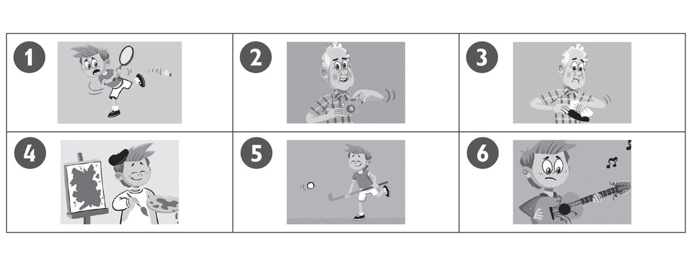
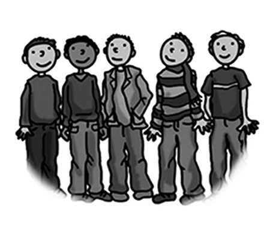
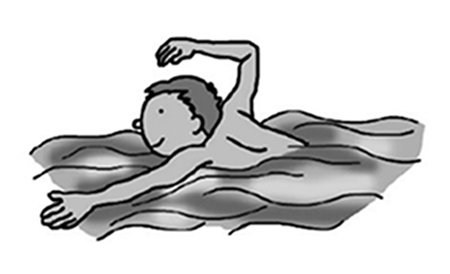
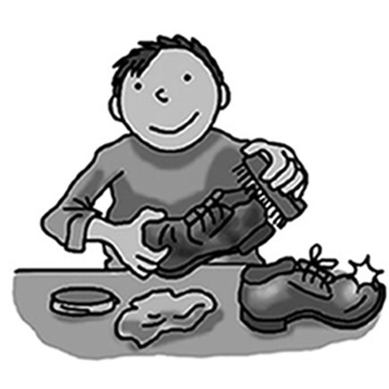
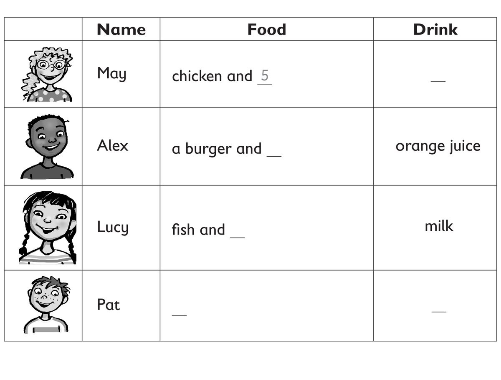

**[Vocabulary]{.underline}**

**1. Look, read and write the words. Match and write the number. There
is one example.   (one point each)**

1\. Bill's wearing a shirt, trousers and a h *[a t]{.underline}*. He's
got a *[ball]{.underline}*.

2\. Anna's wearing a sk \_\_\_\_\_\_\_\_\_\_\_\_\_\_ and T-shirt. She's
got a p \_\_\_\_\_\_\_\_\_\_\_\_\_\_.

*Anna -- skirt*

3\. Matt's wearing j \_\_\_\_\_\_\_\_\_\_\_\_\_\_ s and sunglasses. He's
got a w \_\_\_\_\_\_\_\_\_\_\_\_\_\_.

*Matt -- jeans, watch;*

4\. Grace's wearing a skirt and s \_\_\_\_\_\_\_\_\_\_\_\_\_\_ ks. She's
got a g \_\_\_\_\_\_\_\_\_\_\_\_\_\_.

*Grace -- socks, guitar;*

5\. Tom's wearing a sh \_\_\_\_\_\_\_\_\_\_\_\_\_\_, black trousers and
a jacket. He's got a f \_\_\_\_\_\_\_\_\_\_\_\_\_\_.

*Tom -- shirt, fish;*

6\. May's wearing a long dr \_\_\_\_\_\_\_\_\_\_\_\_\_\_. She's got a c
\_\_\_\_\_\_\_\_\_\_\_\_\_\_.

*May -- dress, camera*

**2. Look and write. There is one example.   (one point each)**

1\. He's playing *[tennis]{.underline}*.

2\. He's taking a *photo*.

3\. He's cleaning a *bus*.

4\. He's painting a *picture*.

5\. He's playing *hockey*.

6\. He's playing the *guitar*.

**3. Read and write the words. There are two extra words. There is one
example.   (one point each)**

beach \| café \| ~~city~~ \| farm \| jellyfish \| mountains \| park \|
shells

1\. 3D There is a *[city]{.underline}*.

2\. 2A There are two *2A -- shells*.

3\. 1A There are two *1A -- jellyfish* in the sea.

4\. 3B There is a *3B -- park*.

5\. 1B There is a with *1B -- beach* a tree.

6\. 2B / 2C There are three *2B/C -- mountains*.

**[Grammar]{.underline}**

**4. Write the questions and answers. There is one example.   (one point
each)**

1\. Suzy / picking up / shells  (✓)

*[Does Suzy like picking up shells? Yes, she does.]{.underline}*

2\. You / going / beach (✓)

*Do you like going to the beach? -- Yes, I do.*

3\. Rick / swimming / sea  (✗)

*Does Rick like swimming in the sea? -- No, he doesn't.*

4\. Mrs Star / reading / sun  (✓)

*Does Mrs Star like reading in the sun? -- Yes, she does.*

5\. Simon / eating / ice cream  (✓)

*Does Simon like eating ice cream? -- Yes, he does.*

6\. You / fishing  (✗)

*Do you like fishing? -- No, I don't.*

**5. Read and write the words. There is one example.    (one point
each)**

1\. Look at *[her]{.underline}*.

She's wearing a skirt.

2\. Look at \_\_\_\_\_\_\_\_\_\_\_\_\_\_\_.

We're on the bus.

*us*

3\. Look at \_\_\_\_\_\_\_\_\_\_\_\_\_\_\_.

I'm under a tree.

*me*

4\. Look at \_\_\_\_\_\_\_\_\_\_\_\_\_\_\_.

Look at those men.

*them*

5\. Look at \_\_\_\_\_\_\_\_\_\_\_\_\_\_\_.

He can swim.

*him*

6\. Look at \_\_\_\_\_\_\_\_\_\_\_\_\_\_\_.

You're cleaning a shoe.

*you*

**[Listening]{.underline}**

**6. Listen and write the number. There is one example.   (one point
each)**

*May -- 6*

*Alex -- 4*

*Lucy -- 2*

*Pat -- 1 3*

**Audio script**

1

**Woman:** Hi May, what would you like to eat?

**May:** I'd like some chicken and, um, some tomatoes.

Can I some water too, please?

**Woman:** Yes, of course. Here you are.

2

**Woman:** Hi Alex, what would you like to eat?

**Alex:** I'd like a burger and some rice, please.

**Woman:** What about a drink?

**Alex:** Can I have an orange juice?

**Woman:** Here you are.

3

**Woman:** Good afternoon, Lucy, what would you like for lunch?

**Lucy:** I want some fish and carrots, please, and I'd like a glass of
milk.

**Woman:** Great. Here you are.

**Lucy:** Thank you.

4

**Woman:** Hello Pat. How are you?

**Pat:** Very well, thank you.

**Woman:** What would you like for lunch?

**Pat:** Can I have some cake and a lemonade.

**Woman:** Yes, here you are.

**Pat:** Thank you!

**7. Look and listen. Tick. There is one example.   (one point each)**

*2. b*

*3. c*

*4. a*

*5. a*

*6. c*

**Audio script**

1

**Boy:** Can your grandma play the piano?

**Girl:** No, but she loves playing the guitar!

2

**Man:** Let's go to the beach today!

**Boy:** Oh, but I want to go to the park and play football.

**Man:** OK. Let's go to the park.

**Mum:** What do you want to wear to the school party, Sue?

**Sue:** Can I wear Dad's big hat?

**Mum:** Ha ha! OK.

4

**Woman:** Let's take the dog for a walk.

**Boy:** Can we walk in the mountains?

**Woman:** Oh yes, the dog loves the mountains!

5

**Woman:** Where's Alice? Is she playing basketball?

**Boy:** No, she's playing table tennis with a friend.

**Woman:** Oh yes ... that's right!

6

**Dad:** What do you want for your birthday, Ben?

**Ben:** Oooh! Can I have a new, bike, Dad?

**Dad:** That's a good idea.

**[Reading]{.underline}**

**8. Read and write the words. There is one example.    (one point
each)**

1\. What's Mum wearing? a *[dress]{.underline}*

2\. How many children are playing badminton?   \_\_\_\_\_\_\_\_\_\_\_\_

*four*

3\. How many shells are there?   \_\_\_\_\_\_\_\_\_\_\_\_

*three*

4\. What's on the table?   a \_\_\_\_\_\_\_\_\_\_\_\_

*watermelon*

5\. Where's the young boy sitting?   on the \_\_\_\_\_\_\_\_\_\_\_\_

*sand*

6\. What's Mum doing?   she's \_\_\_\_\_\_\_\_\_\_\_\_

*reading*

