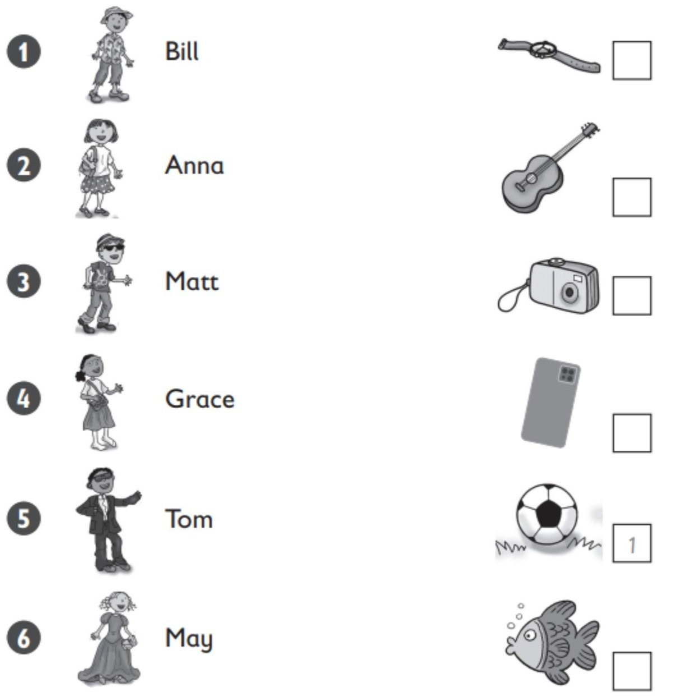
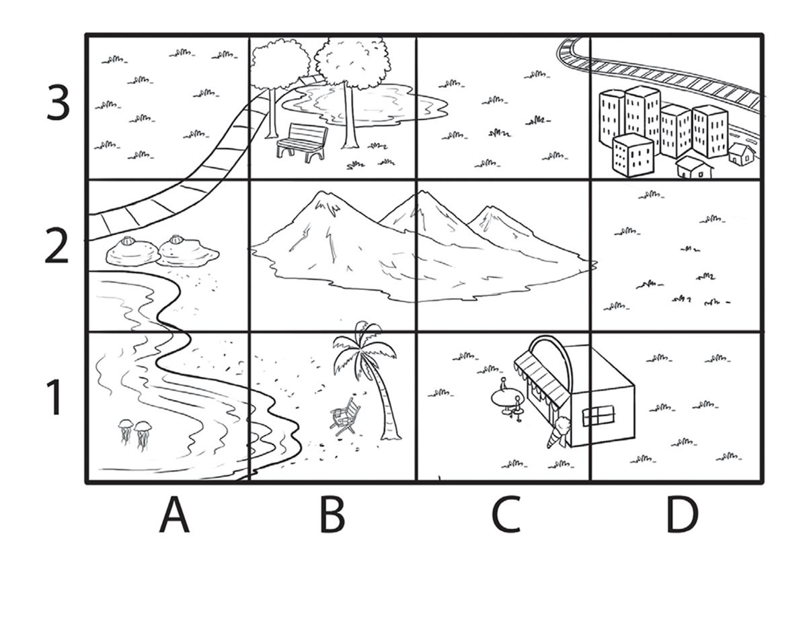
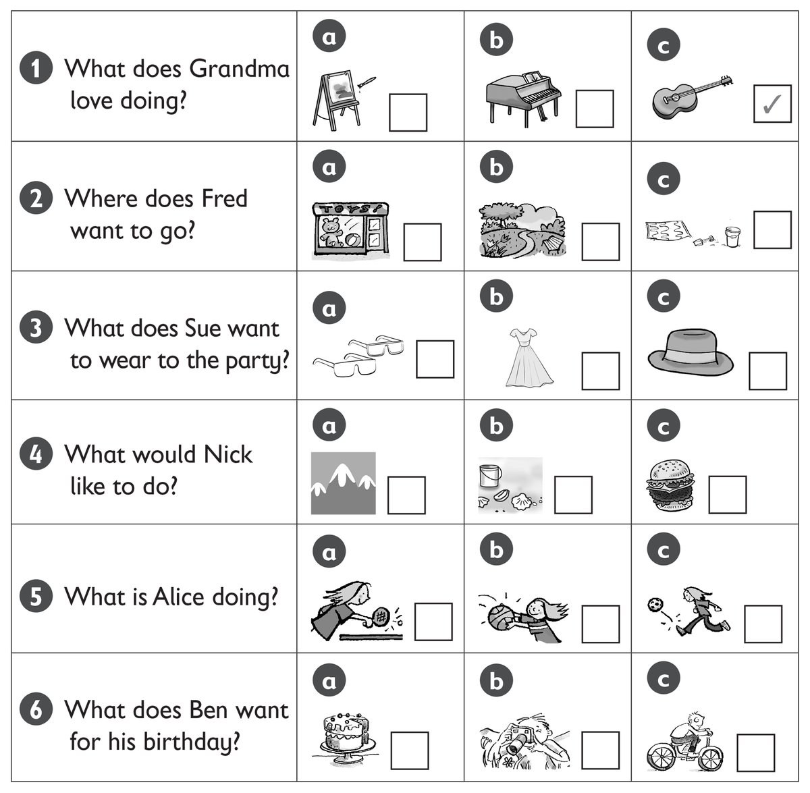
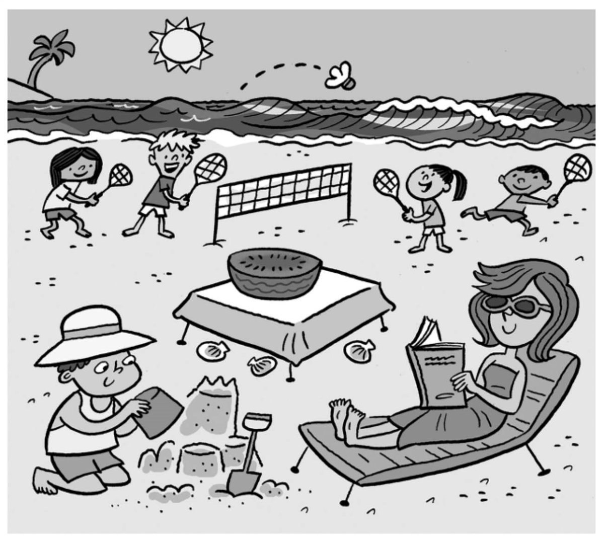

**[Vocabulary]{.underline}**

**1. Look, read and write the words. Match and write the number. There
is one example.   (one point each)**

1\. Bill's wearing a shirt, trousers and a h *[a t]{.underline}*. He's
got a *[ball]{.underline}*.

2\. Anna's wearing a sk \_\_\_\_\_\_\_\_\_\_\_\_\_\_ and T-shirt. She's
got a p \_\_\_\_\_\_\_\_\_\_\_\_\_\_.

3\. Matt's wearing j \_\_\_\_\_\_\_\_\_\_\_\_\_\_ s and sunglasses. He's
got a w \_\_\_\_\_\_\_\_\_\_\_\_\_\_.

4\. Grace's wearing a skirt and s \_\_\_\_\_\_\_\_\_\_\_\_\_\_ ks. She's
got a g \_\_\_\_\_\_\_\_\_\_\_\_\_\_.

5\. Tom's wearing a sh \_\_\_\_\_\_\_\_\_\_\_\_\_\_, black trousers and
a jacket. He's got a f \_\_\_\_\_\_\_\_\_\_\_\_\_\_.

6\. May's wearing a long dr \_\_\_\_\_\_\_\_\_\_\_\_\_\_. She's got a c
\_\_\_\_\_\_\_\_\_\_\_\_\_\_.

**2. Look and write. There is one example.   (one point each)**

1\. He's playing *[tennis]{.underline}*.

2\. He's taking a \_\_\_\_\_\_\_\_\_\_\_\_\_\_.

3\. He's cleaning a \_\_\_\_\_\_\_\_\_\_\_\_\_\_.

4\. He's painting a \_\_\_\_\_\_\_\_\_\_\_\_\_\_.

5\. He's playing \_\_\_\_\_\_\_\_\_\_\_\_\_\_.

6\. He's playing the \_\_\_\_\_\_\_\_\_\_\_\_\_\_.

**3. Read and write the words. There are two extra words. There is one
example.   (one point each)**

beach \| café \| ~~city~~ \| farm \| jellyfish \| mountains \| park \|
shells

1\. 3D There is a *[city]{.underline}*.

2\. 2A There are two \_\_\_\_\_\_\_\_\_\_\_\_\_\_\_\_\_\_\_\_\_\_\_.

3\. 1A There are two \_\_\_\_\_\_\_\_\_\_\_\_\_\_\_\_\_\_\_\_\_\_\_ in
the sea.

4\. 3B There is a \_\_\_\_\_\_\_\_\_\_\_\_\_\_\_\_\_\_\_\_\_\_\_.

5\. 1B There is a with \_\_\_\_\_\_\_\_\_\_\_\_\_\_\_\_\_\_\_\_\_\_\_ a
tree.

6\. 2B / 2C There are three
\_\_\_\_\_\_\_\_\_\_\_\_\_\_\_\_\_\_\_\_\_\_\_.

**[Grammar]{.underline}**

**4. Write the questions and answers. There is one example.   (one point
each)**

1\. Suzy / picking up / shells  (✓)

*[Does Suzy like picking up shells? Yes, she does.]{.underline}*

2\. You / going / beach (✓)

3\. Rick / swimming / sea  (✗)

4\. Mrs Star / reading / sun  (✓)

5\. Simon / eating / ice cream  (✓)

6\. You / fishing  (✗)

**5. Read and write the words. There is one example.    (one point
each)**

1\. Look at *[her]{.underline}*.

She's wearing a skirt.

2\. Look at \_\_\_\_\_\_\_\_\_\_\_\_\_\_\_.

We're on the bus.

3\. Look at \_\_\_\_\_\_\_\_\_\_\_\_\_\_\_.

I'm under a tree.

4\. Look at \_\_\_\_\_\_\_\_\_\_\_\_\_\_\_.

Look at those men.

5\. Look at \_\_\_\_\_\_\_\_\_\_\_\_\_\_\_.

He can swim.

6\. Look at \_\_\_\_\_\_\_\_\_\_\_\_\_\_\_.

You're cleaning a shoe.

**[Listening]{.underline}**

**6. Listen and write the number. There is one example.   (one point
each)**

**7. Look and listen. Tick. There is one example.   (one point each)**

**[Reading]{.underline}**

**8. Read and write the words. There is one example.    (one point
each)**

1\. What's Mum wearing? a *[dress]{.underline}*

2\. How many children are playing badminton?   \_\_\_\_\_\_\_\_\_\_\_\_

3\. How many shells are there?   \_\_\_\_\_\_\_\_\_\_\_\_

4\. What's on the table?   a \_\_\_\_\_\_\_\_\_\_\_\_

5\. Where's the young boy sitting?   on the \_\_\_\_\_\_\_\_\_\_\_\_

6\. What's Mum doing?   she's \_\_\_\_\_\_\_\_\_\_\_\_

