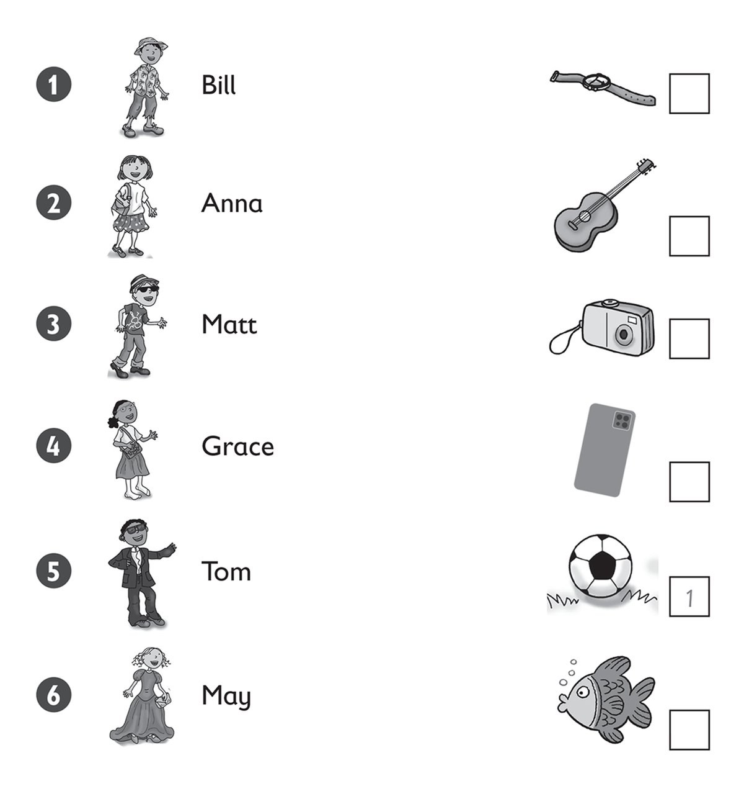
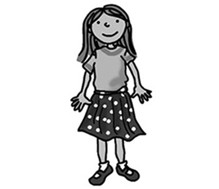
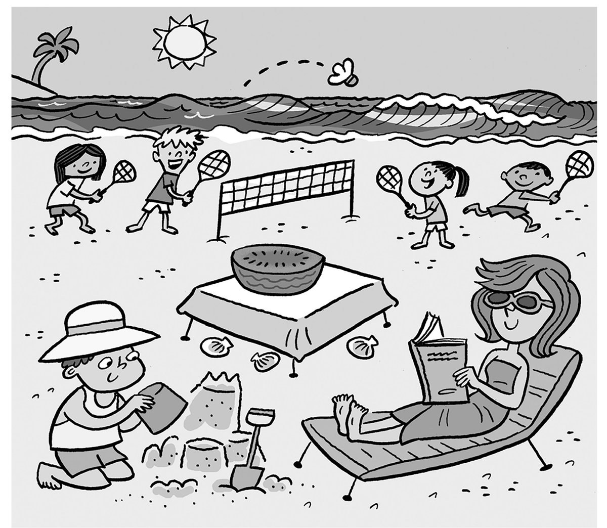

**[Vocabulary]{.underline}**

**1. Look and complete the words. Match and write the number. There is
one example.   (one point each)**

1\. Bill's wearing a shirt, trousers and a h [*a* *t*]{.underline} .
He's got a ball.

2\. Anna's wearing a sk \_\_\_\_\_\_ and T-shirt. She's got a phone.

*irt*

3\. Matt's wearing j \_\_\_\_\_\_ s and sunglasses. He's got a watch.

*ean*

4\. Grace's wearing a skirt and s \_\_\_\_ ks. She's got a guitar.

*oc*

5\. Tom's wearing a sh \_\_\_\_\_\_, black trousers and a jacket. He's
got a fish.

*irt*

6\. May's wearing a long dr \_\_\_\_\_\_. She's got a camera.

*ess*

**2. Look and put the letters in order. Draw lines. There is one
example.   (one point each)**

*2. photo*

*3. bus*

*4. picture*

*5. hockey*

*6. guitar*

**3. Read and write. There is one example.   (one point each)**

beach \| ~~city~~ \| jellyfish \| mountains \| park \| shells

1\. 3D There is a *[city]{.underline}*.

2\. 2A There are two *shells*.

3\. 1A There are two *park* in the sea.

4\. 3B There is a *park*.

5\. 1B There is a with *beach* a tree.

6\. 2B / 2C There are three *mountains*.

**[Grammar]{.underline}**

**4. Write the questions and answers. There is one example.   (one point
each)**

1\. Suzy / picking up / shells (✓)

*[Does Suzy like picking up shells? Yes, she does]{.underline}*.

2\. you / going / beach (✓)

\_\_\_\_\_\_\_\_\_\_\_\_\_\_\_\_\_\_\_\_\_\_\_\_\_

*Do you like going to the beach? Yes, I do.*

3\. Rick / swimming / sea (✗)

\_\_\_\_\_\_\_\_\_\_\_\_\_\_\_\_\_\_\_\_\_\_\_\_\_

*Does Rick like swimming in the sea? No, he doesn't.*

4\. Mrs Star / reading / sun (✓)

\_\_\_\_\_\_\_\_\_\_\_\_\_\_\_\_\_\_\_\_\_\_\_\_\_

*Does Mrs Star like reading in the sun? Yes, she does.*

5\. Simon / eating / ice cream (✓)

\_\_\_\_\_\_\_\_\_\_\_\_\_\_\_\_\_\_\_\_\_\_\_\_\_

*Does Simon like eating ice cream? Yes, he does.*

6\. You / fishing (✗)

\_\_\_\_\_\_\_\_\_\_\_\_\_\_\_\_\_\_\_\_\_\_\_\_\_

*Do you like fishing? No, I don't.*

**5. Read and write the words. There is one example.   (one point
each)**

1\. Look at *[her]{.underline}*.

She's wearing a skirt.

2\. Look at \_\_\_\_\_\_\_\_\_\_\_\_.

We're on the bus.

*us*

3\. Look at \_\_\_\_\_\_\_\_\_\_\_\_.

I'm under a tree.

*me*

4\. Look at \_\_\_\_\_\_\_\_\_\_\_\_.

Look at those men.

*them*

5\. Look at \_\_\_\_\_\_\_\_\_\_\_\_.

He can swim.

*him*

6\. Look at \_\_\_\_\_\_\_\_\_\_\_\_.

You're cleaning a shoe.

*you*

**[Listening]{.underline}**

**6. Listen and circle. There is one example.   (one point each)**

*May -- water*

*Alex -- burger*

*Lucy -- carrots*

*Pat -- cake lemonade*

**Audio script**

1

**Woman:** Hi May, what would you like to eat?

**May:** I'd like some chicken and, um, some tomatoes. Can I some water
too, please?

**Woman:** Yes, of course. Here you are.

2

**Woman:** Hi Alex, what would you like to eat?

**Alex:** I'd like a burger and some rice, please.

**Woman:** What about a drink?

**Alex:** Can I have an orange juice?

**Woman:** Here you are.

3

**Woman:** Good afternoon, Lucy, what would you like for lunch?

**Lucy:** I want some fish and carrots, please, and I'd like a glass of
milk.

**Woman:** Great. Here you are.

**Lucy:** Thank you.

4

**Woman:** Hello Pat. How are you?

**Pat:** Very well, thank you.

**Woman:** What would you like for lunch?

**Pat:** Can I have some cake and a lemonade.

**Woman:** Yes, here you are.

**Pat:** Thank you!

**7. Look and listen. Tick. There is one example.   (one point each)**

*2. park*

*3. hat*

*4. mountains*

*5. table tennis*

*6. bike*

**Audio script**

1

**Boy:** Can your grandma play the piano?

**Girl:** No, but she loves playing the guitar!

2

**Man:** Let's go to the beach today!

**Boy:** Oh, but I want to go to the park and play football.

**Man:** OK. Let's go to the park.

**Mum:** What do you want to wear to the school party, Sue?

**Sue:** Can I wear Dad's big hat?

**Mum:** Ha ha! OK.

4

**Woman:** Let's take the dog for a walk.

**Boy:** Can we walk in the mountains?

**Woman:** Oh yes, the dog loves the mountains!

5

**Woman:** Where's Alice? Is she playing basketball?

**Boy:** No, she's playing table tennis with a friend.

**Woman:** Oh yes ... that's right!

6

**Dad:** What do you want for your birthday, Ben?

**Ben:** Oooh! Can I have a new, bike, Dad?

**Dad:** That's a good idea.

**[Reading]{.underline}**

**8. Read and circle. There is one example.   (one point each)**

1\. What's Mum wearing? a *book* / *[dress]{.underline}* / *shoes*

2\. How many children are playing badminton? *three* / *four* / *five*

*four*

3\. How many shells are there? *one* / *two* / *three*

*three*

4\. What's on the table? a *kiwi* / *tomato* / *watermelon*

*watermelon*

5\. Where's the young boy sitting? *on the sand* / *on a chair* / *in
the sea*

*on the sand*

6\. What's Mum doing? *sleeping* / *writing* / *reading*

*reading*

