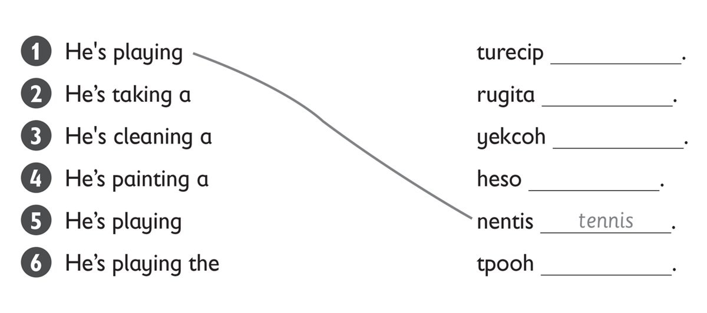
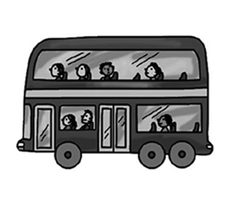
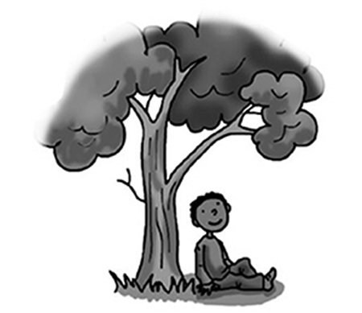
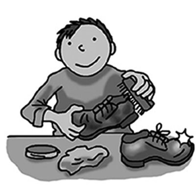
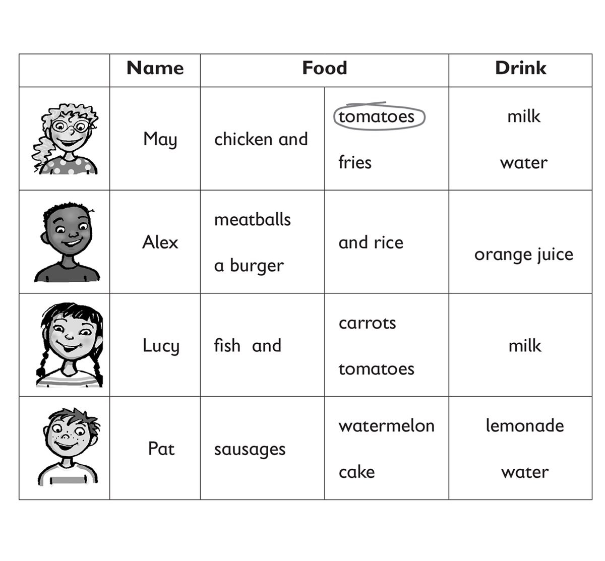
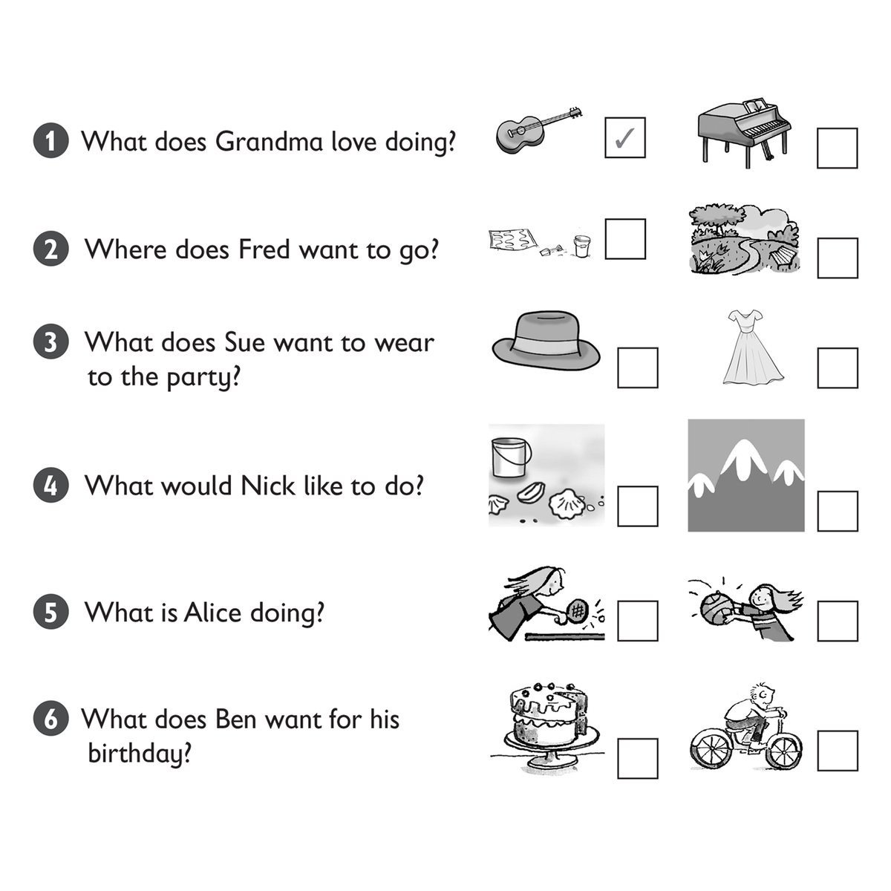

**[Vocabulary]{.underline}**

**1. Look and complete the words. Match and write the number. There is
one example.   (one point each)**

1\. Bill's wearing a shirt, trousers and a h [*a* *t*]{.underline} .
He's got a ball.

2\. Anna's wearing a sk \_\_\_\_\_\_ and T-shirt. She's got a phone.

3\. Matt's wearing j \_\_\_\_\_\_ s and sunglasses. He's got a watch.

4\. Grace's wearing a skirt and s \_\_\_\_ ks. She's got a guitar.

5\. Tom's wearing a sh \_\_\_\_\_\_, black trousers and a jacket. He's
got a fish.

6\. May's wearing a long dr \_\_\_\_\_\_. She's got a camera.

**2. Look and put the letters in order. Draw lines. There is one
example.   (one point each)**

**3. Read and write. There is one example.   (one point each)**

beach \| ~~city~~ \| jellyfish \| mountains \| park \| shells

1\. 3D There is a *[city]{.underline}*.

2\. 2A There are two \_\_\_\_\_\_\_\_\_\_\_\_\_\_\_\_.

3\. 1A There are two \_\_\_\_\_\_\_\_\_\_\_\_\_\_\_\_ in the sea.

4\. 3B There is a \_\_\_\_\_\_\_\_\_\_\_\_\_\_\_\_.

5\. 1B There is a with \_\_\_\_\_\_\_\_\_\_\_\_\_\_\_\_ a tree.

6\. 2B / 2C There are three \_\_\_\_\_\_\_\_\_\_\_\_\_\_\_\_.

**[Grammar]{.underline}**

**4. Write the questions and answers. There is one example.   (one point
each)**

1\. Suzy / picking up / shells (✓)

*[Does Suzy like picking up shells? Yes, she does]{.underline}*.

2\. you / going / beach (✓)

\_\_\_\_\_\_\_\_\_\_\_\_\_\_\_\_\_\_\_\_\_\_\_\_\_

3\. Rick / swimming / sea (✗)

\_\_\_\_\_\_\_\_\_\_\_\_\_\_\_\_\_\_\_\_\_\_\_\_\_

4\. Mrs Star / reading / sun (✓)

\_\_\_\_\_\_\_\_\_\_\_\_\_\_\_\_\_\_\_\_\_\_\_\_\_

5\. Simon / eating / ice cream (✓)

\_\_\_\_\_\_\_\_\_\_\_\_\_\_\_\_\_\_\_\_\_\_\_\_\_

6\. You / fishing (✗)

\_\_\_\_\_\_\_\_\_\_\_\_\_\_\_\_\_\_\_\_\_\_\_\_\_

**5. Read and write the words. There is one example.   (one point
each)**

1\. Look at *[her]{.underline}*.

She's wearing a skirt.

2\. Look at \_\_\_\_\_\_\_\_\_\_\_\_.

We're on the bus.

3\. Look at \_\_\_\_\_\_\_\_\_\_\_\_.

I'm under a tree.

4\. Look at \_\_\_\_\_\_\_\_\_\_\_\_.

Look at those men.

5\. Look at \_\_\_\_\_\_\_\_\_\_\_\_.

He can swim.

6\. Look at \_\_\_\_\_\_\_\_\_\_\_\_.

You're cleaning a shoe.

**[Listening]{.underline}**

**6. Listen and circle. There is one example.   (one point each)**

**7. Look and listen. Tick. There is one example.   (one point each)**

**[Reading]{.underline}**

**8. Read and circle. There is one example.   (one point each)**

1\. What's Mum wearing? a *book* / *[dress]{.underline}* / *shoes*

2\. How many children are playing badminton? *three* / *four* / *five*

3\. How many shells are there? *one* / *two* / *three*

4\. What's on the table? a *kiwi* / *tomato* / *watermelon*

5\. Where's the young boy sitting? *on the sand* / *on a chair* / *in
the sea*

6\. What's Mum doing? *sleeping* / *writing* / *reading*

