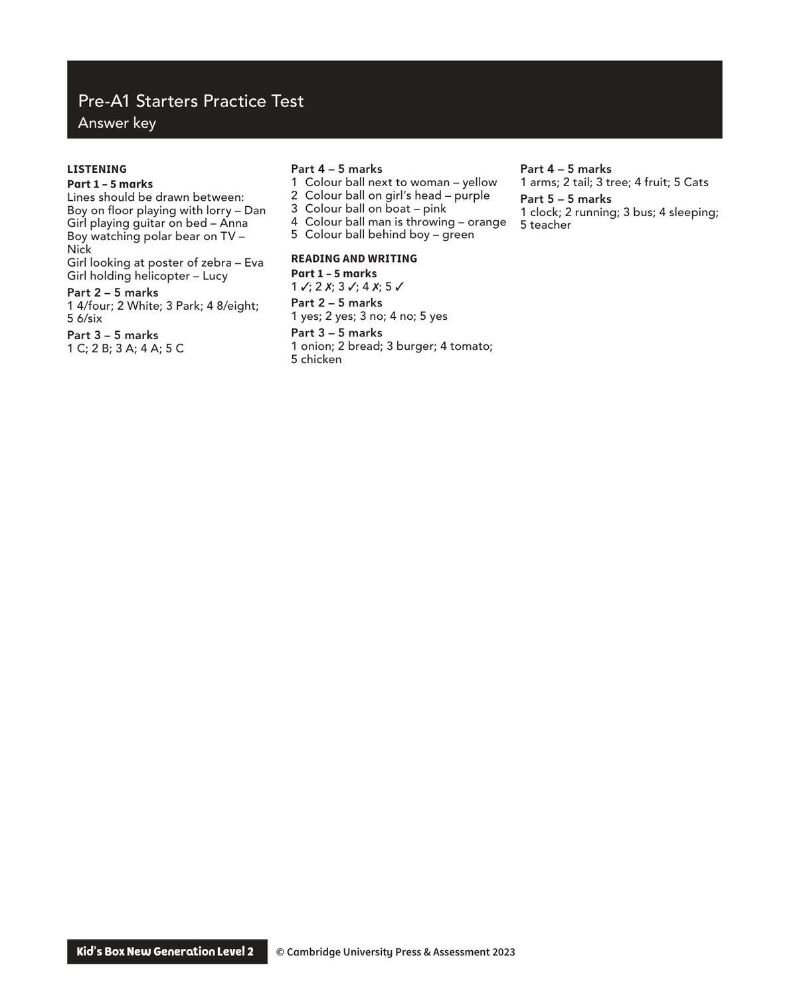
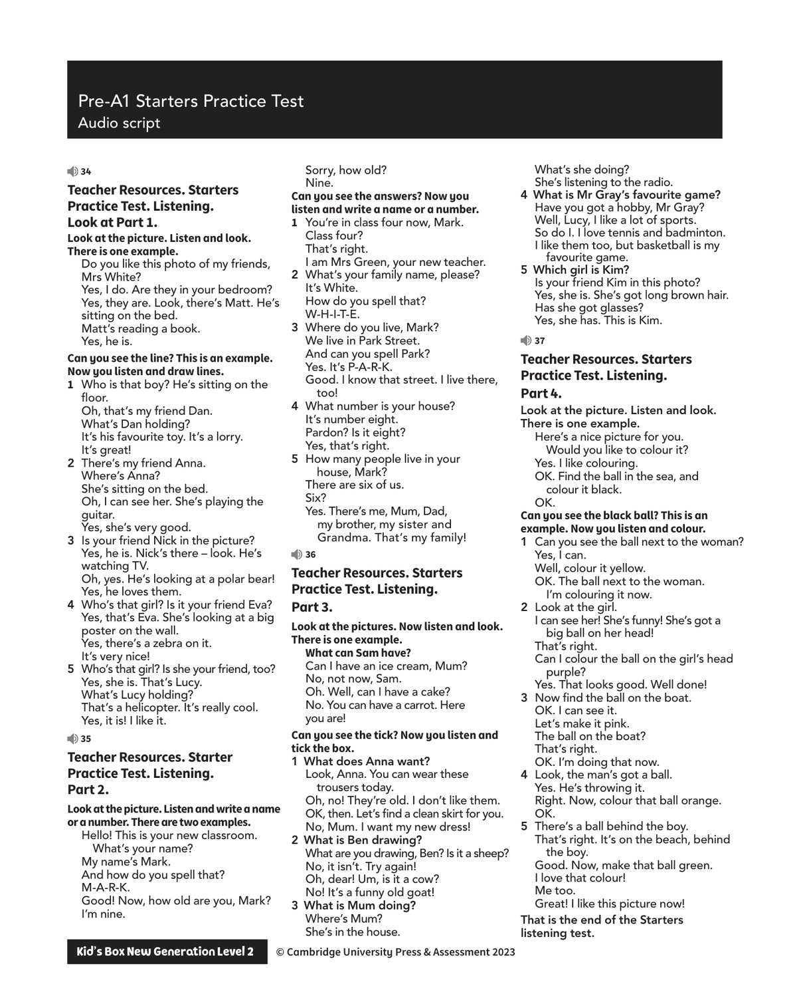

## 第 1 页

Kid’s Box New Generation Level 2        © Cambridge University Press & Assessment 2023
© Cambridge University Press & Assessment 2023
Pre-A1 Starters Practice Test
Answer key
LISTENING
Part 1 – 5 marks
Lines should be drawn between:
Boy on floor playing with lorry – Dan
Girl playing guitar on bed – Anna
Boy watching polar bear on TV –
Nick
Girl looking at poster of zebra – Eva
Girl holding helicopter – Lucy
Part 2 – 5 marks
1 4/four; 2 White; 3 Park; 4 8/eight;
5 6/six
Part 3 – 5 marks
1 C; 2 B; 3 A; 4 A; 5 C
Part 4 – 5 marks
1	 Colour ball next to woman – yellow
2	 Colour ball on girl’s head – purple
3	 Colour ball on boat – pink
4	 Colour ball man is throwing – orange
5	 Colour ball behind boy – green
READING AND WRITING
Part 1 – 5 marks
1 3; 2 7; 3 3; 4 7; 5 3
Part 2 – 5 marks
1 yes; 2 yes; 3 no; 4 no; 5 yes
Part 3 – 5 marks
1 onion; 2 bread; 3 burger; 4 tomato;
5 chicken
Part 4 – 5 marks
1 arms; 2 tail; 3 tree; 4 fruit; 5 Cats
Part 5 – 5 marks
1 clock; 2 running; 3 bus; 4 sleeping;
5 teacher

## 第 2 页

Kid’s Box New Generation Level 2        © Cambridge University Press & Assessment 2023
© Cambridge University Press & Assessment 2023
Pre-A1 Starters Practice Test
Audio script
34
Teacher Resources. Starters
Practice Test. Listening.
Look at Part 1.
Look at the picture. Listen and look.
There is one example.
Do you like this photo of my friends,
Mrs White?
Yes, I do. Are they in your bedroom?
Yes, they are. Look, there’s Matt. He’s
sitting on the bed.
Matt’s reading a book.
Yes, he is.
Can you see the line? This is an example.
Now you listen and draw lines.
1	 Who is that boy? He’s sitting on the
floor.
Oh, that’s my friend Dan.
What’s Dan holding?
It’s his favourite toy. It’s a lorry.
It’s great!
2	 There’s my friend Anna.
Where’s Anna?
She’s sitting on the bed.
Oh, I can see her. She’s playing the
guitar.
Yes, she’s very good.
3	 Is your friend Nick in the picture?
Yes, he is. Nick’s there – look. He’s
watching TV.
Oh, yes. He’s looking at a polar bear!
Yes, he loves them.
4	 Who’s that girl? Is it your friend Eva?
Yes, that’s Eva. She’s looking at a big
poster on the wall.
Yes, there’s a zebra on it.
It’s very nice!
5	 Who’s that girl? Is she your friend, too?
Yes, she is. That’s Lucy.
What’s Lucy holding?
That’s a helicopter. It’s really cool.
Yes, it is! I like it.
35
Teacher Resources. Starter
Practice Test. Listening.
Part 2.
Look at the picture. Listen and write a name
or a number. There are two examples.
Hello! This is your new classroom.
What’s your name?
My name’s Mark.
And how do you spell that?
M-A-R-K.
Good! Now, how old are you, Mark?
I’m nine.
Sorry, how old?
Nine.
Can you see the answers? Now you
listen and write a name or a number.
1	 You’re in class four now, Mark.
Class four?
That’s right.
I am Mrs Green, your new teacher.
2	 What’s your family name, please?
It’s White.
How do you spell that?
W-H-I-T-E.
3	 Where do you live, Mark?
We live in Park Street.
And can you spell Park?
Yes. It’s P-A-R-K.
Good. I know that street. I live there,
too!
4	 What number is your house?
It’s number eight.
Pardon? Is it eight?
Yes, that’s right.
5	 How many people live in your
house, Mark?
There are six of us.
Six?
Yes. There’s me, Mum, Dad,
my brother, my sister and
Grandma. That’s my family!
36
Teacher Resources. Starters
Practice Test. Listening.
Part 3.
Look at the pictures. Now listen and look.
There is one example.
What can Sam have?
Can I have an ice cream, Mum?
No, not now, Sam.
Oh. Well, can I have a cake?
No. You can have a carrot. Here
you are!
Can you see the tick? Now you listen and
tick the box.
1  What does Anna want?
Look, Anna. You can wear these
trousers today.
Oh, no! They’re old. I don’t like them.
OK, then. Let’s find a clean skirt for you.
No, Mum. I want my new dress!
2  What is Ben drawing?
What are you drawing, Ben? Is it a sheep?
No, it isn’t. Try again!
Oh, dear! Um, is it a cow?
No! It’s a funny old goat!
3  What is Mum doing?
Where’s Mum?
She’s in the house.
What’s she doing?
She’s listening to the radio.
4  What is Mr Gray’s favourite game?
Have you got a hobby, Mr Gray?
Well, Lucy, I like a lot of sports.
So do I. I love tennis and badminton.
I like them too, but basketball is my
favourite game.
5  Which girl is Kim?
Is your friend Kim in this photo?
Yes, she is. She’s got long brown hair.
Has she got glasses?
Yes, she has. This is Kim.
37
Teacher Resources. Starters
Practice Test. Listening.
Part 4.
Look at the picture. Listen and look.
There is one example.
Here’s a nice picture for you.
Would you like to colour it?
Yes. I like colouring.
OK. Find the ball in the sea, and
colour it black.
OK.
Can you see the black ball? This is an
example. Now you listen and colour.
1	 Can you see the ball next to the woman?
Yes, I can.
Well, colour it yellow.
OK. The ball next to the woman.
I’m colouring it now.
2	 Look at the girl.
I can see her! She’s funny! She’s got a
big ball on her head!
That’s right.
Can I colour the ball on the girl’s head
purple?
Yes. That looks good. Well done!
3	 Now find the ball on the boat.
OK. I can see it.
Let’s make it pink.
The ball on the boat?
That’s right.
OK. I’m doing that now.
4	 Look, the man’s got a ball.
Yes. He’s throwing it.
Right. Now, colour that ball orange.
OK.
5	 There’s a ball behind the boy.
That’s right. It’s on the beach, behind
the boy.
Good. Now, make that ball green.
I love that colour!
Me too.
Great! I like this picture now!
That is the end of the Starters
listening test.

