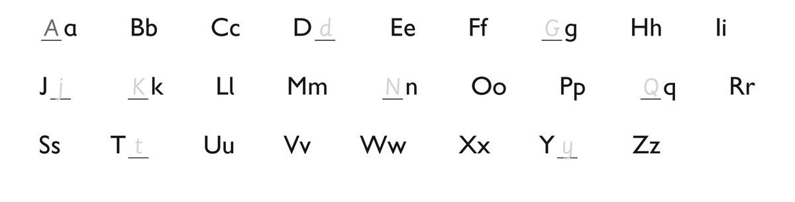
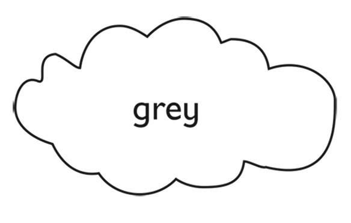
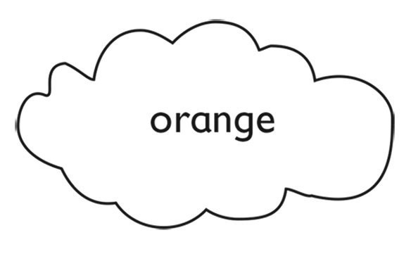
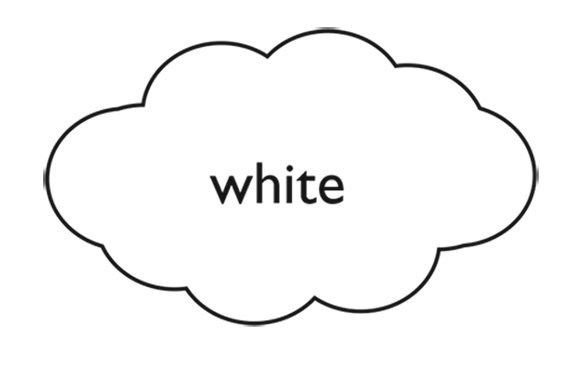
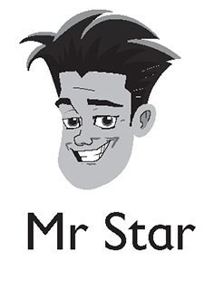
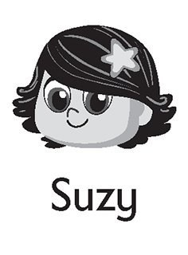
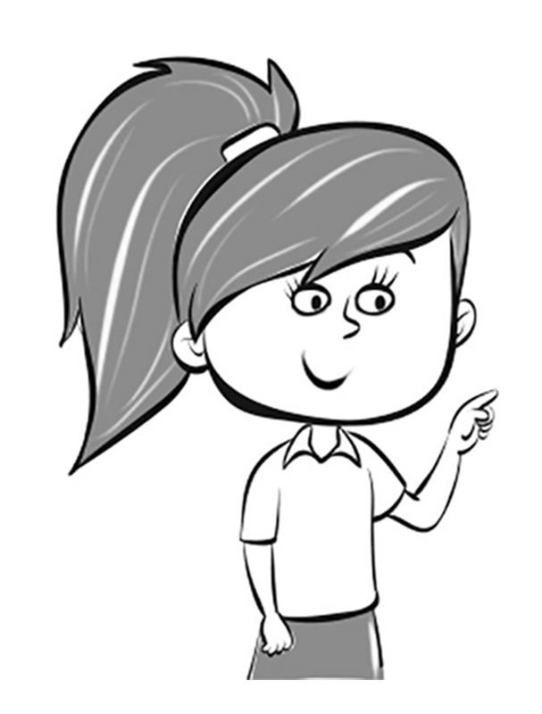
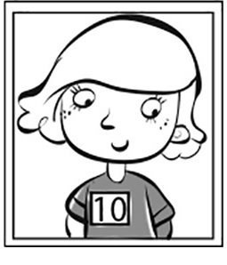

**[Vocabulary]{.underline}**

**1. Look and write the letter. There is one example.   (one point
each)**

*d, G, j, K, N, Q, t, y*

**2. Look and write the number. There is one example.   (one point
each)**

eight \| five \| ~~one~~ \| seven \| three \| two

1\. *[one]{.underline}*

2\. *two*

3\. *three*

4\. *[four]{.underline}*

5\. *five*

6\. *[six]{.underline}*

7\. *seven*

8\. *eight*

9\. *[nine]{.underline}*

10\. *[ten]{.underline}*

**3. Read and colour. Colour one with your teacher. There is one
example.   (one point each)**

1.

2.

*brown*

3.

*grey*

4.

*orange*

5.

*black*

6.

*white*

**[Grammar]{.underline}**

**4. Read and complete. There is one example.   (one point each)**

1\. Who's she?  *[She's Stella.]{.underline}*

2\. Who's he?  \_\_\_\_\_\_\_\_\_\_\_\_\_\_\_\_\_\_\_\_\_\_\_\_\_\_\_

*He's Simon.*

3\. Who's he?  \_\_\_\_\_\_\_\_\_\_\_\_\_\_\_\_\_\_\_\_\_\_\_\_\_\_\_

*He's Mr Star.*

4\. Who's she?  \_\_\_\_\_\_\_\_\_\_\_\_\_\_\_\_\_\_\_\_\_\_\_\_\_\_\_

*She's Marie.*

5\. Who's she?  \_\_\_\_\_\_\_\_\_\_\_\_\_\_\_\_\_\_\_\_\_\_\_\_\_\_\_

*She's Suzy.*

6\. Who's he?  \_\_\_\_\_\_\_\_\_\_\_\_\_\_\_\_\_\_\_\_\_\_\_\_\_\_\_

*He's Maskman.*

**5. Look and draw lines. There is one example.   (one point each)**

*2 the bag is **under** the table,3 the book is **in** the bag,4 the pen
and eraser are **on** the chair*

**[Listening]{.underline}**

**6. Listen and write the letters. There is one example.   (one point
each)**

s \| m \| ~~h~~ \| n \| k

1\. c*[h]{.underline}*air

2\. fi\_\_h

3\. soc\_\_s

4\. pla\_\_e

5\. \_\_ouse

*2. fish*

*3. socks*

*4. plane*

*5. mouse*

**Audio script**

1\. chair

2\. fish

3\. socks

4\. plane

5\. mouse

**[Reading]{.underline}**

**7. Read and circle. There is one example.   (two points each)**

1\. This is my *sister* / *[brother]{.underline}*.

    *He's* / *She's* eight.

*He's*

2\. This is my *sister* / *brother*.

    *He's* / *She's* ten.

*sister / She's,*

3\. This is my *grandma* / *grandpa*.

    *He's* old!

*grandpa*

**8. Read and draw lines. There is one example.   (one point each)**

1\. The pen is on the table.

2\. The eraser is on the chair.

*line from eraser to top of chair seat*

3\. The book is under the table.

*line from book to under the table*

4\. The bag is under the chair.

*line from bag to under the chair*

5\. The pencil is next to the bag.

*line from pencil to next to the bag*

