**[Vocabulary]{.underline}**

**1. Look and write the letter. There is one example.   (one point
each)**

**2. Look and write the number. There is one example.   (one point
each)**

eight \| five \| ~~one~~ \| seven \| three \| two

1\. *[one]{.underline}*

2\. \_\_\_\_\_\_\_\_\_\_\_\_

3\. \_\_\_\_\_\_\_\_\_\_\_\_

4\. *[four]{.underline}*

5\. \_\_\_\_\_\_\_\_\_\_\_\_

6\. *[six]{.underline}*

7\. \_\_\_\_\_\_\_\_\_\_\_\_

8\. \_\_\_\_\_\_\_\_\_\_\_\_

9\. *[nine]{.underline}*

10\. *[ten]{.underline}*

**3. Read and colour. Colour one with your teacher. There is one
example.   (one point each)**

1.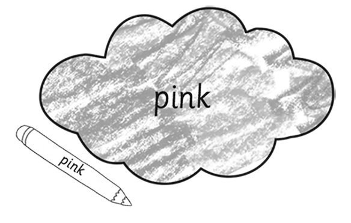2.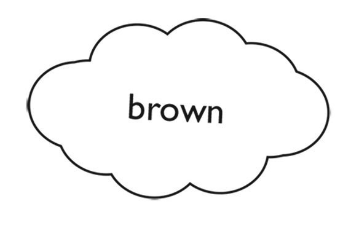3.4.5.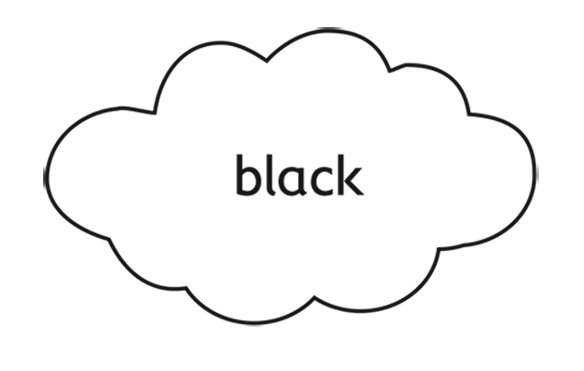6.

**[Grammar]{.underline}**

**4. Read and complete. There is one example.   (one point each)**

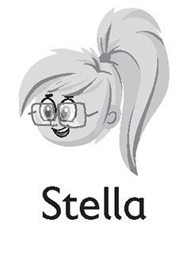

1\. Who's she?  *[She's Stella.]{.underline}*

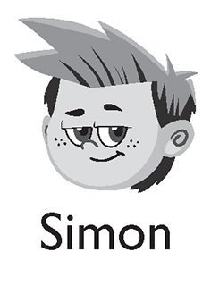

2\. Who's he?  \_\_\_\_\_\_\_\_\_\_\_\_\_\_\_\_\_\_\_\_\_\_\_\_\_\_\_

3\. Who's he?  \_\_\_\_\_\_\_\_\_\_\_\_\_\_\_\_\_\_\_\_\_\_\_\_\_\_\_

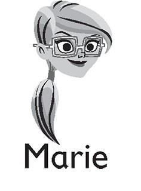

4\. Who's she?  \_\_\_\_\_\_\_\_\_\_\_\_\_\_\_\_\_\_\_\_\_\_\_\_\_\_\_

5\. Who's she?  \_\_\_\_\_\_\_\_\_\_\_\_\_\_\_\_\_\_\_\_\_\_\_\_\_\_\_

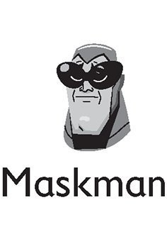

6\. Who's he?  \_\_\_\_\_\_\_\_\_\_\_\_\_\_\_\_\_\_\_\_\_\_\_\_\_\_\_

**5. Look and draw lines. There is one example.   (one point each)**

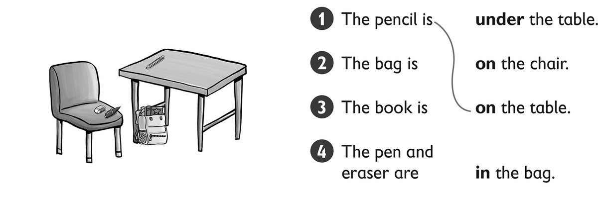

**[Listening]{.underline}**

**6. Listen and write the letters. There is one example.   (one point
each)**

s \| m \| ~~h~~ \| n \| k

1\. c*[h]{.underline}*air

2\. fi\_\_h

3\. soc\_\_s

4\. pla\_\_e

5\. \_\_ouse

**[Reading]{.underline}**

**7. Read and circle. There is one example.   (two points each)**

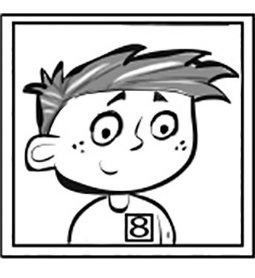

1\. This is my *sister* / *[brother]{.underline}*.

    *He's* / *She's* eight.

2\. This is my *sister* / *brother*.

    *He's* / *She's* ten.

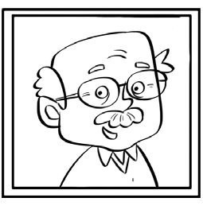

3\. This is my *grandma* / *grandpa*.

    *He's* old!

**8. Read and draw lines. There is one example.   (one point each)**

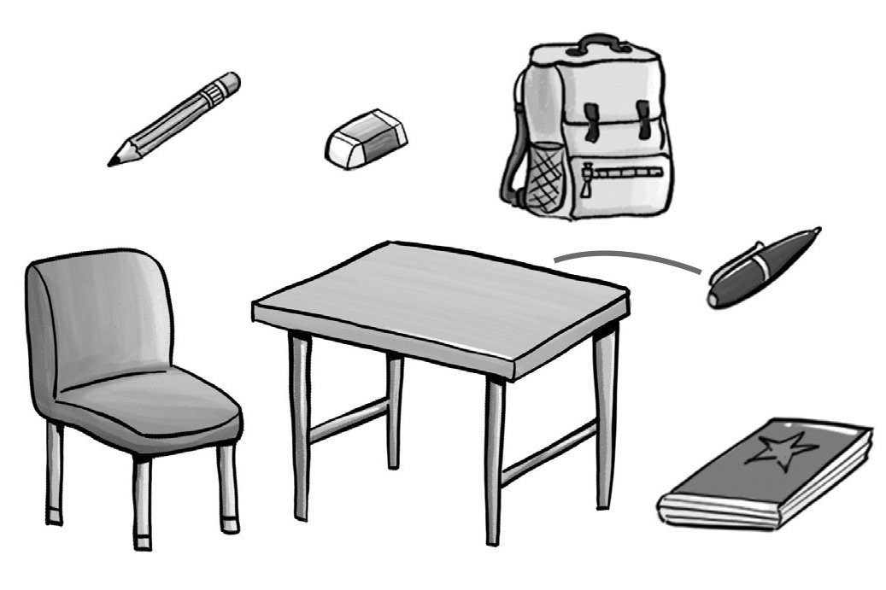

1\. The pen is on the table.

2\. The eraser is on the chair.

3\. The book is under the table.

4\. The bag is under the chair.

5\. The pencil is next to the bag.

