**[Vocabulary]{.underline}**

**1. Look and write the letters. There is one example.   (one point
each)**

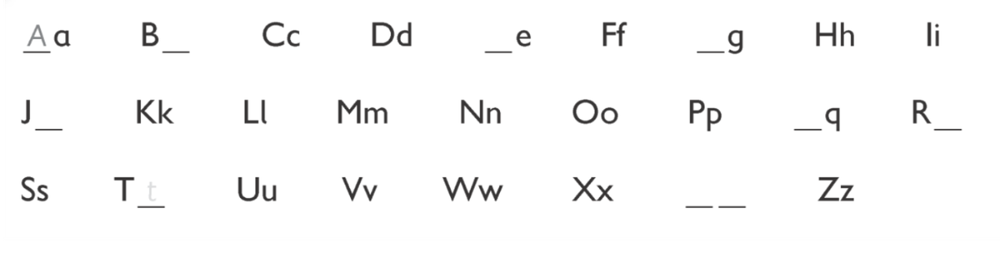

**2. Look and write. There is one example.   (one point each)**

1\. one

2\. tw*[o]{.underline}*

3\. three

4\. f \_\_ \_\_ r

5\. \_\_ \_\_ ve

6\. six

7\. \_\_ e \_\_ en

8\. eig \_\_ \_\_

9\. \_\_ \_\_ ne

10\. ten

**3. Put the letters in order. Then colour. Colour one with your
teacher. There is one example.   (one point each)**

  ----------------------------------------------------------------------------------------------------------------------------------------------------------------------------------------------------------------------- -- -------------------------------------------------------------------------------------------------------------------------------------------------------------------------------------------------------------------- -- --------------------------------------------------------------------------------------------------------------------------------------------------------------------------------------------------------------------
  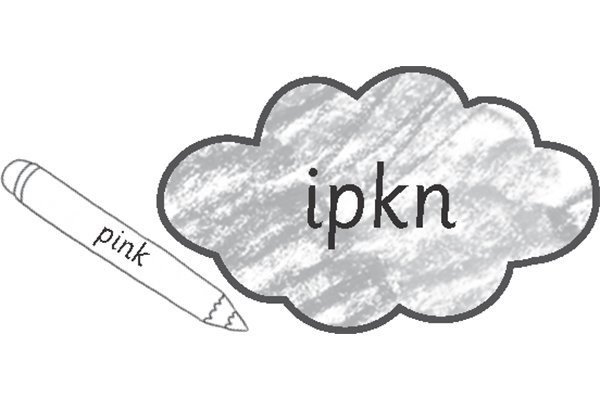 1.      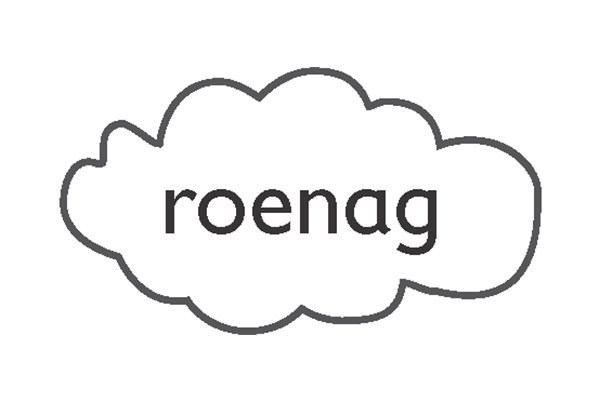      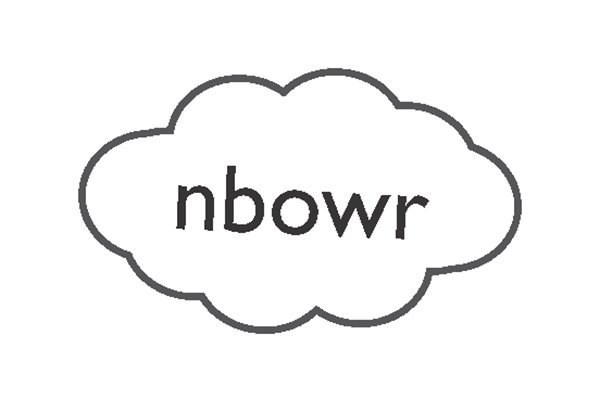
  *[pink]{.underline}*                                                                                                                                                                                                       2. \_\_\_\_\_\_                                                                                                                                                                                                         3. \_\_\_\_\_\_

  ----------------------------------------------------------------------------------------------------------------------------------------------------------------------------------------------------------------------- -- -------------------------------------------------------------------------------------------------------------------------------------------------------------------------------------------------------------------- -- --------------------------------------------------------------------------------------------------------------------------------------------------------------------------------------------------------------------

  -------------------------------------------------------------------------------------------------------------------------------------------------------------------------------------------------------------------- -- -------------------------------------------------------------------------------------------------------------------------------------------------------------------------------------------------------------------- -- --------------------------------------------------------------------------------------------------------------------------------------------------------------------------------------------------------------------
  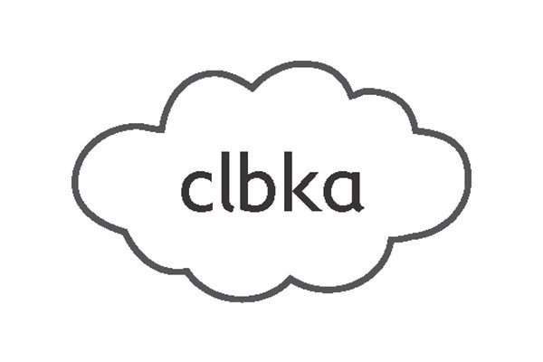      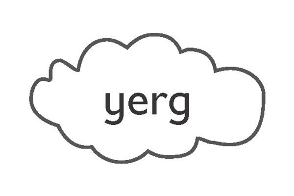      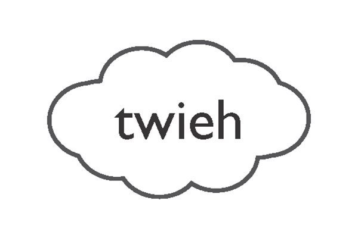
  4. \_\_\_\_\_\_                                                                                                                                                                                                         5. \_\_\_\_\_\_                                                                                                                                                                                                         6. \_\_\_\_\_\_

  -------------------------------------------------------------------------------------------------------------------------------------------------------------------------------------------------------------------- -- -------------------------------------------------------------------------------------------------------------------------------------------------------------------------------------------------------------------- -- --------------------------------------------------------------------------------------------------------------------------------------------------------------------------------------------------------------------

**[Grammar]{.underline}**

**4. Put the letters in order and write. There is one example.   (one
point each)**

se'H \| Mr tSra \| e'shS \| ~~telSla~~ \| maaksMn \| eiraM

1\. Who's she? *[She's]{.underline}* Stella.

2\. Who's he? \_\_\_\_\_\_\_\_\_\_\_\_ Simon.

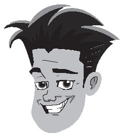

3\. Who's he? He's \_\_\_\_\_\_\_\_\_\_\_\_.

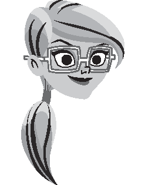

4\. Who's she? She's \_\_\_\_\_\_\_\_\_\_\_\_.

5\. Who's she? \_\_\_\_\_\_\_\_\_\_\_\_ Suzy.

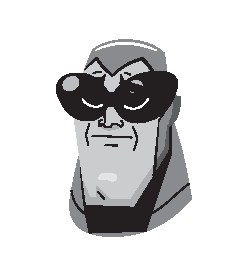

6\. Who's he? He's \_\_\_\_\_\_\_\_\_\_\_\_.

**5. Look and write. There is one example.   (one point each)**

in \| ~~on~~ \| on \| under

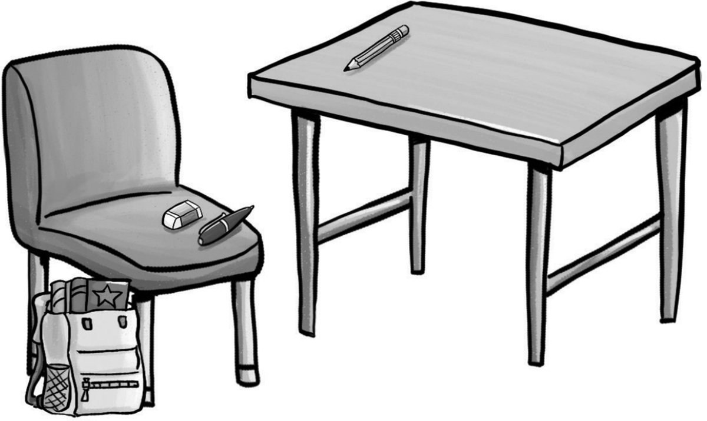

1\. The pencil is *[on]{.underline}* the table.

2\. The bag is \_\_\_\_\_\_\_\_\_\_\_\_ the chair.

3\. The book is \_\_\_\_\_\_\_\_\_\_\_\_ the bag.

4\. The pen and eraser are \_\_\_\_\_\_\_\_\_\_\_\_ the chair.

**[Listening]{.underline}**

**6. Listen and write the letters. There is one example.   (one point
each)**

1\. *[ch]{.underline}*air

2\. f \_\_ \_\_ \_\_

3\. s \_\_ \_\_ \_\_ \_\_

4\. p \_\_ \_\_ \_\_ \_\_

5\. m \_\_ \_\_ \_\_ \_\_

**[Reading]{.underline}**

**7. Put the words in order. Then write. There is one example.   (one
point each)**

is my This sister \| ~~brother This my is~~ \| eight He's \| ten She's
\| grandpa is This my

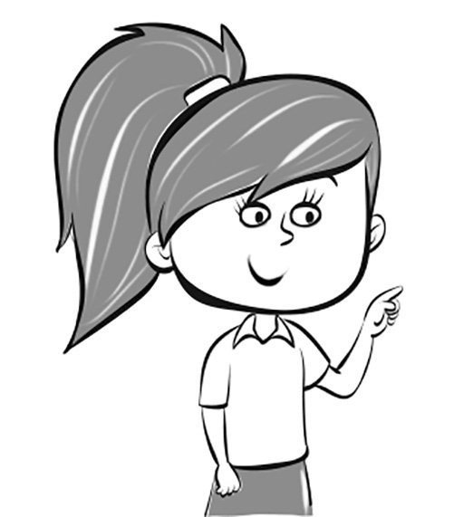

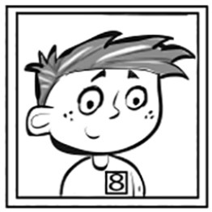

1\. *[This]{.underline}* *[is]{.underline}* *[my]{.underline}*
*[brother]{.underline}*.

2\. \_\_\_\_\_\_\_\_\_\_\_\_\_\_ \_\_\_\_\_\_\_\_\_\_\_\_\_\_.

3\. \_\_\_\_\_\_\_\_\_\_\_\_\_\_ \_\_\_\_\_\_\_\_\_\_\_\_\_\_
\_\_\_\_\_\_\_\_\_\_\_\_\_\_ \_\_\_\_\_\_\_\_\_\_\_\_\_\_.

4\. \_\_\_\_\_\_\_\_\_\_\_\_\_\_ \_\_\_\_\_\_\_\_\_\_\_\_\_\_.

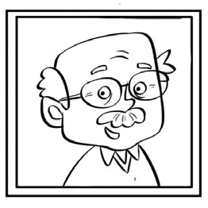

5\. \_\_\_\_\_\_\_\_\_\_\_\_\_\_ \_\_\_\_\_\_\_\_\_\_\_\_\_\_
\_\_\_\_\_\_\_\_\_\_\_\_\_\_ \_\_\_\_\_\_\_\_\_\_\_\_\_\_.

    He's old!

**8. Look and write. There is one example.   (one point each)**

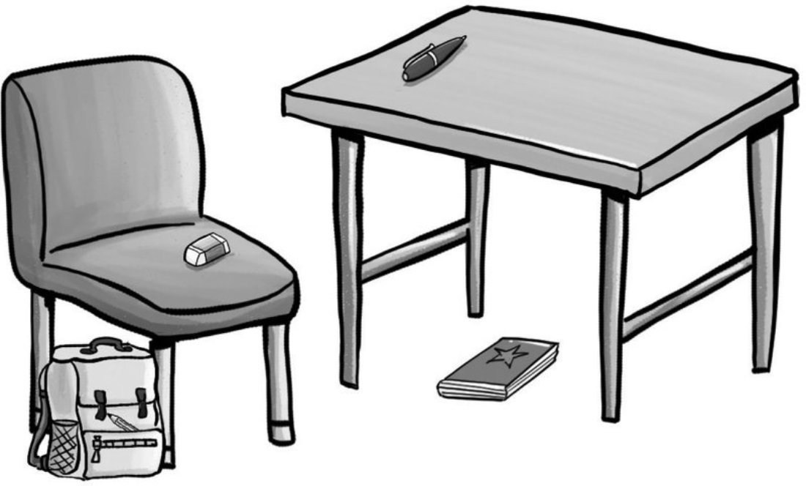

1\. The pen is *[on the table]{.underline}*.

2\. The eraser is \_\_\_\_\_\_\_\_\_\_\_\_\_\_\_\_\_\_\_\_\_\_.

3\. The book is \_\_\_\_\_\_\_\_\_\_\_\_\_\_\_\_\_\_\_\_\_\_.

4\. The pencil is \_\_\_\_\_\_\_\_\_\_\_\_\_\_\_\_\_\_\_\_\_\_.

5\. The bag is \_\_\_\_\_\_\_\_\_\_\_\_\_\_\_\_\_\_\_\_\_\_.

