**[Vocabulary]{.underline}**

**1. Look and write the letters. There is one example.   (one point
each)**

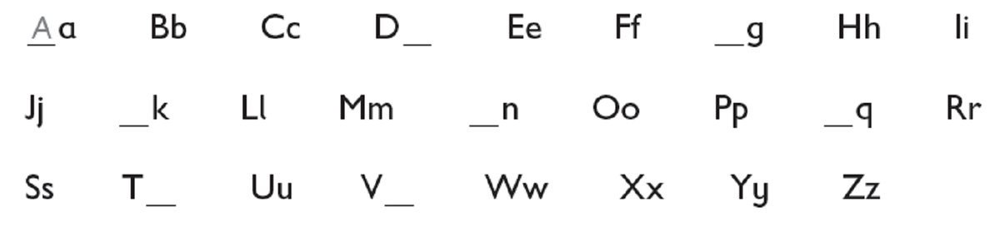

*d, G, K, N, Q, t, v, x*

**2. Put the letters in order. There is one example.   (one point
each)**

  ------------------------------- --- -----------------------------------
  1\. one                             * *

  ------------------------------- --- -----------------------------------

  ------------------------------- --- -----------------------------------
  2\. wto                             *[two]{.underline}*

  ------------------------------- --- -----------------------------------

  ------------------------------- --- -----------------------------------
  3\. three                           * *

  ------------------------------- --- -----------------------------------

  ------------------------------- --- -----------------------------------
  4\. ofur                            *four*

  ------------------------------- --- -----------------------------------

  ------------------------------- --- -----------------------------------
  5\. vefi                            *five*

  ------------------------------- --- -----------------------------------

  ------------------------------- --- -----------------------------------
  6\. six                             * *

  ------------------------------- --- -----------------------------------

  ------------------------------- --- -----------------------------------
  7\. esevn                           *seven*

  ------------------------------- --- -----------------------------------

  ------------------------------- --- -----------------------------------
  8\. geiht                           *eight*

  ------------------------------- --- -----------------------------------

  ------------------------------- --- -----------------------------------
  9\. inen                            *nine*

  ------------------------------- --- -----------------------------------

  ------------------------------- --- -----------------------------------
  10\. ten                            * *

  ------------------------------- --- -----------------------------------

**3. Complete the words. Then colour. Colour one with your teacher.
There is one example.   (one point each)**

c \| g \| h \| ~~k~~ \| w \| y

1.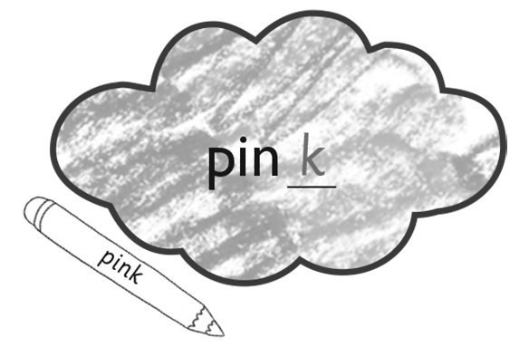

2.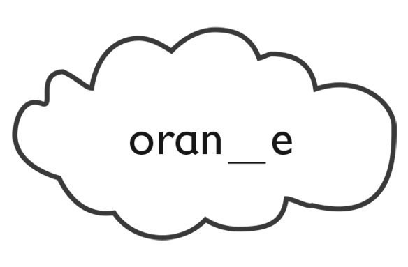

*orange*

3.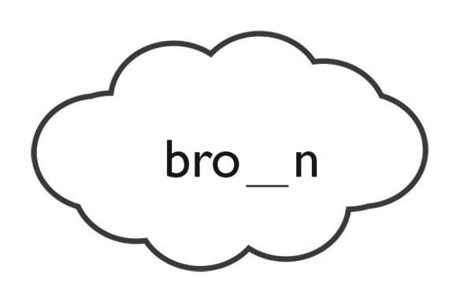

*brown*

4.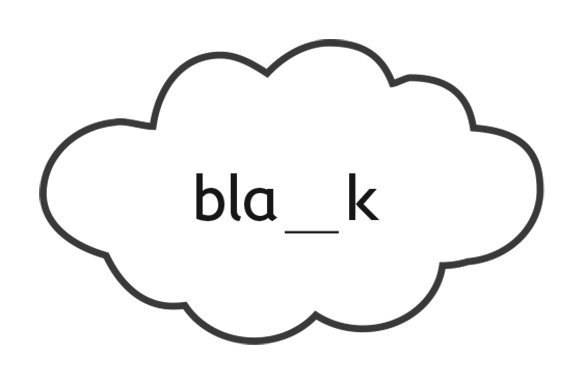

*black*

5.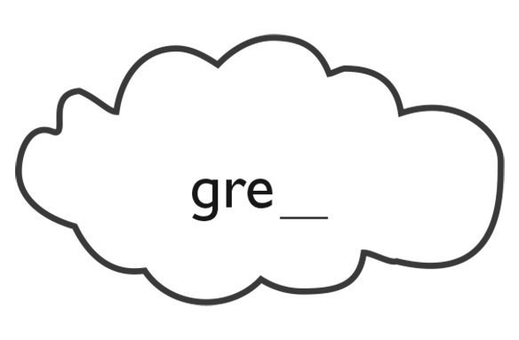

*grey*

6.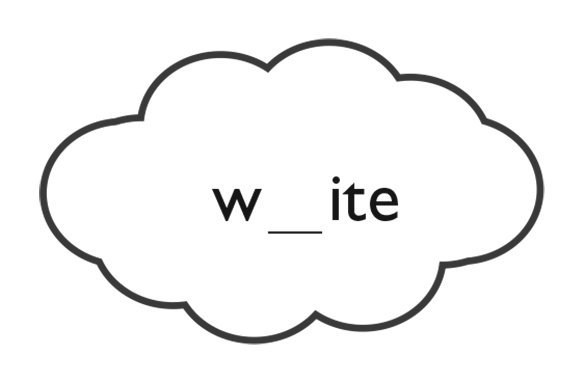

*white*

**[Grammar]{.underline}**

**4. Read and complete. There is one example.   (one point each)**

Simon \| Mr Star \| ~~Stella~~ \| Suzy \| Marie \| Maskman

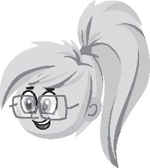

1\. Who's she? *[She's Stella.]{.underline}*

2\. Who's he? \_\_\_\_\_\_\_\_\_\_\_\_\_\_\_\_\_\_\_\_

*He's Simon.*

3\. Who's he? \_\_\_\_\_\_\_\_\_\_\_\_\_\_\_\_\_\_\_\_

*He's Mr Star.*

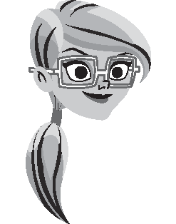

4\. Who's she? \_\_\_\_\_\_\_\_\_\_\_\_\_\_\_\_\_\_\_\_

*She's Marie.*

5\. Who's she? \_\_\_\_\_\_\_\_\_\_\_\_\_\_\_\_\_\_\_\_

*She's Suzy.*

6\. Who's he? \_\_\_\_\_\_\_\_\_\_\_\_\_\_\_\_\_\_\_\_

*He's Maskman.*

**5. Look and circle. There is one example.   (one point each)**

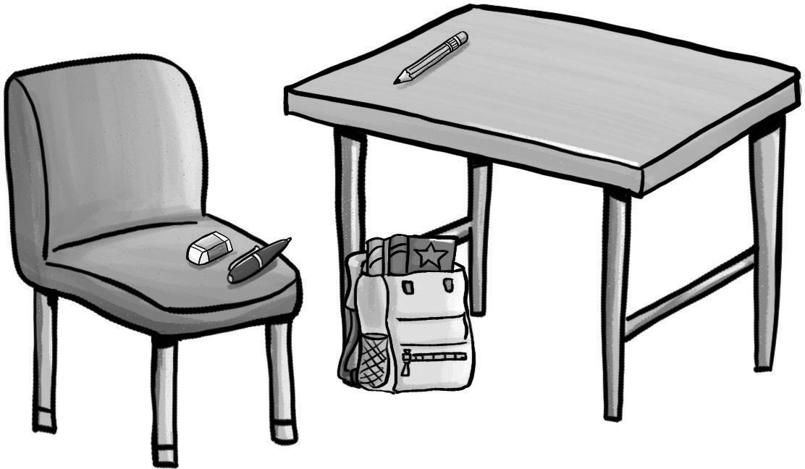

1\. The pencil is *in* / *[on]{.underline}* the table.

2\. The bag is *under* / *on* the table.

*under*

3\. The book is *in* / *under* the bag.

*in*

4\. The pen and eraser are *in* / *on* the chair.

*on*

**[Listening]{.underline}**

**6. Listen and write the letters. There is one example.   (one point
each)**

1\. *[c]{.underline}* *[h]{.underline}* air

2\. fi \_\_ \_\_

3\. so \_\_ \_\_ s

4\. pla \_\_ \_\_

5\. \_\_ \_\_ use

*2. fish*

*3. socks*

*4. plane*

*5. mouse*

**Audio script**

1\. chair

2\. fish

3\. socks

4\. plane

5\. mouse

**[Reading]{.underline}**

**7. Read and write. There is one example.   (one point each)**

~~brother~~ \| sister \| grandpa \| He's \| She's

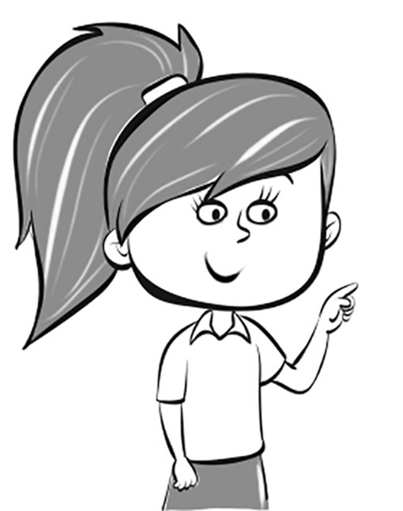

1\. This is my *[brother]{.underline}*, Bill.

    \_\_\_\_\_\_\_\_\_\_\_\_\_\_\_\_\_\_\_ eight.

*He's*

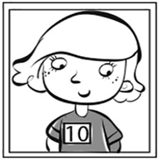

2\. This is my \_\_\_\_\_\_\_\_\_\_\_\_\_\_\_\_\_\_\_, Kim.

    \_\_\_\_\_\_\_\_\_\_\_\_\_\_\_\_\_\_\_ ten.

*sister / She's*

3\. This is my \_\_\_\_\_\_\_\_\_\_\_\_\_\_\_\_\_\_\_.

    He's old!

*grandpa*

**8. Read and circle the tick or cross. There is one example.   (one
point each)**

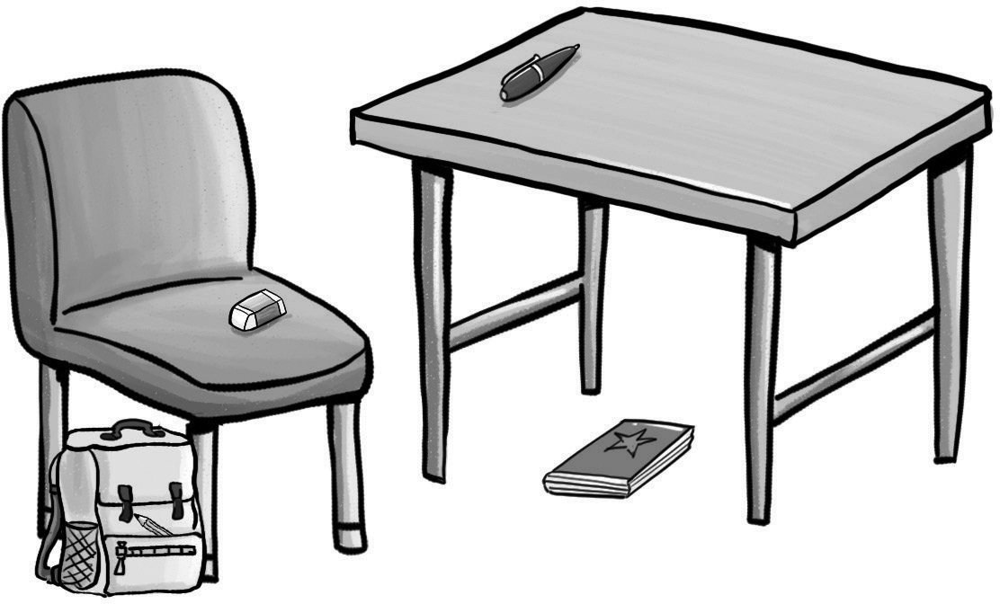

  ------------------------------- --- -------------------------------
  1\. The pen is on the table.        ✓      ✗

  ------------------------------- --- -------------------------------

  ------------------------------- --- -------------------------------
  2\. The eraser is on the chair.     *[✓]{.underline}*      ✗

  ------------------------------- --- -------------------------------

*✓*

  ------------------------------- --- -------------------------------
  3\. The book is under the           ✓      ✗
  chair.                              

  ------------------------------- --- -------------------------------

*✗*

  ------------------------------- --- -------------------------------
  4\. The pencil is in the bag.       ✓      ✗

  ------------------------------- --- -------------------------------

*✓*

  ------------------------------- --- -------------------------------
  5\. The bag is under the table.     ✓      ✗

  ------------------------------- --- -------------------------------

*✗*

