**[Vocabulary]{.underline}**

**1. Look and write the words. There is one example.   (one point
each)**

~~badminton~~ \| baseball \| basketball \| hockey \| skateboarding \|
table tennis

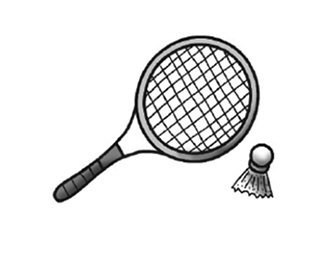

1\. b*[adminto]{.underline}*n

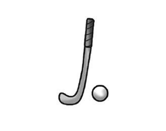

2\. h\_\_\_\_\_\_\_\_\_\_\_\_y

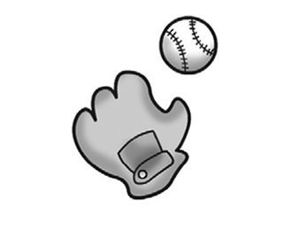

3\. b\_\_\_\_\_\_\_\_\_\_\_\_l

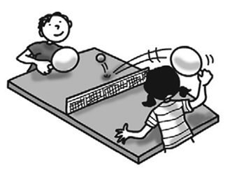

4\. t\_\_\_\_\_\_\_\_\_\_\_\_e t\_\_\_\_\_\_\_\_\_\_\_\_s

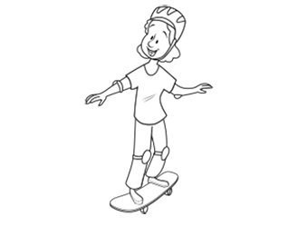

5\. s\_\_\_\_\_\_\_\_\_\_\_\_g

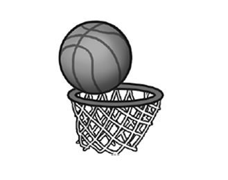

6\. b\_\_\_\_\_\_\_\_\_\_\_\_l

**2. Look and write the number. There is one example.   (one point
each)**

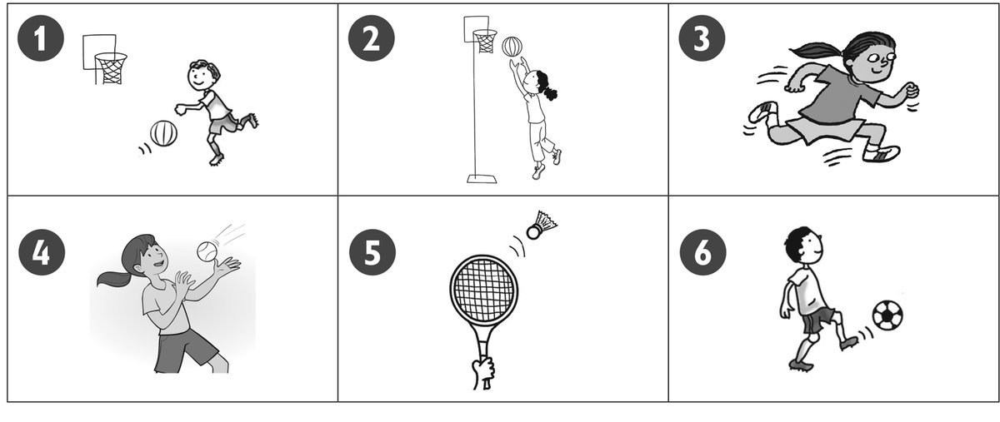

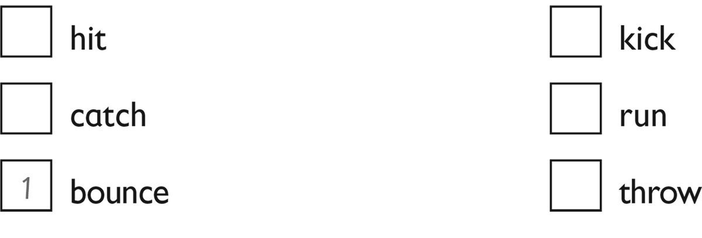

**3. Read and circle the sport. There is one example.   (one point
each)**

1\. You hit a small ball with a bat.

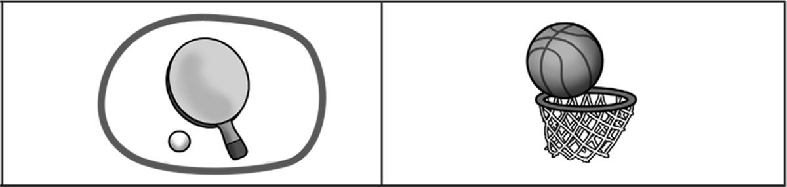

2\. You hit the ball with a racket.

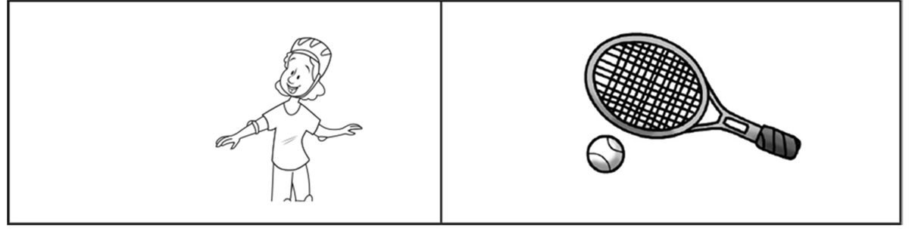

3\. You hit a ball on a table.

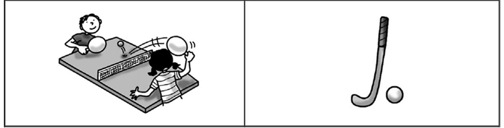

4\. You kick a ball.

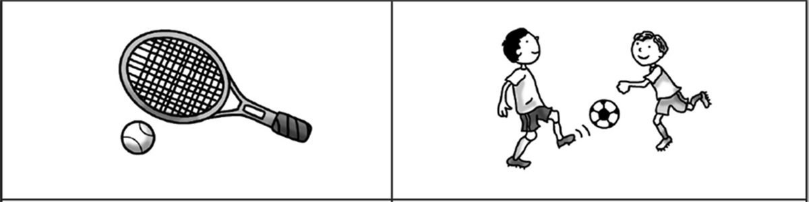

5\. You throw a ball in a net.

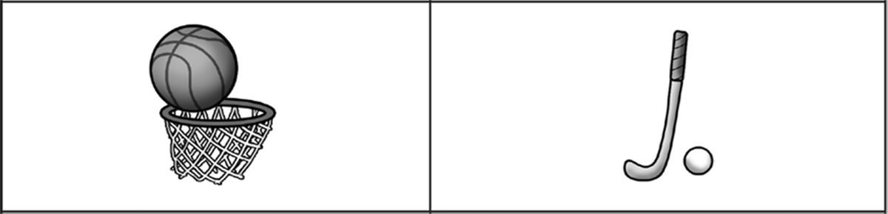

6\. You hit a small ball with a long stick.

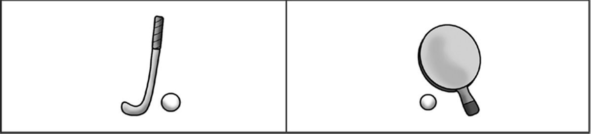

**[Grammar]{.underline}**

**4. Read and tick the correct sentence. There is one example.   (one
point each)**

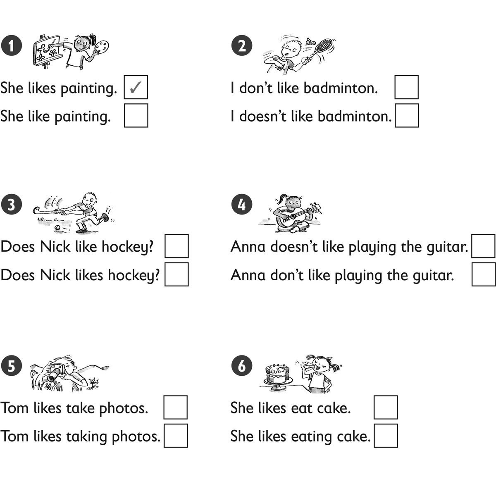

**5. Look and read. Circle. There is one example.   (one point each)**

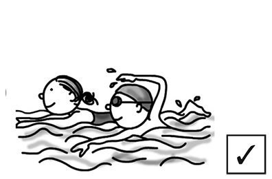

1\. Does he like swimming?        *[Yes, he
does.]{.underline}*          No, he doesn't.

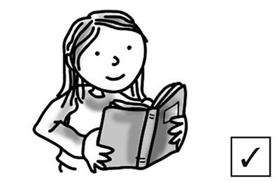

2\. Does she like reading?        Yes, she does.          No, she
doesn't.

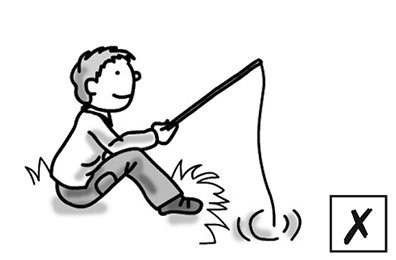

3\. Does he like fishing?        Yes, he does.          No, he doesn't.

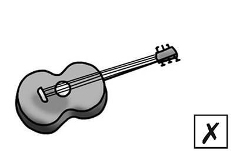

4\. Do you like playing the guitar?        Yes, I do.          No, I
don't.

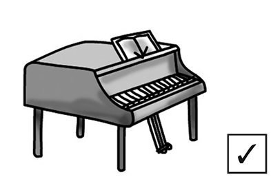

5\. Do you like playing the piano?        Yes, I do.          No, I
don't.

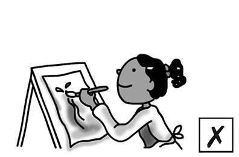

6\. Does she like painting?        Yes, she does.          No, she
doesn't.

**[Listening]{.underline}**

**6. Listen and circle. There is one example.   (one point each)**

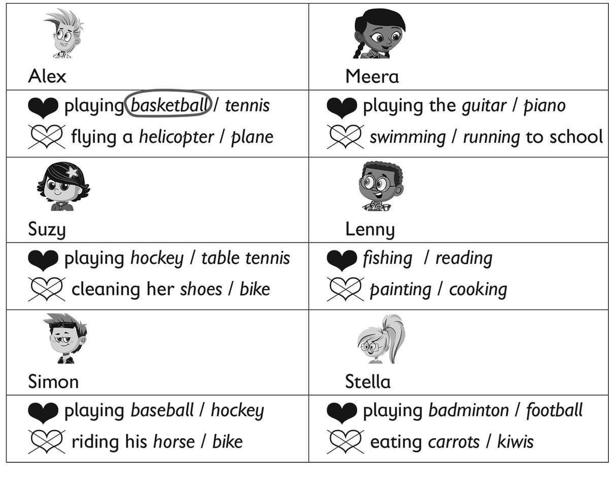

**7. Listen. Put a tick and a cross. There is one example.   (one point
each)**

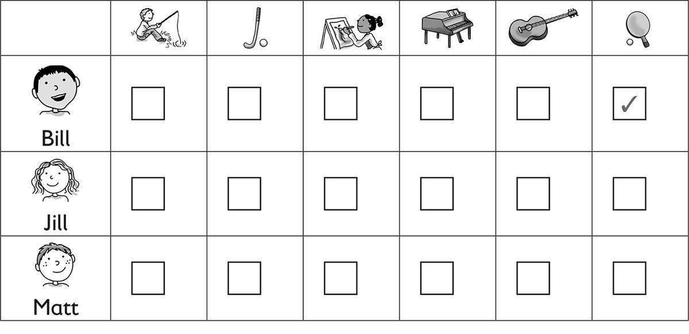

**[Reading]{.underline}**

**8. Read and write the words. There is one example.   (one point
each)**

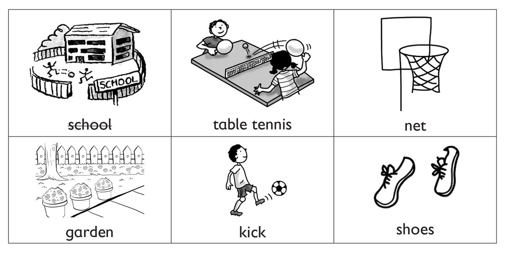

Today Bill and Jill are playing basketball at their (1)
*[school]{.underline}*.

They are wearing white shorts and a red T-shirt. Jill is wearing yellow
(2) \_\_\_\_\_\_\_\_\_\_\_\_\_\_\_\_\_\_\_\_. Yellow is her favourite
colour.

In basketball, there are five players. The players bounce the ball and
throw it in a (3) \_\_\_\_\_\_\_\_\_\_\_\_\_\_\_\_\_\_\_\_. They don't
(4) \_\_\_\_\_\_\_\_\_\_\_\_\_\_\_\_\_\_\_\_ the ball. Many basketball
players are tall. Jill doesn't like playing basketball. She loves
playing (5) \_\_\_\_\_\_\_\_\_\_\_\_\_\_\_\_\_\_\_\_. She has got a
table in her (6) \_\_\_\_\_\_\_\_\_\_\_\_\_\_\_\_\_\_\_\_!

