**[Vocabulary]{.underline}**

**1. Look and write the words. There is one example.   (one point
each)**

  ---------------------------------------------------------------------------------------------------------------------------------------------------------------------------------------------------------------------- -- ------------------------------------------------------------------------------------------------------------------------------------------------------------------------------------------------------------------- -- -------------------------------------------------------------------------------------------------------------------------------------------------------------------------------------------------------------------
  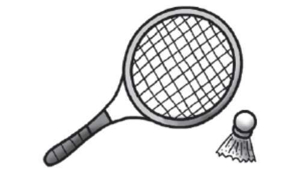 1.      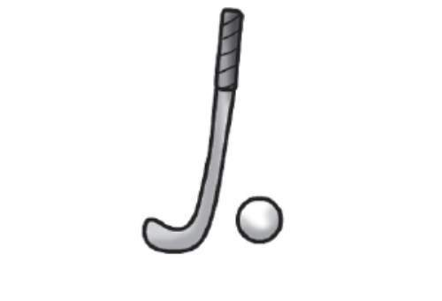      
  *[badminton]{.underline}*                                                                                                                                                                                                 2. *hockey*                                                                                                                                                                                                            3. *baseball*

  ---------------------------------------------------------------------------------------------------------------------------------------------------------------------------------------------------------------------- -- ------------------------------------------------------------------------------------------------------------------------------------------------------------------------------------------------------------------- -- -------------------------------------------------------------------------------------------------------------------------------------------------------------------------------------------------------------------

  ------------------------------------------------------------------------------------------------------------------------------------------------------------------------------------------------------------------- -- ------------------------------------------------------------------------------------------------------------------------------------------------------------------------------------------------------------------- -- -------------------------------------------------------------------------------------------------------------------------------------------------------------------------------------------------------------------
  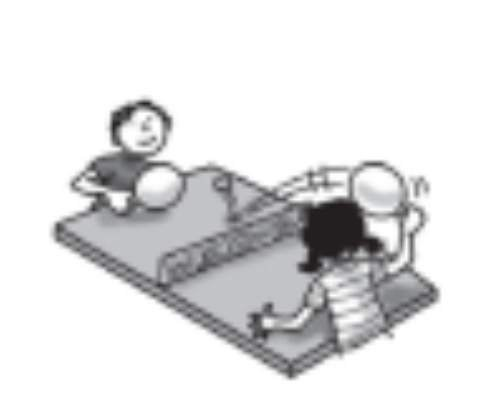            
  4. *table tennis*                                                                                                                                                                                                      5. *skateboarding*                                                                                                                                                                                                     6. *basketball*

  ------------------------------------------------------------------------------------------------------------------------------------------------------------------------------------------------------------------- -- ------------------------------------------------------------------------------------------------------------------------------------------------------------------------------------------------------------------- -- -------------------------------------------------------------------------------------------------------------------------------------------------------------------------------------------------------------------

**2. Put the letters in order. Look and write the number. There is one
example.   (one point each)**

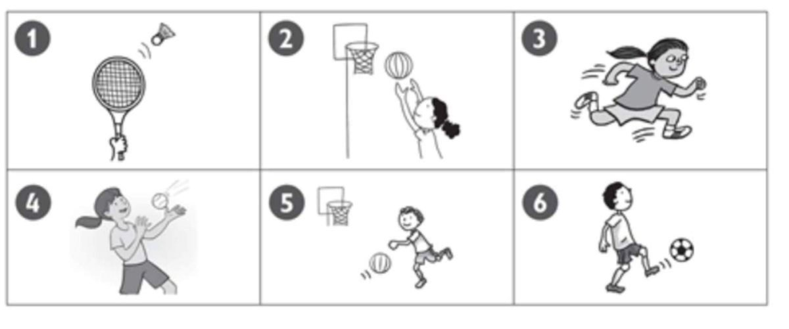

1\. *[5]{.underline}* *[ecnuob]{.underline}* *[bounce]{.underline}*

2\. \_\_\_\_\_\_\_\_\_\_\_\_ kcki \_\_\_\_\_\_\_\_\_\_\_\_

*6 kick*

3\. \_\_\_\_\_\_\_\_\_\_\_\_ tchca \_\_\_\_\_\_\_\_\_\_\_\_

*4 catch*

4\. \_\_\_\_\_\_\_\_\_\_\_\_ unr \_\_\_\_\_\_\_\_\_\_\_\_

*3 run*

5\. \_\_\_\_\_\_\_\_\_\_\_\_ ith \_\_\_\_\_\_\_\_\_\_\_\_

*1 hit*

6\. \_\_\_\_\_\_\_\_\_\_\_\_ wthor \_\_\_\_\_\_\_\_\_\_\_\_

*2 throw*

**3. Look, read and draw lines. There is one example.   (one point
each)**

*2. tennis*

*3. table tennis*

*4. football*

*5. basketball*

*6. hockey*

**[Grammar]{.underline}**

**4. Read and write the words. There is one example.   (one point
each)**

  --------------------------------------------------------------------------------------------------------------------------------------------------------------------------------------------------------------------- -- ------------------------------------------------------------------------------------------------------------------------------------------------------------------------------------------------------------------- -- -------------------------------------------------------------------------------------------------------------------------------------------------------------------------------------------------------------------
  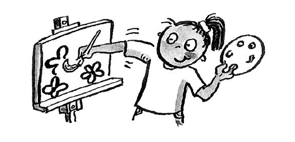 1.            
  She *[likes]{.underline}* painting.                                                                                                                                                                                      2. I *don't* like badminton.                                                                                                                                                                                           3. Does Nick *like* hockey?

  --------------------------------------------------------------------------------------------------------------------------------------------------------------------------------------------------------------------- -- ------------------------------------------------------------------------------------------------------------------------------------------------------------------------------------------------------------------- -- -------------------------------------------------------------------------------------------------------------------------------------------------------------------------------------------------------------------

  ------------------------------------------------------------------------------------------------------------------------------------------------------------------------------------------------------------------- -- ------------------------------------------------------------------------------------------------------------------------------------------------------------------------------------------------------------------- -- -------------------------------------------------------------------------------------------------------------------------------------------------------------------------------------------------------------------
  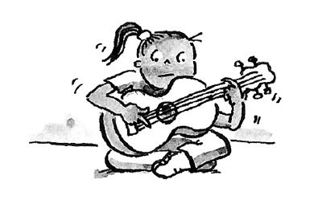      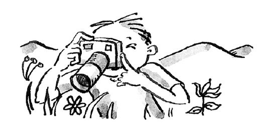      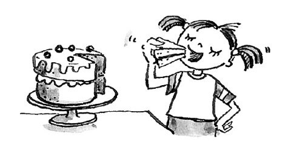
  4. Anna *likes* playing the guitar.                                                                                                                                                                                    5. Tom likes *taking* photos.                                                                                                                                                                                          6. She likes *eating* cake.

  ------------------------------------------------------------------------------------------------------------------------------------------------------------------------------------------------------------------- -- ------------------------------------------------------------------------------------------------------------------------------------------------------------------------------------------------------------------- -- -------------------------------------------------------------------------------------------------------------------------------------------------------------------------------------------------------------------

**5. Look and read. Put the letters in order. Write. There is one
example.   (one point each)**

Yes, I do. \| No, I don't. \| Yes, he / she does. \| No he / she
doesn't.

1\. Does he like (mmiswing)? *[swimming]{.underline}*
*[Yes,]{.underline}* *[he]{.underline}* *[does]{.underline}*.

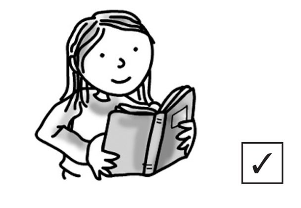

2\. Does she like (redgnia)? \_\_\_\_\_\_\_\_\_\_\_\_
\_\_\_\_\_\_\_\_\_\_\_\_, \_\_\_\_\_\_\_\_\_\_\_\_
\_\_\_\_\_\_\_\_\_\_\_\_

*reading Yes she does.*

3\. Does he like (gnihsif)? \_\_\_\_\_\_\_\_\_\_\_\_
\_\_\_\_\_\_\_\_\_\_\_\_, \_\_\_\_\_\_\_\_\_\_\_\_
\_\_\_\_\_\_\_\_\_\_\_\_

*fishing No he doesn't.*

4\. Do you like playing the (ragtui)? \_\_\_\_\_\_\_\_\_\_\_\_
\_\_\_\_\_\_\_\_\_\_\_\_, \_\_\_\_\_\_\_\_\_\_\_\_
\_\_\_\_\_\_\_\_\_\_\_\_

*guitar No I don't.*

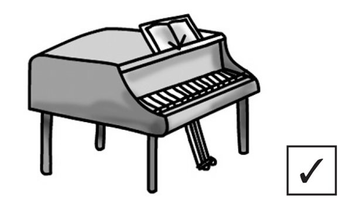

5\. Do you like playing the (oiapn)? \_\_\_\_\_\_\_\_\_\_\_\_
\_\_\_\_\_\_\_\_\_\_\_\_, \_\_\_\_\_\_\_\_\_\_\_\_
\_\_\_\_\_\_\_\_\_\_\_\_

*piano Yes I do.*

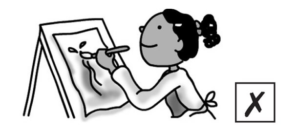

6\. Does she like (ngitianp)? \_\_\_\_\_\_\_\_\_\_\_\_
\_\_\_\_\_\_\_\_\_\_\_\_, \_\_\_\_\_\_\_\_\_\_\_\_
\_\_\_\_\_\_\_\_\_\_\_\_

*painting No she doesn't.*

**[Listening]{.underline}**

**6. Listen and write the words. There is one example.   (one point
each)**

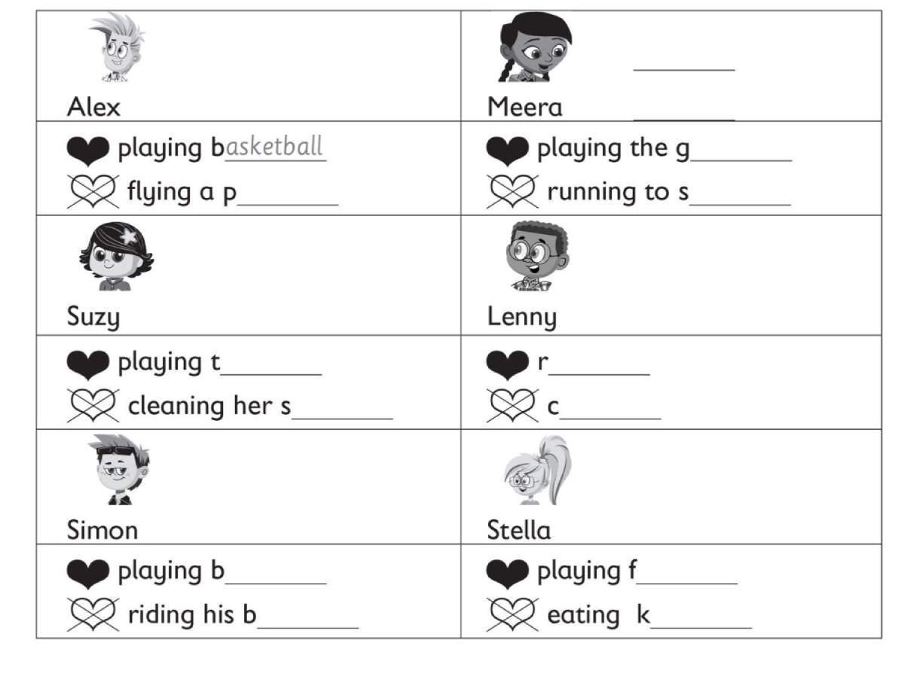

*Meera: likes -- playing the guitar doesn't like -- running to school.*

*Suzy: likes -- playing table tennis doesn't like -- cleaning shoes.*

*Lenny: likes -- reading doesn't like -- cooking.*

*Simon: likes -- playing basketball doesn't like -- riding bike.*

*Stella: likes -- playing football doesn't like -- eating kiwis.*

**Audio script**

**Alex:** I like playing basketball. I don't like flying a plane.

**Meera:** I like playing the guitar. I don't like running to school.

**Suzy:** I like playing table tennis. I don't like cleaning my shoes.

**Lenny:** I like reading. I don't like cooking.

**Simon:** I like playing basketball. I don't like riding my bike.

**Stella:** I like playing football. I don't like eating kiwis.

**7. Listen. Write *B* (Bill), *J* (Jill), or *M* (Matt). There are four
extra pictures. There is one example.   (one point each)**

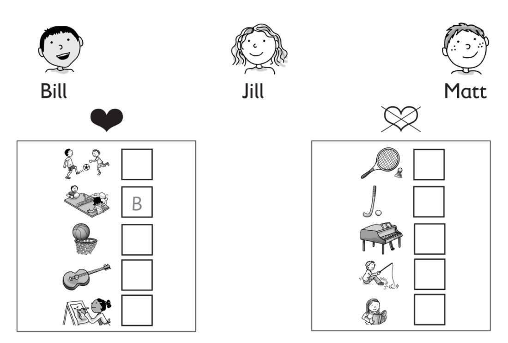

*Bill: doesn't like hockey;*

*Jill: likes playing guitar, doesn't like playing the piano;*

*Matt: likes painting, doesn't like fishing*

**Audio script**

**Woman:** Bill, do you like playing table tennis?

**Bill:** Yes, I do.

**Woman:** Bill, do you like playing hockey?

**Bill:** No, I don't.

**Woman:** Jill, do you like playing the guitar?

**Jill:** Yes, I do.

**Woman:** Do you like playing the piano?

**Jill:** No, I don't.

**Woman:** Matt, do you like painting?

**Matt:** Yes, I do.

**Woman:** Do you like fishing?

**Matt:** No, I don't.

**[Reading]{.underline}**

**8. Read and write the words. There are two extra words. There is one
example.   (one point each)**

Example

~~school~~ \| table tennis \| net \| garden \| bat \| kick \| swim \|
shoes

Today Bill and Jill are playing basketball at their (1) *school* .

They are wearing white shorts and a red T-shirt. Jill is wearing yellow
(2) *shoes*. Yellow is her favourite colour.

In basketball, there are five players. The players bounce the ball and
throw it in a (3) *net*. They don't (4) *kick* the ball. Many basketball
players are tall. Jill doesn't like playing basketball. She loves
playing (5) *table tennis*. She has got a table tennis table in her (6)
*garden* !

