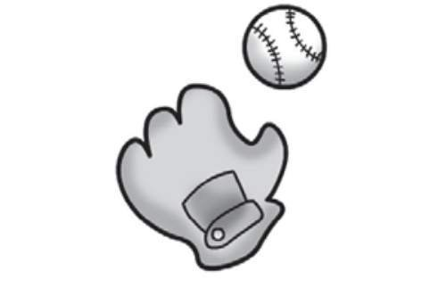
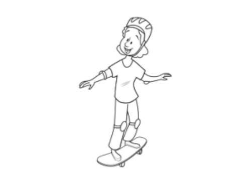
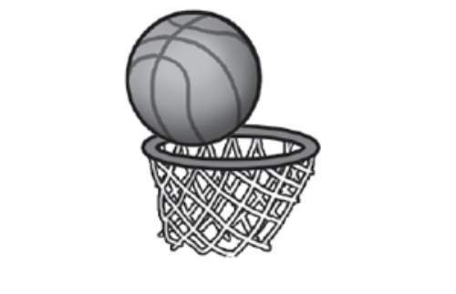
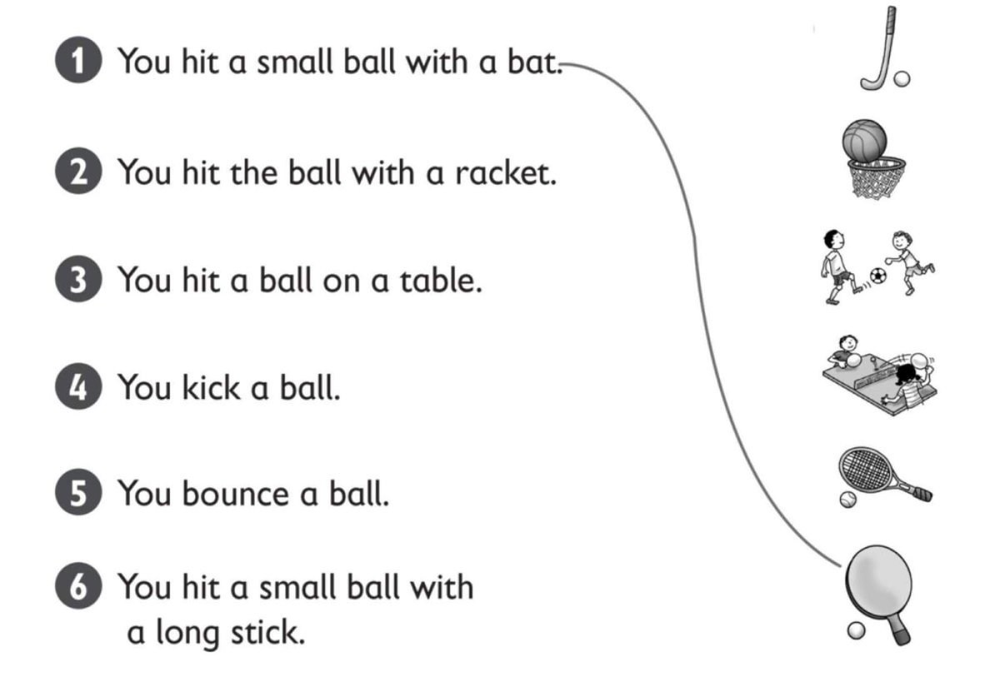
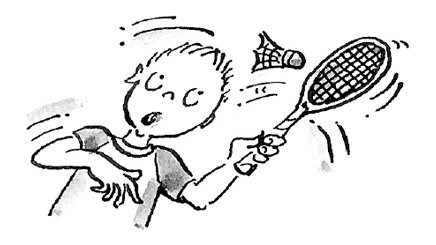
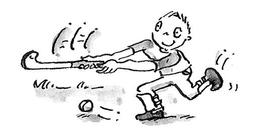
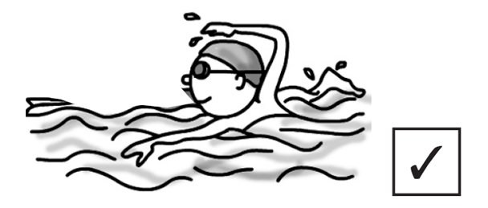
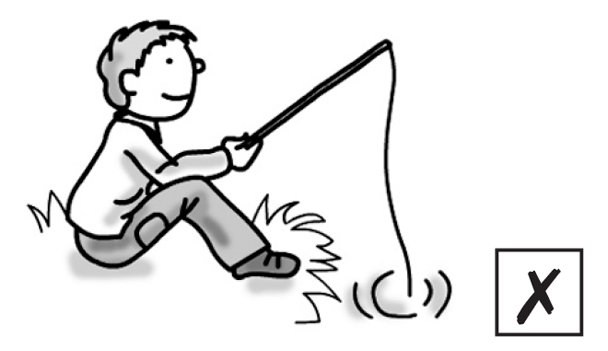
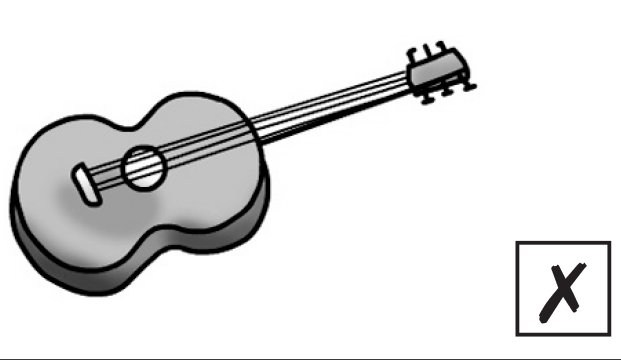
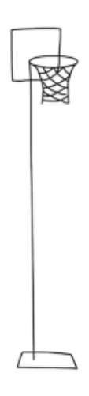

**[Vocabulary]{.underline}**

**1. Look and write the words. There is one example.   (one point
each)**

  ------------------------------------------------------------------------------------------------------------------------------------------------------------------------------------------------------------------------- -- ---------------------------------------------------------------------------------------------------------------------------------------------------------------------------------------------------------------------- -- ----------------------------------------------------------------------------------------------------------------------------------------------------------------------------------------------------------------------
   1.            
  *[badminton]{.underline}*                                                                                                                                                                                                    2. \_\_\_\_\_\_\_\_\_\_\_\_\_                                                                                                                                                                                             3. \_\_\_\_\_\_\_\_\_\_\_\_\_

  ------------------------------------------------------------------------------------------------------------------------------------------------------------------------------------------------------------------------- -- ---------------------------------------------------------------------------------------------------------------------------------------------------------------------------------------------------------------------- -- ----------------------------------------------------------------------------------------------------------------------------------------------------------------------------------------------------------------------

  ---------------------------------------------------------------------------------------------------------------------------------------------------------------------------------------------------------------------- -- ---------------------------------------------------------------------------------------------------------------------------------------------------------------------------------------------------------------------- -- ----------------------------------------------------------------------------------------------------------------------------------------------------------------------------------------------------------------------
              
  4. \_\_\_\_\_\_\_\_\_\_\_\_\_                                                                                                                                                                                             5. \_\_\_\_\_\_\_\_\_\_\_\_\_                                                                                                                                                                                             6. \_\_\_\_\_\_\_\_\_\_\_\_\_

  ---------------------------------------------------------------------------------------------------------------------------------------------------------------------------------------------------------------------- -- ---------------------------------------------------------------------------------------------------------------------------------------------------------------------------------------------------------------------- -- ----------------------------------------------------------------------------------------------------------------------------------------------------------------------------------------------------------------------

**2. Put the letters in order. Look and write the number. There is one
example.   (one point each)**

1\. *[5]{.underline}* *[ecnuob]{.underline}* *[bounce]{.underline}*

2\. \_\_\_\_\_\_\_\_\_\_\_\_ kcki \_\_\_\_\_\_\_\_\_\_\_\_

3\. \_\_\_\_\_\_\_\_\_\_\_\_ tchca \_\_\_\_\_\_\_\_\_\_\_\_

4\. \_\_\_\_\_\_\_\_\_\_\_\_ unr \_\_\_\_\_\_\_\_\_\_\_\_

5\. \_\_\_\_\_\_\_\_\_\_\_\_ ith \_\_\_\_\_\_\_\_\_\_\_\_

6\. \_\_\_\_\_\_\_\_\_\_\_\_ wthor \_\_\_\_\_\_\_\_\_\_\_\_

**3. Look, read and draw lines. There is one example.   (one point
each)**

**[Grammar]{.underline}**

**4. Read and write the words. There is one example.   (one point
each)**

  ------------------------------------------------------------------------------------------------------------------------------------------------------------------------------------------------------------------------ -- ---------------------------------------------------------------------------------------------------------------------------------------------------------------------------------------------------------------------- -- ----------------------------------------------------------------------------------------------------------------------------------------------------------------------------------------------------------------------
   1.            
  She *[likes]{.underline}* painting.                                                                                                                                                                                         2. I \_\_\_\_\_\_ like badminton.                                                                                                                                                                                         3. Does Nick \_\_\_\_\_\_ hockey?

  ------------------------------------------------------------------------------------------------------------------------------------------------------------------------------------------------------------------------ -- ---------------------------------------------------------------------------------------------------------------------------------------------------------------------------------------------------------------------- -- ----------------------------------------------------------------------------------------------------------------------------------------------------------------------------------------------------------------------

  ---------------------------------------------------------------------------------------------------------------------------------------------------------------------------------------------------------------------- -- ---------------------------------------------------------------------------------------------------------------------------------------------------------------------------------------------------------------------- -- ----------------------------------------------------------------------------------------------------------------------------------------------------------------------------------------------------------------------
              
  4. Anna \_\_\_\_\_\_ playing the guitar.                                                                                                                                                                                  5. Tom likes \_\_\_\_\_\_ photos.                                                                                                                                                                                         6. She likes \_\_\_\_\_\_ cake.

  ---------------------------------------------------------------------------------------------------------------------------------------------------------------------------------------------------------------------- -- ---------------------------------------------------------------------------------------------------------------------------------------------------------------------------------------------------------------------- -- ----------------------------------------------------------------------------------------------------------------------------------------------------------------------------------------------------------------------

**5. Look and read. Put the letters in order. Write. There is one
example.   (one point each)**

Yes, I do. \| No, I don't. \| Yes, he / she does. \| No he / she
doesn't.

1\. Does he like (mmiswing)? *[swimming]{.underline}*
*[Yes,]{.underline}* *[he]{.underline}* *[does]{.underline}*.

2\. Does she like (redgnia)? \_\_\_\_\_\_\_\_\_\_\_\_
\_\_\_\_\_\_\_\_\_\_\_\_, \_\_\_\_\_\_\_\_\_\_\_\_
\_\_\_\_\_\_\_\_\_\_\_\_

3\. Does he like (gnihsif)? \_\_\_\_\_\_\_\_\_\_\_\_
\_\_\_\_\_\_\_\_\_\_\_\_, \_\_\_\_\_\_\_\_\_\_\_\_
\_\_\_\_\_\_\_\_\_\_\_\_

4\. Do you like playing the (ragtui)? \_\_\_\_\_\_\_\_\_\_\_\_
\_\_\_\_\_\_\_\_\_\_\_\_, \_\_\_\_\_\_\_\_\_\_\_\_
\_\_\_\_\_\_\_\_\_\_\_\_

5\. Do you like playing the (oiapn)? \_\_\_\_\_\_\_\_\_\_\_\_
\_\_\_\_\_\_\_\_\_\_\_\_, \_\_\_\_\_\_\_\_\_\_\_\_
\_\_\_\_\_\_\_\_\_\_\_\_

6\. Does she like (ngitianp)? \_\_\_\_\_\_\_\_\_\_\_\_
\_\_\_\_\_\_\_\_\_\_\_\_, \_\_\_\_\_\_\_\_\_\_\_\_
\_\_\_\_\_\_\_\_\_\_\_\_

**[Listening]{.underline}**

**6. Listen and write the words. There is one example.   (one point
each)**

**7. Listen. Write *B* (Bill), *J* (Jill), or *M* (Matt). There are four
extra pictures. There is one example.   (one point each)**

**[Reading]{.underline}**

**8. Read and write the words. There are two extra words. There is one
example.   (one point each)**

Example

~~school~~ \| table tennis \| net \| garden \| bat \| kick \| swim \|
shoes

Today Bill and Jill are playing basketball at their (1) *school* .

They are wearing white shorts and a red T-shirt. Jill is wearing yellow
(2) \_\_\_\_\_\_\_\_\_\_\_\_\_\_\_\_\_\_\_. Yellow is her favourite
colour.

In basketball, there are five players. The players bounce the ball and
throw it in a (3) \_\_\_\_\_\_\_\_\_\_\_\_\_\_\_\_\_\_\_. They don't (4)
\_\_\_\_\_\_\_\_\_\_\_\_\_\_\_\_\_\_\_ the ball. Many basketball players
are tall. Jill doesn't like playing basketball. She loves playing (5)
\_\_\_\_\_\_\_\_\_\_\_\_\_\_\_\_\_\_\_. She has got a table tennis table
in her (6) \_\_\_\_\_\_\_\_\_\_\_\_\_\_\_\_\_\_\_!

