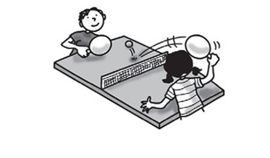
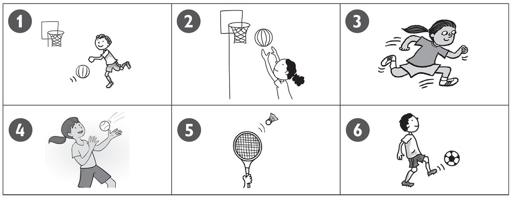
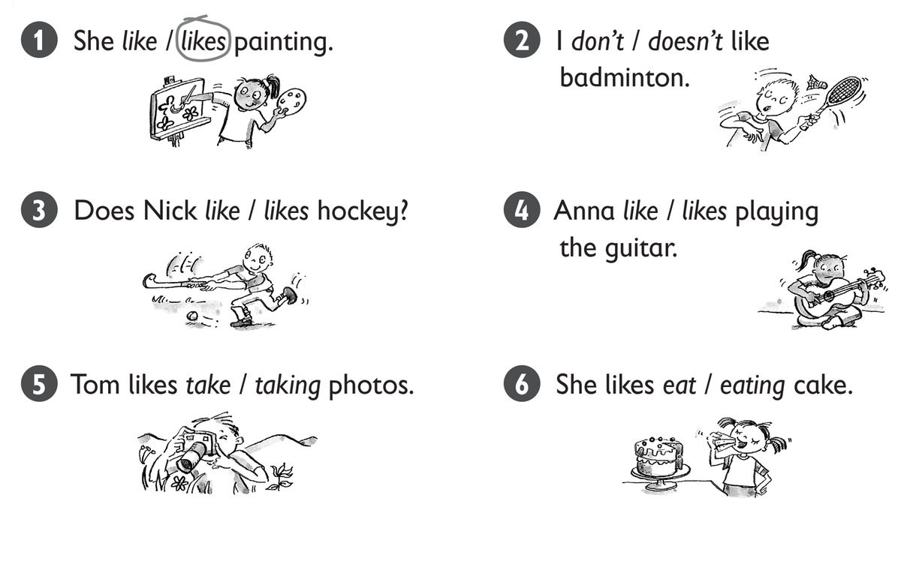
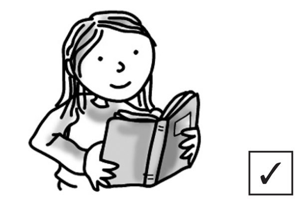
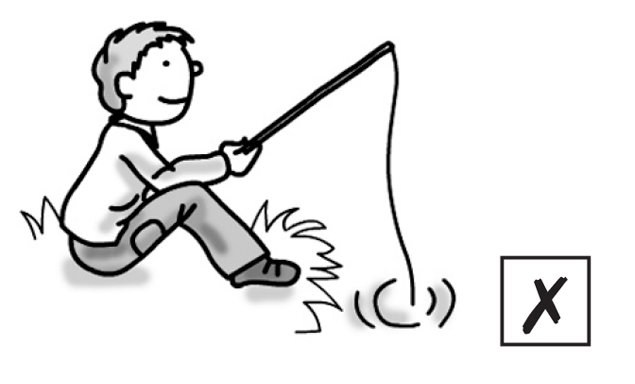
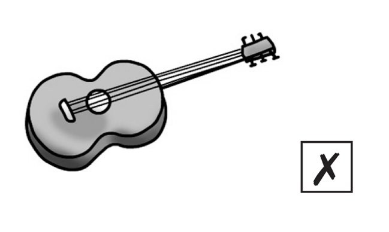
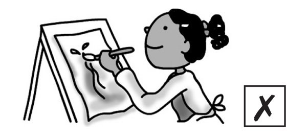
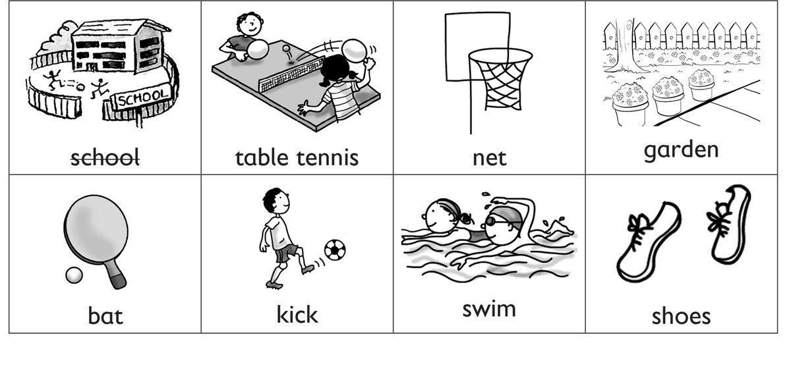

**[Vocabulary]{.underline}**

**1. Match and write the words. There is one example.   (one point
each)**

~~badminton~~ \| baseball \| basketball \| hockey \| skateboarding \|
table tennis

  --------------------------------------------------------------------------------------------------------------------------------------------------------------------------------------------------------------------- -- ------------------------------------------------------------------------------------------------------------------------------------------------------------------------------------------------------------------ -- ------------------------------------------------------------------------------------------------------------------------------------------------------------------------------------------------------------------ -- ------------------------------------------------------------------------------------------------------------------------------------------------------------------------------------------------------------------
   1.                  
  *[badminton]{.underline}*                                                                                                                                                                                                2. *hockey*                                                                                                                                                                                                           3. *baseball*                                                                                                                                                                                                         4. *table tennis*

  --------------------------------------------------------------------------------------------------------------------------------------------------------------------------------------------------------------------- -- ------------------------------------------------------------------------------------------------------------------------------------------------------------------------------------------------------------------ -- ------------------------------------------------------------------------------------------------------------------------------------------------------------------------------------------------------------------ -- ------------------------------------------------------------------------------------------------------------------------------------------------------------------------------------------------------------------

  ------------------------------------------------------------------------------------------------------------------------------------------------------------------------------------------------------------------ -- ------------------------------------------------------------------------------------------------------------------------------------------------------------------------------------------------------------------
        
  5. *skateboarding*                                                                                                                                                                                                    6. *basketball*

  ------------------------------------------------------------------------------------------------------------------------------------------------------------------------------------------------------------------ -- ------------------------------------------------------------------------------------------------------------------------------------------------------------------------------------------------------------------

**2. Look. Put the letters in order. There is one example.   (one point
each)**

  ------------------------------- --- -----------------------------------
  1\. ecnuob                          *[bounce]{.underline}*

  ------------------------------- --- -----------------------------------

  ------------------------------- --- -----------------------------------
  2\. wthor                           *throw*

  ------------------------------- --- -----------------------------------

  ------------------------------- --- -----------------------------------
  3\. unr                             *run*

  ------------------------------- --- -----------------------------------

  ------------------------------- --- -----------------------------------
  4\. tchca                           *catch*

  ------------------------------- --- -----------------------------------

  ------------------------------- --- -----------------------------------
  5\. ith                             *hit*

  ------------------------------- --- -----------------------------------

  ------------------------------- --- -----------------------------------
  6\. kcki                            *kick*

  ------------------------------- --- -----------------------------------

**3. Look, read and draw the lines. There is one example.   (one point
each)**

*2. tennis*

*3. table tennis*

*4. football*

*5. basketball*

*6. hockey*

**[Grammar]{.underline}**

**4. Read and circle. There is one example.   (one point each)**

*2. don't*

*3. like*

*4. likes*

*5. taking*

*6. eating*

**5. Look and read. Choose the words. Write. There is one
example.   (one point each)**

Yes \| No \| do \| don't \| does \| doesn't

1\. Does he like swimming?

*[Yes,]{.underline}* *[he]{.underline}* *[does]{.underline}*

2\. Does she like reading?

\_\_\_\_\_\_\_\_\_\_, she \_\_\_\_\_\_\_\_\_\_.

*Yes does*

3\. Does he like fishing?

\_\_\_\_\_\_\_\_\_\_, he \_\_\_\_\_\_\_\_\_\_.

*No doesn't*

4\. Do you like playing the guitar?

\_\_\_\_\_\_\_\_\_\_, I \_\_\_\_\_\_\_\_\_\_.

*No don't*

5\. Do you like playing the piano?

\_\_\_\_\_\_\_\_\_\_, I \_\_\_\_\_\_\_\_\_\_.

*Yes do*

6\. Does she like painting?

\_\_\_\_\_\_\_\_\_\_, I \_\_\_\_\_\_\_\_\_\_.

*No doesn't*

**6. Listen and match. There is one example.   (one point each)**

*Meera: likes -- playing the guitar; doesn't like -- running to school*

*Suzy: likes -- playing table tennis; doesn't like -- cleaning shoes*

*Lenny: likes -- reading; doesn't like -- cooking*

*Simon: likes -- playing basketball; doesn't like -- riding bike*

*Stella: likes -- playing football; doesn't like -- eating kiwis*

**Audio script**

**Alex:** I like playing basketball. I don't like flying a plane.

**Meera:** I like playing the guitar. I don't like running to school.

**Suzy:** I like playing table tennis. I don't like cleaning my shoes.

**Lenny:** I like reading. I don't like cooking.

**Simon:** I like playing basketball. I don't like riding my bike.

**Stella:** I like playing football. I don't like eating kiwis.

**7. Listen. Write *B* (Bill), *J* (Jill), or *M* (Matt). There are two
extra pictures.   (one point each)**

*Bill: doesn't like hockey*

*Jill: likes playing guitar, doesn't like playing the piano*

*Matt: likes painting, doesn't like fishing (the extra pictures are
football and reading)*

**Audio script**

**Woman:** Bill, do you like playing table tennis?

**Bill:** Yes, I do.

**Woman:** Bill, do you like playing hockey?

**Bill:** No, I don't.

**Woman:** Jill, do you like playing the guitar?

**Jill:** Yes, I do.

**Woman:** Do you like playing the piano?

**Jill:** No, I don't.

**Woman:** Matt, do you like painting?

**Matt:** Yes, I do.

**Woman:** Do you like fishing?

**Matt:** No, I don't.

**[Reading]{.underline}**

**8. Read and write the words. There are two extra words. There is one
example.   (one point each)**

bat \| swim

Today Bill and Jill are playing basketball at their (1) *school*.

They are wearing white shorts and a red T-shirt. Jill is wearing yellow
(2) *shoes*. Yellow is her favourite colour.

In basketball, there are five players. The players bounce the ball and
throw it in a (3) *net*. They don't (4) *kick* the ball. Many basketball
players are tall. Jill doesn't like playing basketball. She loves
playing (5) *table tennis*. She has got a table in her (6) *garden*!

