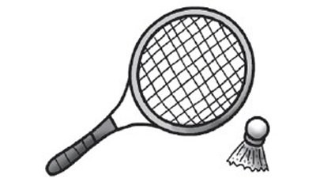
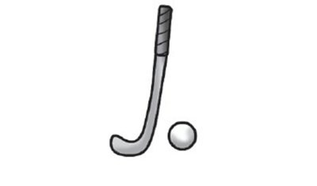
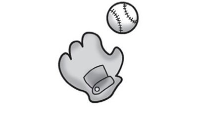
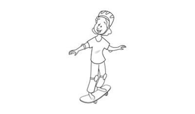
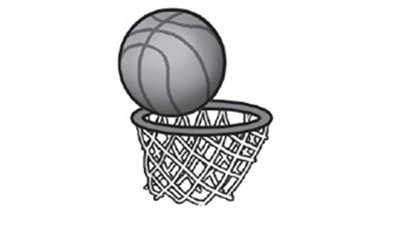
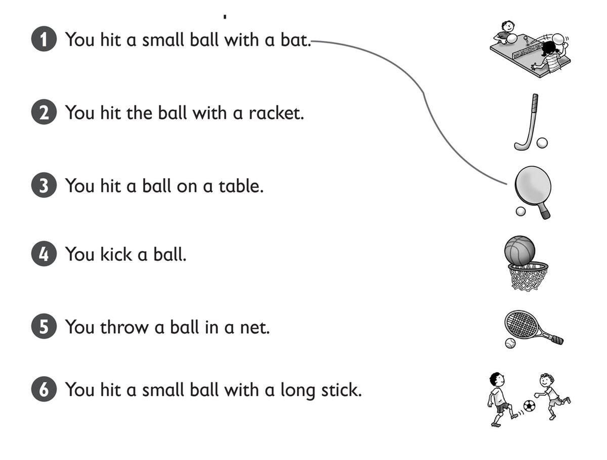
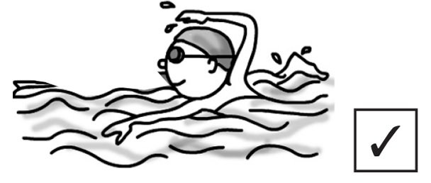
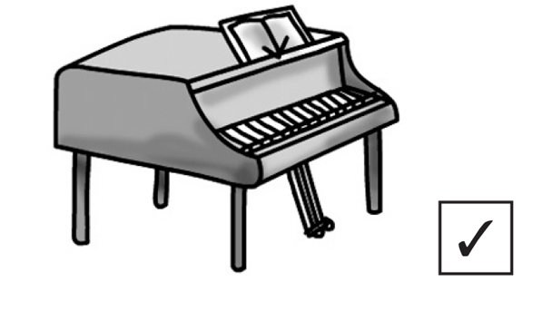
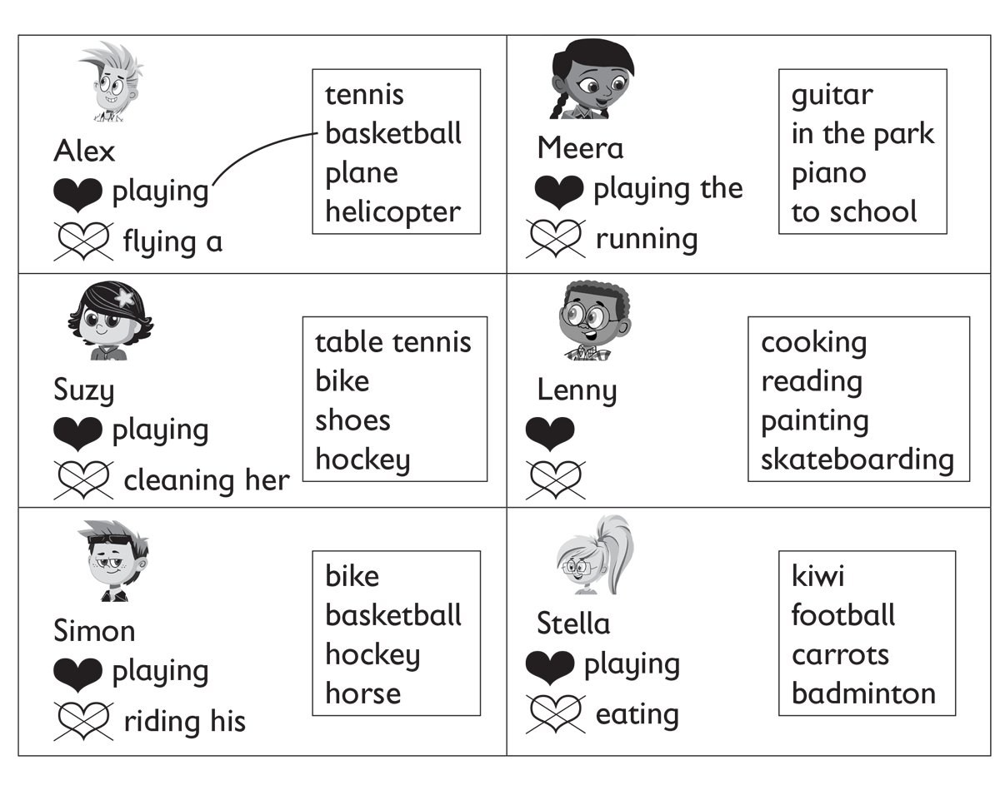
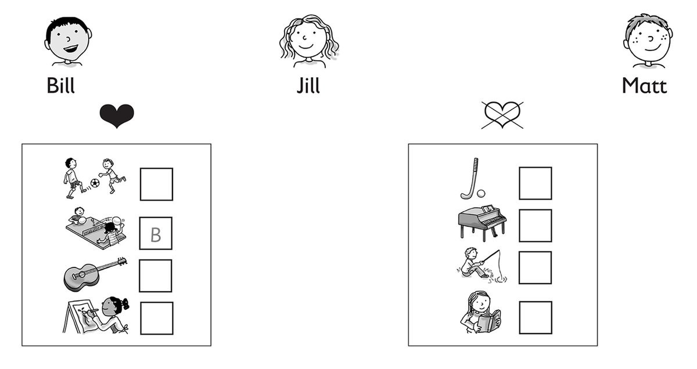

**[Vocabulary]{.underline}**

**1. Match and write the words. There is one example.   (one point
each)**

~~badminton~~ \| baseball \| basketball \| hockey \| skateboarding \|
table tennis

  ------------------------------------------------------------------------------------------------------------------------------------------------------------------------------------------------------------------------ -- --------------------------------------------------------------------------------------------------------------------------------------------------------------------------------------------------------------------- -- --------------------------------------------------------------------------------------------------------------------------------------------------------------------------------------------------------------------- -- ---------------------------------------------------------------------------------------------------------------------------------------------------------------------------------------------------------------------
   1.                  
  *[badminton]{.underline}*                                                                                                                                                                                                   2. \_\_\_\_\_\_\_\_\_\_\_\_\_                                                                                                                                                                                            3. \_\_\_\_\_\_\_\_\_\_\_\_\_                                                                                                                                                                                            4. \_\_\_\_\_\_\_\_\_\_\_\_\_

  ------------------------------------------------------------------------------------------------------------------------------------------------------------------------------------------------------------------------ -- --------------------------------------------------------------------------------------------------------------------------------------------------------------------------------------------------------------------- -- --------------------------------------------------------------------------------------------------------------------------------------------------------------------------------------------------------------------- -- ---------------------------------------------------------------------------------------------------------------------------------------------------------------------------------------------------------------------

  --------------------------------------------------------------------------------------------------------------------------------------------------------------------------------------------------------------------- -- ---------------------------------------------------------------------------------------------------------------------------------------------------------------------------------------------------------------------
        
  5. \_\_\_\_\_\_\_\_\_\_\_\_\_                                                                                                                                                                                            6. \_\_\_\_\_\_\_\_\_\_\_\_\_

  --------------------------------------------------------------------------------------------------------------------------------------------------------------------------------------------------------------------- -- ---------------------------------------------------------------------------------------------------------------------------------------------------------------------------------------------------------------------

**2. Look. Put the letters in order. There is one example.   (one point
each)**

  ------------------------------- --- -----------------------------------
  1\. ecnuob                          *[bounce]{.underline}*

  ------------------------------- --- -----------------------------------

  ------------------------------- --- -----------------------------------
  2\. wthor                           \_\_\_\_\_\_\_\_\_\_\_\_

  ------------------------------- --- -----------------------------------

  ------------------------------- --- -----------------------------------
  3\. unr                             \_\_\_\_\_\_\_\_\_\_\_\_

  ------------------------------- --- -----------------------------------

  ------------------------------- --- -----------------------------------
  4\. tchca                           \_\_\_\_\_\_\_\_\_\_\_\_

  ------------------------------- --- -----------------------------------

  ------------------------------- --- -----------------------------------
  5\. ith                             \_\_\_\_\_\_\_\_\_\_\_\_

  ------------------------------- --- -----------------------------------

  ------------------------------- --- -----------------------------------
  6\. kcki                            \_\_\_\_\_\_\_\_\_\_\_\_

  ------------------------------- --- -----------------------------------

**3. Look, read and draw the lines. There is one example.   (one point
each)**

**[Grammar]{.underline}**

**4. Read and circle. There is one example.   (one point each)**

**5. Look and read. Choose the words. Write. There is one
example.   (one point each)**

Yes \| No \| do \| don't \| does \| doesn't

1\. Does he like swimming?

*[Yes,]{.underline}* *[he]{.underline}* *[does]{.underline}*

2\. Does she like reading?

\_\_\_\_\_\_\_\_\_\_, she \_\_\_\_\_\_\_\_\_\_.

3\. Does he like fishing?

\_\_\_\_\_\_\_\_\_\_, he \_\_\_\_\_\_\_\_\_\_.

4\. Do you like playing the guitar?

\_\_\_\_\_\_\_\_\_\_, I \_\_\_\_\_\_\_\_\_\_.

5\. Do you like playing the piano?

\_\_\_\_\_\_\_\_\_\_, I \_\_\_\_\_\_\_\_\_\_.

6\. Does she like painting?

\_\_\_\_\_\_\_\_\_\_, I \_\_\_\_\_\_\_\_\_\_.

**6. Listen and match. There is one example.   (one point each)**

**7. Listen. Write *B* (Bill), *J* (Jill), or *M* (Matt). There are two
extra pictures.   (one point each)**

**[Reading]{.underline}**

**8. Read and write the words. There are two extra words. There is one
example.   (one point each)**

bat \| swim

Today Bill and Jill are playing basketball at their (1) *school*.

They are wearing white shorts and a red T-shirt. Jill is wearing yellow
(2) \_\_\_\_\_\_\_\_\_\_\_\_\_\_\_\_\_\_\_. Yellow is her favourite
colour.

In basketball, there are five players. The players bounce the ball and
throw it in a (3) \_\_\_\_\_\_\_\_\_\_\_\_\_\_\_\_\_\_\_. They don't (4)
\_\_\_\_\_\_\_\_\_\_\_\_\_\_\_\_\_\_\_ the ball. Many basketball players
are tall. Jill doesn't like playing basketball. She loves playing (5)
\_\_\_\_\_\_\_\_\_\_\_\_\_\_\_\_\_\_\_. She has got a table in her (6)
\_\_\_\_\_\_\_\_\_\_\_\_\_\_\_\_\_\_\_!

