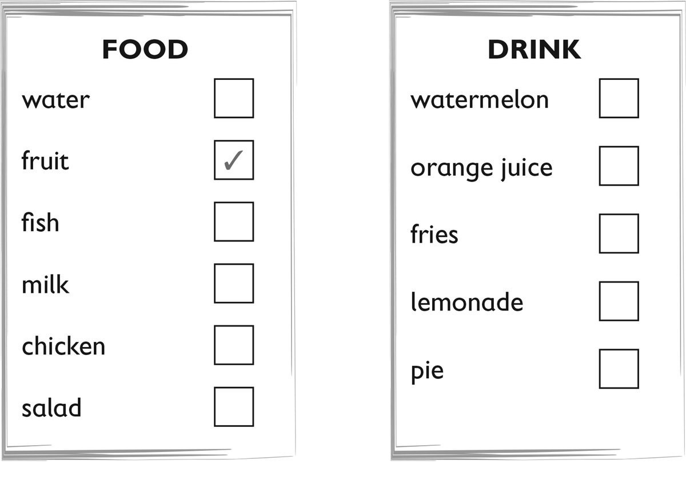
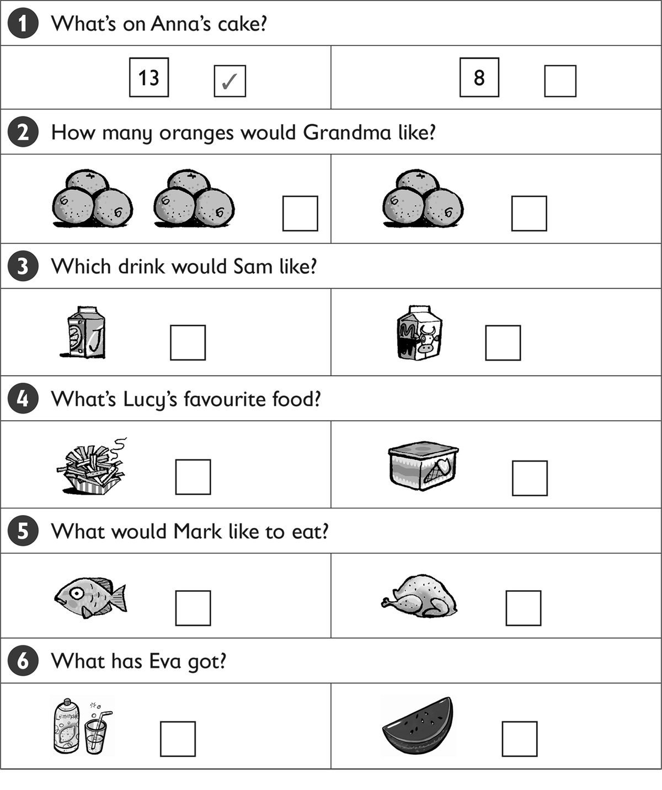

**[Vocabulary]{.underline}**

**1. Listen and number. There is one example.   (one point each)**

*cake 2*

*orange 6*

*sausage 4*

*sausage 3*

*lemonade 5*

**Audio script**

1\. burger

2\. cake

3\. lemonade

4\. sausage

5\. watermelon

6\. orange

**2. Look and put a tick or a cross. There is one example.   (one point
each)**

***FOOD:***

*fish   ✓*

*chicken   ✓*

*salad   ✓*

***DRINK:***

*orange juice   ✓*

*lemonade   ✓*

**3. Read and circle the food. There is one example.   (one point
each)**

1\. These are red.

    a. bananas    b. *[tomatoes]{.underline}*

2\. This is a big green and red fruit.

    a. an apple    b. a watermelon

*a watermelon*

3\. This is a drink.

    a. juice    b. a burger

*juice*

4\. These are long and orange.

    a. sausages    b. carrots

*carrots*

5\. This is meat.

    a. burger    b. cake

*burger*

6\. You can eat these with your burger.

    a. fries    b. oranges

*fries*

**[Grammar]{.underline}**

**4. Read and write the words. There is one example.   (one point
each)**

love \| ~~Would~~ \| have \| like \| thank \| Here

1\. *[Would]{.underline}* you like a sausage?

2\. Yes, I'd *love* one.

3\. Can I *have* some lemonade?

4\. *Here* you are.

5\. Would you *like* some watermelon?

6\. No, *thank* you.

**5. Read and write *one* or *some*. There is one example.   (one point
each)**

1\. Would you like some apples?

    -- Yes, I'd like *[some]{.underline}*.

2\. Would you like some fries?

    -- Yes, I'd like *some*.

3\. Would you like an orange?

    -- Yes, I'd like *one*.

4\. Would you like a cake?

    -- Yes, I'd like *one*.

5\. Would you like some sausages?

    -- Yes, I'd like *some*.

6\. Would you like some lemonade?

    -- Yes, I'd like *some*.

**[Listening]{.underline}**

**6. Listen and tick or cross. There is one example.   (one point
each)**

*2. ✓*

*3. ✓*

*4. ✓*

*5. ✓*

*6. ✓*

**Audio script**

1

**Woman:** Would you like some burgers?

**Boy:** No, thank you!

2

**Woman:** Would you like some oranges?

**Girl:** Yes, please!

3

**Woman:** Would you like some milk?

**Boy:** Yes, please!

4

**Woman:** Would you like some fries?

**Girl:** No, thank you!

5

**Woman:** Would you like some apples?

**Boy:** Yes, please!

6

**Woman:** Would you like some juice?

**Girl:** No, thank you!

**7. Listen and tick. There is one example.   (one point each)**

*2. three oranges*

*3. milk*

*4. ice cream*

*5. fish*

*6. lemonade*

**Audio script**

**1**

**Woman:** What a beautiful cake! You're thirteen!

**Girl:** Yes, I am!

**2**

**Woman:** Good morning, I'd like three oranges, please.

**Man:** Yes, here you are.

**3**

**Man:** What would you like to drink, Sam? Orange juice or milk?

**Boy:** Um. Milk, please.

**4**

**Boy:** What's your favourite food, Lucy?

**Lucy:** Chocolate ice cream!

**5**

**Man:** Would you like some fish for dinner, Mark?

**Mark:** Yes, please.

**6**

**Boy:** What are you drinking, Eva?

**Eva:** Some lemonade.

**[Reading]{.underline}**

**8. Look and read. Then circle. There is one example.   (one point
each)**

1\. How many oranges are there?        *three* / *[four]{.underline}*

2\. Where is the lemonade?        *on* / *under the table*

*on*

3\. What has Grandpa got?        *a watermelon* / *kiwi*

*watermelon*

4\. What is Mum cooking?        *burgers* / *fries*

*burgers*

5\. What is the dog eating?        *fish* / *sausages*

*sausages*

6\. Where is number 9?        *on the hat* / *cake*

*cake*

