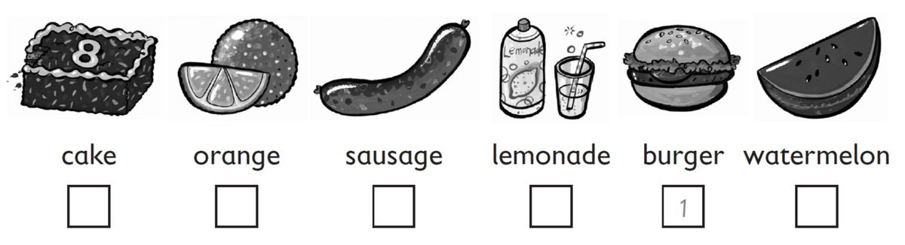
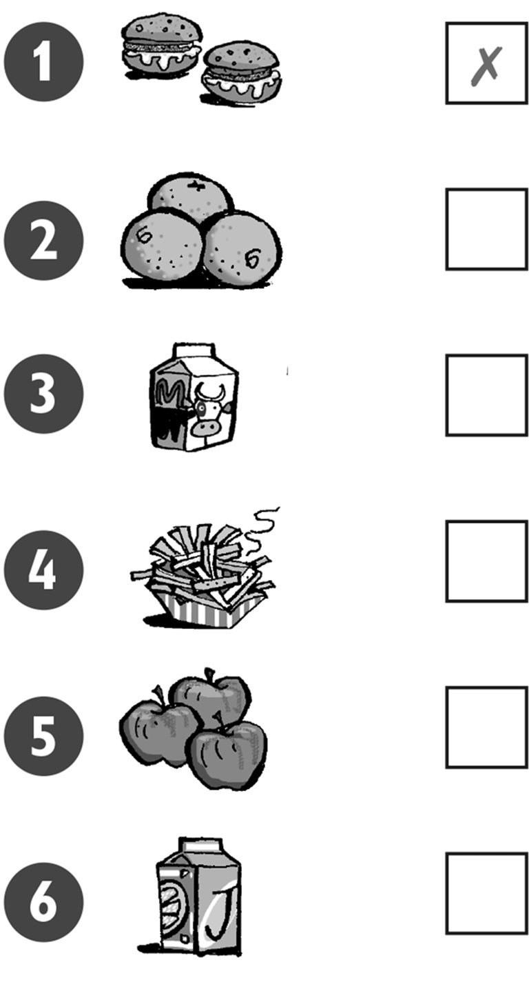

**[Vocabulary]{.underline}**

**1. Listen and number. There is one example.   (one point each)**

**2. Look and put a tick or a cross. There is one example.   (one point
each)**

**3. Read and circle the food. There is one example.   (one point
each)**

1\. These are red.

    a. bananas    b. *[tomatoes]{.underline}*

2\. This is a big green and red fruit.

    a. an apple    b. a watermelon

3\. This is a drink.

    a. juice    b. a burger

4\. These are long and orange.

    a. sausages    b. carrots

5\. This is meat.

    a. burger    b. cake

6\. You can eat these with your burger.

    a. fries    b. oranges

**[Grammar]{.underline}**

**4. Read and write the words. There is one example.   (one point
each)**

love \| ~~Would~~ \| have \| like \| thank \| Here

1\. *[Would]{.underline}* you like a sausage?

2\. Yes, I'd \_\_\_\_\_\_\_\_\_\_\_\_ one.

3\. Can I \_\_\_\_\_\_\_\_\_\_\_\_ some lemonade?

4\. \_\_\_\_\_\_\_\_\_\_\_\_ you are.

5\. Would you \_\_\_\_\_\_\_\_\_\_\_\_ some watermelon?

6\. No, \_\_\_\_\_\_\_\_\_\_\_\_ you.

**5. Read and write *one* or *some*. There is one example.   (one point
each)**

1\. Would you like some apples?

    -- Yes, I'd like *[some]{.underline}*.

2\. Would you like some fries?

    -- Yes, I'd like \_\_\_\_\_\_\_\_\_\_\_.

3\. Would you like an orange?

    -- Yes, I'd like \_\_\_\_\_\_\_\_\_\_\_.

4\. Would you like a cake?

    -- Yes, I'd like \_\_\_\_\_\_\_\_\_\_\_.

5\. Would you like some sausages?

    -- Yes, I'd like \_\_\_\_\_\_\_\_\_\_\_.

6\. Would you like some lemonade?

    -- Yes, I'd like \_\_\_\_\_\_\_\_\_\_\_.

**[Listening]{.underline}**

**6. Listen and tick or cross. There is one example.   (one point
each)**

**7. Listen and tick. There is one example.   (one point each)**

**[Reading]{.underline}**

**8. Look and read. Then circle. There is one example.   (one point
each)**

1\. How many oranges are there?        *three* / *[four]{.underline}*

2\. Where is the lemonade?        *on* / *under the table*

3\. What has Grandpa got?        *a watermelon* / *kiwi*

4\. What is Mum cooking?        *burgers* / *fries*

5\. What is the dog eating?        *fish* / *sausages*

6\. Where is number 9?        *on the hat* / *cake*

