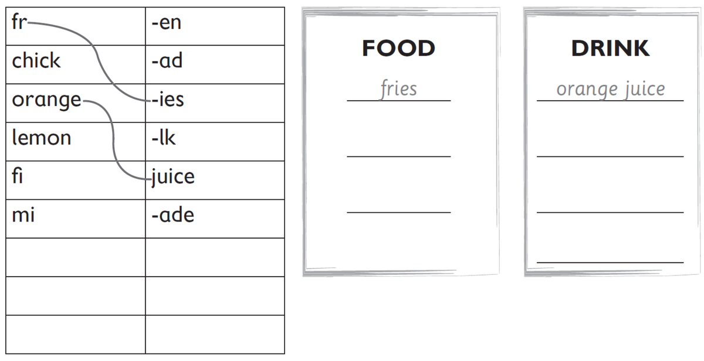
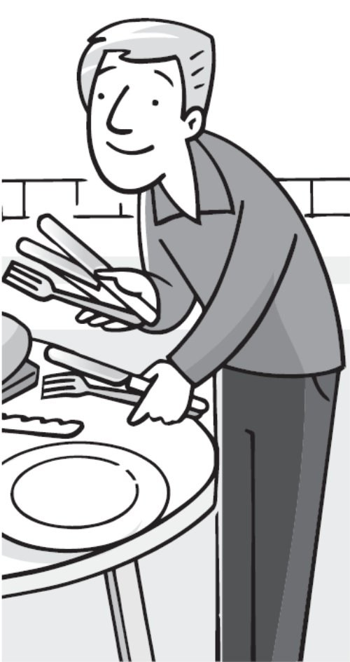
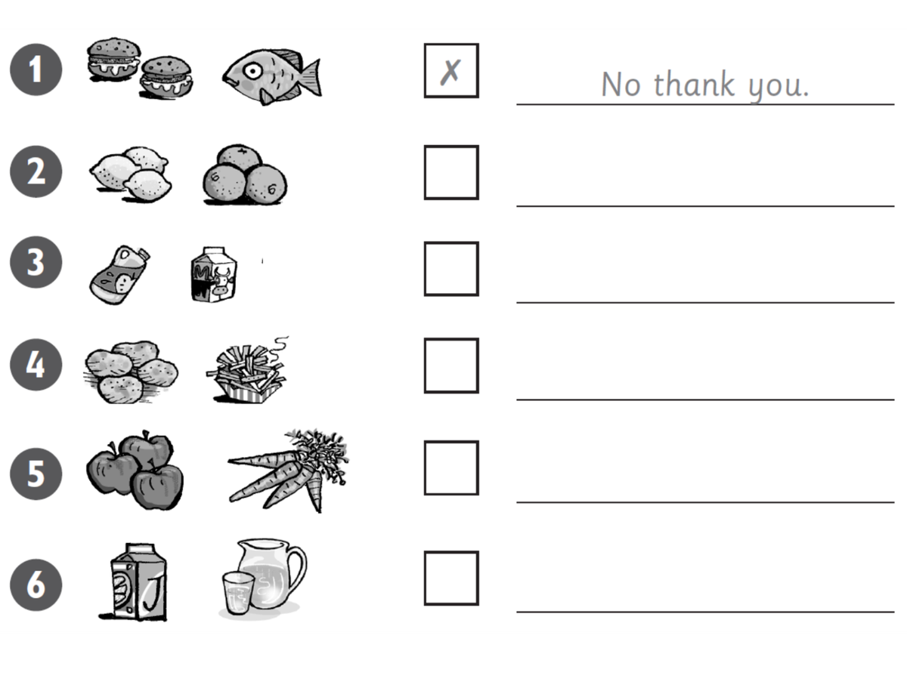

**[Vocabulary]{.underline}**

**1. Listen and number. There is one example.   (one point each)**

*cake -- 2*

*orange -- 6*

*sausage -- 4*

*lemonade -- 3*

*watermelon -- 5*

**Audio script**

1\. burger

2\. cake

3\. lemonade

4\. sausage

5\. watermelon

6\. orange

**2. Look and draw lines. Write. There are two examples.   (one point
each)**

***Food:** fish, chicken, salad*

***Drink:** lemonade, milk*

**3. Put the letters in order. Read and match. Write the number. There
is one example.   (one point each)**

  ------------------------------- --- --------------------------------
  1\. These are red.                  ⬜  (cejui)
                                      \_\_\_\_\_\_\_\_\_\_\_\_\_\_\_

  ------------------------------- --- --------------------------------

*[tomatoes]{.underline}*

  ------------------------------- --- --------------------------------
  2\. This is a big green and red     ⬜  (fesir)
  fruit.                              \_\_\_\_\_\_\_\_\_\_\_\_\_\_\_

  ------------------------------- --- --------------------------------

*watermelon*

  ------------------------------- --- ---------------------------------------------------------
  3\. This is a drink.                *[1]{.underline}*  (maesttoo)  *[tomatoes]{.underline}*

  ------------------------------- --- ---------------------------------------------------------

*juice*

  ------------------------------- --- --------------------------------
  4\. These are long and orange.      ⬜  (gerbur)
                                      \_\_\_\_\_\_\_\_\_\_\_\_\_\_\_

  ------------------------------- --- --------------------------------

*carrots*

  ------------------------------- --- --------------------------------
  5\. This is meat.                   ⬜  (nolemretaw)
                                      \_\_\_\_\_\_\_\_\_\_\_\_\_\_\_

  ------------------------------- --- --------------------------------

*burger*

  ------------------------------- --- --------------------------------
  6\. You can eat these with your     ⬜  (rarocts)
  burger.                             \_\_\_\_\_\_\_\_\_\_\_\_\_\_\_

  ------------------------------- --- --------------------------------

*fries*

**[Grammar]{.underline}**

**4. Read and write the words. There is one example.   (one point
each)**

love \| ~~Would~~ \| have \| Can \| some \| like \| are \| Would \|
thank \| please \| Here

1\. *[Would]{.underline}* you like a sausage?

2\. Yes, I'd \_\_\_\_\_\_\_\_\_\_\_\_\_\_\_ one.

*love*

3\. Can I \_\_\_\_\_\_\_\_\_\_\_\_\_\_\_ some lemonade?

*have*

4\. \_\_\_\_\_\_\_\_\_\_\_\_\_\_\_ you are.

*Here*

5\. Would you \_\_\_\_\_\_\_\_\_\_\_\_\_\_\_ some watermelon?

*like*

6\. No, \_\_\_\_\_\_\_\_\_\_\_\_\_\_\_ you.

*thank*

7\. \_\_\_\_\_\_\_\_\_\_\_\_\_\_\_ I have some fries, please?

*Can*

8\. Yes, here you \_\_\_\_\_\_\_\_\_\_\_\_\_\_\_.

*are*

9\. \_\_\_\_\_\_\_\_\_\_\_\_\_\_\_ you like
\_\_\_\_\_\_\_\_\_\_\_\_\_\_\_ cake?

*Would, some*

10\. Yes, \_\_\_\_\_\_\_\_\_\_\_\_\_\_\_.

*please*

**5. Read and write *one* or *some*. There is one example.   (one point
each)**

1\. Would you like some red and green apples?

    -- Yes, I'd love *[some]{.underline}*.

2\. Would you like some fries with your burger?

    -- Yes, I'd love *some*.

3\. Would you like an orange?

    -- Yes, I'd love *one*. It's my favourite fruit!

4\. Would you like a cake?

    -- Yes, I'd love *one*. It's my birthday!

5\. Would you like some sausages?

    -- Yes, I'd love *some*. Can I have three?

6\. Would you like some lemonade to drink?

    -- Yes, I'd love *some*.

**[Listening]{.underline}**

**6. Listen and circle. Put a tick or a cross. Write *Yes, please* or
*No, thank you*. There is one example.   (one point each)**

*2. oranges ✓ Yes, please.*

*3. milk ✓ Yes, please.*

*4. fries ✗ No, thank you.*

*5. apples ✓ Yes, please.*

*6. juice ✗ No, thank you.*

**7. Listen and tick. There is one example.   (one point each)**

*2. three*

*3. milk*

*4. ice cream*

*5. fish*

*6. lemonade*

**[Reading]{.underline}**

**8. Look and read the questions. Write one-word answers. There is one
example.   (one point each)**

1\. How many oranges are there?

    *[four]{.underline}*

2\. Where is the lemonade?

    \_\_\_\_\_\_\_\_\_\_\_\_\_\_\_ the table

*on*

3\. What has Grandpa got?

    a \_\_\_\_\_\_\_\_\_\_\_\_\_\_\_

*watermelon*

4\. What is Mum cooking?

    \_\_\_\_\_\_\_\_\_\_\_\_\_\_\_

*burgers*

5\. What is the dog eating?

    \_\_\_\_\_\_\_\_\_\_\_\_\_\_\_

*sausages*

6\. Where is the number 9?

    on the boy's \_\_\_\_\_\_\_\_\_\_\_\_\_\_\_

*cake*

