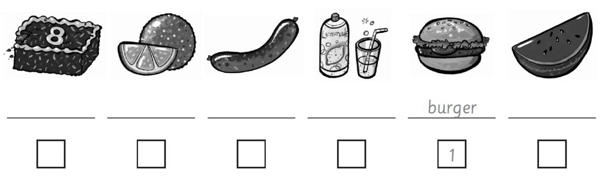
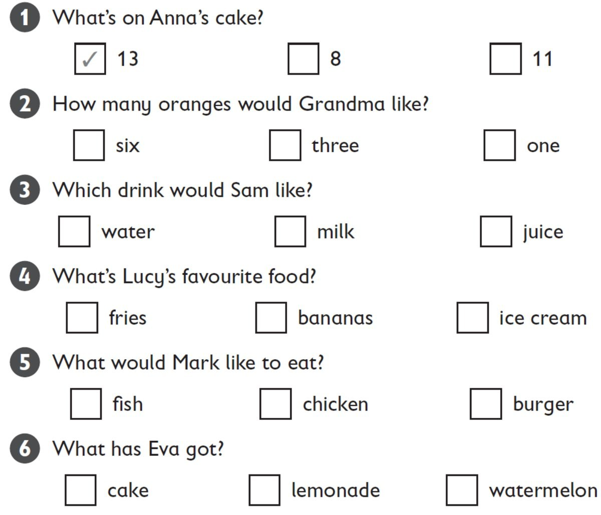
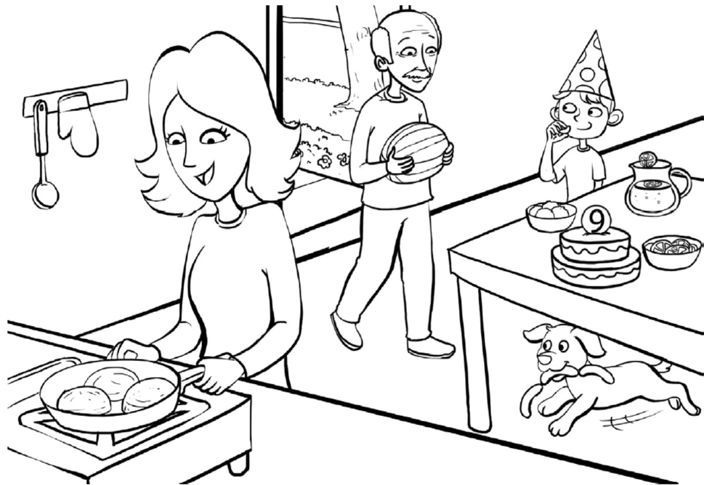

**[Vocabulary]{.underline}**

**1. Listen and number. There is one example.   (one point each)**

**2. Look and draw lines. Write. There are two examples.   (one point
each)**

**3. Put the letters in order. Read and match. Write the number. There
is one example.   (one point each)**

  ------------------------------- --- --------------------------------
  1\. These are red.                  ⬜  (nolemretaw)
                                      \_\_\_\_\_\_\_\_\_\_\_\_\_\_\_

  ------------------------------- --- --------------------------------

  ------------------------------- --- ---------------------------------------------------------
  2\. This is a big green and red     *[1]{.underline}*  (maesttoo)  *[tomatoes]{.underline}*
  fruit.                              

  ------------------------------- --- ---------------------------------------------------------

  ------------------------------- --- --------------------------------
  3\. This is a drink.                ⬜  (cejui)
                                      \_\_\_\_\_\_\_\_\_\_\_\_\_\_\_

  ------------------------------- --- --------------------------------

  ------------------------------- --- --------------------------------
  4\. These are long and orange.      ⬜  (gerbur)
                                      \_\_\_\_\_\_\_\_\_\_\_\_\_\_\_

  ------------------------------- --- --------------------------------

  ------------------------------- --- --------------------------------
  5\. This is meat.                   ⬜  (rarocts)
                                      \_\_\_\_\_\_\_\_\_\_\_\_\_\_\_

  ------------------------------- --- --------------------------------

  ------------------------------- --- --------------------------------
  6\. You can eat these with your     ⬜  (fesir)
  burger.                             \_\_\_\_\_\_\_\_\_\_\_\_\_\_\_

  ------------------------------- --- --------------------------------

**[Grammar]{.underline}**

**4. Read and write the words. There is one example.   (one point
each)**

love \| ~~Would~~ \| have \| Can \| some \| like \| are \| Would \|
thank \| please \| Here

1\. *[Would]{.underline}* you like a sausage?

2\. Yes, I'd \_\_\_\_\_\_\_\_\_\_\_\_\_\_\_ one.

3\. Can I \_\_\_\_\_\_\_\_\_\_\_\_\_\_\_ some lemonade?

4\. \_\_\_\_\_\_\_\_\_\_\_\_\_\_\_ you are.

5\. Would you \_\_\_\_\_\_\_\_\_\_\_\_\_\_\_ some watermelon?

6\. No, \_\_\_\_\_\_\_\_\_\_\_\_\_\_\_ you.

7\. \_\_\_\_\_\_\_\_\_\_\_\_\_\_\_ I have some fries, please?

8\. Yes, here you \_\_\_\_\_\_\_\_\_\_\_\_\_\_\_.

9\. \_\_\_\_\_\_\_\_\_\_\_\_\_\_\_ you like
\_\_\_\_\_\_\_\_\_\_\_\_\_\_\_ cake?

10\. Yes, \_\_\_\_\_\_\_\_\_\_\_\_\_\_\_.

**5. Read and write *one* or *some*. There is one example.   (one point
each)**

1\. Would you like some red and green apples?

    -- Yes, I'd love *[some]{.underline}*.

2\. Would you like some fries with your burger?

    -- Yes, I'd love \_\_\_\_\_\_\_\_\_\_\_.

3\. Would you like an orange?

    -- Yes, I'd love \_\_\_\_\_\_\_\_\_\_\_. It's my favourite fruit!

4\. Would you like a cake?

    -- Yes, I'd love \_\_\_\_\_\_\_\_\_\_\_. It's my birthday!

5\. Would you like some sausages?

    -- Yes, I'd love \_\_\_\_\_\_\_\_\_\_\_. Can I have three?

6\. Would you like some lemonade to drink?

    -- Yes, I'd love \_\_\_\_\_\_\_\_\_\_\_.

**[Listening]{.underline}**

**6. Listen and circle. Put a tick or a cross. Write *Yes, please* or
*No, thank you*. There is one example.   (one point each)**

**7. Listen and tick. There is one example.   (one point each)**

**[Reading]{.underline}**

**8. Look and read the questions. Write one-word answers. There is one
example.   (one point each)**

1\. How many oranges are there?

    *[four]{.underline}*

2\. Where is the lemonade?

    \_\_\_\_\_\_\_\_\_\_\_\_\_\_\_ the table

3\. What has Grandpa got?

    a \_\_\_\_\_\_\_\_\_\_\_\_\_\_\_

4\. What is Mum cooking?

    \_\_\_\_\_\_\_\_\_\_\_\_\_\_\_

5\. What is the dog eating?

    \_\_\_\_\_\_\_\_\_\_\_\_\_\_\_

6\. Where is the number 9?

    on the boy's \_\_\_\_\_\_\_\_\_\_\_\_\_\_\_

