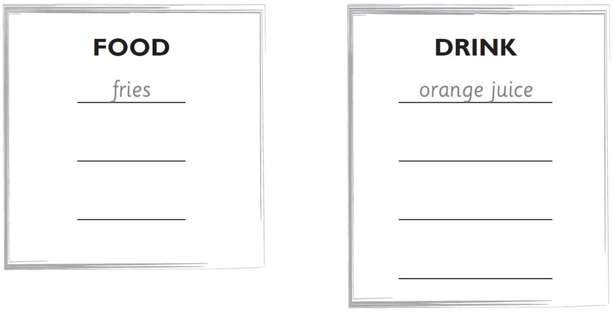

**[Vocabulary]{.underline}**

**1. Listen and number. There is one example.   (one point each)**

*cake -- 2*

*orange -- 6*

*sausage -- 4*

*lemonade -- 3*

*watermelon -- 5*

**2. Look and write. There are two examples.   (one point each)**

salad \| fish \| ~~fries~~ \| lemonade \| milk \| ~~orange juice~~ \|
water

***Food:** fish, salad*

***Drink:** lemonade, milk, water*

**3. Read and match. Write the number. There is one example.   (one
point each)**

  ------------------------------- --- -------------------------------
  1\. \_\_ These are red.             \_\_\_\_ carrots

  ------------------------------- --- -------------------------------

*[tomatoes]{.underline}*

  ------------------------------- --- -------------------------------
  2\. \_\_ This is a big green        \_\_\_\_ a watermelon
  and red fruit.                      

  ------------------------------- --- -------------------------------

*a watermelon*

  ------------------------------- --- -------------------------------
  3\. \_\_ This is a drink.           \_\_\_\_ a burger

  ------------------------------- --- -------------------------------

*juice*

  ------------------------------- --- -------------------------------
  4\. \_\_ These are long and         \_\_\_\_ juice
  orange.                             

  ------------------------------- --- -------------------------------

*carrots*

  ------------------------------- --- -------------------------------
  5\. \_\_ This is meat.              \_\_\_\_ tomatoes

  ------------------------------- --- -------------------------------

*burger*

  ------------------------------- --- -------------------------------
  6\. \_\_ You can eat these with     \_\_\_\_ fries
  your burger.                        

  ------------------------------- --- -------------------------------

*fries*

**[Grammar]{.underline}**

**4. Write the questions and answers. There is one example.   (one point
each)**

1\. sausage? / a / Would / like / you

*[Would you like a sausage?]{.underline}*

2\. I'd / Yes, / one. / love

    \_\_\_\_\_\_\_\_\_\_\_\_\_\_\_\_\_\_\_\_\_\_\_\_\_\_\_\_\_\_\_\_\_\_\_\_\_\_\_\_\_\_\_

*Yes, I'd love one.*

3\. some / Can / lemonade? / have / I

    \_\_\_\_\_\_\_\_\_\_\_\_\_\_\_\_\_\_\_\_\_\_\_\_\_\_\_\_\_\_\_\_\_\_\_\_\_\_\_\_\_\_\_

*Can I have some lemonade?*

4\. are. / you / Here

    \_\_\_\_\_\_\_\_\_\_\_\_\_\_\_\_\_\_\_\_\_\_\_\_\_\_\_\_\_\_\_\_\_\_\_\_\_\_\_\_\_\_\_

*Here you are.*

5\. some / Would / like / watermelon? / you

    \_\_\_\_\_\_\_\_\_\_\_\_\_\_\_\_\_\_\_\_\_\_\_\_\_\_\_\_\_\_\_\_\_\_\_\_\_\_\_\_\_\_\_

*Would you like some watermelon?*

6\. you. / No / thank

    \_\_\_\_\_\_\_\_\_\_\_\_\_\_\_\_\_\_\_\_\_\_\_\_\_\_\_\_\_\_\_\_\_\_\_\_\_\_\_\_\_\_\_

*No thank you.*

**5. Read and circle. There is one example.   (one point each)**

1\. Would you like some apples?

    -- Yes, I'd love *one* / *[some]{.underline}*.

2\. Would you like some fries?

    -- Yes, I'd love *one* / *some*.

*some*

3\. Would you like an orange?

    -- Yes, I'd love *one* / *some*.

*one*

4\. Would you like a cake?

    -- Yes, I'd love *one* / *some*.

*one*

5\. Would you like some sausages?

    -- Yes, I'd love *one* / *some*.

*some*

6\. Would you like some lemonade?

    -- Yes, I'd love *one* / *some*.

*some*

**[Listening]{.underline}**

**6. Listen. Circle *Yes, please* or *No, thank you*. There is one
example.   (one point each)**

*2. Yes, please.*

*3. Yes, please.*

*4. No, thank you.*

*5. Yes, please.*

*6. No, thank you.*

**Audio script**

1

**Woman:** Would you like some burgers?

**Boy:** No, thank you!

2

**Woman:** Would you like some oranges?

**Girl:** Yes, please!

3

**Woman:** Would you like some milk?

**Boy:** Yes, please!

4

**Woman:** Would you like some fries?

**Girl:** No, thank you!

5

**Woman:** Would you like some apples?

**Boy:** Yes, please!

6

**Woman:** Would you like some juice?

**Girl:** No, thank you!

**7. Listen and tick. There is one example.   (one point each)**

*2. three oranges*

*3. milk*

*4. ice cream*

*5. fish*

*6. lemonade*

**Audio script**

1

**Woman:** What a beautiful cake! You're thirteen!

**Girl:** Yes, I am!

2

**Woman:** Good morning, I'd like three oranges, please.

**Man:** Yes, here you are.

3

**Man:** What would you like to drink, Sam? Orange juice or milk?

**Boy:** Um. Milk, please.

\[pause\]

4

**Boy:** What's your favourite food, Lucy?

**Lucy:** Chocolate ice cream!

\[pause\]

5

**Man:** Would you like some fish for dinner, Mark?

**Mark:** Yes, please.

\[pause\]

6

**Boy:** What are you drinking, Eva?

**Eva:** Some lemonade.

**[Reading]{.underline}**

**8. Look and read. Write the answer. There are two extra words. There
is one example.   (one point each)**

burgers \| cake \| ~~four~~ \| fries \| on \| sausages \| under \|
watermelon

1\. How many oranges are there?

    *[four]{.underline}*

2\. Where is the lemonade?

    \_\_\_\_\_\_\_\_\_\_\_\_\_\_\_ the table

*on*

3\. What has Grandpa got?

    a \_\_\_\_\_\_\_\_\_\_\_\_\_\_\_

*watermelon*

4\. What is Mum cooking?

    \_\_\_\_\_\_\_\_\_\_\_\_\_\_\_

*burgers*

5\. What is the dog eating?

    \_\_\_\_\_\_\_\_\_\_\_\_\_\_\_

*sausages*

6\. Where is the number 9?

    on the boy's \_\_\_\_\_\_\_\_\_\_\_\_\_\_\_

*cake*

