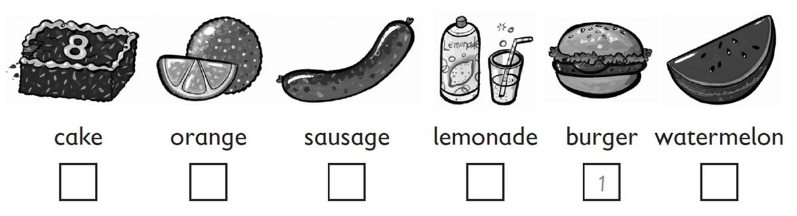
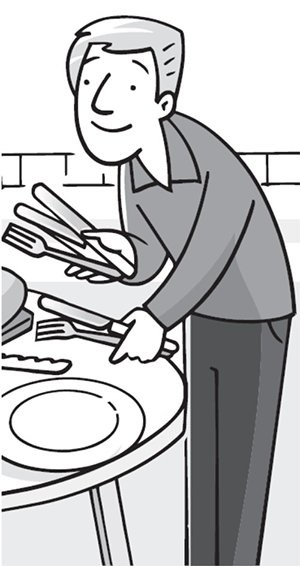
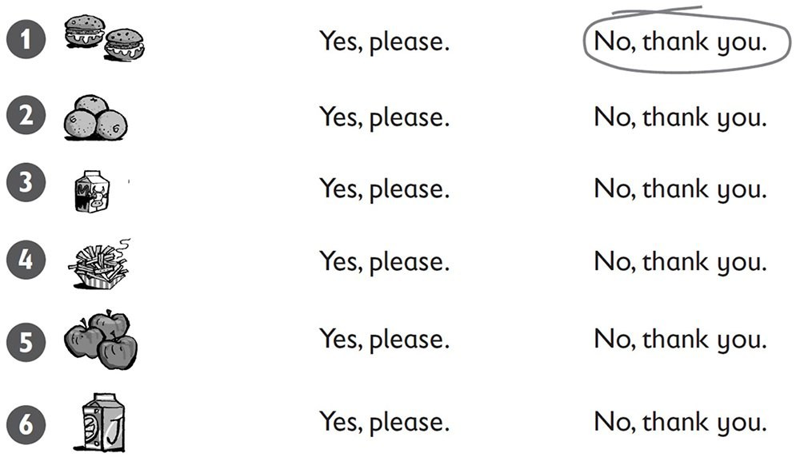
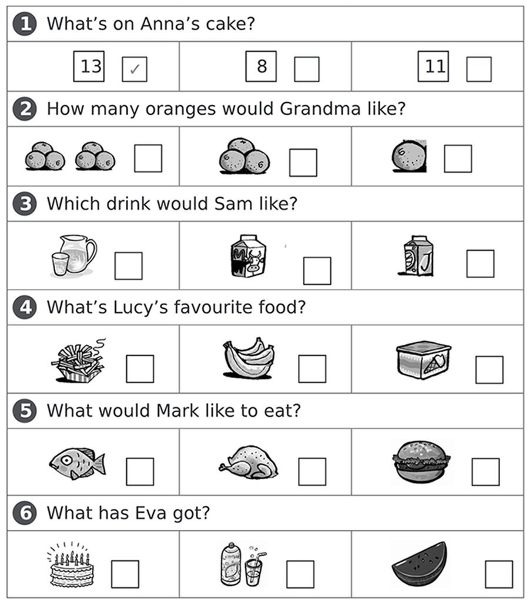

**[Vocabulary]{.underline}**

**1. Listen and number. There is one example.   (one point each)**

**2. Look and write. There are two examples.   (one point each)**

salad \| fish \| ~~fries~~ \| lemonade \| milk \| ~~orange juice~~ \|
water

**3. Read and match. Write the number. There is one example.   (one
point each)**

  ------------------------------- --- -------------------------------
  1\. \_\_ These are red.             \_\_\_\_ tomatoes

  ------------------------------- --- -------------------------------

  ------------------------------- --- -------------------------------
  2\. \_\_ This is a big green        \_\_\_\_ juice
  and red fruit.                      

  ------------------------------- --- -------------------------------

  ------------------------------- --- -------------------------------
  3\. \_\_ This is a drink.           \_\_\_\_ carrots

  ------------------------------- --- -------------------------------

  ------------------------------- --- -------------------------------
  4\. \_\_ These are long and         \_\_\_\_ fries
  orange.                             

  ------------------------------- --- -------------------------------

  ------------------------------- --- -------------------------------
  5\. \_\_ This is meat.              \_\_\_\_ a watermelon

  ------------------------------- --- -------------------------------

  ------------------------------- --- -------------------------------
  6\. \_\_ You can eat these with     \_\_\_\_ a burger
  your burger.                        

  ------------------------------- --- -------------------------------

**[Grammar]{.underline}**

**4. Write the questions and answers. There is one example.   (one point
each)**

1\. sausage? / a / Would / like / you

*[Would you like a sausage?]{.underline}*

2\. I'd / Yes, / one. / love

    \_\_\_\_\_\_\_\_\_\_\_\_\_\_\_\_\_\_\_\_\_\_\_\_\_\_\_\_\_\_\_\_\_\_\_\_\_\_\_\_\_\_\_

3\. some / Can / lemonade? / have / I

    \_\_\_\_\_\_\_\_\_\_\_\_\_\_\_\_\_\_\_\_\_\_\_\_\_\_\_\_\_\_\_\_\_\_\_\_\_\_\_\_\_\_\_

4\. are. / you / Here

    \_\_\_\_\_\_\_\_\_\_\_\_\_\_\_\_\_\_\_\_\_\_\_\_\_\_\_\_\_\_\_\_\_\_\_\_\_\_\_\_\_\_\_

5\. some / Would / like / watermelon? / you

    \_\_\_\_\_\_\_\_\_\_\_\_\_\_\_\_\_\_\_\_\_\_\_\_\_\_\_\_\_\_\_\_\_\_\_\_\_\_\_\_\_\_\_

6\. you. / No / thank

    \_\_\_\_\_\_\_\_\_\_\_\_\_\_\_\_\_\_\_\_\_\_\_\_\_\_\_\_\_\_\_\_\_\_\_\_\_\_\_\_\_\_\_

**5. Read and circle. There is one example.   (one point each)**

1\. Would you like some apples?

    -- Yes, I'd love *one* / *[some]{.underline}*.

2\. Would you like some fries?

    -- Yes, I'd love *one* / *some*.

3\. Would you like an orange?

    -- Yes, I'd love *one* / *some*.

4\. Would you like a cake?

    -- Yes, I'd love *one* / *some*.

5\. Would you like some sausages?

    -- Yes, I'd love *one* / *some*.

6\. Would you like some lemonade?

    -- Yes, I'd love *one* / *some*.

**[Listening]{.underline}**

**6. Listen. Circle *Yes, please* or *No, thank you*. There is one
example.   (one point each)**

**7. Listen and tick. There is one example.   (one point each)**

**[Reading]{.underline}**

**8. Look and read. Write the answer. There are two extra words. There
is one example.   (one point each)**

burgers \| cake \| ~~four~~ \| fries \| on \| sausages \| under \|
watermelon

1\. How many oranges are there?

    *[four]{.underline}*

2\. Where is the lemonade?

    \_\_\_\_\_\_\_\_\_\_\_\_\_\_\_ the table

3\. What has Grandpa got?

    a \_\_\_\_\_\_\_\_\_\_\_\_\_\_\_

4\. What is Mum cooking?

    \_\_\_\_\_\_\_\_\_\_\_\_\_\_\_

5\. What is the dog eating?

    \_\_\_\_\_\_\_\_\_\_\_\_\_\_\_

6\. Where is the number 9?

    on the boy's \_\_\_\_\_\_\_\_\_\_\_\_\_\_\_

