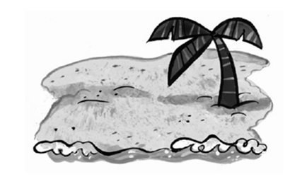
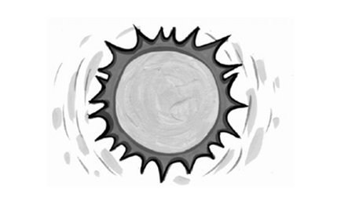
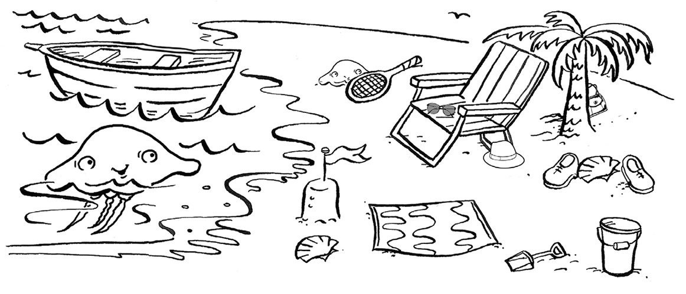
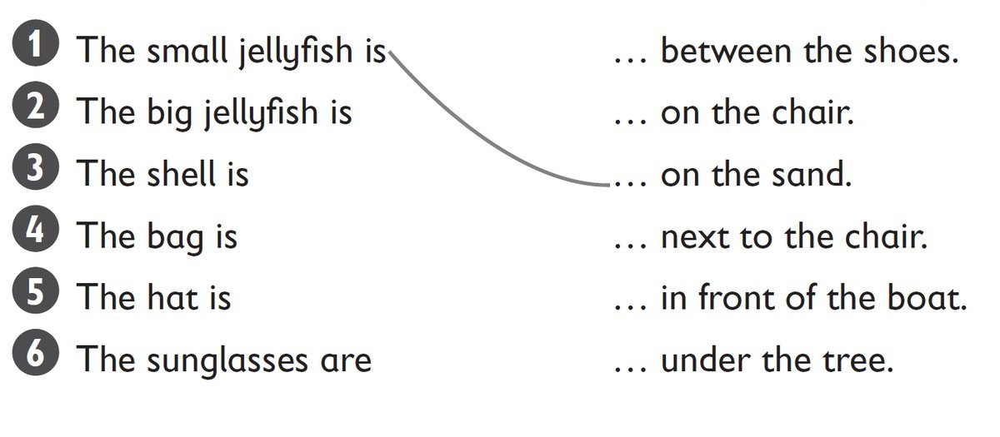

**[Vocabulary]{.underline}**

**1. Write the words. There is one example.   (one point each)**

beach \| jellyfish \| ~~mountains~~ \| sea \| shell \| sun

1\. m*[ountains]{.underline}*

2\. sh\_\_\_\_\_\_\_\_\_\_\_\_

*shell*

3\. s\_\_\_\_\_\_\_\_\_\_\_\_

*sea*

4\. b\_\_\_\_\_\_\_\_\_\_\_\_

*beach*

5\. s\_\_\_\_\_\_\_\_\_\_\_\_

*sun*

6\. j\_\_\_\_\_\_\_\_\_\_\_\_

*jellyfish*

**2. Look and match. There is one example.   (one point each)**

*2. in front of the boat*

*3. between the shoes*

*4. under the tree*

*5. next to the chair*

*6. on the chair*

**3. Look and read. Write the name. There is one example.   (one point
each)**

Dad \| ~~Mum~~ \| Mum \| Simon \| Stella \| Suzy \| Suzy

1\. *[Mum]{.underline}* is reading a book.

2\. *Suzy* is picking up shells.

3\. *Simon* is swimming.

4\. *Stella* and are wearing hats.

5\. *Dad* is walking on the beach.

6\. *Mum* is wearing sunglasses.

**[Grammar]{.underline}**

**4. Look and read. Write the number. There is one example.   (one point
each)**

*2. e*

*3. f*

*4. b*

*5. a*

*6. c*

**5. Look and read. Circle *does* or *doesn't*. There is one
example.   (one point each)**

1\. Does Sally want a big school bag?

    Yes, she *[does]{.underline}* / *doesn't*.

2\. Does Sally want black shoes?

    No, she *does* / *doesn't*.

*doesn't*

3\. Does Peter want a football shirt?

    No, he *does* / *doesn't*.

*doesn't*

4\. Does Peter want a new skateboard?

    Yes, he *does* / *doesn't*.

*does*

5\. Does Sally want cool sunglasses?

    Yes, she *does* / *doesn't*.

*does*

6\. Does Peter want a red bike?

    No, he *does* / *doesn't*.

*doesn't*

**[Listening]{.underline}**

**6. Listen and draw lines. There is one example.   (one point each)**

*1. shell*

*2. city -- café*

*3. mountain -- bird*

**Audio script**

**1**

**Girl:** Let's go to the beach. I love picking up shells!

**2**

**Boy:** Let's go to the city. I like sitting in cafés!

**3**

**Girl:** Let's go to the mountains. I like looking at the birds.

**7. Listen and tick. There is one example.   (one point each)**

*2. park*

*3. picnic*

*4. cakes*

*5. Grandma*

*6. dress*

**Audio script**

**1**

**Mum:** It's your birthday today, Zoe.

**What** do you want to do?

**Zoe:** I want to see my friends.

**2**

**Mum:** Where do you want to go?

**Zoe:** I want to go to the park.

**3**

**Mum:** What do you want to do in the park?

**Zoe:** I want to have a picnic.

**4**

**Mum:** What do you want to eat?

**Zoe:** I want to eat cakes.

**5**

**Mum:** Do you want to see Grandma today?

**Zoe:** Yes, I do!

**6**

**Mum:** And what do you want for your birthday?

**Zoe:** I want a red dress!

**[Reading]{.underline}**

**8. Read and write the name. There is one example.   (one point each)**

sister \| Dad \| Fred \| Grandma \| Grandpa \| ~~Mum~~

  ------------------------------- --- -----------------------------------
  1\. She's walking on the beach.     *[Mum]{.underline}*

  ------------------------------- --- -----------------------------------

  ------------------------------- --- -----------------------------------
  2\. He's fishing.                   *Grandpa*

  ------------------------------- --- -----------------------------------

  ------------------------------- --- -----------------------------------
  3\. He's jumping in the sea.        *Dad*

  ------------------------------- --- -----------------------------------

  ------------------------------- --- -----------------------------------
  4\. She's playing with shells.      *sister*

  ------------------------------- --- -----------------------------------

  ------------------------------- --- -----------------------------------
  5\. He's cleaning the beach.        *Fred*

  ------------------------------- --- -----------------------------------

  ------------------------------- --- -----------------------------------
  6\. She's sleeping.                 *Grandma*

  ------------------------------- --- -----------------------------------

