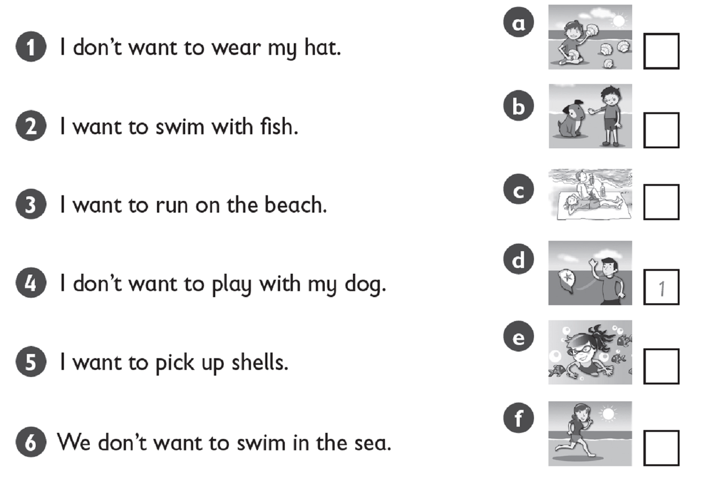
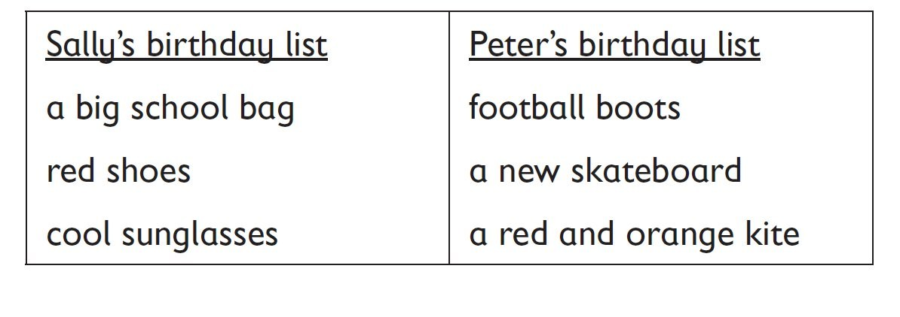
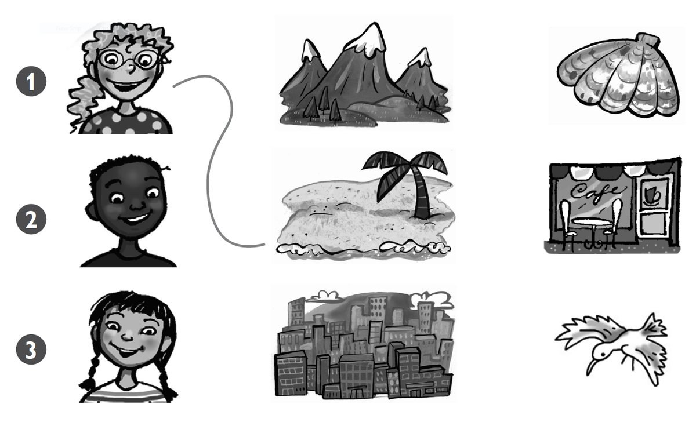
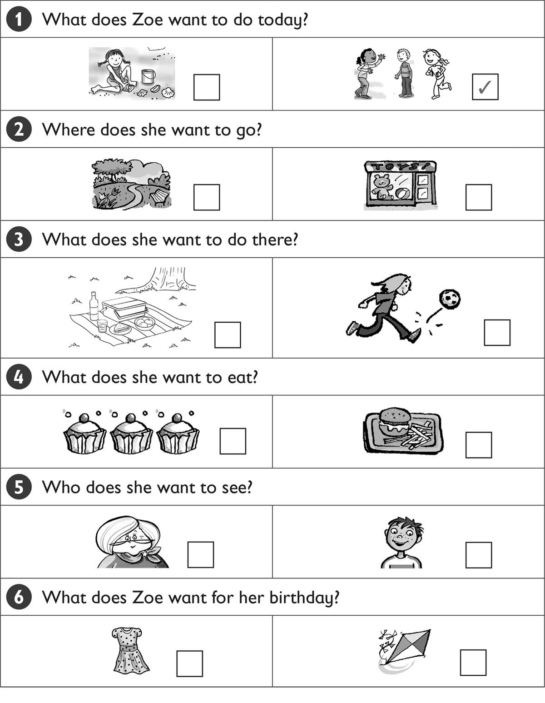
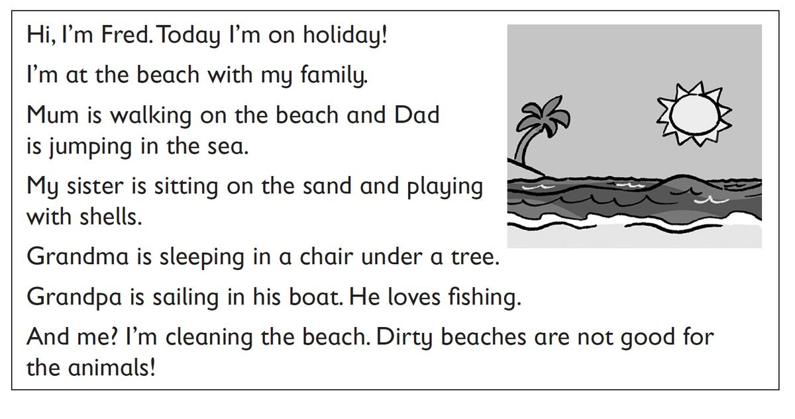

**[Vocabulary]{.underline}**

**1. Write the words. There is one example.   (one point each)**

beach \| jellyfish \| ~~mountains~~ \| sea \| shell \| sun

1\. m*[ountains]{.underline}*

2\. sh\_\_\_\_\_\_\_\_\_\_\_\_

3\. s\_\_\_\_\_\_\_\_\_\_\_\_

4\. b\_\_\_\_\_\_\_\_\_\_\_\_

5\. s\_\_\_\_\_\_\_\_\_\_\_\_

6\. j\_\_\_\_\_\_\_\_\_\_\_\_

**2. Look and match. There is one example.   (one point each)**

**3. Look and read. Write the name. There is one example.   (one point
each)**

Dad \| ~~Mum~~ \| Mum \| Simon \| Stella \| Suzy \| Suzy

1\. *[Mum]{.underline}* is reading a book.

2\. \_\_\_\_\_\_\_\_\_\_\_\_\_ is picking up shells.

3\. \_\_\_\_\_\_\_\_\_\_\_\_\_ is swimming.

4\. \_\_\_\_\_\_\_\_\_\_\_\_\_ and \_\_\_\_\_\_\_\_\_\_\_\_\_ are
wearing hats.

5\. \_\_\_\_\_\_\_\_\_\_\_\_\_ is walking on the beach.

6\. \_\_\_\_\_\_\_\_\_\_\_\_\_ is wearing sunglasses.

**[Grammar]{.underline}**

**4. Look and read. Write the number. There is one example.   (one point
each)**

**5. Look and read. Circle *does* or *doesn't*. There is one
example.   (one point each)**

1\. Does Sally want a big school bag?

    Yes, she *[does]{.underline}* / *doesn't*.

2\. Does Sally want black shoes?

    No, she *does* / *doesn't*.

3\. Does Peter want a football shirt?

    No, he *does* / *doesn't*.

4\. Does Peter want a new skateboard?

    Yes, he *does* / *doesn't*.

5\. Does Sally want cool sunglasses?

    Yes, she *does* / *doesn't*.

6\. Does Peter want a red bike?

    No, he *does* / *doesn't*.

**[Listening]{.underline}**

**6. Listen and draw lines. There is one example.   (one point each)**

**7. Listen and tick. There is one example.   (one point each)**

**[Reading]{.underline}**

**8. Read and write the name. There is one example.   (one point each)**

sister \| Dad \| Fred \| Grandma \| Grandpa \| ~~Mum~~

  ------------------------------- --- -----------------------------------
  1\. She's walking on the beach.     *[Mum]{.underline}*

  ------------------------------- --- -----------------------------------

  ------------------------------- --- -----------------------------------
  2\. He's fishing.                   \_\_\_\_\_\_\_\_\_\_\_\_

  ------------------------------- --- -----------------------------------

  ------------------------------- --- -----------------------------------
  3\. He's jumping in the sea.        \_\_\_\_\_\_\_\_\_\_\_\_

  ------------------------------- --- -----------------------------------

  ------------------------------- --- -----------------------------------
  4\. She's playing with shells.      \_\_\_\_\_\_\_\_\_\_\_\_

  ------------------------------- --- -----------------------------------

  ------------------------------- --- -----------------------------------
  5\. He's cleaning the beach.        \_\_\_\_\_\_\_\_\_\_\_\_

  ------------------------------- --- -----------------------------------

  ------------------------------- --- -----------------------------------
  6\. She's sleeping.                 \_\_\_\_\_\_\_\_\_\_\_\_

  ------------------------------- --- -----------------------------------

