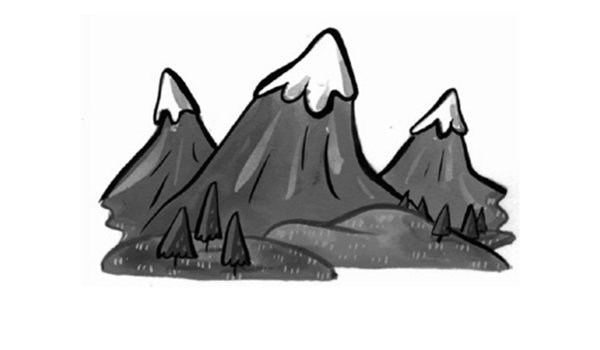
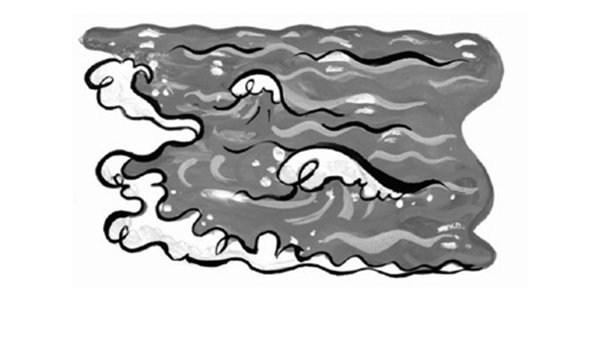
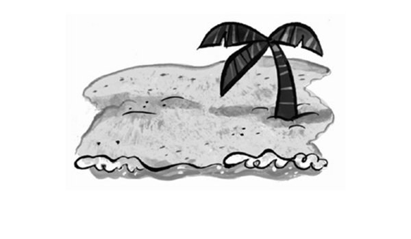
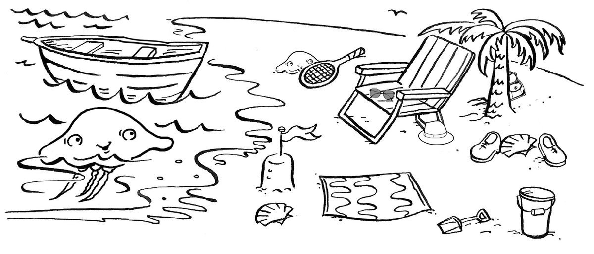
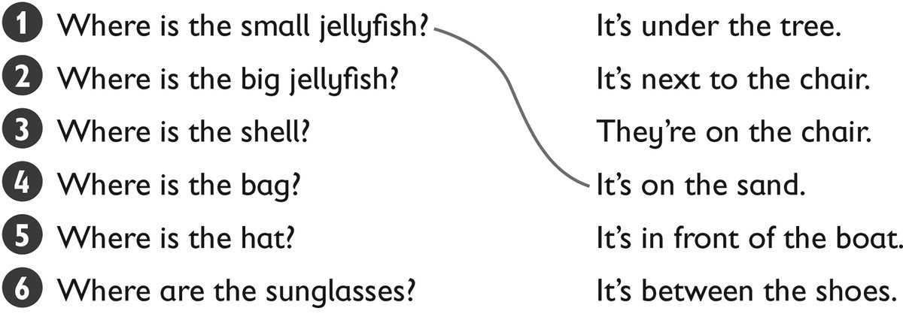
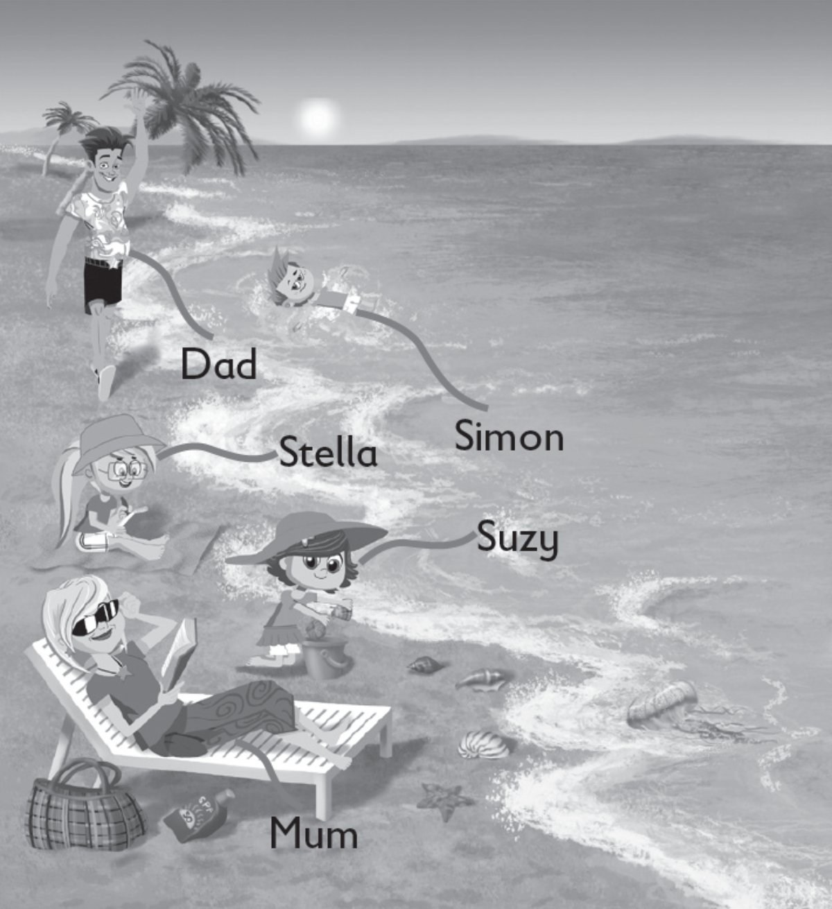
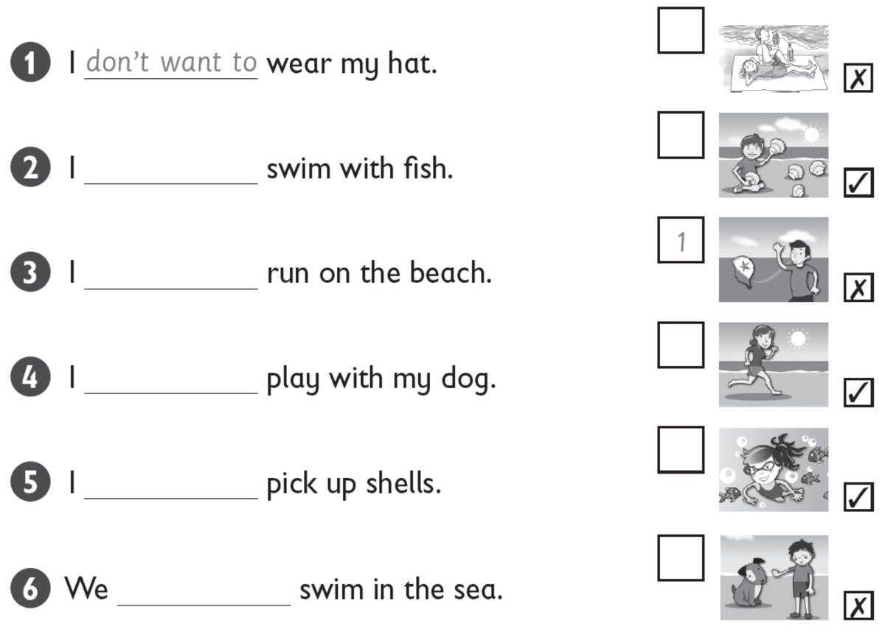
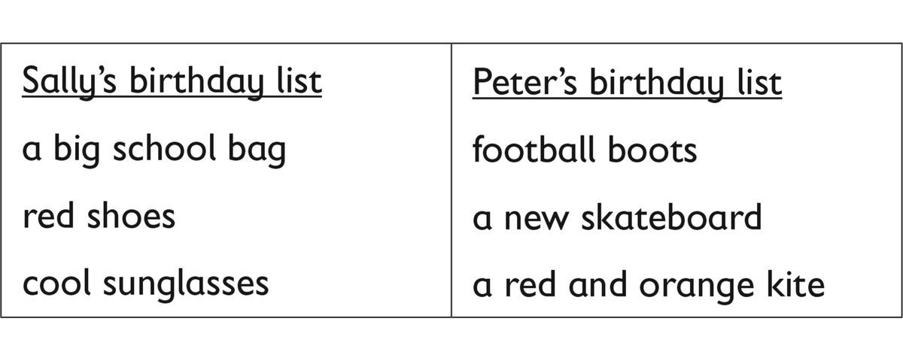

**[Vocabulary]{.underline}**

**1. Write the words. There is one example.   (one point each)**

  ---------------------------------------------------------------------------------------------------------------------------------------------------------------------------------------------------------------------- -- ------------------------------------------------------------------------------------------------------------------------------------------------------------------------------------------------------------------- -- -------------------------------------------------------------------------------------------------------------------------------------------------------------------------------------------------------------------
   1.            
  I'm walking in the *[mountains]{.underline}*.                                                                                                                                                                             2. I'm looking at a *shell*.                                                                                                                                                                                           3. I'm swimming in the *sea*.

  ---------------------------------------------------------------------------------------------------------------------------------------------------------------------------------------------------------------------- -- ------------------------------------------------------------------------------------------------------------------------------------------------------------------------------------------------------------------- -- -------------------------------------------------------------------------------------------------------------------------------------------------------------------------------------------------------------------

  ------------------------------------------------------------------------------------------------------------------------------------------------------------------------------------------------------------------- -- ------------------------------------------------------------------------------------------------------------------------------------------------------------------------------------------------------------------- -- -------------------------------------------------------------------------------------------------------------------------------------------------------------------------------------------------------------------
              
  4. I'm sitting on the *beach*.                                                                                                                                                                                         5. I'm reading in the *sun*.                                                                                                                                                                                           6. I'm watching the *jellyfish*.

  ------------------------------------------------------------------------------------------------------------------------------------------------------------------------------------------------------------------- -- ------------------------------------------------------------------------------------------------------------------------------------------------------------------------------------------------------------------- -- -------------------------------------------------------------------------------------------------------------------------------------------------------------------------------------------------------------------

**2. Look and read. Draw lines. There is one example.   (one point
each)**

*2. It's in front of the boat*

*3. It's between the shoes*

*4. It's under the tree*

*5. It's next to the chair*

*6. They're on the chair*

**3. Look and read. Write *yes* or *no*. There is one example.   (one
point each)**

  ------------------------------- --- -----------------------------------
  1\. Mum is sleeping.                *no*

  ------------------------------- --- -----------------------------------

  ------------------------------- --- -----------------------------------
  2\. Suzy is picking up a            *no*
  jellyfish.                          

  ------------------------------- --- -----------------------------------

  ------------------------------- --- -----------------------------------
  3\. Simon is swimming in the        *yes*
  sea.                                

  ------------------------------- --- -----------------------------------

  ------------------------------- --- -----------------------------------
  4\. Stella is wearing               *no*
  sunglasses.                         

  ------------------------------- --- -----------------------------------

  ------------------------------- --- -----------------------------------
  5\. Dad is walking on the sand.     *yes*

  ------------------------------- --- -----------------------------------

  ------------------------------- --- -----------------------------------
  6\. Mum and Dad are wearing         *no*
  hats.                               

  ------------------------------- --- -----------------------------------

**[Grammar]{.underline}**

**4. Look and write *I want to* / *I don't want to*. Match and write the
number. There is one example.   (one point each)**

*2. want to (swim with fish)*

*3. want to (run on beach)*

*4. don't want to (play with dog)*

*5. want to (pick up shells)*

*6. don't want to (swim in sea)*

**5. Look, read and choose the words. Then write. There is one
example.   (one point each)**

does \| doesn't \| he \| No \| she \| Yes

  ------------------------------- --- -----------------------------------
  1\. Does Sally want a big           *[Yes]{.underline},
  school bag?                         [she]{.underline}
                                      [does]{.underline}*

  ------------------------------- --- -----------------------------------

  ------------------------------- --- -----------------------------------
  2\. Does Sally want black           *No, she doesn't.*
  shoes?                              

  ------------------------------- --- -----------------------------------

  ------------------------------- --- -----------------------------------
  3\. Does Peter want a football      *No, he doesn't.*
  shirt?                              

  ------------------------------- --- -----------------------------------

  ------------------------------- --- -----------------------------------
  4\. Does Peter want a new           *Yes, he does.*
  skateboard?                         

  ------------------------------- --- -----------------------------------

  ------------------------------- --- -----------------------------------
  5\. Does Sally want cool            *Yes, she does.*
  sunglasses?                         

  ------------------------------- --- -----------------------------------

  ------------------------------- --- -----------------------------------
  6\. Does Peter want a red bike?     *No, he doesn't.*

  ------------------------------- --- -----------------------------------

**[Listening]{.underline}**

**6. Listen and draw lines. There is one example.   (one point each)**

*1. shell*

*2. city -- café*

*3. mountain -- bird*

**Audio script**

1

**Girl:** Let's go to the beach. I love picking up shells!

2

**Boy:** Let's go to the city. I like sitting in cafés!

3

**Girl:** Let's go to the mountains. I like looking at the birds.

**7. Listen and tick. There is one example.   (one point each)**

1\. What does Zoe want to do today?

    ⬜  swim          ✓  see friends

2\. Where does she want to go?

    ⬜  the park          ⬜  the toy shop

3\. What does she want to do there?

    ⬜  play football          ⬜  have a picnic

4\. What does she want to eat?

    ⬜  fruit          ⬜  cakes

5\. Who does she want to see?

    ⬜  her grandma          ⬜  her baby brother

6\. What does Zoe want for her birthday?

    ⬜  a red kite          ⬜  a red dress

*2. the park*

*3. have a picnic*

*4. cakes*

*5. her grandma*

*6. a red dress*

**Audio script**

1

**Mum:** It's your birthday today, Zoe.

What do you want to do?

**Zoe:** I want to see my friends.

2

**Mum:** Where do you want to go?

**Zoe:** I want to go to the park.

3

**Mum:** What do you want to do in the park?

**Zoe:** I want to have a picnic.

4

**Mum:** What do you want to eat?

**Zoe:** I want to eat cakes.

5

**Mum:** Do you want to see grandma today?

**Zoe:** Yes, I do!

6

**Mum:** And what do you want for your birthday?

**Zoe:** I want a red dress!

**8. Read and write the answers. There is one example.   (one point
each)**

1\. Who is walking on the beach?

    *[Mum]{.underline}*

2\. What is Dad doing?

     \_\_\_\_\_\_\_\_\_\_\_\_\_\_\_ in the sea

*jumping*

3\. What is Suzy playing with?

     \_\_\_\_\_\_\_\_\_\_\_\_\_\_\_

*shells*

4\. Where is Grandpa?

    in his \_\_\_\_\_\_\_\_\_\_\_\_\_\_\_

*boat*

5\. Where is Grandma sleeping?

    under a \_\_\_\_\_\_\_\_\_\_\_\_\_\_\_

*tree*

6\. What is Fred cleaning?

    the \_\_\_\_\_\_\_\_\_\_\_\_\_\_\_

*beach*

