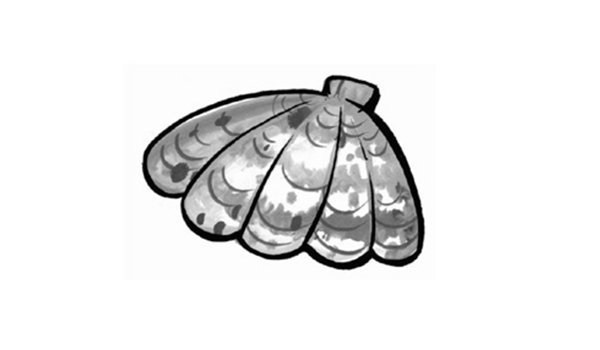
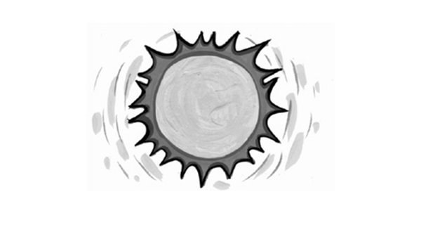
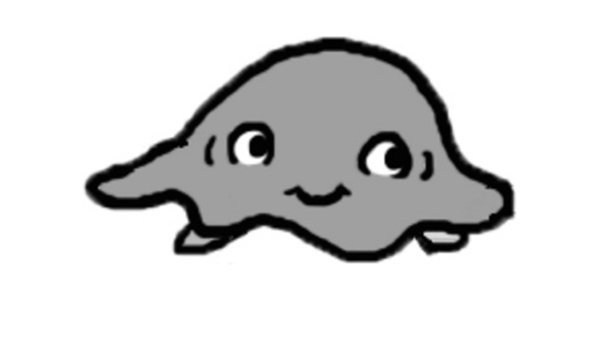
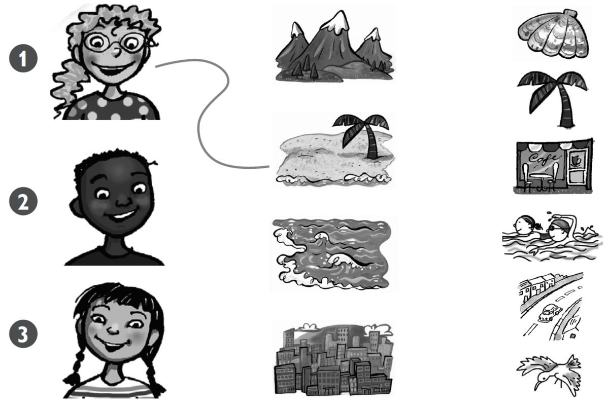

**[Vocabulary]{.underline}**

**1. Write the words. There is one example.   (one point each)**

  ------------------------------------------------------------------------------------------------------------------------------------------------------------------------------------------------------------------------- -- ---------------------------------------------------------------------------------------------------------------------------------------------------------------------------------------------------------------------- -- ----------------------------------------------------------------------------------------------------------------------------------------------------------------------------------------------------------------------
   1.            
  I'm walking in the *[mountains]{.underline}*.                                                                                                                                                                                2. I'm looking at a \_\_\_\_\_\_\_\_\_.                                                                                                                                                                                   3. I'm swimming in the \_\_\_\_\_\_\_\_\_.

  ------------------------------------------------------------------------------------------------------------------------------------------------------------------------------------------------------------------------- -- ---------------------------------------------------------------------------------------------------------------------------------------------------------------------------------------------------------------------- -- ----------------------------------------------------------------------------------------------------------------------------------------------------------------------------------------------------------------------

  ---------------------------------------------------------------------------------------------------------------------------------------------------------------------------------------------------------------------- -- ---------------------------------------------------------------------------------------------------------------------------------------------------------------------------------------------------------------------- -- ----------------------------------------------------------------------------------------------------------------------------------------------------------------------------------------------------------------------
              
  4. I'm sitting on the \_\_\_\_\_\_\_\_\_.                                                                                                                                                                                 5. I'm reading in the \_\_\_\_\_\_\_\_\_.                                                                                                                                                                                 6. I'm watching the \_\_\_\_\_\_\_\_\_.

  ---------------------------------------------------------------------------------------------------------------------------------------------------------------------------------------------------------------------- -- ---------------------------------------------------------------------------------------------------------------------------------------------------------------------------------------------------------------------- -- ----------------------------------------------------------------------------------------------------------------------------------------------------------------------------------------------------------------------

**2. Look and read. Draw lines. There is one example.   (one point
each)**

**3. Look and read. Write *yes* or *no*. There is one example.   (one
point each)**

  ------------------------------- --- -----------------------------------
  1\. Mum is sleeping.                no

  ------------------------------- --- -----------------------------------

  ------------------------------- --- -----------------------------------
  2\. Suzy is picking up a            \_\_\_\_\_\_\_\_\_\_\_\_\_\_\_
  jellyfish.                          

  ------------------------------- --- -----------------------------------

  ------------------------------- --- -----------------------------------
  3\. Simon is swimming in the        \_\_\_\_\_\_\_\_\_\_\_\_\_\_\_
  sea.                                

  ------------------------------- --- -----------------------------------

  ------------------------------- --- -----------------------------------
  4\. Stella is wearing               \_\_\_\_\_\_\_\_\_\_\_\_\_\_\_
  sunglasses.                         

  ------------------------------- --- -----------------------------------

  ------------------------------- --- -----------------------------------
  5\. Dad is walking on the sand.     \_\_\_\_\_\_\_\_\_\_\_\_\_\_\_

  ------------------------------- --- -----------------------------------

  ------------------------------- --- -----------------------------------
  6\. Mum and Dad are wearing         \_\_\_\_\_\_\_\_\_\_\_\_\_\_\_
  hats.                               

  ------------------------------- --- -----------------------------------

**[Grammar]{.underline}**

**4. Look and write *I want to* / *I don't want to*. Match and write the
number. There is one example.   (one point each)**

**5. Look, read and choose the words. Then write. There is one
example.   (one point each)**

does \| doesn't \| he \| No \| she \| Yes

  ------------------------------- --- -----------------------------------
  1\. Does Sally want a big           *[Yes]{.underline}*,
  school bag?                         *[she]{.underline}*
                                      *[does]{.underline}*

  ------------------------------- --- -----------------------------------

  ------------------------------- --- -----------------------------------
  2\. Does Sally want black           \_\_\_\_\_\_\_\_\_\_\_\_,
  shoes?                              \_\_\_\_\_\_\_\_\_\_\_\_.

  ------------------------------- --- -----------------------------------

  ------------------------------- --- -----------------------------------
  3\. Does Peter want a football      \_\_\_\_\_\_\_\_\_\_\_\_,
  shirt?                              \_\_\_\_\_\_\_\_\_\_\_\_.

  ------------------------------- --- -----------------------------------

  ------------------------------- --- -----------------------------------
  4\. Does Peter want a new           \_\_\_\_\_\_\_\_\_\_\_\_,
  skateboard?                         \_\_\_\_\_\_\_\_\_\_\_\_.

  ------------------------------- --- -----------------------------------

  ------------------------------- --- -----------------------------------
  5\. Does Sally want cool            \_\_\_\_\_\_\_\_\_\_\_\_,
  sunglasses?                         \_\_\_\_\_\_\_\_\_\_\_\_.

  ------------------------------- --- -----------------------------------

  ------------------------------- --- -----------------------------------
  6\. Does Peter want a red bike?     \_\_\_\_\_\_\_\_\_\_\_\_,
                                      \_\_\_\_\_\_\_\_\_\_\_\_.

  ------------------------------- --- -----------------------------------

**[Listening]{.underline}**

**6. Listen and draw lines. There is one example.   (one point each)**

**7. Listen and tick. There is one example.   (one point each)**

1\. What does Zoe want to do today?

    ⬜  swim          ✓  see friends

2\. Where does she want to go?

    ⬜  the park          ⬜  the toy shop

3\. What does she want to do there?

    ⬜  play football          ⬜  have a picnic

4\. What does she want to eat?

    ⬜  fruit          ⬜  cakes

5\. Who does she want to see?

    ⬜  her grandma          ⬜  her baby brother

6\. What does Zoe want for her birthday?

    ⬜  a red kite          ⬜  a red dress

**8. Read and write the answers. There is one example.   (one point
each)**

1\. Who is walking on the beach?

    *[Mum]{.underline}*

2\. What is Dad doing?

     \_\_\_\_\_\_\_\_\_\_\_\_\_\_\_ in the sea

3\. What is Suzy playing with?

     \_\_\_\_\_\_\_\_\_\_\_\_\_\_\_

4\. Where is Grandpa?

    in his \_\_\_\_\_\_\_\_\_\_\_\_\_\_\_

5\. Where is Grandma sleeping?

    under a \_\_\_\_\_\_\_\_\_\_\_\_\_\_\_

6\. What is Fred cleaning?

    the \_\_\_\_\_\_\_\_\_\_\_\_\_\_\_

