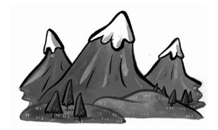
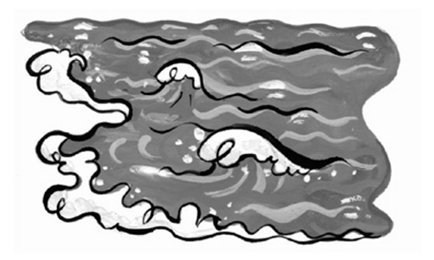
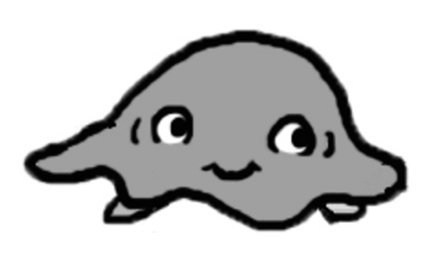
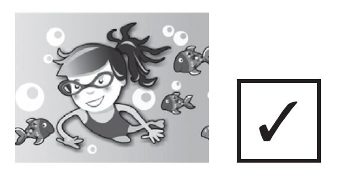
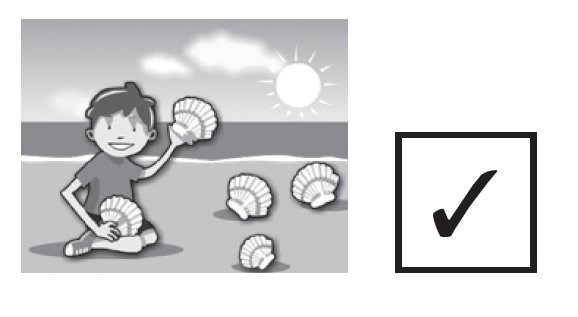
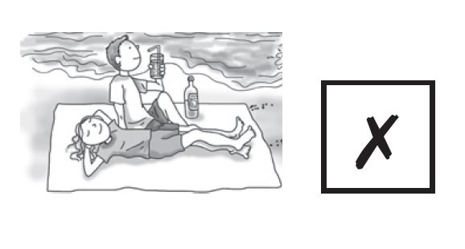
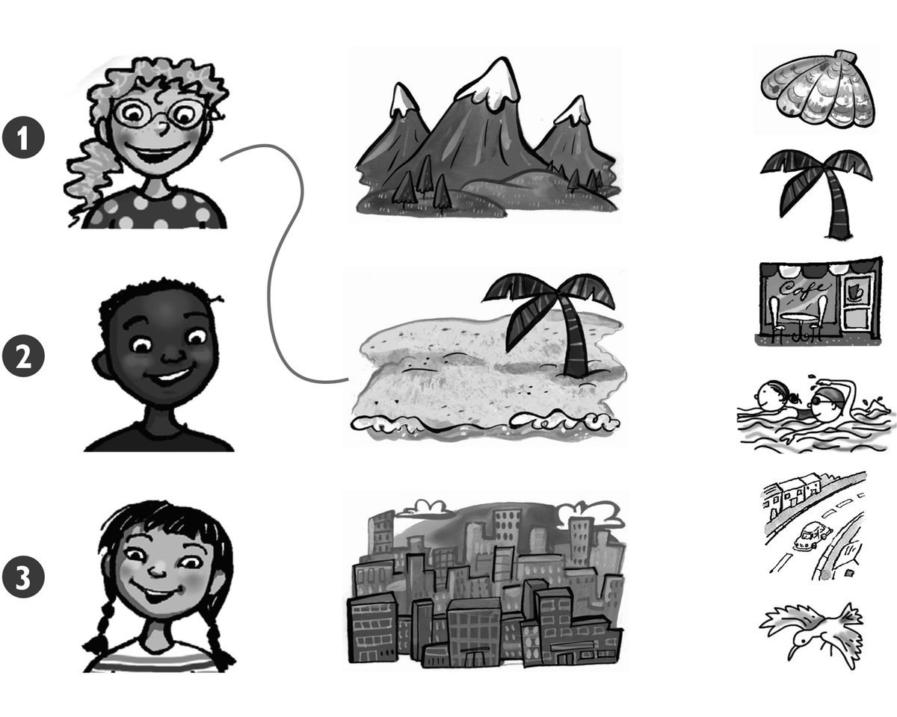
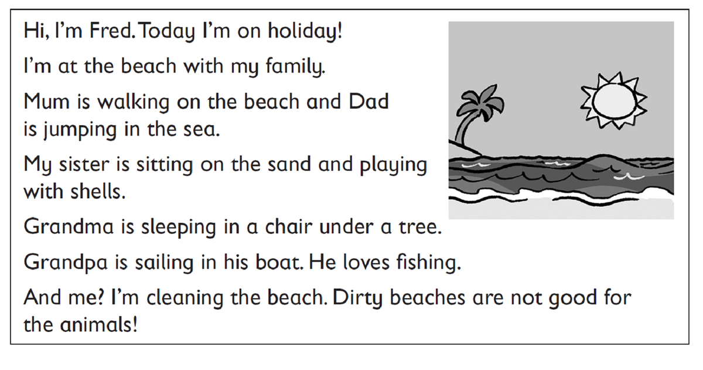

**[Vocabulary]{.underline}**

**1. Complete the words. There is one example.   (one point each)**

1\. m *[o]{.underline}* *[u]{.underline}* *[n]{.underline}* ta
*[i]{.underline}* *[n]{.underline}*

2\. \_\_h\_\_l\_\_

*shell*

3\. s\_\_ \_\_

*sea*

4\. \_\_ \_\_ a \_\_ h

*beach*

5\. \_\_ \_\_ n

*sun*

6\. j \_\_ llyf \_\_ sh

*jellyfish*

**2. Look and read. Write *yes* or *no*. There is one example.   (one
point each)**

  ------------------------------- --- -----------------------------------
  1\. The small jellyfish is on       *[yes]{.underline}*
  the sand.                           

  ------------------------------- --- -----------------------------------

  ------------------------------- --- -----------------------------------
  2\. The big jellyfish is behind     *no*
  the boat.                           

  ------------------------------- --- -----------------------------------

  ------------------------------- --- -----------------------------------
  3\. The shell is between the        *yes*
  shoes.                              

  ------------------------------- --- -----------------------------------

  ------------------------------- --- -----------------------------------
  4\. The bag is under the chair.     *no*

  ------------------------------- --- -----------------------------------

  ------------------------------- --- -----------------------------------
  5\. The hat is on the tree.         *no*

  ------------------------------- --- -----------------------------------

  ------------------------------- --- -----------------------------------
  6\. The sunglasses are on the       *yes*
  chair.                              

  ------------------------------- --- -----------------------------------

**3. Look and read. Draw lines. There is one example.    (one point
each)**

*2. shells*

*3. in the sea*

*4. a hat*

*5. on the beach*

*6. sunglasses*

**[Grammar]{.underline}**

**4. Look and read. Write *I want to* / *I don't want to*. There is one
example. (Unit 12 Standard)**

1\. I *[don't want to]{.underline}* wear my hat.

2\. I \_\_\_\_\_\_\_\_\_\_\_\_ swim with fish.

*want to*

3\. I \_\_\_\_\_\_\_\_\_\_\_\_ run on the beach.

*want to*

4\. I \_\_\_\_\_\_\_\_\_\_\_\_ play with my dog.

*don't want to*

5\. I \_\_\_\_\_\_\_\_\_\_\_\_ pick up shells.

*want to*

6\. We \_\_\_\_\_\_\_\_\_\_\_\_ to swim in the sea.

*don't want to*

**5. Look, read and circle. There is one example.   (one point each)**

1\. Does Sally want a big school bag?

    *[Yes, she does.]{.underline}* / *No, she doesn't.*

2\. Does Sally want black shoes?

    *Yes, she does.* / *No, she doesn't.*

*No, she doesn't*

3\. Does Peter want a football shirt?

    *Yes, he does.* / *No, he doesn't.*

*No, he doesn't*

4\. Does Peter want a new skateboard?

    *Yes, he does.* / *No, he doesn't.*

*Yes, he does*

5\. Does Sally want cool sunglasses?

    *Yes, she does.* / *No, she doesn't.*

*Yes, she does*

6\. Does Peter want a red bike?

    *Yes, he does.* / *No, he doesn't.*

*No, he doesn't*

**[Listening]{.underline}**

**6. Listen and draw lines. There is one example.   (one point each)**

*1. shell*

*2. city -- café*

*3. mountain -- bird*

**Audio script**

**1**

**Girl:** Let's go to the beach. I love picking up shells!

**2**

**Boy:** Let's go to the city. I like sitting in cafés!

**3**

**Girl:** Let's go to the mountains. I like looking at the birds.

**7. Listen and tick. There is one example.   (one point each)**

*2. park*

*3. picnic*

*4. cakes*

*5. Grandma*

*6. dress*

**Audio script**

**1**

**Mum:** It's your birthday today, Zoe.

**What** do you want to do?

**Zoe:** I want to see my friends.

**2**

**Mum:** Where do you want to go?

**Zoe:** I want to go to the park.

**3**

**Mum:** What do you want to do in the park?

**Zoe:** I want to have a picnic.

**4**

**Mum:** What do you want to eat?

**Zoe:** I want to eat cakes.

**5**

**Mum:** Do you want to see Grandma today?

**Zoe:** Yes, I do!

**6**

**Mum:** And what do you want for your birthday?

**Zoe:** I want a red dress!

**[Reading]{.underline}**

**8. Read and write the name. There is one example.   (one point each)**

  ------------------------------- --- -----------------------------------
  1\. Who is walking on the           *[Mum]{.underline}*
  beach?                              

  ------------------------------- --- -----------------------------------

  ------------------------------- --- -----------------------------------
  2\. Who is fishing?                 *Grandpa*

  ------------------------------- --- -----------------------------------

  ------------------------------- --- -----------------------------------
  3\. Who is jumping in the sea?      *Dad*

  ------------------------------- --- -----------------------------------

  ------------------------------- --- -----------------------------------
  4\. Who is playing with shells?     *sister*

  ------------------------------- --- -----------------------------------

  ------------------------------- --- -----------------------------------
  5\. Who is cleaning the beach?      *Fred*

  ------------------------------- --- -----------------------------------

  ------------------------------- --- -----------------------------------
  6\. Who is sleeping under a         *Grandma*
  tree?                               

  ------------------------------- --- -----------------------------------

