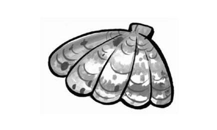
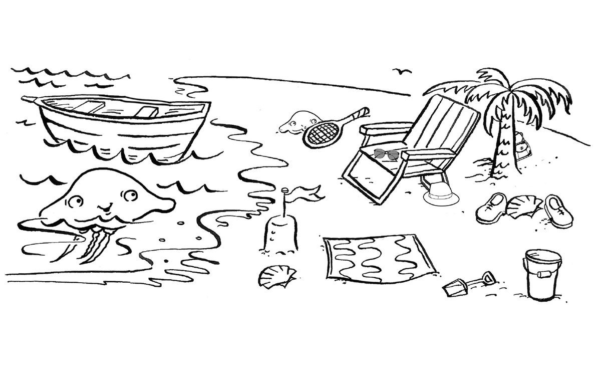
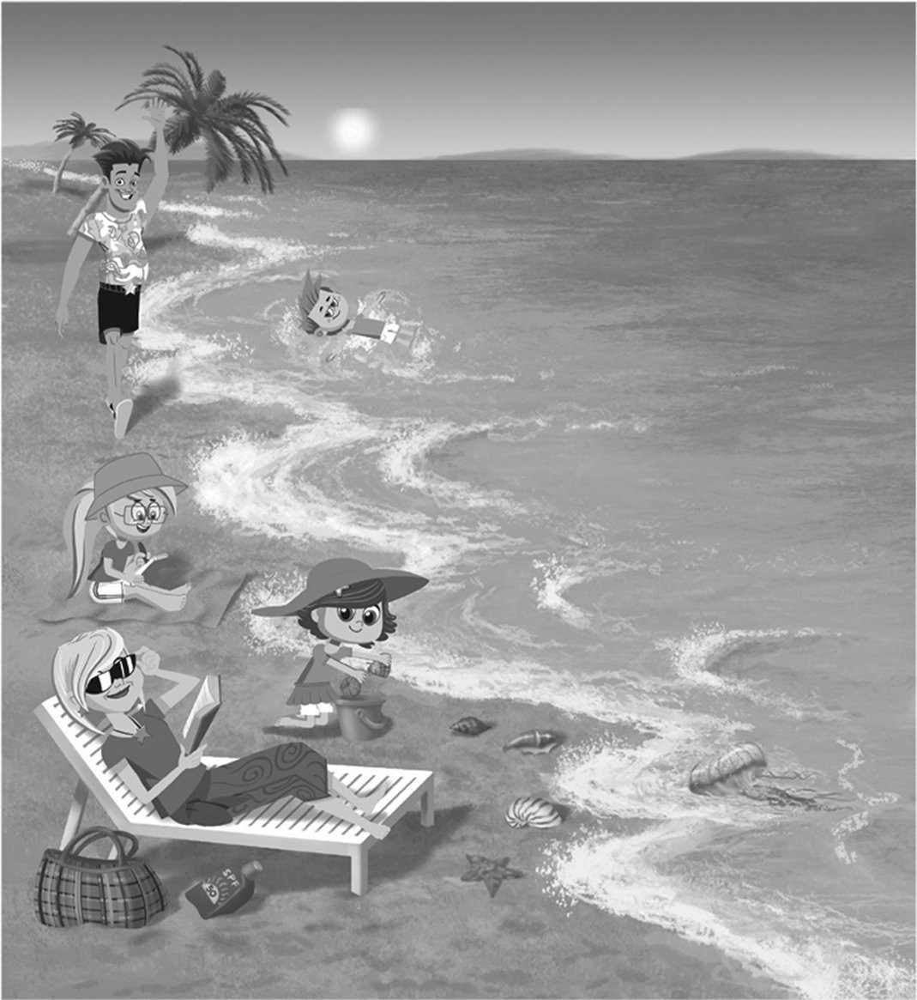
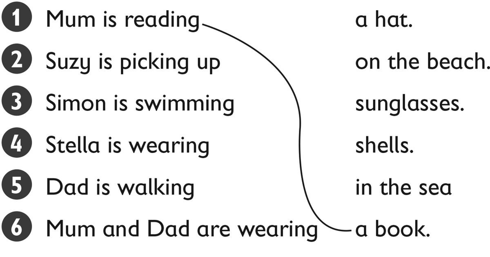
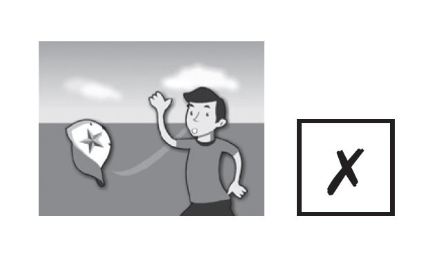
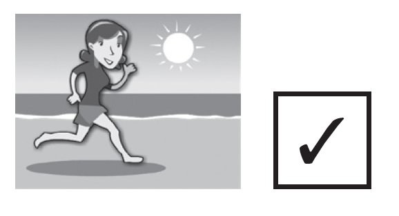
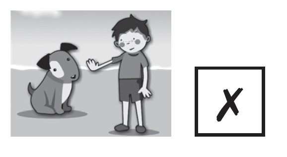
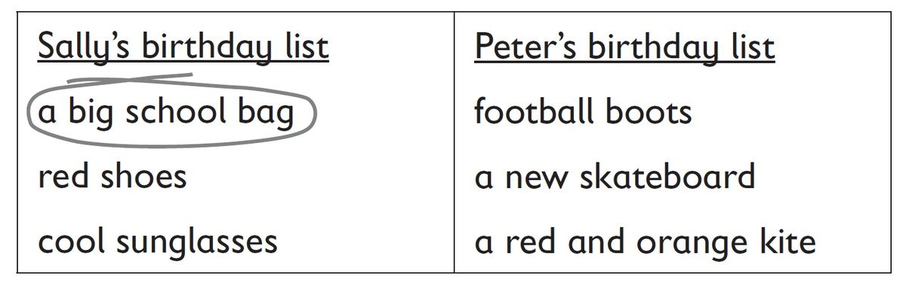
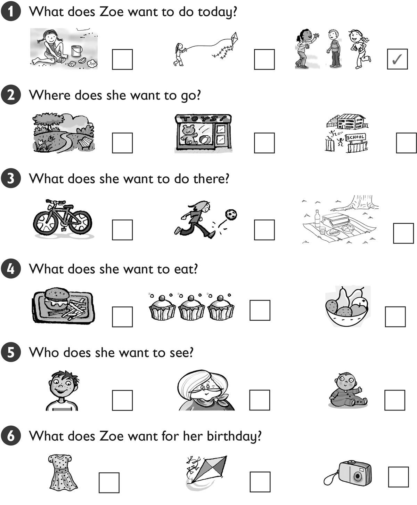

**[Vocabulary]{.underline}**

**1. Complete the words. There is one example.   (one point each)**

1\. m *[o]{.underline}* *[u]{.underline}* *[n]{.underline}* ta
*[i]{.underline}* *[n]{.underline}*

2\. \_\_h\_\_l\_\_

3\. s\_\_ \_\_

4\. \_\_ \_\_ a \_\_ h

5\. \_\_ \_\_ n

6\. j \_\_ llyf \_\_ sh

**2. Look and read. Write *yes* or *no*. There is one example.   (one
point each)**

  ------------------------------- --- -----------------------------------
  1\. The small jellyfish is on       *[yes]{.underline}*
  the sand.                           

  ------------------------------- --- -----------------------------------

  ------------------------------- --- -----------------------------------
  2\. The big jellyfish is behind     \_\_\_\_\_\_\_\_\_\_\_\_
  the boat.                           

  ------------------------------- --- -----------------------------------

  ------------------------------- --- -----------------------------------
  3\. The shell is between the        \_\_\_\_\_\_\_\_\_\_\_\_
  shoes.                              

  ------------------------------- --- -----------------------------------

  ------------------------------- --- -----------------------------------
  4\. The bag is under the chair.     \_\_\_\_\_\_\_\_\_\_\_\_

  ------------------------------- --- -----------------------------------

  ------------------------------- --- -----------------------------------
  5\. The hat is on the tree.         \_\_\_\_\_\_\_\_\_\_\_\_

  ------------------------------- --- -----------------------------------

  ------------------------------- --- -----------------------------------
  6\. The sunglasses are on the       \_\_\_\_\_\_\_\_\_\_\_\_
  chair.                              

  ------------------------------- --- -----------------------------------

**3. Look and read. Draw lines. There is one example.    (one point
each)**

**[Grammar]{.underline}**

**4. Look and read. Write *I want to* / *I don't want to*. There is one
example. (Unit 12 Standard)**

1\. I *[don't want to]{.underline}* wear my hat.

2\. I \_\_\_\_\_\_\_\_\_\_\_\_ swim with fish.

3\. I \_\_\_\_\_\_\_\_\_\_\_\_ run on the beach.

4\. I \_\_\_\_\_\_\_\_\_\_\_\_ play with my dog.

5\. I \_\_\_\_\_\_\_\_\_\_\_\_ pick up shells.

6\. We \_\_\_\_\_\_\_\_\_\_\_\_ to swim in the sea.

**5. Look, read and circle. There is one example.   (one point each)**

1\. Does Sally want a big school bag?

    *[Yes, she does.]{.underline}* / *No, she doesn't.*

2\. Does Sally want black shoes?

    *Yes, she does.* / *No, she doesn't.*

3\. Does Peter want a football shirt?

    *Yes, he does.* / *No, he doesn't.*

4\. Does Peter want a new skateboard?

    *Yes, he does.* / *No, he doesn't.*

5\. Does Sally want cool sunglasses?

    *Yes, she does.* / *No, she doesn't.*

6\. Does Peter want a red bike?

    *Yes, he does.* / *No, he doesn't.*

**[Listening]{.underline}**

**6. Listen and draw lines. There is one example.   (one point each)**

**7. Listen and tick. There is one example.   (one point each)**

**[Reading]{.underline}**

**8. Read and write the name. There is one example.   (one point each)**

  ------------------------------- --- -----------------------------------
  1\. Who is walking on the           *[Mum]{.underline}*
  beach?                              

  ------------------------------- --- -----------------------------------

  ------------------------------- --- -----------------------------------
  2\. Who is fishing?                 \_\_\_\_\_\_\_\_\_\_\_\_

  ------------------------------- --- -----------------------------------

  ------------------------------- --- -----------------------------------
  3\. Who is jumping in the sea?      \_\_\_\_\_\_\_\_\_\_\_\_

  ------------------------------- --- -----------------------------------

  ------------------------------- --- -----------------------------------
  4\. Who is playing with shells?     \_\_\_\_\_\_\_\_\_\_\_\_

  ------------------------------- --- -----------------------------------

  ------------------------------- --- -----------------------------------
  5\. Who is cleaning the beach?      \_\_\_\_\_\_\_\_\_\_\_\_

  ------------------------------- --- -----------------------------------

  ------------------------------- --- -----------------------------------
  6\. Who is sleeping under a         \_\_\_\_\_\_\_\_\_\_\_\_
  tree?                               

  ------------------------------- --- -----------------------------------

