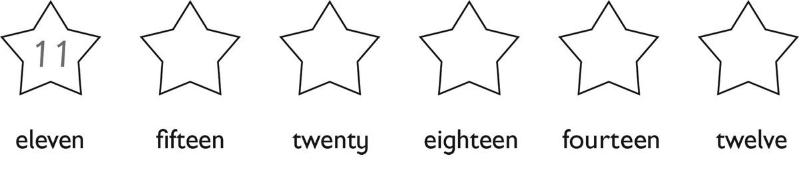
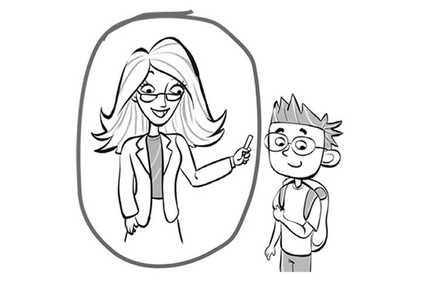
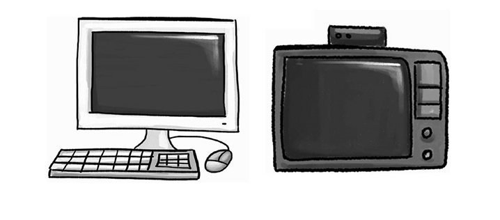
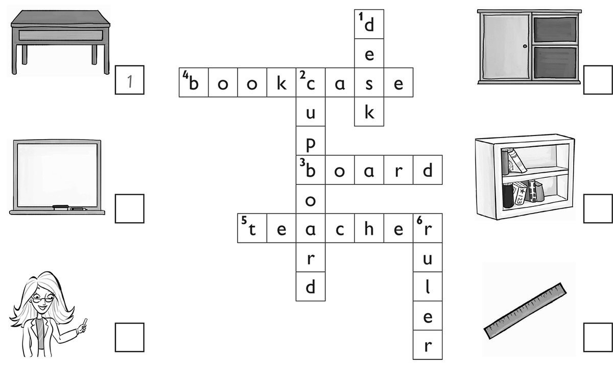
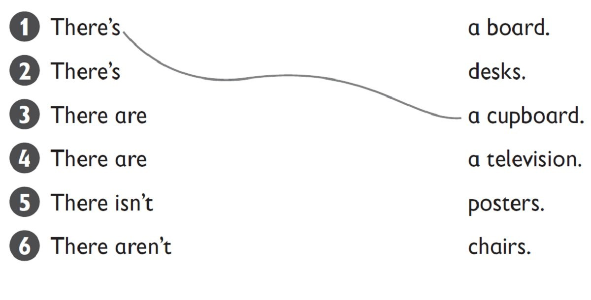
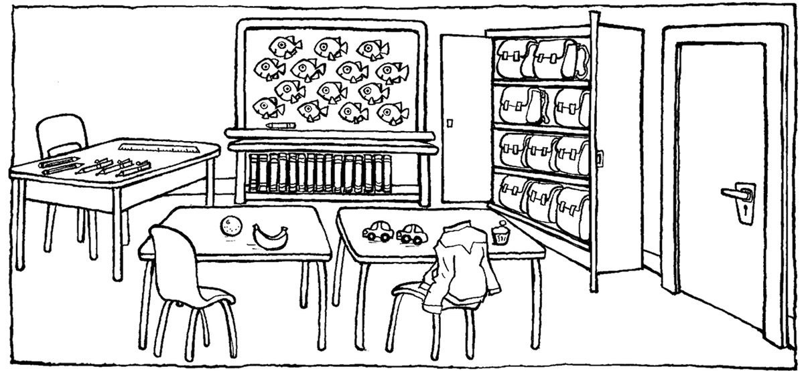
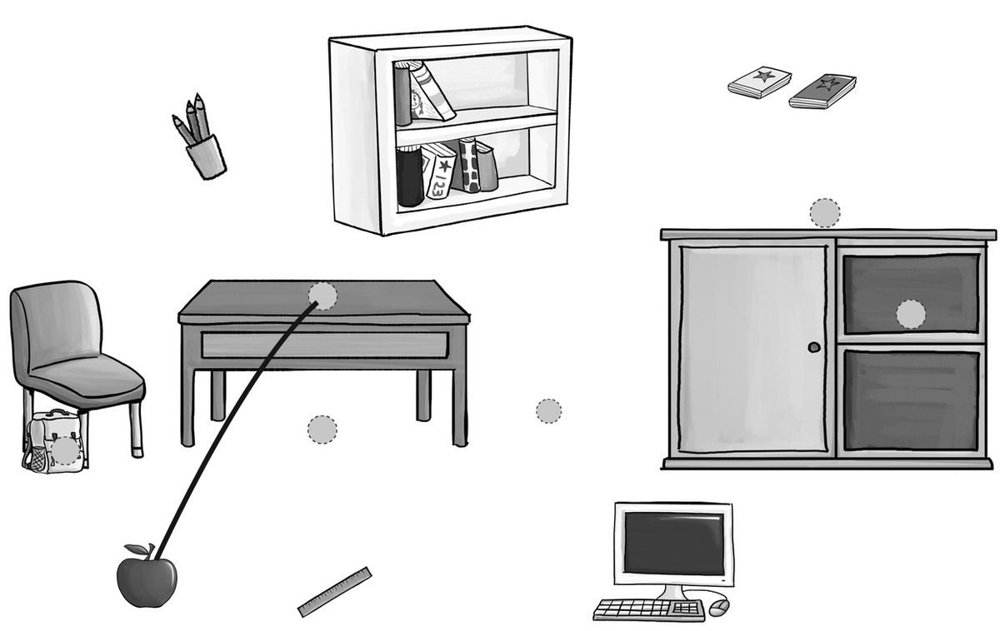

**[Vocabulary]{.underline}**

**1. Look and write. There is one example.   (one point each)**

*2. bookcase*

*3. desk*

*4. cupboard*

*5. computer*

*6. board*

**2. Look and circle. There is one example.   (one point each)**

1\. a teacher

2\. a bookcase

*bookcase*

3\. a desk

*desk*

4\. a cupboard

*cupboard*

5\. a computer

*computer*

6\. a board

*board*

**3. Look and match. There is one example.   (one point each)**

*2. teacher*

*3. board*

*4. bookcase*

*5. cupboard*

*6. ruler*

**[Grammar]{.underline}**

**4. Read and draw lines. There is one example.   (one point each)**

*2 There's a whiteboard*

*3 & 4. There are desks / chairs*

*5 There isn't a television*

*6 There aren't posters*

**5. Look and circle. There is one example.   (one point each)**

1\. How many desks are there?    *two* / *[three]{.underline}*

2\. How many rulers are there?    *one* / *four*

*one*

3\. How many bags are there?    *ten* / *twelve*

*ten*

4\. Is there a bookcase?    yes / *no*

*yes*

5\. Is there a television?    *yes* / *no*

*no*

6\. Are there books?    *yes* / *no*

*yes*

**6. Look and draw lines. There is one example.   (one point each)**

1\. An apple is on the desk.

2\. The ruler is in the bag.

*line from ruler to bag*

3\. The pencils are in the cupboard.

*line from pens to cupboard*

4\. The bookcase is next to the desk.

*line from bookcase to desk*

5\. Two books are under the desk.

*line from books to under the desk*

6\. The computer is on the cupboard.

*line from computer to cupboard*

**[Listening]{.underline}**

**7. Listen and complete. There is one example.   (one point each)**

1\. The desk is *on* / *[next]{.underline}* to the bookcase.

2\. There *is* / *isn't* a television.

*isn't*

3\. The poster is next to the *chair* / *whiteboard*.

*whiteboard*

4\. There are *two* / *three* cupboards.

*2*

5\. The bags are in a *cupboard* / *bookcase*.

*cupboard*

**Audio script**

**Boy:** Hi, Anna. Is this your classroom?

**Girl:** Yes, and this is my desk.

**Boy:** It's next to the bookcase.

**Girl:** Yes!

(pause)

**Boy:** Is there a TV in your classroom?

**Girl:** No there isn't a television, but there are two computers on
the bookcase.

**Boy:** Oh yes!

(pause)

**Boy:** Are there any posters on the wall?

**Girl:** Yes. Look! There's a poster next to the whiteboard.

**Boy:** It's a big poster!

(pause)

**Boy:** How many cupboards are there in the classroom?

**Girl:** There are two.

**Boy:** Two?

**Girl:** Yes, there is one cupboard with pens and pencils and one
cupboard with our bags.

**Boy:** That's great!

**[Reading]{.underline}**

**8. Read and write. There is one example.   (one point each)**

1\. There are twenty *[desks]{.underline}* in Ben's classroom.

2\. The *chairs* are purple.

3\. There are six *posters* on the wall.

4\. There are *three* cupboards.

5\. Ben's *teacher* is Mrs Green.

6\. The pencils are on the teacher's *desk*.

