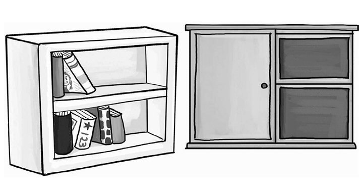
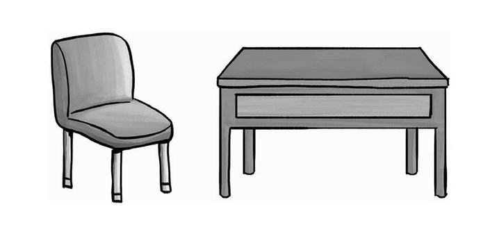
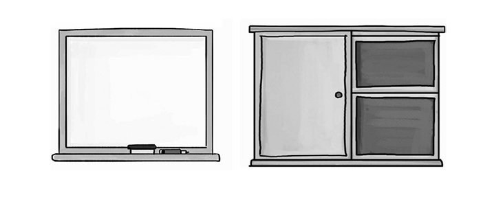
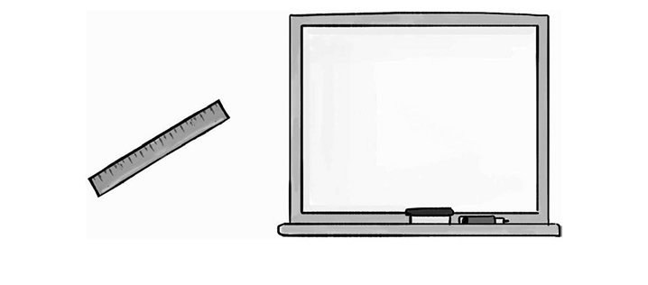
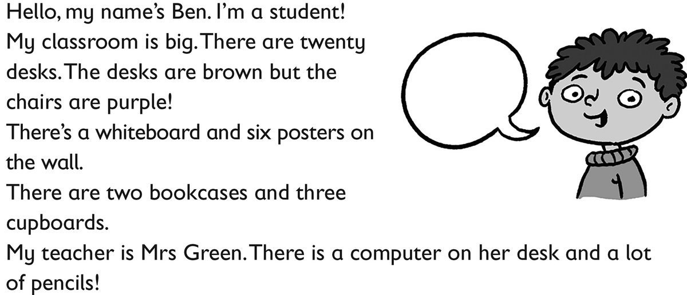

**[Vocabulary]{.underline}**

**1. Look and write. There is one example.   (one point each)**

**2. Look and circle. There is one example.   (one point each)**

1\. a teacher

2\. a bookcase

3\. a desk

4\. a cupboard

5\. a computer

6\. a board

**3. Look and match. There is one example.   (one point each)**

**[Grammar]{.underline}**

**4. Read and draw lines. There is one example.   (one point each)**

**5. Look and circle. There is one example.   (one point each)**

1\. How many desks are there?    *two* / *[three]{.underline}*

2\. How many rulers are there?    *one* / *four*

3\. How many bags are there?    *ten* / *twelve*

4\. Is there a bookcase?    yes / *no*

5\. Is there a television?    *yes* / *no*

6\. Are there books?    *yes* / *no*

**6. Look and draw lines. There is one example.   (one point each)**

1\. An apple is on the desk.

2\. The ruler is in the bag.

3\. The pencils are in the cupboard.

4\. The bookcase is next to the desk.

5\. Two books are under the desk.

6\. The computer is on the cupboard.

**[Listening]{.underline}**

**7. Listen and complete. There is one example.   (one point each)**

1\. The desk is *on* / *[next]{.underline}* to the bookcase.

2\. There *is* / *isn't* a television.

3\. The poster is next to the *chair* / *whiteboard*.

4\. There are *two* / *three* cupboards.

5\. The bags are in a *cupboard* / *bookcase*.

**[Reading]{.underline}**

**8. Read and write. There is one example.   (one point each)**

1\. There are twenty *[desks]{.underline}* in Ben's classroom.

2\. The \_\_\_\_\_\_\_\_\_\_\_\_\_\_ are purple.

3\. There are six \_\_\_\_\_\_\_\_\_\_\_\_\_\_ on the wall.

4\. There are \_\_\_\_\_\_\_\_\_\_\_\_\_\_ cupboards.

5\. Ben's \_\_\_\_\_\_\_\_\_\_\_\_\_\_ is Mrs Green.

6\. The pencils are on the teacher's \_\_\_\_\_\_\_\_\_\_\_\_\_\_.

