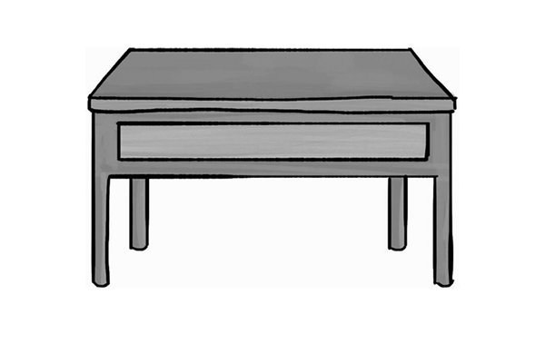
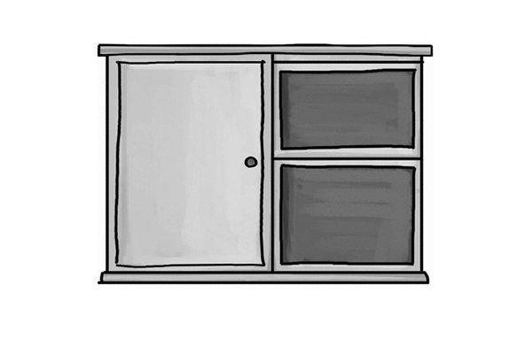
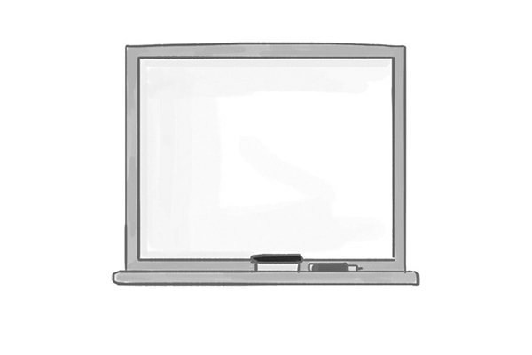
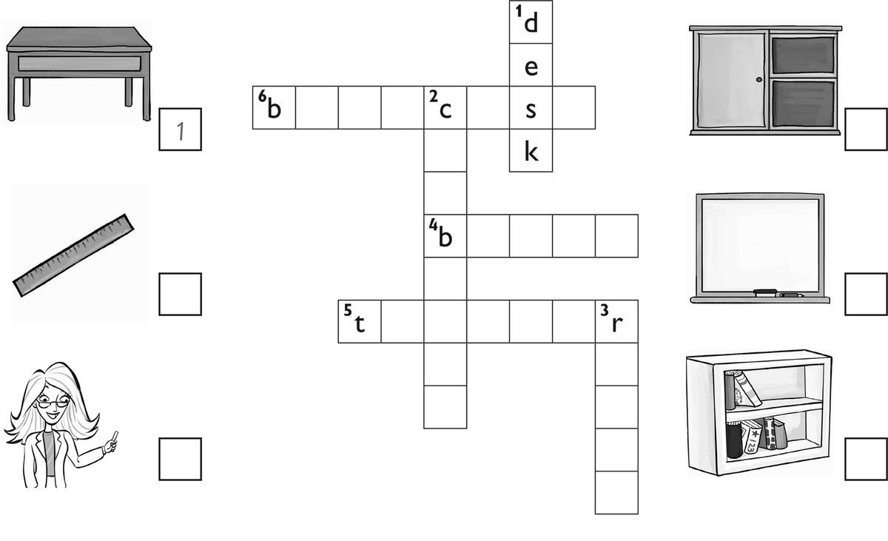
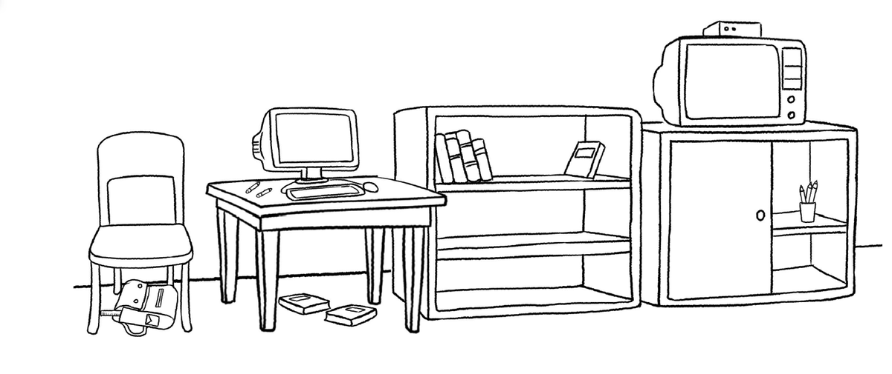
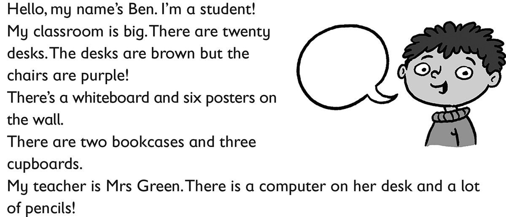

**[Vocabulary]{.underline}**

**1. Look and write. There is one example.   (one point each)**

*12*

*fourteen*

*sixteen*

*eighteen*

*19 nineteen*

**2. Look and write. There is one example.   (one point each)**

bookcase \| computer \| cupboard \| desk \| ~~teacher~~ \| board

  -------------------------------------------------------------------------------------------------------------------------------------------------------------------------------------------------------------------- -- ----------------------------------------------------------------------------------------------------------------------------------------------------------------------------------------------------------------- -- -----------------------------------------------------------------------------------------------------------------------------------------------------------------------------------------------------------------
   1.            
  *[teacher]{.underline}*                                                                                                                                                                                                 2. *bookcase*                                                                                                                                                                                                        3. *desk*

  -------------------------------------------------------------------------------------------------------------------------------------------------------------------------------------------------------------------- -- ----------------------------------------------------------------------------------------------------------------------------------------------------------------------------------------------------------------- -- -----------------------------------------------------------------------------------------------------------------------------------------------------------------------------------------------------------------

  ----------------------------------------------------------------------------------------------------------------------------------------------------------------------------------------------------------------- -- ----------------------------------------------------------------------------------------------------------------------------------------------------------------------------------------------------------------- -- -----------------------------------------------------------------------------------------------------------------------------------------------------------------------------------------------------------------
              
  4. *cupboard*                                                                                                                                                                                                        5. *whiteboard*                                                                                                                                                                                                      6. *computer*

  ----------------------------------------------------------------------------------------------------------------------------------------------------------------------------------------------------------------- -- ----------------------------------------------------------------------------------------------------------------------------------------------------------------------------------------------------------------- -- -----------------------------------------------------------------------------------------------------------------------------------------------------------------------------------------------------------------

**3. Look and write the words. Then match. There is one example.   (one
point each)**

*2. teacher*

*3. board*

*4. bookcase*

*5. cupboard*

*6. ruler*

**[Grammar]{.underline}**

**4. Look and write *is, isn't,* are or *aren't*. There is one
example.   (one point each)**

1\. There *[are]{.underline}* desks in the classroom.

2\. There *aren't* five rulers in the classroom.

3\. There *isn't* a teacher.

4\. There *are* three chairs.

5\. There *are* ten bags in the cupboard.

6\. There *is* a cupboard.

**5. Look and write *is, isn't,* are or *aren't*. There is one
example.   (one point each)**

1\. How many desks are there?    There *[are]{.underline}* three.

2\. How many rulers are there?    There \_\_\_\_\_\_\_\_\_\_ one.

*is*

3\. How many bags are there?    There \_\_\_\_\_\_\_\_\_\_ ten.

*are*

4\. Is there a bookcase?    Yes, there \_\_\_\_\_\_\_\_\_\_.

*is*

5\. Is there a television?    No, there \_\_\_\_\_\_\_\_\_\_.

*isn't*

6\. Are there books?    Yes, there \_\_\_\_\_\_\_\_\_\_.

*are*

**6. Look and write. There is one example.   (one point each)**

in \| next to \| on \| ~~under~~ \| under \| in

1\. The bag is *[under]{.underline}* the chair.

2\. The television is \_\_\_\_\_\_\_\_\_\_ the cupboard.

*on*

3\. The pencils are \_\_\_\_\_\_\_\_\_\_ the cupboard.

*in*

4\. The bookcase is \_\_\_\_\_\_\_\_\_\_ the desk.

*next to*

5\. Two books are \_\_\_\_\_\_\_\_\_\_ the desk.

*under*

6\. The ruler is \_\_\_\_\_\_\_\_\_\_ the bag.

*in*

**[Listening]{.underline}**

**7. Listen and circle *yes* or *no*. There is one example.   (one point
each)**

1\. Anna's desk is next to the bookcase.     *[yes]{.underline}*  no

2\. There is a television in the classroom.     yes  no

*no*

3\. There are two computers.     yes  no

*yes*

4\. There is one poster.     yes  no

*yes*

5\. The bags are in a cupboard.     yes  no

*yes*

**Audio script**

**Boy:** Hi, Anna. Is this your classroom?

**Girl:** Yes, and this is my desk.

**Boy:** It's next to the bookcase.

**Girl:** Yes!

(pause)

**Boy:** Is there a TV in your classroom?

**Girl:** No there isn't a television, but there are two computers on
the bookcase.

**Boy:** Oh yes!

(pause)

**Boy:** Are there any posters on the wall?

**Girl:** Yes. Look! There's a poster next to the whiteboard.

**Boy:** It's a big poster!

(pause)

**Boy:** How many cupboards are there in the classroom?

**Girl:** There are two.

**Boy:** Two?

**Girl:** Yes, there is one cupboard with pens and pencils and one
cupboard with our bags.

**Boy:** That's great!

**[Reading]{.underline}**

**8. Read and write one word. There is one example.   (one point each)**

1\. How many desks are there?     *[twenty]{.underline}*

2\. What colour are the chairs?     \_\_\_\_\_\_\_\_\_\_

*purple*

3\. Where are the posters?     on the \_\_\_\_\_\_\_\_\_\_

*wall*

4\. How many cupboards are there?     \_\_\_\_\_\_\_\_\_\_

*three (3)*

5\. Who is Ben's teacher?     Mrs \_\_\_\_\_\_\_\_\_\_

*Green*

6\. Where are the pencils?     on the \_\_\_\_\_\_\_\_\_\_

*desk*

