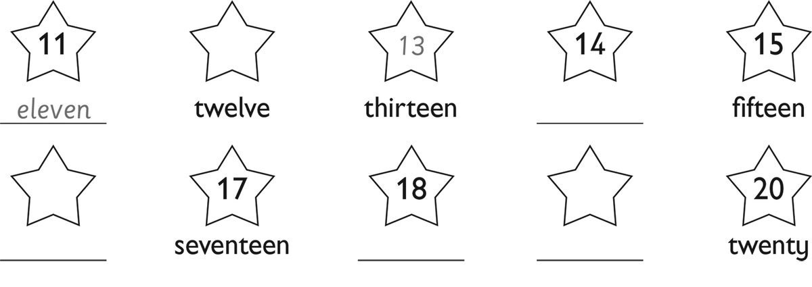
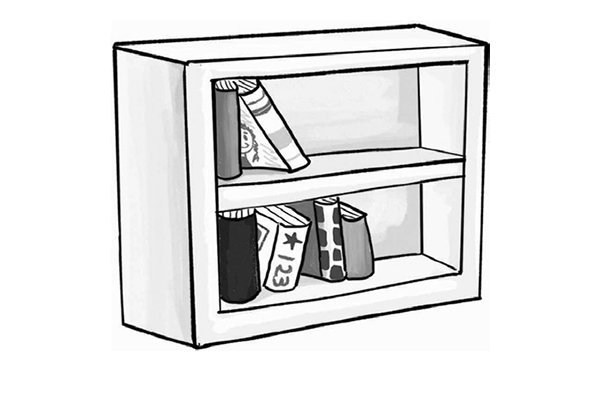
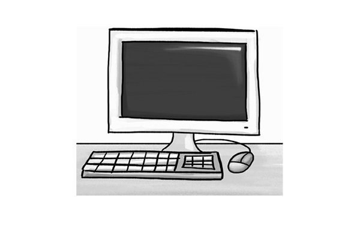
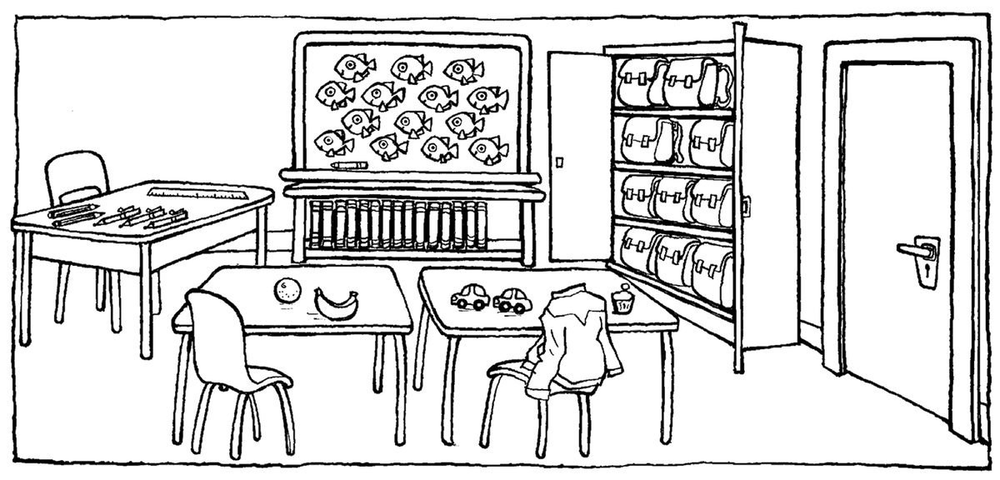

**[Vocabulary]{.underline}**

**1. Look and write. There is one example.   (one point each)**

**2. Look and write. There is one example.   (one point each)**

bookcase \| computer \| cupboard \| desk \| ~~teacher~~ \| board

  ----------------------------------------------------------------------------------------------------------------------------------------------------------------------------------------------------------------------- -- -------------------------------------------------------------------------------------------------------------------------------------------------------------------------------------------------------------------- -- --------------------------------------------------------------------------------------------------------------------------------------------------------------------------------------------------------------------
   1.            
  *[teacher]{.underline}*                                                                                                                                                                                                    2. \_\_\_\_\_\_\_\_\_\_                                                                                                                                                                                                 3. \_\_\_\_\_\_\_\_\_\_

  ----------------------------------------------------------------------------------------------------------------------------------------------------------------------------------------------------------------------- -- -------------------------------------------------------------------------------------------------------------------------------------------------------------------------------------------------------------------- -- --------------------------------------------------------------------------------------------------------------------------------------------------------------------------------------------------------------------

  -------------------------------------------------------------------------------------------------------------------------------------------------------------------------------------------------------------------- -- -------------------------------------------------------------------------------------------------------------------------------------------------------------------------------------------------------------------- -- --------------------------------------------------------------------------------------------------------------------------------------------------------------------------------------------------------------------
              
  4. \_\_\_\_\_\_\_\_\_\_                                                                                                                                                                                                 5. \_\_\_\_\_\_\_\_\_\_                                                                                                                                                                                                 6. \_\_\_\_\_\_\_\_\_\_

  -------------------------------------------------------------------------------------------------------------------------------------------------------------------------------------------------------------------- -- -------------------------------------------------------------------------------------------------------------------------------------------------------------------------------------------------------------------- -- --------------------------------------------------------------------------------------------------------------------------------------------------------------------------------------------------------------------

**3. Look and write the words. Then match. There is one example.   (one
point each)**

**[Grammar]{.underline}**

**4. Look and write *is, isn't,* are or *aren't*. There is one
example.   (one point each)**

1\. There *[are]{.underline}* desks in the classroom.

2\. There \_\_\_\_\_\_\_\_\_\_\_\_\_ five rulers in the classroom.

3\. There \_\_\_\_\_\_\_\_\_\_\_\_\_ a teacher.

4\. There \_\_\_\_\_\_\_\_\_\_\_\_\_ three chairs.

5\. There \_\_\_\_\_\_\_\_\_\_\_\_\_ ten bags in the cupboard.

6\. There \_\_\_\_\_\_\_\_\_\_\_\_\_ a cupboard.

**5. Look and write *is, isn't,* are or *aren't*. There is one
example.   (one point each)**

1\. How many desks are there?    There *[are]{.underline}* three.

2\. How many rulers are there?    There \_\_\_\_\_\_\_\_\_\_ one.

3\. How many bags are there?    There \_\_\_\_\_\_\_\_\_\_ ten.

4\. Is there a bookcase?    Yes, there \_\_\_\_\_\_\_\_\_\_.

5\. Is there a television?    No, there \_\_\_\_\_\_\_\_\_\_.

6\. Are there books?    Yes, there \_\_\_\_\_\_\_\_\_\_.

**6. Look and write. There is one example.   (one point each)**

in \| next to \| on \| ~~under~~ \| under \| in

1\. The bag is *[under]{.underline}* the chair.

2\. The television is \_\_\_\_\_\_\_\_\_\_ the cupboard.

3\. The pencils are \_\_\_\_\_\_\_\_\_\_ the cupboard.

4\. The bookcase is \_\_\_\_\_\_\_\_\_\_ the desk.

5\. Two books are \_\_\_\_\_\_\_\_\_\_ the desk.

6\. The ruler is \_\_\_\_\_\_\_\_\_\_ the bag.

**[Listening]{.underline}**

**7. Listen and circle *yes* or *no*. There is one example.   (one point
each)**

1\. Anna's desk is next to the bookcase.     *[yes]{.underline}*  no

2\. There is a television in the classroom.     yes  no

3\. There are two computers.     yes  no

4\. There is one poster.     yes  no

5\. The bags are in a cupboard.     yes  no

**[Reading]{.underline}**

**8. Read and write one word. There is one example.   (one point each)**

1\. How many desks are there?     *[twenty]{.underline}*

2\. What colour are the chairs?     \_\_\_\_\_\_\_\_\_\_

3\. Where are the posters?     on the \_\_\_\_\_\_\_\_\_\_

4\. How many cupboards are there?     \_\_\_\_\_\_\_\_\_\_

5\. Who is Ben's teacher?     Mrs \_\_\_\_\_\_\_\_\_\_

6\. Where are the pencils?     on the \_\_\_\_\_\_\_\_\_\_

