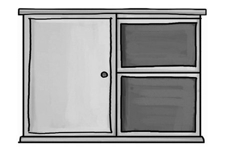
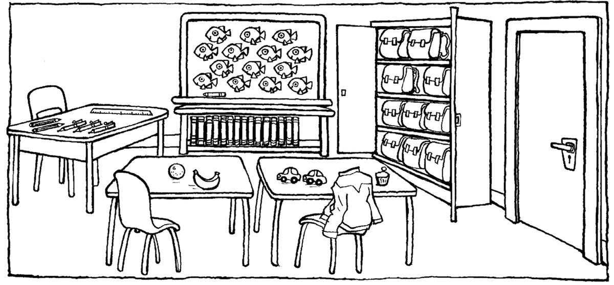
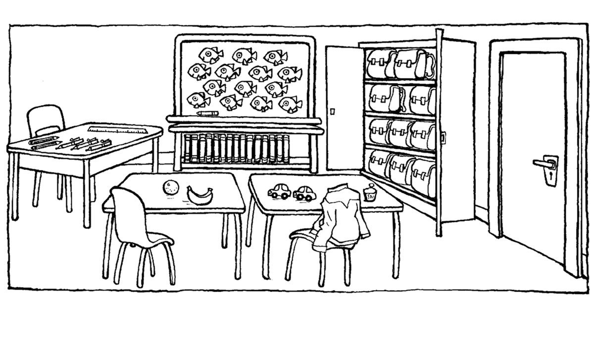
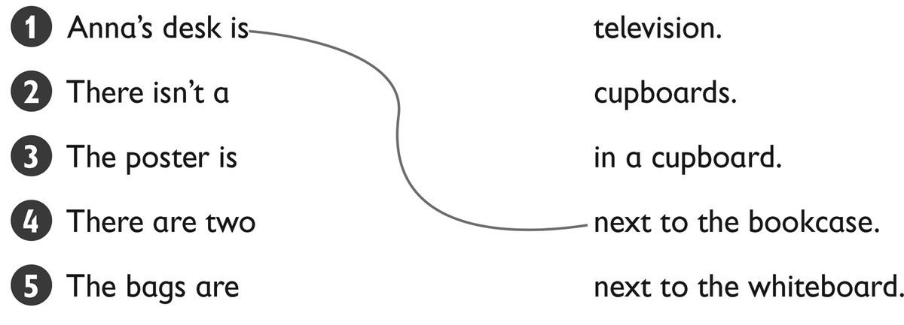

**[Vocabulary]{.underline}**

**1. Look and write. There is one example.   (one point each)**

*15*

*20*

*eighteen*

*fourteen*

*12*

**2. Look and circle. There is one example.   (one point each)**

1\. a student / *[teacher]{.underline}*

2\. a cupboard / bookcase

*bookcase*

3\. a desk / chair

*desk*

4\. a cupboard / whiteboard

*cupboard*

5\. a television / computer

*computer*

6\. a board / ruler

*whiteboard*

**3. Look and write the words. Then match. There is one example.   (one
point each)**

*2. teacher*

*3. board*

*4. bookcase*

*5. cupboard*

*6. ruler*

**[Grammar]{.underline}**

**4. Read and circle. There is one example.   (one point each)**

1\. There *is* / *[are]{.underline}* desks in the classroom.

2\. There *is* / *are* a cupboard in the classroom.

*is*

3\. There *aren't* / *isn't* posters in the classroom.

*aren't*

4\. There *is* / *are* chairs in the classroom.

*are*

5\. There *isn't* / *aren't* a teacher in the classroom.

*isn't*

6\. There *is* / *are* a ruler in the classroom.

*is*

**5. Look and write *is, isn't* or *are*. There is one example.   (one
point each)**

1\. How many desks are there?     There *[are]{.underline}* three.

2\. How many rulers are there?     There \_\_\_\_\_\_\_\_\_\_ one.

*is*

3\. How many bags are there?     There \_\_\_\_\_\_\_\_\_\_ ten.

*are*

4\. Is there a bookcase?     Yes, there\_\_\_\_\_\_\_\_\_\_.

*is*

5\. Is there a television?     No, there \_\_\_\_\_\_\_\_\_\_.

*isn't*

6\. Are there books?     Yes, there\_\_\_\_\_\_\_\_\_\_.

*are*

**6. Look and circle. There is one example.   (one point each)**

1\. The television is *in* / *[on]{.underline}* the cupboard.

2\. The ruler is *in* / *on* the bag.

*in*

3\. The pencils are *in* / *under* the cupboard.

*in*

4\. The bookcase is *under* / *next to* the desk.

*next to*

5\. Two books are *under* / *on* the desk.

*under*

6\. The computer is next *to* / *on* the desk.

*on*

**[Listening]{.underline}**

**7. Listen and draw lines. There is one example.   (one point each)**

*2. There isn't a television.*

*3. The poster is next to the whiteboard.*

*4. There are two cupboards.*

*5. The bags are in a cupboard.*

**Audio script**

**Boy:** Hi, Anna. Is this your classroom?

**Girl:** Yes, and this is my desk.

**Boy:** It's next to the bookcase.

**Girl:** Yes!

(pause)

**Boy:** Is there a TV in your classroom?

**Girl:** No there isn't a television, but there are two computers on
the bookcase.

**Boy:** Oh yes!

(pause)

**Boy:** Are there any posters on the wall?

**Girl:** Yes. Look! There's a poster next to the whiteboard.

**Boy:** It's a big poster!

(pause)

**Boy:** How many cupboards are there in the classroom?

**Girl:** There are two.

**Boy:** Two?

**Girl:** Yes, there is one cupboard with pens and pencils and one
cupboard with our bags.

**Boy:** That's great!

**[Reading]{.underline}**

**8. Read and write *yes* or *no*. There is one example.   (one point
each)**

  ------------------------------- --- -----------------------------------
  1\. Ben's classroom is big.         *[yes]{.underline}*

  ------------------------------- --- -----------------------------------

  ------------------------------- --- -----------------------------------
  2\. There are twelve desks.         *no*

  ------------------------------- --- -----------------------------------

  ------------------------------- --- -----------------------------------
  3\. The chairs are purple.          *yes*

  ------------------------------- --- -----------------------------------

  ------------------------------- --- -----------------------------------
  4\. There are six posters.          *yes*

  ------------------------------- --- -----------------------------------

  ------------------------------- --- -----------------------------------
  5\. There is one cupboard.          *no*

  ------------------------------- --- -----------------------------------

  ------------------------------- --- -----------------------------------
  6\. The pencils are on the          *yes*
  teacher's desk.                     

  ------------------------------- --- -----------------------------------

