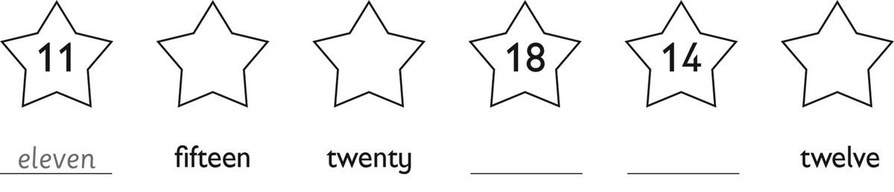
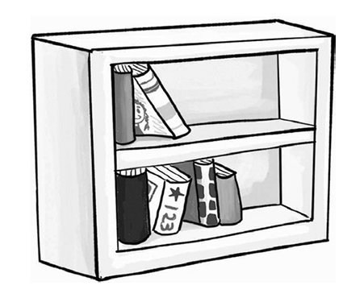
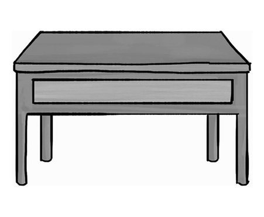
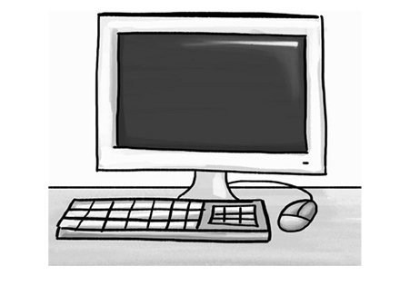
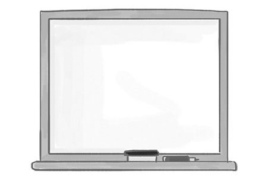
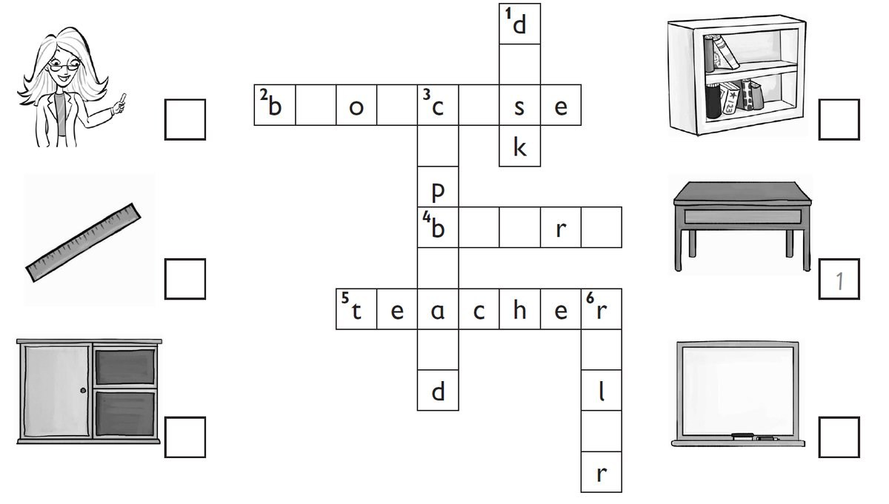
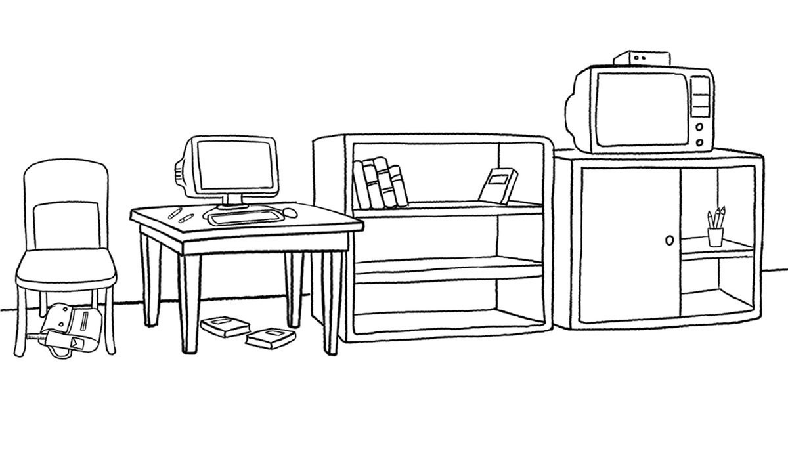
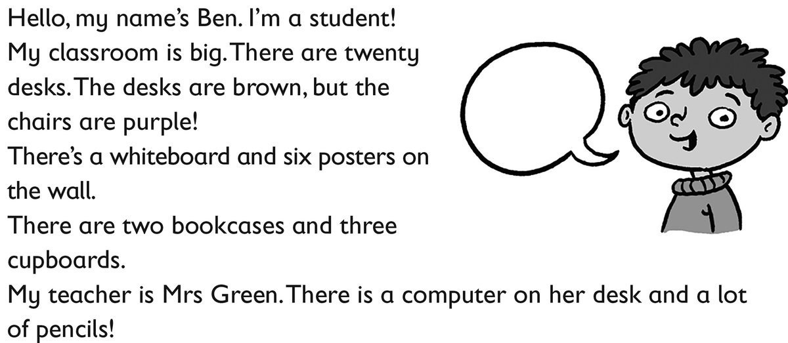

**[Vocabulary]{.underline}**

**1. Look and write. There is one example.   (one point each)**

**2. Look and circle. There is one example.   (one point each)**

1\. a student / *[teacher]{.underline}*

2\. a cupboard / bookcase

3\. a desk / chair

4\. a cupboard / whiteboard

5\. a television / computer

6\. a board / ruler

**3. Look and write the words. Then match. There is one example.   (one
point each)**

**[Grammar]{.underline}**

**4. Read and circle. There is one example.   (one point each)**

1\. There *is* / *[are]{.underline}* desks in the classroom.

2\. There *is* / *are* a cupboard in the classroom.

3\. There *aren't* / *isn't* posters in the classroom.

4\. There *is* / *are* chairs in the classroom.

5\. There *isn't* / *aren't* a teacher in the classroom.

6\. There *is* / *are* a ruler in the classroom.

**5. Look and write *is, isn't* or *are*. There is one example.   (one
point each)**

1\. How many desks are there?     There *[are]{.underline}* three.

2\. How many rulers are there?     There \_\_\_\_\_\_\_\_\_\_ one.

3\. How many bags are there?     There \_\_\_\_\_\_\_\_\_\_ ten.

4\. Is there a bookcase?     Yes, there\_\_\_\_\_\_\_\_\_\_.

5\. Is there a television?     No, there \_\_\_\_\_\_\_\_\_\_.

6\. Are there books?     Yes, there\_\_\_\_\_\_\_\_\_\_.

**6. Look and circle. There is one example.   (one point each)**

1\. The television is *in* / *[on]{.underline}* the cupboard.

2\. The ruler is *in* / *on* the bag.

3\. The pencils are *in* / *under* the cupboard.

4\. The bookcase is *under* / *next to* the desk.

5\. Two books are *under* / *on* the desk.

6\. The computer is next *to* / *on* the desk.

**[Listening]{.underline}**

**7. Listen and draw lines. There is one example.   (one point each)**

**[Reading]{.underline}**

**8. Read and write *yes* or *no*. There is one example.   (one point
each)**

  ------------------------------- --- -----------------------------------
  1\. Ben's classroom is big.         *[yes]{.underline}*

  ------------------------------- --- -----------------------------------

  ------------------------------- --- -----------------------------------
  2\. There are twelve desks.         \_\_\_\_\_\_\_\_\_\_\_\_

  ------------------------------- --- -----------------------------------

  ------------------------------- --- -----------------------------------
  3\. The chairs are purple.          \_\_\_\_\_\_\_\_\_\_

  ------------------------------- --- -----------------------------------

  ------------------------------- --- -----------------------------------
  4\. There are six posters.          \_\_\_\_\_\_\_\_\_\_

  ------------------------------- --- -----------------------------------

  ------------------------------- --- -----------------------------------
  5\. There is one cupboard.          \_\_\_\_\_\_\_\_\_\_

  ------------------------------- --- -----------------------------------

  ------------------------------- --- -----------------------------------
  6\. The pencils are on the          \_\_\_\_\_\_\_\_\_\_
  teacher's desk.                     

  ------------------------------- --- -----------------------------------

