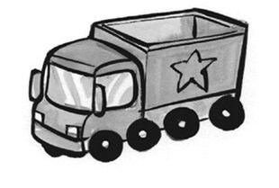
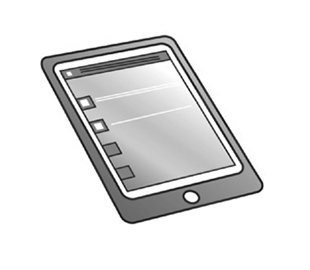
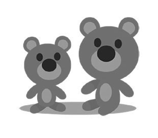
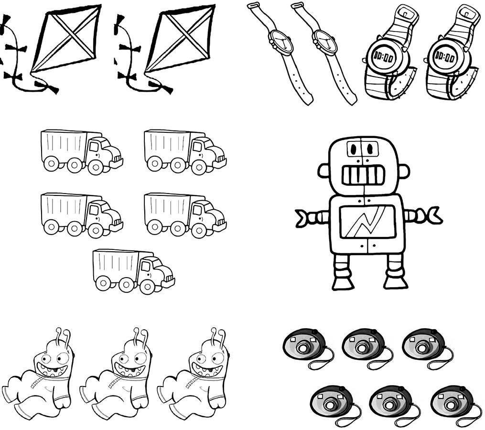
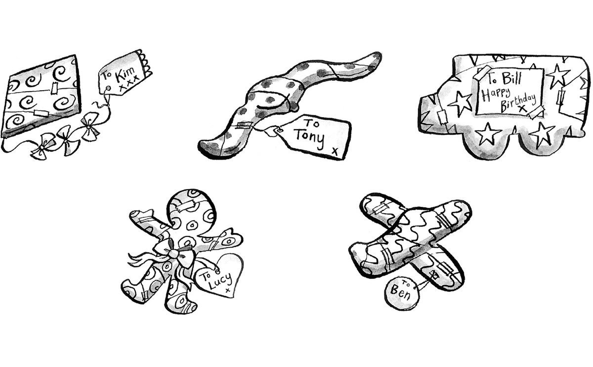
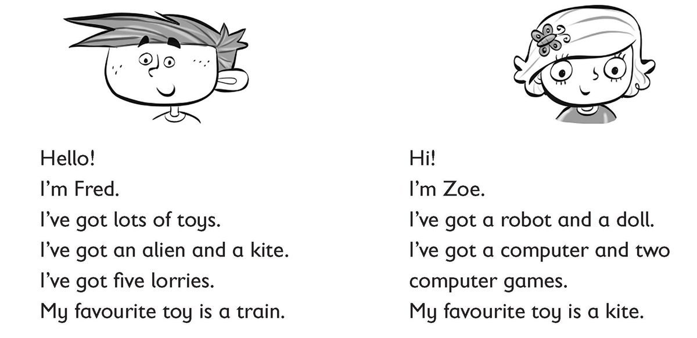

**[Vocabulary]{.underline}**

**1. Look and write. There is one example.   (one point each)**

camera \| ~~lorry~~ \| teddy \| tablet \| robot \| watch

1\. l*[orry]{.underline}*

2\. t \_\_\_\_\_\_\_\_\_\_\_

*tablet*

3\. c \_\_\_\_\_\_\_\_\_\_\_\_

*camera*

4\. w \_\_\_\_\_\_\_\_\_\_\_

*watch*

5\. r \_\_\_\_\_\_\_\_\_\_\_

*robot*

6\. t \_\_\_\_\_\_\_\_\_\_\_

*teddy*

**2. Listen and colour. There is one example.   (one point each)**

*robot - purple*

*aliens - green*

*watches - brown*

*kites - yellow*

*lorries - grey*

**3. Look and draw lines. Then colour. There is one example.   (one
point each)**

*one purple robot*

*three green aliens*

*four brown watches*

*two yellow kites*

*five grey lorries*

**[Grammar]{.underline}**

**4. Read and circle. There is one example.   (one point each)**

1\. *This / These* is a doll.

*This*

2\. *This* / *These* is a computer game.

*These*

3\. *This / These* are cars.

*These*

4\. *This / These* are teddies.

*These*

5\. *This / These* is a robot.

*This*

6\. *This / These* are watches.

*These*

**5. Read and write the word. There is one example.   (one point each)**

Lucy's \| Whose \| Ben's \| ~~Kim's~~ \| Tony's \| Bill's

1\. Whose is the kite? It's *[Kim's.]{.underline}*

2\. Whose is the watch? It's \_\_\_\_\_\_\_\_\_\_\_\_.

*Tony's*

3\. Whose is the lorry? It's \_\_\_\_\_\_\_\_\_\_\_\_.

*Bill's*

4\. Whose is the doll? It's \_\_\_\_\_\_\_\_\_\_\_\_.

*Lucy's*

5\. \_\_\_\_\_\_\_\_\_\_\_\_ is the plane? It's \_\_\_\_\_\_\_\_\_\_\_.

*Whose / Ben's*

**[Listening]{.underline}**

**6. Listen and write the number. There is one example.   (one point
each)**

*2. camera*

*3. kites*

*4. computer games*

*5. watch*

*6. lorries*

**Audio script**

Boy: Is this a robot? Girl: Yes, it is.

Girl: Hello. What's this? Is it a watch? Boy: No, it's a camera.

Girl: Hi. What are these? Boy: They're kites. Girl: They're beautiful.

Girl: These are tablets. Boy: No, they're computer games.Girl: Oh yes!

Boy: What's this? Girl: It's a yellow watch. Boy: Yellow is my favourite
colour!

Boy: Are these lorries? Girl: Yes, they are! Boy: Lorries are my
favourite toy!

**7. Listen and draw lines. There is one example.   (one point each)**

*Ann*

*Sam*

*Jill*

*Ann*

*Rick*

**Audio script**

Whose is the kite? It's Rick's.

Whose is the camera? It's Ann's.

Whose is the robot? It's Sam's.

Whose is the computer game? It's Jill's.

Whose is the watch? It's Ann's.

Whose is the lorry? It's Rick's.

**[Reading]{.underline}**

**8. Read and write yes or no. There is one example.   (one point
each)**

  ------------------------------- --- -----------------------------------
  1\. Zoe has got a robot.            *[yes]{.underline}*

  ------------------------------- --- -----------------------------------

  ------------------------------- --- -----------------------------------
  2\. Fred has got an alien.          *yes*

  ------------------------------- --- -----------------------------------

  ------------------------------- --- -----------------------------------
  3\. Fred has got four lorries.      *no*

  ------------------------------- --- -----------------------------------

  ------------------------------- --- -----------------------------------
  4\. Zoe has got two computer        *yes*
  games.                              

  ------------------------------- --- -----------------------------------

  ------------------------------- --- -----------------------------------
  5\. Zoe's favourite toy is a        *no*
  doll.                               

  ------------------------------- --- -----------------------------------

  ------------------------------- --- -----------------------------------
  6\. Fred's favourite toy is a       *no*
  lorry.                              

  ------------------------------- --- -----------------------------------

