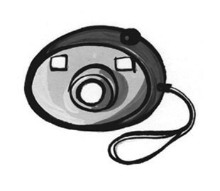
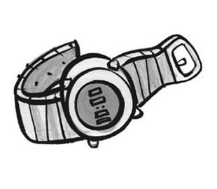
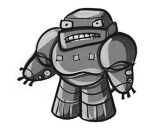
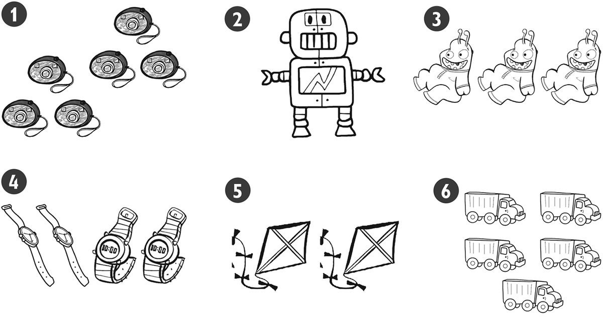
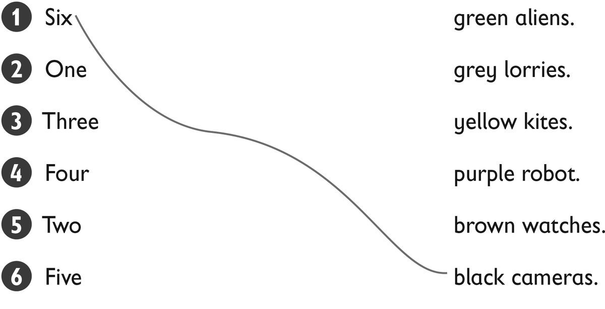
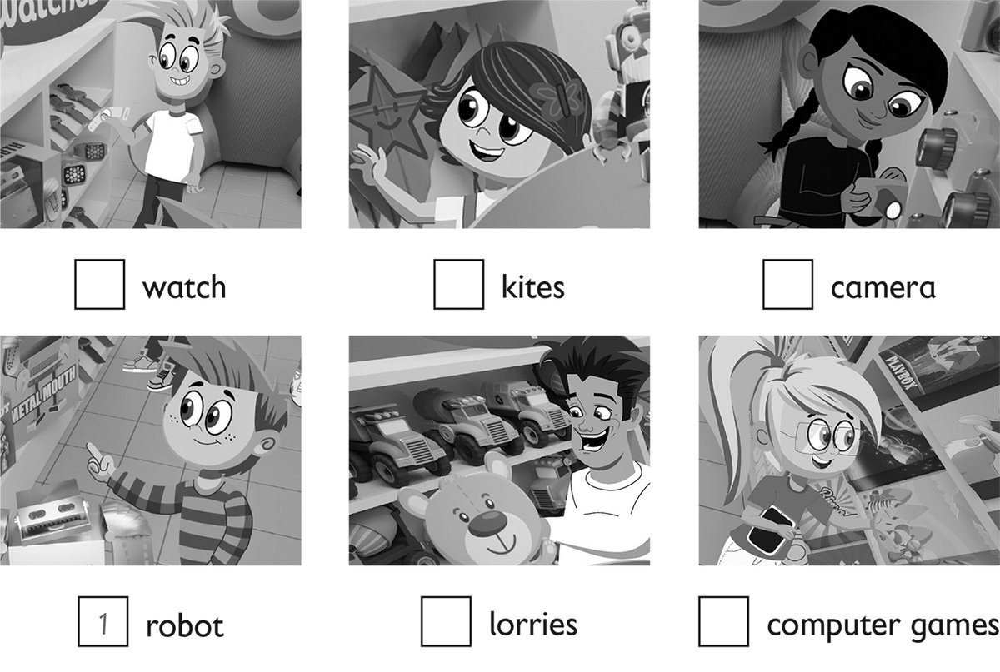
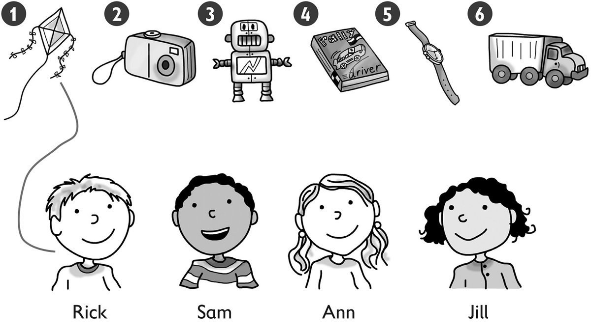

**[Vocabulary]{.underline}**

**1. Look and write. There is one example.   (one point each)**

camera \| ~~lorry~~ \| teddy \| tablet \| robot \| watch

1\. l*[orry]{.underline}*

2\. t \_\_\_\_\_\_\_\_\_\_\_

3\. c \_\_\_\_\_\_\_\_\_\_\_\_

4\. w \_\_\_\_\_\_\_\_\_\_\_

5\. r \_\_\_\_\_\_\_\_\_\_\_

6\. t \_\_\_\_\_\_\_\_\_\_\_

**2. Listen and colour. There is one example.   (one point each)**

**3. Look and draw lines. Then colour. There is one example.   (one
point each)**

**[Grammar]{.underline}**

**4. Read and circle. There is one example.   (one point each)**

1\. *This / These* is a doll.

2\. *This* / *These* is a computer game.

3\. *This / These* are cars.

4\. *This / These* are teddies.

5\. *This / These* is a robot.

6\. *This / These* are watches.

**5. Read and write the word. There is one example.   (one point each)**

Lucy's \| Whose \| Ben's \| ~~Kim's~~ \| Tony's \| Bill's

1\. Whose is the kite? It's *[Kim's.]{.underline}*

2\. Whose is the watch? It's \_\_\_\_\_\_\_\_\_\_\_\_.

3\. Whose is the lorry? It's \_\_\_\_\_\_\_\_\_\_\_\_.

4\. Whose is the doll? It's \_\_\_\_\_\_\_\_\_\_\_\_.

5\. \_\_\_\_\_\_\_\_\_\_\_\_ is the plane? It's \_\_\_\_\_\_\_\_\_\_\_.

**[Listening]{.underline}**

**6. Listen and write the number. There is one example.   (one point
each)**

**7. Listen and draw lines. There is one example.   (one point each)**

**[Reading]{.underline}**

**8. Read and write yes or no. There is one example.   (one point
each)**

  ------------------------------- --- -----------------------------------
  1\. Zoe has got a robot.            

  ------------------------------- --- -----------------------------------

  ------------------------------- --- -----------------------------------
  2\. Fred has got an alien.          \_\_\_\_\_\_\_\_\_\_\_\_

  ------------------------------- --- -----------------------------------

  ------------------------------- --- -----------------------------------
  3\. Fred has got four lorries.      \_\_\_\_\_\_\_\_\_\_\_\_

  ------------------------------- --- -----------------------------------

  ------------------------------- --- -----------------------------------
  4\. Zoe has got two computer        \_\_\_\_\_\_\_\_\_\_\_\_
  games.                              

  ------------------------------- --- -----------------------------------

  ------------------------------- --- -----------------------------------
  5\. Zoe's favourite toy is a        \_\_\_\_\_\_\_\_\_\_\_\_
  doll.                               

  ------------------------------- --- -----------------------------------

  ------------------------------- --- -----------------------------------
  6\. Fred's favourite toy is a       \_\_\_\_\_\_\_\_\_\_\_\_
  lorry.                              

  ------------------------------- --- -----------------------------------

