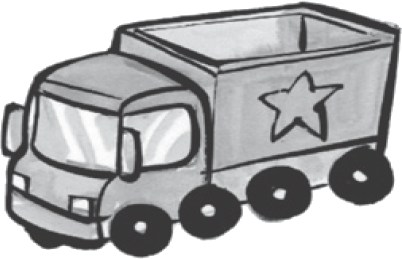
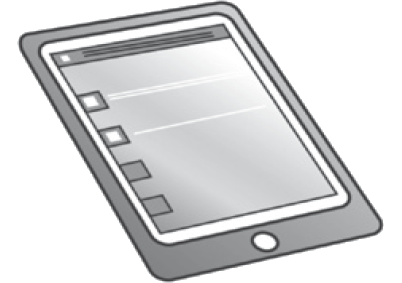
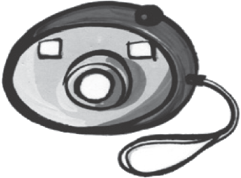
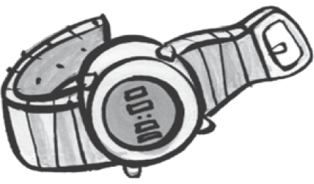
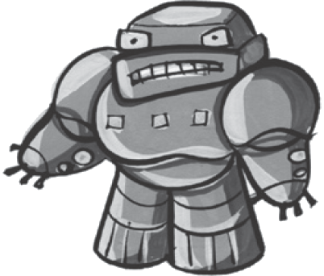
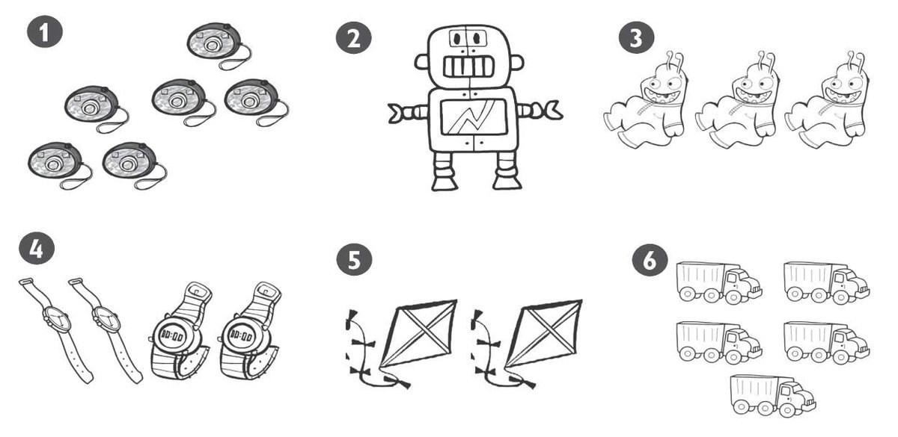
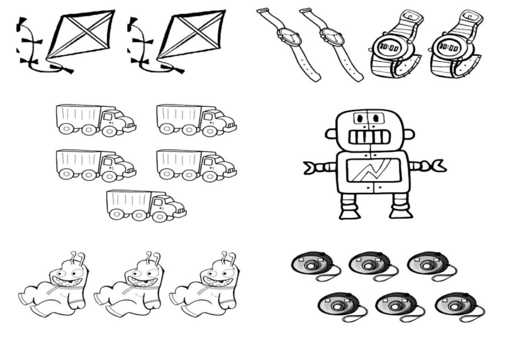
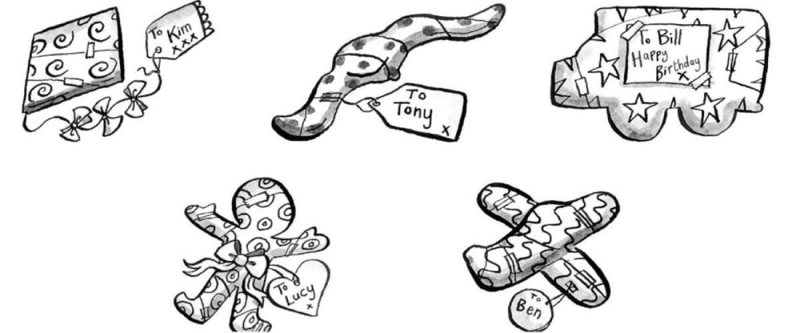
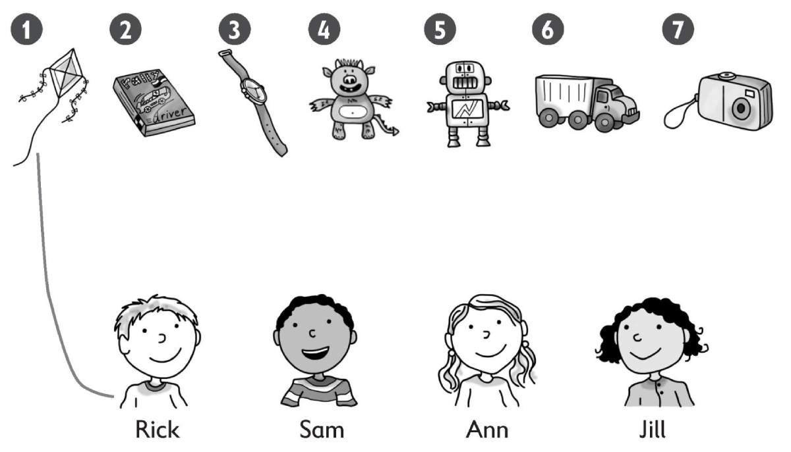
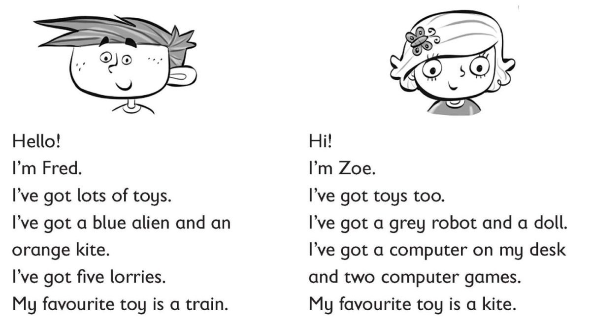

**[Vocabulary]{.underline}**

**1. Put the letters in order. Then write. There is one example.   (one
point each)**

meacra \| ~~ryrlo~~ \| dtedy \| tbaetl \| toobr \| cwaht

  ---------------------------------------------------------------------------------------------------------------------------------------------------------------------------------------------------------------------- -- ------------------------------------------------------------------------------------------------------------------------------------------------------------------------------------------------------------------- -- ------------------------------------------------------------------------------------------------------------------------------------------------------------------------------------------------------------------- -- -------------------------------------------------------------------------------------------------------------------------------------------------------------------------------------------------------------------
   1.                  
  \_\_\_\_\_\_\_\_\_\_\_\_\_                                                                                                                                                                                                2. \_\_\_\_\_\_\_\_\_\_\_\_\_                                                                                                                                                                                          3. \_\_\_\_\_\_\_\_\_\_\_\_\_                                                                                                                                                                                          4. \_\_\_\_\_\_\_\_\_\_\_\_\_

  ---------------------------------------------------------------------------------------------------------------------------------------------------------------------------------------------------------------------- -- ------------------------------------------------------------------------------------------------------------------------------------------------------------------------------------------------------------------- -- ------------------------------------------------------------------------------------------------------------------------------------------------------------------------------------------------------------------- -- -------------------------------------------------------------------------------------------------------------------------------------------------------------------------------------------------------------------

  ------------------------------------------------------------------------------------------------------------------------------------------------------------------------------------------------------------------- -- -------------------------------------------------------------------------------------------------------------------------------------------------------------------------------------------------------------------
        
  5. \_\_\_\_\_\_\_\_\_\_\_\_\_                                                                                                                                                                                          6. \_\_\_\_\_\_\_\_\_\_\_\_\_

  ------------------------------------------------------------------------------------------------------------------------------------------------------------------------------------------------------------------- -- -------------------------------------------------------------------------------------------------------------------------------------------------------------------------------------------------------------------

**2. Listen and colour. There is one example.   (one point each)**

**3. Look and write. Then colour. There are two extra words. There is
one example.   (one point each)**

aliens \| two \| lorries \| seven \| ~~cameras~~ \| four \| tablets \|
robot

1\. six black

2\. one purple

3\. three green

4\. brown watches

5\. yellow kites

6\. five grey

**[Grammar]{.underline}**

**4. Write This is or These are. There is one example.   (one point
each)**

1\. [This is]{.underline} a doll.

2\. \_\_\_\_\_\_\_\_\_\_\_\_\_\_\_\_ \_\_\_\_\_\_\_\_\_\_\_\_\_\_\_\_ a
computer game.

3\. \_\_\_\_\_\_\_\_\_\_\_\_\_\_\_\_
\_\_\_\_\_\_\_\_\_\_\_\_\_\_\_\_cars

4\. \_\_\_\_\_\_\_\_\_\_\_\_\_\_\_\_ \_\_\_\_\_\_\_\_\_\_\_\_\_\_\_\_
teddies.

5\. \_\_\_\_\_\_\_\_\_\_\_\_\_\_\_\_ \_\_\_\_\_\_\_\_\_\_\_\_\_\_\_\_ a
robot.

6\. \_\_\_\_\_\_\_\_\_\_\_\_\_\_\_\_ \_\_\_\_\_\_\_\_\_\_\_\_\_\_\_\_
watches

**5. Read and write the word. There is one example.   (one point each)**

1\. Whose is the kite? It's [Kim's]{.underline}.

2\. Whose is the plane? It's\_\_\_\_\_\_\_\_\_\_\_\_ .

3\. Whose is the lorry? It's \_\_\_\_\_\_\_\_\_\_\_.

4\. \_\_\_\_\_\_\_\_\_\_\_is the doll? It's Lucy's.

5\. Whose \_\_\_\_\_\_\_\_\_\_\_\_the watch?
Tony's\_\_\_\_\_\_\_\_\_\_\_\_.

**[Listening]{.underline}**

**6. Listen and complete. There is one example.   (one point each)**

1\. This is a *robot / an alien.*

2\. This is a *camera / watch.*

3\. These are *ars / kites.*

4\. These are *tablets / computer games.*

5\. This watch is *yellow / black.*

6\. His favourite toys are *trains / lorries.*

**7. Listen and draw lines. There is one example.   (one point each)**

**8. Read and write the correct word. There is one example.   (one point
each)**

1\. Whose is the robot? It's [Zoe's]{.underline}.

2\. Whose is the alien? It's\_\_\_\_\_\_\_\_\_\_\_\_.

3\. What colour is Fred's kite?\_\_\_\_\_\_\_\_\_\_\_\_.

4\. Where is Zoe's computer? on the \_\_\_\_\_\_\_\_\_\_\_\_.

5\. How many computer games has she got?\_\_\_\_\_\_\_\_\_\_\_\_.

6\. What's Fred's favourite toy? a\_\_\_\_\_\_\_\_\_\_\_\_.

