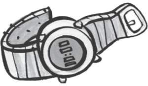
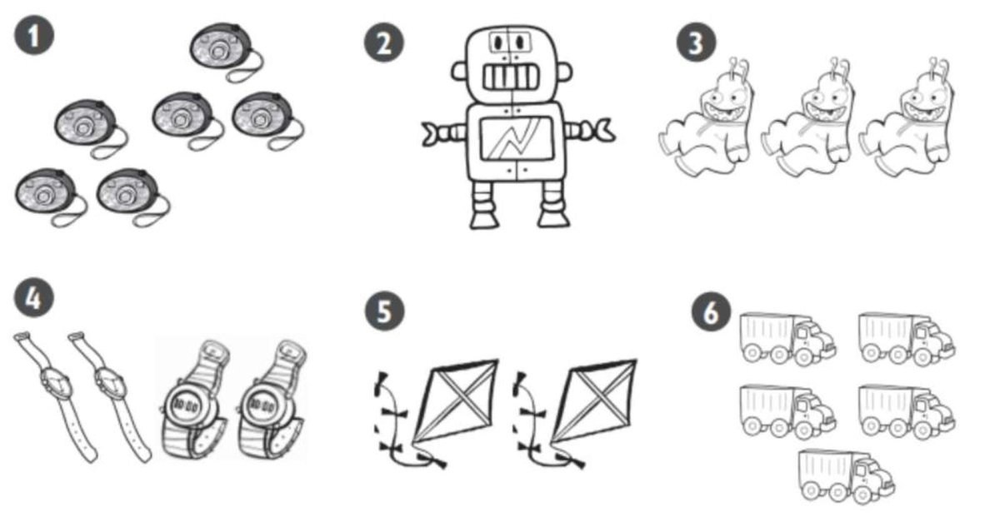
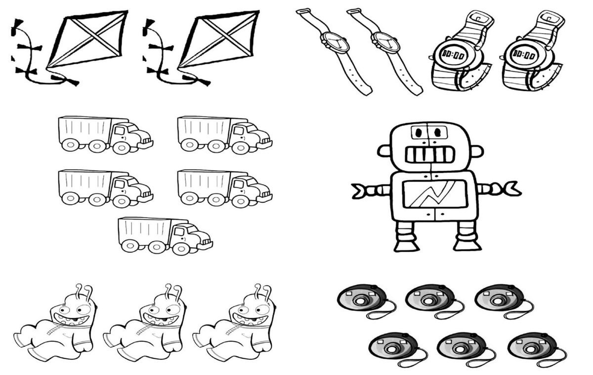
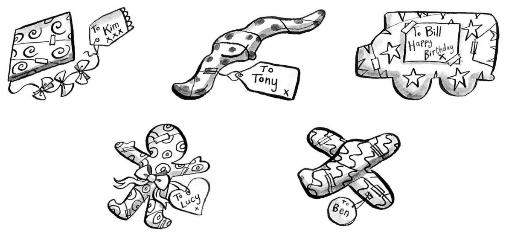
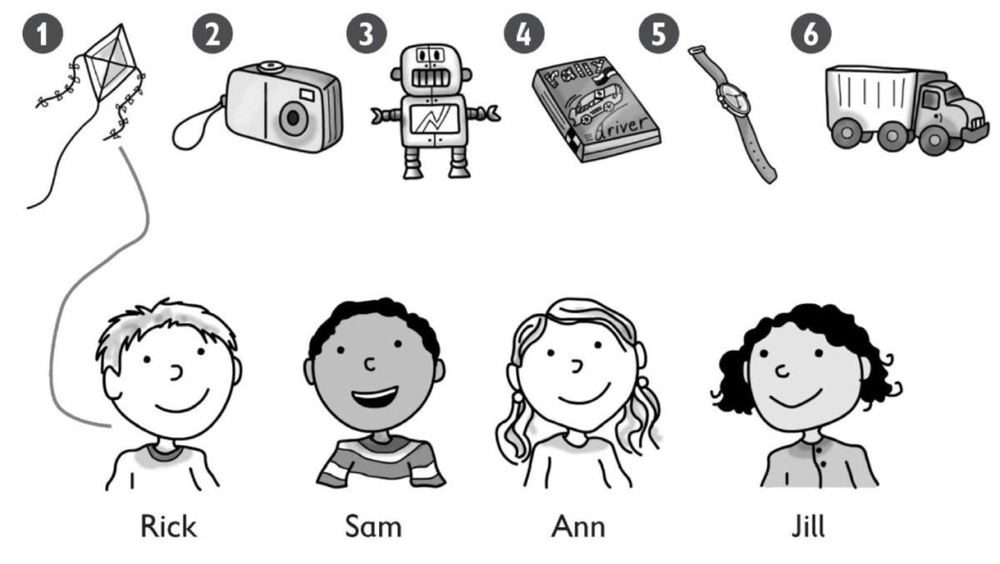
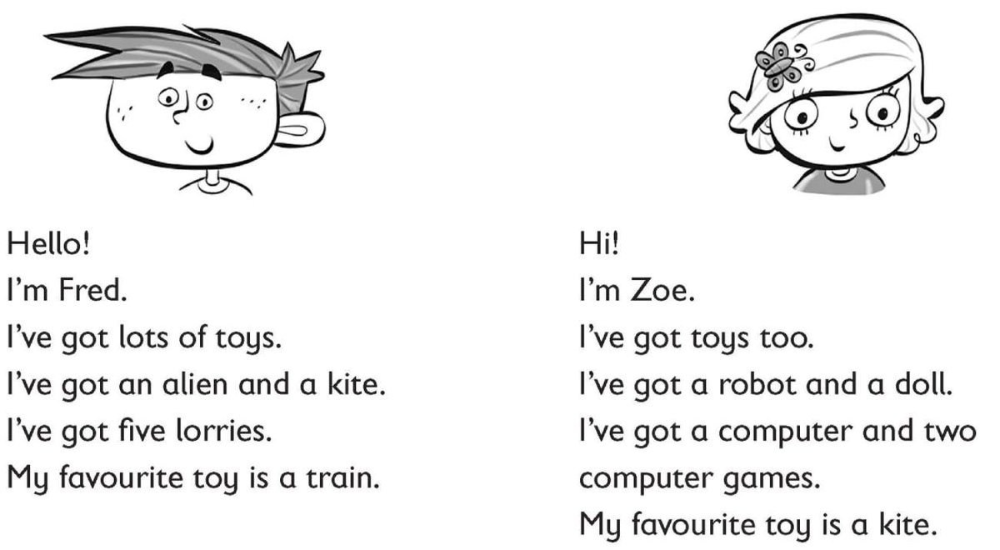

**[Vocabulary]{.underline}**

**1. Read and write the correct word. There is one example.   (one point
each)**

camera \| ~~lorry~~ \| teddy \| tablet \| robot \| watch

  -------------------------------------------------------------------------------------------------------------------------------------------------------------------------------------------------------------------- -- ----------------------------------------------------------------------------------------------------------------------------------------------------------------------------------------------------------------- -- ----------------------------------------------------------------------------------------------------------------------------------------------------------------------------------------------------------------- -- ----------------------------------------------------------------------------------------------------------------------------------------------------------------------------------------------------------------- -- -----------------------------------------------------------------------------------------------------------------------------------------------------------------------------------------------------------------
   1.                        
  *[lorry]{.underline}*                                                                                                                                                                                                   2. *tablet*                                                                                                                                                                                                          3. *camera*                                                                                                                                                                                                          4. *watch*                                                                                                                                                                                                           5. *robot*

  -------------------------------------------------------------------------------------------------------------------------------------------------------------------------------------------------------------------- -- ----------------------------------------------------------------------------------------------------------------------------------------------------------------------------------------------------------------- -- ----------------------------------------------------------------------------------------------------------------------------------------------------------------------------------------------------------------- -- ----------------------------------------------------------------------------------------------------------------------------------------------------------------------------------------------------------------- -- -----------------------------------------------------------------------------------------------------------------------------------------------------------------------------------------------------------------

  ----------------------------------------------------------------------------------------------------------------------------------------------------------------------------------------------------------------
  
  6. *teddy*

  ----------------------------------------------------------------------------------------------------------------------------------------------------------------------------------------------------------------

**2. Listen and colour. There is one example.   (one point each)**

*robot - purple*

*aliens - green*

*watches - brown*

*kites - yellow*

*lorries - grey*

Six black cameras.

One purple robot.

Three green aliens.

Four brown watches.

Two yellow kites.

Five grey lorries.

**3. Look and write. Then colour. There is one example.   (one point
each)**

1\. six black c *[a]{.underline}* m *[e]{.underline}* r
*[a]{.underline}* s

2\. one purple r \_\_\_\_ \_\_\_\_ o \_\_\_\_

*one purple robot*

3\. three green \_\_\_\_ l i e \_\_\_\_ s

*three green aliens*

4\. f \_\_\_\_ u \_\_\_\_ brown watches

*our brown watches*

5\. t \_\_\_\_ \_\_\_\_ yellow kites

*two yellow kites*

6\. five grey l \_\_\_\_ r r \_\_\_\_ \_\_\_\_ s

*five grey lorries*

**[Grammar]{.underline}**

**4. Read and circle. There is one example.   (one point each)**

1\. *This is / These* are a doll.

*This is*

2\. *This is / These* are a computer game.

*This is*

3\. *This is / These* are cars.

*These are*

4\. *This is / These* are teddies.

*These are*

5\. *This is / These* are a robot.

*This is*

6\. *This is / These* are watches.

*These are*

**5. Read and write the word. There is one example.   (one point each)**

1\. Whose is the kite? It's *[Kim's]{.underline}*.

2\. Whose is the plane? It's \_\_\_\_\_\_\_\_\_\_\_\_.

*Ben's*

3\. Whose is the lorry? It's \_\_\_\_\_\_\_\_\_\_\_\_.

*Bill's*

4\. \_\_\_\_\_\_\_\_\_\_\_\_ is the doll? It's Lucy's.

*Whose*

5\. \_\_\_\_\_\_\_\_\_\_\_\_ is the watch? It's.

*Whose / Tony's*

**[Listening]{.underline}**

**6. Listen and write the number. There is one example.   (one point
each)**

*camera*

*kites*

*computer games*

*watch*

*lorries*

**7. Listen and draw lines. There is one example.   (one point each)**

*Ann*

*Sam*

*Jill*

*Ann*

*Rick*

**Audio script**

Whose is the kite? It's Rick's.

Whose is the camera? It's Ann's.

Whose is the robot? It's Sam's.

Whose is the computer game? It's Jill's.

Whose is the watch? It's Ann's.

Whose is the lorry? It's Rick's.

**[Reading]{.underline}**

**8. Read and write Fred or Zoe. There is one example.   (one point
each)**

1\. *[Zoe]{.underline}* has got a robot.

2\. *Fred* has got an alien.

3\. *Fred* has got five lorries.

4\. *Zoe* has got two computer games.

5\. *Zoe* 's favourite toy is a kite.

6\. *Fred* 's favourite toy is a train.

