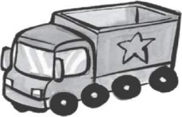
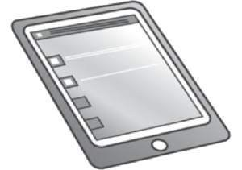
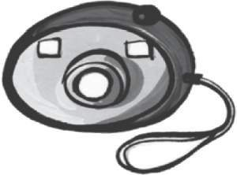
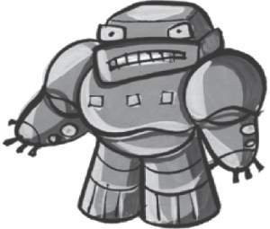
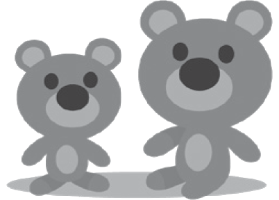
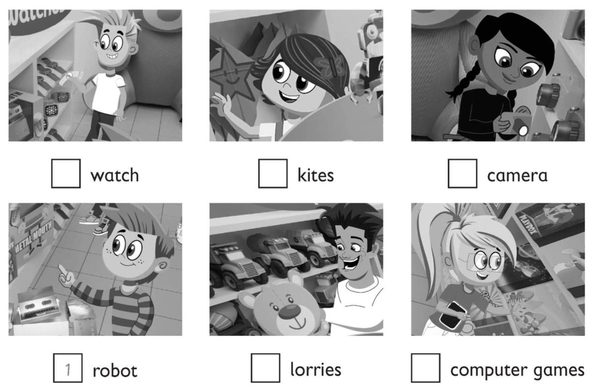

**[Vocabulary]{.underline}**

**1. Read and write the correct word. There is one example.   (one point
each)**

camera \| ~~lorry~~ \| teddy \| tablet \| robot \| watch

  ----------------------------------------------------------------------------------------------------------------------------------------------------------------------------------------------------------------------- -- -------------------------------------------------------------------------------------------------------------------------------------------------------------------------------------------------------------------- -- -------------------------------------------------------------------------------------------------------------------------------------------------------------------------------------------------------------------- -- -------------------------------------------------------------------------------------------------------------------------------------------------------------------------------------------------------------------- -- --------------------------------------------------------------------------------------------------------------------------------------------------------------------------------------------------------------------
   1.                        
  *[lorry]{.underline}*                                                                                                                                                                                                      2. \_\_\_\_\_\_                                                                                                                                                                                                         3. \_\_\_\_\_\_                                                                                                                                                                                                         4. \_\_\_\_\_\_                                                                                                                                                                                                         5. \_\_\_\_\_\_

  ----------------------------------------------------------------------------------------------------------------------------------------------------------------------------------------------------------------------- -- -------------------------------------------------------------------------------------------------------------------------------------------------------------------------------------------------------------------- -- -------------------------------------------------------------------------------------------------------------------------------------------------------------------------------------------------------------------- -- -------------------------------------------------------------------------------------------------------------------------------------------------------------------------------------------------------------------- -- --------------------------------------------------------------------------------------------------------------------------------------------------------------------------------------------------------------------

  -------------------------------------------------------------------------------------------------------------------------------------------------------------------------------------------------------------------
  
  6. \_\_\_\_\_\_

  -------------------------------------------------------------------------------------------------------------------------------------------------------------------------------------------------------------------

**2. Listen and colour. There is one example.   (one point each)**

**3. Look and write. Then colour. There is one example.   (one point
each)**

1\. six black c *[a]{.underline}* m *[e]{.underline}* r
*[a]{.underline}* s

2\. one purple r \_\_\_\_ \_\_\_\_ o \_\_\_\_

3\. three green \_\_\_\_ l i e \_\_\_\_ s

4\. f \_\_\_\_ u \_\_\_\_ brown watches

5\. t \_\_\_\_ \_\_\_\_ yellow kites

6\. five grey l \_\_\_\_ r r \_\_\_\_ \_\_\_\_ s

**[Grammar]{.underline}**

**4. Read and circle. There is one example.   (one point each)**

1\. *This is / These* are a doll.

2\. *This is / These* are a computer game.

3\. *This is / These* are cars.

4\. *This is / These* are teddies.

5\. *This is / These* are a robot.

6\. *This is / These* are watches.

**5. Read and write the word. There is one example.   (one point each)**

1\. Whose is the kite? It's *[Kim's]{.underline}*.

2\. Whose is the plane? It's \_\_\_\_\_\_\_\_\_\_\_\_.

3\. Whose is the lorry? It's \_\_\_\_\_\_\_\_\_\_\_\_.

4\. \_\_\_\_\_\_\_\_\_\_\_\_ is the doll? It's Lucy's.

5\. \_\_\_\_\_\_\_\_\_\_\_\_ is the watch? It's.

**[Listening]{.underline}**

**6. Listen and write the number. There is one example.   (one point
each)**

**7. Listen and draw lines. There is one example.   (one point each)**

**[Reading]{.underline}**

**8. Read and write Fred or Zoe. There is one example.   (one point
each)**

1\. *[Zoe]{.underline}* has got a robot.

2\. \_\_\_\_\_\_\_\_\_\_\_ has got an alien.

3\. \_\_\_\_\_\_\_\_\_\_\_ has got five lorries.

4\. \_\_\_\_\_\_\_\_\_\_\_ has got two computer games.

5\. \_\_\_\_\_\_\_\_\_\_\_ 's favourite toy is a kite.

6\. \_\_\_\_\_\_\_\_\_\_\_ 's favourite toy is a train.

