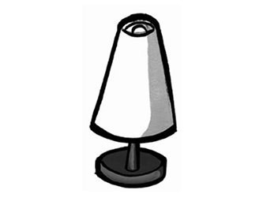
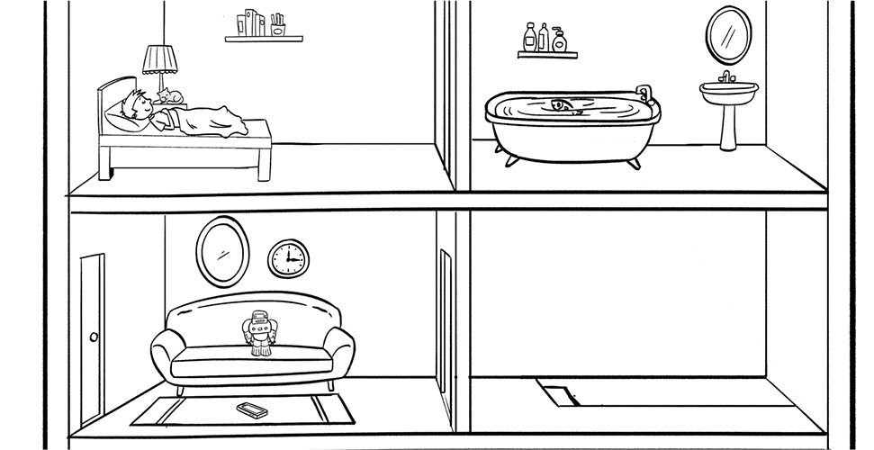
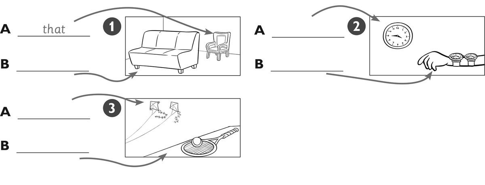
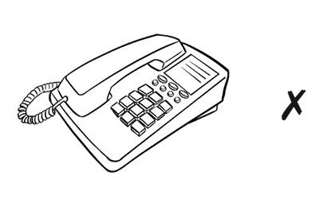
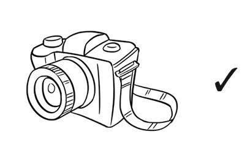
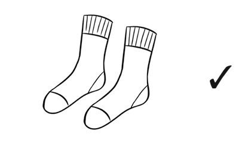
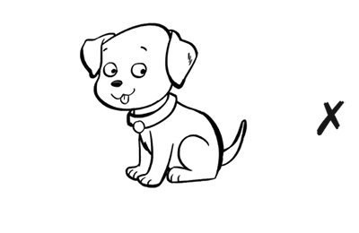
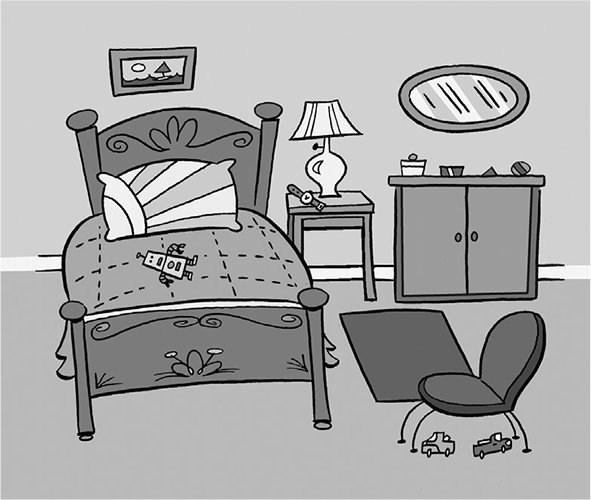

**[Vocabulary]{.underline}**

**1. Look and complete the words. There is one example.    (one point
each)**

1\. *[c]{.underline}* *[l]{.underline}* o *[c]{.underline}*
*[k]{.underline}*

2\. \_\_ \_\_ o \_\_ e

*phone*

3\. \_\_ o \_\_ a

*sofa*

4\. \_\_ i \_\_ \_\_ o \_\_

*mirror*

5\. \_\_ a \_\_

*mat*

6\. \_\_ a \_\_ \_\_

*lamp*

**2. Look and circle. There is one example.    (one point each)**

1\. Where is the robot?

    *[on the sofa]{.underline} / mat*

2\. Where is the clock?

    *next to the mirror / table*

*next to the mirror*

3\. Where is the phone?

    *on the mat / bed*

*on the mat*

4\. Where is the fish?

    *in the cupboard / bath*

*in the bath*

5\. Where is the cat?

    *under the lamp / clock*

*under the lamp*

6\. Where is the boy?

    *in bed / on the sofa*

*in bed*

**3. Look. Write this, these, that, those. There is one example.    (one
point each)**

*1. B this (sofa)*

*2. A that (clock), B these (watches)*

*3. A those (kites), B this (ball) / these (racket and ball)*

**[Grammar]{.underline}**

**4. Look and circle. There is one example.   (one point each)**

1\. Is that phone yours?     Yes, it is.    *[No, it
isn't.]{.underline}*

2\. Is that camera yours?     Yes, it is.    No, it isn't.

*Yes, it is.*

3\. Are those socks yours?      Yes, they are.    No, they aren't.

*Yes, they are.*

4\. Are those books yours?      Yes, they are.    No, they aren't.

*No, they aren't.*

5\. Is that dog yours?     Yes, it is.    No, it isn't.

*No, it isn't.*

6\. Is that kite yours?     Yes, it is.    No, it isn't.

*Yes, it is.*

**5. Look and write. There is one example.    (one point each)**

1\. Which bag is yours?

orange    The    one        *[The]{.underline}* *[orange]{.underline}*
*[one]{.underline}*.

2\. Which socks are Jane's?

ones    red    The        \_\_\_\_\_\_\_\_\_\_\_\_
\_\_\_\_\_\_\_\_\_\_\_\_ \_\_\_\_\_\_\_\_\_\_\_\_.

*The red ones*

3\. Is this phone yours?

it's    mine    Yes        \_\_\_\_\_\_\_\_\_\_\_\_,
\_\_\_\_\_\_\_\_\_\_\_\_ \_\_\_\_\_\_\_\_\_\_\_\_.

*Yes, it's mine*

4\. Are those shoes yours, Fred?

aren't    No    mine    they        \_\_\_\_\_\_\_\_\_\_\_\_,
\_\_\_\_\_\_\_\_\_\_\_\_ \_\_\_\_\_\_\_\_\_\_\_\_.

*No, they aren't mine*

5\. Is this watch Grandpa's?

Grandma's    it's    No,        \_\_\_\_\_\_\_\_\_\_\_\_,
\_\_\_\_\_\_\_\_\_\_\_\_ \_\_\_\_\_\_\_\_\_\_\_\_.

*No, it's Grandma's*

6\. Whose trousers are these?

his    They're        \_\_\_\_\_\_\_\_\_\_\_\_ \_\_\_\_\_\_\_\_\_\_\_\_.

*They're his*

**[Listening]{.underline}**

**6. Listen and write the letter.    (one point each)**

*Daisy -- D, Jim -- B, Julia -- A, Charlie -- E, Mary -- C*

**Audio script**

**Woman:** Let's play *Hide and Seek*. 1,2,3,4,5,6,7,8,9,10. Ready?
Coming! Hm. Where are the boys and girls? Aha! Those are Paul's brown
shoes! I can see you Paul. You're in the cupboard!

**Paul:** Yes! I am!

**Woman:** Who's the behind the lamp! I can see you, Daisy. The lamp is
very small!

**Daisy:** Yes, it is!

**Woman:** Whose are those orange socks? Ahh ...They're Jim's! I can see
you, Jim. You're behind the sofa!

**Jim:** Yes, it's me!

\[pause\]

**Woman:** Whose is that long, brown hair? Is it Julia's?

**Julia:** Yes, it's mine! I'm in the bath.

**Woman:** I can see your green trousers, Charlie! You're under the bed!

**Charlie:** Yes, you're right!

**Woman:** Mary, I can see you under the mat!

**Mary:** Yes, the mat is very small!

**7. Listen, draw lines and colour. There is one example.    (one point
each)**

*John -- green watch, purple kite*

*Sue -- red camera, yellow trousers, red socks*

**Audio script**

**Woman:** Which shoes are John's?

**Man:** The white ones are his.

**Woman:** Which camera is Sue's?

**Man:** The red one is hers.

**Woman:** Which watch is John's?

**Man:** The green one is his.

**Woman:** Which trousers are Sue's?

**Man:** The yellow ones are hers.

**Woman:** Which kite is John's?

**Man:** The purple one is his.

**Woman:** Which socks are Sue's?

**Man:** The red ones are hers.

**[Reading]{.underline}**

**8. Look and read. Write the words.    (one point each)**

bed \| cupboard \| ~~lamp~~ \| mat \| mirror \| watch

  ------------------------------- --- -----------------------------------
  1\. This helps you see at           *[lamp]{.underline}*
  night.                              

  ------------------------------- --- -----------------------------------

  ------------------------------- --- -----------------------------------
  2\. You sleep in this.              *bed*

  ------------------------------- --- -----------------------------------

  ------------------------------- --- -----------------------------------
  3\. You stand on this. It's on      *mat*
  the floor.                          

  ------------------------------- --- -----------------------------------

  ------------------------------- --- -----------------------------------
  4\. You look at your face in        *mirror*
  this.                               

  ------------------------------- --- -----------------------------------

  ------------------------------- --- -----------------------------------
  5\. This tells you the time.        *watch*

  ------------------------------- --- -----------------------------------

  ------------------------------- --- -----------------------------------
  6\. You can put your toys in        *cupboard*
  this.                               

  ------------------------------- --- -----------------------------------

