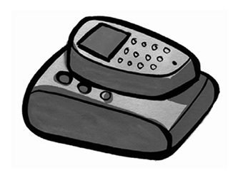
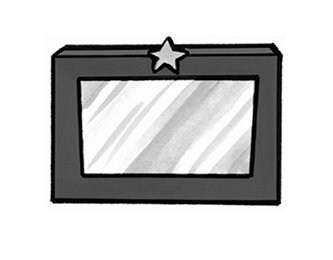
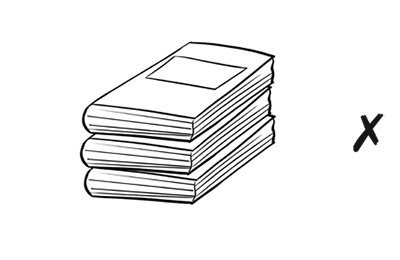
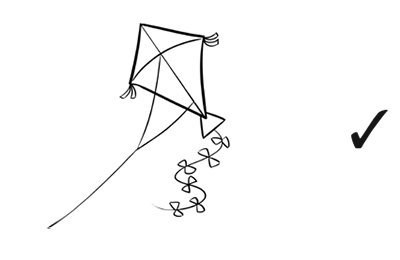
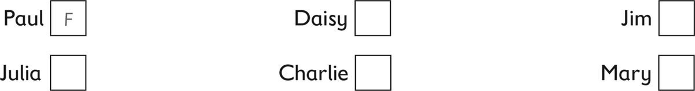
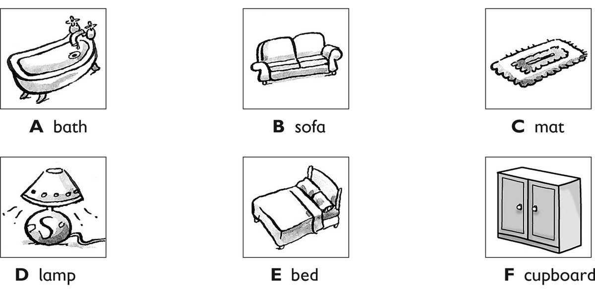
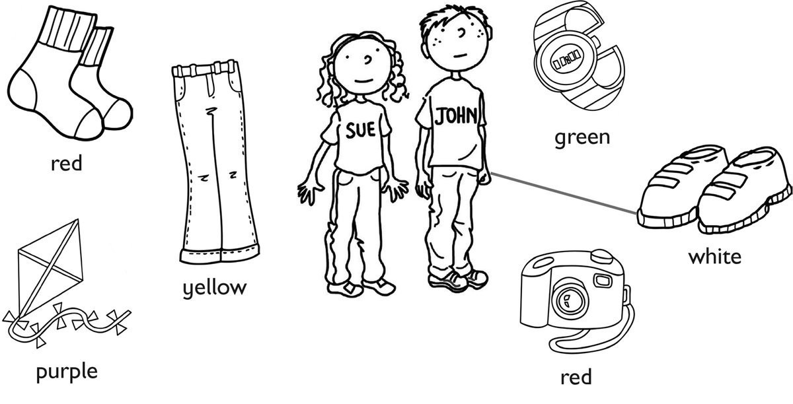

**[Vocabulary]{.underline}**

**1. Look and complete the words. There is one example.    (one point
each)**

1\. *[c]{.underline}* *[l]{.underline}* o *[c]{.underline}*
*[k]{.underline}*

2\. \_\_ \_\_ o \_\_ e

3\. \_\_ o \_\_ a

4\. \_\_ i \_\_ \_\_ o \_\_

5\. \_\_ a \_\_

6\. \_\_ a \_\_ \_\_

**2. Look and circle. There is one example.    (one point each)**

1\. Where is the robot?

    *[on the sofa]{.underline} / mat*

2\. Where is the clock?

    *next to the mirror / table*

3\. Where is the phone?

    *on the mat / bed*

4\. Where is the fish?

    *in the cupboard / bath*

5\. Where is the cat?

    *under the lamp / clock*

6\. Where is the boy?

    *in bed / on the sofa*

**3. Look. Write this, these, that, those. There is one example.    (one
point each)**

**[Grammar]{.underline}**

**4. Look and circle. There is one example.   (one point each)**

1\. Is that phone yours?     Yes, it is.    *[No, it
isn't.]{.underline}*

2\. Is that camera yours?     Yes, it is.    No, it isn't.

3\. Are those socks yours?      Yes, they are.    No, they aren't.

4\. Are those books yours?      Yes, they are.    No, they aren't.

5\. Is that dog yours?     Yes, it is.    No, it isn't.

6\. Is that kite yours?     Yes, it is.    No, it isn't.

**5. Look and write. There is one example.    (one point each)**

1\. Which bag is yours?

orange    The    one        *[The]{.underline}* *[orange]{.underline}*
*[one]{.underline}*.

2\. Which socks are Jane's?

ones    red    The        \_\_\_\_\_\_\_\_\_\_\_\_
\_\_\_\_\_\_\_\_\_\_\_\_ \_\_\_\_\_\_\_\_\_\_\_\_.

3\. Is this phone yours?

it's    mine    Yes        \_\_\_\_\_\_\_\_\_\_\_\_,
\_\_\_\_\_\_\_\_\_\_\_\_ \_\_\_\_\_\_\_\_\_\_\_\_.

4\. Are those shoes yours, Fred?

aren't    No    mine    they        \_\_\_\_\_\_\_\_\_\_\_\_,
\_\_\_\_\_\_\_\_\_\_\_\_ \_\_\_\_\_\_\_\_\_\_\_\_.

5\. Is this watch Grandpa's?

Grandma's    it's    No,        \_\_\_\_\_\_\_\_\_\_\_\_,
\_\_\_\_\_\_\_\_\_\_\_\_ \_\_\_\_\_\_\_\_\_\_\_\_.

6\. Whose trousers are these?

his    They're        \_\_\_\_\_\_\_\_\_\_\_\_ \_\_\_\_\_\_\_\_\_\_\_\_.

**[Listening]{.underline}**

**6. Listen and write the letter.    (one point each)**

**7. Listen, draw lines and colour. There is one example.    (one point
each)**

**[Reading]{.underline}**

**8. Look and read. Write the words.    (one point each)**

bed \| cupboard \| ~~lamp~~ \| mat \| mirror \| watch

  ------------------------------- --- -----------------------------------
  1\. This helps you see at           *[lamp]{.underline}*
  night.                              

  ------------------------------- --- -----------------------------------

  ------------------------------- --- -----------------------------------
  2\. You sleep in this.              \_\_\_\_\_\_\_\_\_\_\_\_

  ------------------------------- --- -----------------------------------

  ------------------------------- --- -----------------------------------
  3\. You stand on this. It's on      \_\_\_\_\_\_\_\_\_\_\_\_
  the floor.                          

  ------------------------------- --- -----------------------------------

  ------------------------------- --- -----------------------------------
  4\. You look at your face in        \_\_\_\_\_\_\_\_\_\_\_\_
  this.                               

  ------------------------------- --- -----------------------------------

  ------------------------------- --- -----------------------------------
  5\. This tells you the time.        \_\_\_\_\_\_\_\_\_\_\_\_

  ------------------------------- --- -----------------------------------

  ------------------------------- --- -----------------------------------
  6\. You can put your toys in        \_\_\_\_\_\_\_\_\_\_\_\_
  this.                               

  ------------------------------- --- -----------------------------------

