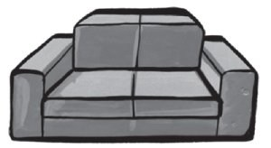
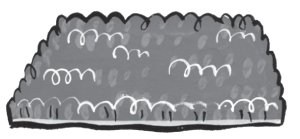
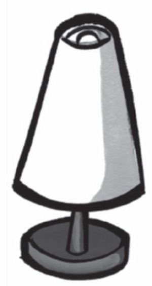
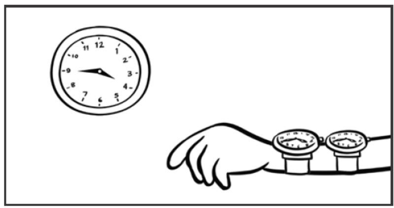
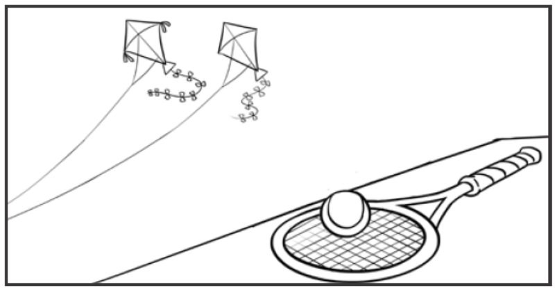
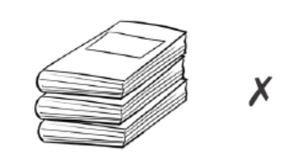
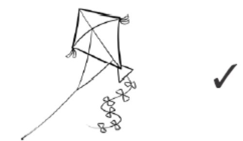
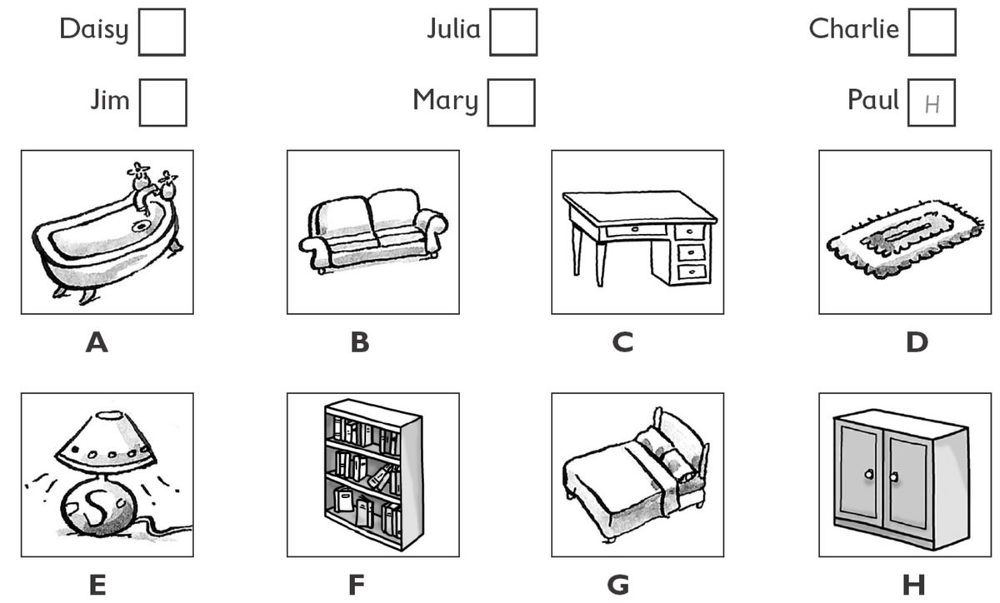
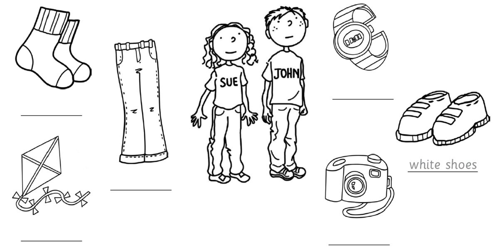
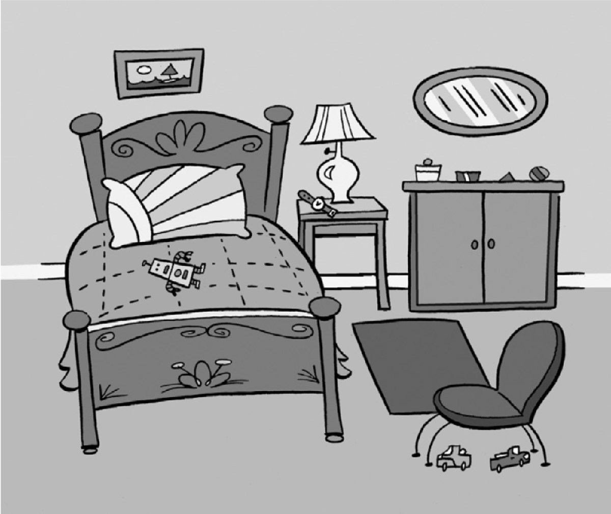

**[Vocabulary]{.underline}**

**1. Look and write the words. There is one example.   (one point
each)**

1\. *[clock]{.underline}*

2\. \_\_\_\_\_\_\_\_\_\_\_\_

*phone*

3\. \_\_\_\_\_\_\_\_\_\_\_\_

*sofa*

4\. \_\_\_\_\_\_\_\_\_\_\_\_

*mirror*

5\. \_\_\_\_\_\_\_\_\_\_\_\_

*mat*

6\. \_\_\_\_\_\_\_\_\_\_\_\_

*lamp*

**2. Look and write. There is one example.   (one point each)**

*2. mirror*

*3. mat*

*4. bath*

*5. lamp*

*6. bed*

**3. Look and write. There is one example.   (one point each)**

this \| that \| these \| those \| ball \| clock \| kites \| sofa \|
watches

1\. **A**  *[that armchair]{.underline}*

    **B**  \_\_\_\_\_\_\_\_\_\_\_\_\_\_\_\_

***B.** this sofa*

2\. **A**  \_\_\_\_\_\_\_\_\_\_\_\_\_\_\_\_

    **B**   \_\_\_\_\_\_\_\_\_\_\_\_\_\_\_\_

***A.** that clock*

***B.** these watches*

3\. **A**  \_\_\_\_\_\_\_\_\_\_\_\_\_\_\_\_

    **B**  \_\_\_\_\_\_\_\_\_\_\_\_\_\_\_\_

***A.** A those kites*

***B.** this ball*

**[Grammar]{.underline}**

**4. Look. Put the letters in order. Then write *Yes, it is* / *No, it
isn't* / *Yes, they are* / *No, they aren't*. There is one
example.   (one point each)**

1\. Is that \[pnohe\] yours? *[phone]{.underline}* *[No, it
isn't.]{.underline}*

2\. Is that \[racame\] yours? \_\_\_\_\_\_\_\_\_\_\_\_ ,
\_\_\_\_\_\_\_\_\_\_\_\_

*camera -- Yes, it is.*

3\. Are those \[oscks\] yours? \_\_\_\_\_\_\_\_\_\_\_\_ ,
\_\_\_\_\_\_\_\_\_\_\_\_

*socks -- Yes,they are.*

4\. Are those \[oobsk\] yours? \_\_\_\_\_\_\_\_\_\_\_\_ ,
\_\_\_\_\_\_\_\_\_\_\_\_

*books -- No, they aren't.*

5\. Is that \[gdo\] yours? \_\_\_\_\_\_\_\_\_\_\_\_ ,
\_\_\_\_\_\_\_\_\_\_\_\_

*dog -- No, it isn't*

6\. Is that \[itke\] yours? \_\_\_\_\_\_\_\_\_\_\_\_ ,
\_\_\_\_\_\_\_\_\_\_\_\_

*kite -- Yes, it is.*

**5. Look and write. There is one example.   (one point each)**

aren't \| his \| mine \| ~~one~~ \| ones \| They're

1\. Which bag is yours? -- The orange *[one]{.underline}* .

2\. Which socks are Jane's? -- The red \_\_\_\_\_\_\_\_\_\_\_\_ .

*ones*

3\. Is this phone yours? -- Yes, it's \_\_\_\_\_\_\_\_\_\_\_\_ .

*mine*

4\. Are those shoes yours, Fred? -- No, they \_\_\_\_\_\_\_\_\_\_\_\_
mine.

*aren't*

5\. Is this watch Grandpa's? -- Yes, it's \_\_\_\_\_\_\_\_\_\_\_\_ .

*his*

6\. Whose trousers are these? -- \_\_\_\_\_\_\_\_\_\_\_\_ Peter's.

*They're*

**[Listening]{.underline}**

**6. Listen and write the letter. There are two extra letters. There is
one example.   (one point each)**

*Daisy -- E*

*Jim -- B*

*Julia -- A*

*Charlie -- G*

*Mary -- D*

**Audio script**

**Woman:** Let's play Hide and Seek. 1,2,3,4,5,6,7,8,9,10. Ready?
Coming! Hm. Where are the boys and girls? Aha! Those are Paul's brown
shoes! I can see you Paul. You're in the cupboard!

**Paul:** Yes! I am!

**Woman:** Who's the behind the lamp! I can see you, Daisy. The lamp is
very small!

**Daisy:** Yes, it is!

**Woman:** Whose are those orange socks? Ahh...They're Jim's! I can see
you, Jim. You're behind the sofa!

**Jim:** Yes, it's me!

**Woman:** Whose is that long, brown hair? Is it Julia's?

**Julia:** Yes, it's mine! I'm in the bath.

**Woman:** I can see your green trousers, Charlie! You're under the bed!

**Charlie:** Yes, you're right!

**Woman:** Mary, I can see you under the mat!

**Mary:** Yes, the mat is very small!

**7. Listen and colour. Then write. There is one example.   (one point
each)**

*John -- green watch, purple kite*

*Sue -- red camera, yellow trousers, red socks*

**Audio script**

**Woman:** Which shoes are John's?

**Man:** The white ones are his.

**Woman:** Which camera is Sue's?

**Man:** The red one is hers.

**Woman:** Which watch is John's?

**Man:** The green one is his.

**Woman:** Which trousers are Sue's?

**Man:** The yellow ones are hers.

**Woman:** Which kite is John's?

**Man:** The purple one is his.

**Woman:** Which socks are Sue's?

**Man:** The red ones are hers.

**[Reading]{.underline}**

**8. Look, read and write. There is one example.    (one point each)**

1\. This helps you see at night. *l[amp]{.underline}*

2\. You sleep in this. \_\_\_\_\_\_\_\_\_\_\_\_

*bed*

3\. You stand on this. It's on the floor. \_\_\_\_\_\_\_\_\_\_\_\_

*mat*

4\. You look at your face in this. \_\_\_\_\_\_\_\_\_\_\_\_

*mirror*

5\. This tells you the time. \_\_\_\_\_\_\_\_\_\_\_\_

*watch*

6\. You can put your toys in this. \_\_\_\_\_\_\_\_\_\_\_\_

*cupboard*

