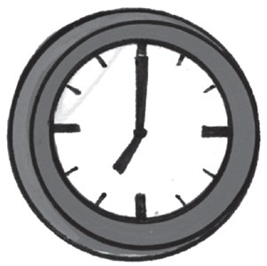
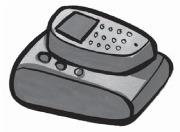
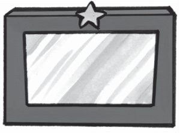
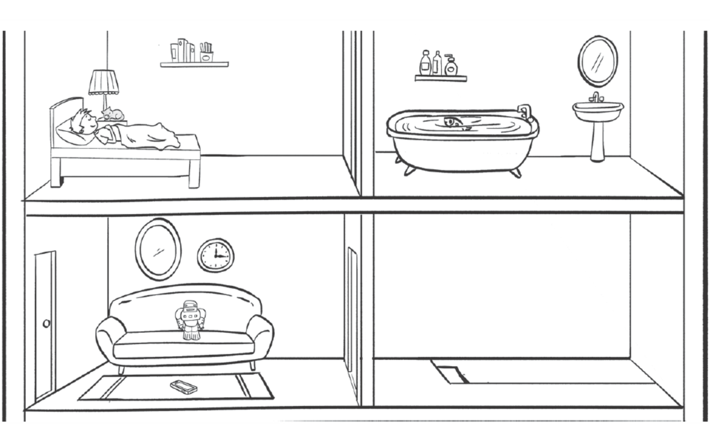
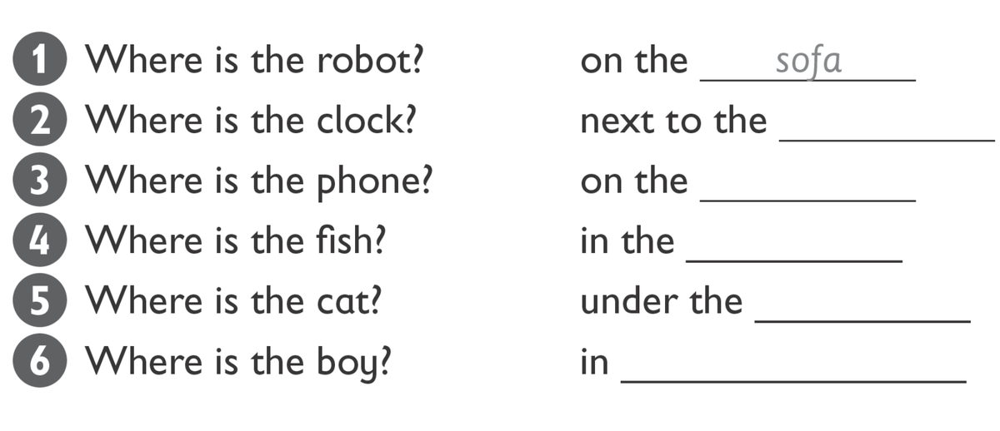
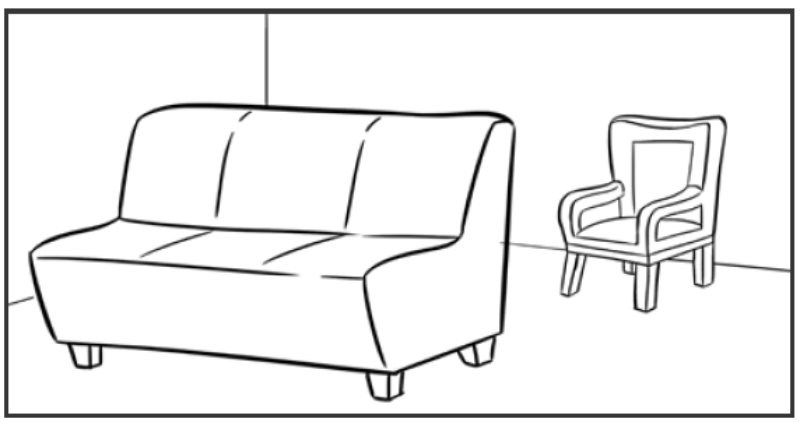
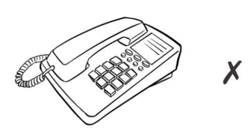
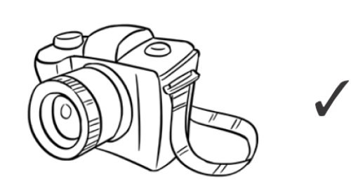
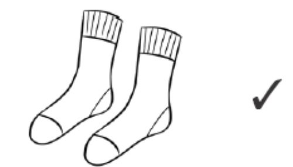
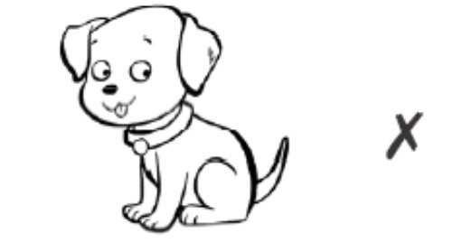

**[Vocabulary]{.underline}**

**1. Look and write the words. There is one example.   (one point
each)**

1\. *[clock]{.underline}*

2\. \_\_\_\_\_\_\_\_\_\_\_\_

3\. \_\_\_\_\_\_\_\_\_\_\_\_

4\. \_\_\_\_\_\_\_\_\_\_\_\_

5\. \_\_\_\_\_\_\_\_\_\_\_\_

6\. \_\_\_\_\_\_\_\_\_\_\_\_

**2. Look and write. There is one example.   (one point each)**

**3. Look and write. There is one example.   (one point each)**

this \| that \| these \| those \| ball \| clock \| kites \| sofa \|
watches

1\. **A**  *[that armchair]{.underline}*

    **B**  \_\_\_\_\_\_\_\_\_\_\_\_\_\_\_\_

2\. **A**  \_\_\_\_\_\_\_\_\_\_\_\_\_\_\_\_

    **B**   \_\_\_\_\_\_\_\_\_\_\_\_\_\_\_\_

3\. **A**  \_\_\_\_\_\_\_\_\_\_\_\_\_\_\_\_

    **B**  \_\_\_\_\_\_\_\_\_\_\_\_\_\_\_\_

**[Grammar]{.underline}**

**4. Look. Put the letters in order. Then write *Yes, it is* / *No, it
isn't* / *Yes, they are* / *No, they aren't*. There is one
example.   (one point each)**

1\. Is that \[pnohe\] yours? *[phone]{.underline}* *[No, it
isn't.]{.underline}*

2\. Is that \[racame\] yours? \_\_\_\_\_\_\_\_\_\_\_\_ ,
\_\_\_\_\_\_\_\_\_\_\_\_

3\. Are those \[oscks\] yours? \_\_\_\_\_\_\_\_\_\_\_\_ ,
\_\_\_\_\_\_\_\_\_\_\_\_

4\. Are those \[oobsk\] yours? \_\_\_\_\_\_\_\_\_\_\_\_ ,
\_\_\_\_\_\_\_\_\_\_\_\_

5\. Is that \[gdo\] yours? \_\_\_\_\_\_\_\_\_\_\_\_ ,
\_\_\_\_\_\_\_\_\_\_\_\_

6\. Is that \[itke\] yours? \_\_\_\_\_\_\_\_\_\_\_\_ ,
\_\_\_\_\_\_\_\_\_\_\_\_

**5. Look and write. There is one example.   (one point each)**

aren't \| his \| mine \| ~~one~~ \| ones \| They're

1\. Which bag is yours? -- The orange *[one]{.underline}* .

2\. Which socks are Jane's? -- The red \_\_\_\_\_\_\_\_\_\_\_\_ .

3\. Is this phone yours? -- Yes, it's \_\_\_\_\_\_\_\_\_\_\_\_ .

4\. Are those shoes yours, Fred? -- No, they \_\_\_\_\_\_\_\_\_\_\_\_
mine.

5\. Is this watch Grandpa's? -- Yes, it's \_\_\_\_\_\_\_\_\_\_\_\_ .

6\. Whose trousers are these? -- \_\_\_\_\_\_\_\_\_\_\_\_ Peter's.

**[Listening]{.underline}**

**6. Listen and write the letter. There are two extra letters. There is
one example.   (one point each)**

**7. Listen and colour. Then write. There is one example.   (one point
each)**

**[Reading]{.underline}**

**8. Look, read and write. There is one example.    (one point each)**

1\. This helps you see at night. *l[amp]{.underline}*

2\. You sleep in this. \_\_\_\_\_\_\_\_\_\_\_\_

3\. You stand on this. It's on the floor. \_\_\_\_\_\_\_\_\_\_\_\_

4\. You look at your face in this. \_\_\_\_\_\_\_\_\_\_\_\_

5\. This tells you the time. \_\_\_\_\_\_\_\_\_\_\_\_

6\. You can put your toys in this. \_\_\_\_\_\_\_\_\_\_\_\_

